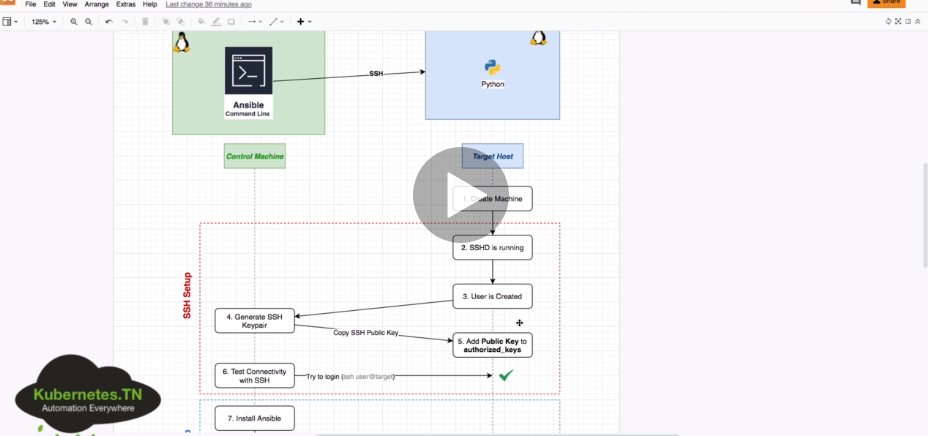

# ANSIBLE  

+ [DOCUMENTACIÓN](https://docs.ansible.com/ansible/latest/installation_guide/index.html)

+ [Apuntes Ansible](https://elpuig.xeill.net/Members/vcarceler/articulos/ansible/index_html)  

+ [Libros Ansible](https://www.ansible.com/resources/ebooks)  

+ Es un software de gestión de la configuración automática y remota.  
+ Nos permite centralizar la configuración de numerosas servidores, dispositivos de red y Cloud Providers de una forma sencilla y automatizada.  
+ Podremos aprovisionar servidores en AWS, Azure o VMWARE y automatizar la configuración de dichos servidores.  

+ Ventajas:  
    * No requiere agentes  
    * Multiplataforma, eficiente y seguro  
    * Aprovisiona infraestructuras  
    * Configura dispositivos de red  

+ Se necesita un __Ansible Controller__ ejecutando en un SO Linux. Se puede administrar equipos Windows/Max pero el Ansible Controller debe ser LINUX.  

## Instalación  
+ `yum install ansible` __RedHat__  
+ `dnf install ansible` __Fedora__  
+ `apt-get install ansible` __Ubuntu__  
+ `pip install ansible` __Python-Pip__  
+ `brew install ansible` __MAC__  


+ `ansible --version` comprobamos la versión instalada.  

## Inventarios  
+ Ansible trabaja ejecutando tareas contra diferentes equipos remotos, dispositivos de red o APIs.  
+ Nos permiten definir dichos equipos, agruparlos y especificar valores grupales o individuales de los mismos.  
+ Formato Ansible INI, YAML o JSON.  

+ `/etc/ansible/hosts` fichero por defecto donde se define o ruta concreta `-i file`.  
+ `ansbible.cfg` fichero de configuración.  

+ EJEMPLO:  
```
[masters] # nombre general
master ansible_host=IP/FQDN/service_docker ansible_user=remote_user ansible_private_key_file=xxx.pem # nombre - maqquina a conectar - usuario a conectar - private_key
```  

+ Comprobamos la conexión: 
`ansible -i inventory -m ping all`  
`ansible -m ping -i hosts master` -m de modulo -i fichero y maquina  

```
master | SUCCESS => {
    "ansible_facts": {
        "discovered_interpreter_python": "/usr/bin/python"
    }, 
    "changed": false, 
    "ping": "pong"
}
```  

## Comando básico  
+ `ansible -i <inventory_path> -m {modulo} -a "{modulo opciones}" <nodos: all/master>`  
+ Ejemplo: `ansible -i hosts -m shell -a "echo 'hola'" all`  

+ Ejemplo: `ansible -i hosts -m shell -a "echo 'hola'" all`  
+ Ejemplo: `ansible -i hosts -m shell -a "ls -l /etc" all/masters`  
+ Ejemplo: `ansible -i hosts -b -m user -a "name=andy state=present shell=/bin/bash" all`  
> atacamos a todos los users(all) y le creamos un usuario andy. -b de superuser, con una shell concreta

## Ayuda Ansible  
`ansible-doc -l`  

+ Ejemplo de ayuda de un módulo concreto:  
`ansible-doc (-s) user`  

## Playbook  
+ Los Playbooks describen configuraciones, despliegue, y orquestación en Ansible. ​ El formato del Playbook es YAML. ​ Cada Playbook asocia un grupo de hosts a un conjunto de roles. Cada rol está representado por llamadas a lo que Ansible define como Tareas.  

+ Ejemplo:  
```
- name: Demo Install Ansible
  hosts: all
  become: yes
  tasks:
  ## instalando ansible usando apt-get
  - name: install ansible using apt
    apt:
      name: ansible
      state: present
```  

+ Ejemplo:  

```
cat play.yml 
- hosts: test1
  tasks:

    - shell: echo "Hola Mundo desde Ansible y Jenkins" > /tmp/hola-ansible.txt
```  

+ Ejemplo:  

```
- hosts: test1
  tasks:
    - debug:
       var: MSG
```  

+ Ejemplo:  

```
- hosts: test1
  tasks:
    - debug:
       var: MSG
    - debug:
       msg: "Yo no me voy a ejecutar :("
     tags: no-exec
    - debug:
       msg: "Yo sí me voy a ejecutar :)"
     tags: si-exec
```  

+ Ejemplo completo de crear un user: 

```
- hosts: master
  become: yes # ser superuser
  tasks:
  - name: create user andy
    user:
      name: andy
      state: present
      shell: /bin/bash
  - name: create user miguel
    user: name=andy state= present
```  

+ ORDEN:  
`ansible-playbook -i hosts playbook.yml --syntax`  
`ansible-playbook -i hosts playbook.yml --check (solo simula)`  

## Módulos  
+ Conocidos también task plugins o library plugins, son unidades discretas de código que se pueden utilizar desde linea de comandos o playbook.  
+ Se suelen utilizar en el nodo de destino remoto y recopila los valores de retorno. Se pueden utilizar en ad-hoc commands, playbooks y roles.  

+ Ejemplo módulo apt:  
```
- name: Demo Install Ansible
  hosts: all
  become: yes
  tasks:
  ## instalando ansible usando apt-get
  - name: install ansible using apt
    apt:
      name: ansible
      state: present
```  

+ Ejemplo módulo authorized_keys:  

```
- hosts: master
  become: yes # ser superuser
  tasks:
  - name: create user andy
    user:
      name: andy
      state: present
      shell: /bin/bash
  - name: create ssh keys
    authorized_keys:
      user: andy
      key: "{{ item }}"
      state: present
    with_file:
      - ~/.ssh/id_rsa.pub
      no_log: yes
```  

## Variables  
+ Ejemplo de variables para Ansible:  

```
- name: Demo Install Ansible
  hosts: all
  become: yes
  ## definimos las variables
  vars:
    package: ansible
    state: present
  tasks:
  ## instalando ansible usando apt-get
  - name: install ansible using apt
    apt:
      name: "{{ package }}"
      state: "{{ state }}"
```  

## Condicionales  
+ Realizar tareas segun ciertas cosas o parámetros:  
+ Ejemplo condicional:  

```
- name: Demo Install Ansible
  hosts: all
  become: yes
  ## definimos las variables
  vars:
    package: ansible
    state: present
  tasks:
  ## instalando ansible usando apt-get
  - name: install ansible using apt
    apt:
      name: "{{ package }}"
      state: "{{ state }}"
    ## indicando la condicion de solo en master
    when: "'master' in inventory_hostname"
```  

## Bucles  
+ Ejemplo de bucle:  

```
- name: Demo Install Ansible
  hosts: all
  become: yes
  tasks:
  ## instalando ansible usando apt-get
  - name: install ansible using apt
    apt:
      name: "{{ item }}"
      state: present
    ## indicando bucle de paquetes a instalar
    loop:
    - ansible
    - apache2
```  

```
- name: Demo Install Ansible
  hosts: all
  become: yes
  tasks:
  - name: create users
    user:
      name: "{{ item }}"
      state: present/absent
    ## indicando bucle de crear users
    with_items:
    - andy
    - miguel
    - mario
```  

## Roles  
+ Los roles son formas de cargar automáticamente una estructura de archivos/directorios, archivos de variables, tareas y controladores basados en una estructura de archivos conocida.  
+ Agrupar contenido por roles permite compartir los roles con otros usuarios y poder reutilizar código.  
+ Los roles esperan que los archivos esten en ciertos directorios, deben incluir al menos uno de estos.  

+ Ejemplo de role:  

```
- name: Play to demo roles
  hosts: all
  become: yes
  ## roles block
  roles:
  ## the role we want to install
  - apache ## dentro de este directorio hay muchos files, playbooks, tasks...
```  

## Ansible Galaxy  
+ Es un sitio gratuito para buscar, descargar, calificar y revisar toto tipo de roles de Ansible desarrollados por la comunidad y puede ser una excelente manera de impulsar nuestros proyectos de automatización.  
+ El cliente __ansible-galaxy__ está incluido en Ansible.  

+ Ejemplo:  
```
## ansible-galaxy
## install a role in 'roles' folder
ansible-galaxy install "ansible.docker" -p roles/

## create a role folders/files structure
ansible-galaxy init "my-role"

## search for a role
ansible-galaxy search 'docker'
```  

## Resumen 

+ Repaso de ansible. 
+ Es un software de gestión de la configuración automática y remota.  
+ Nos permite centralizar la configuración de numerosas servidores, dispositivos de red y Cloud Providers de una forma sencilla y automatizada.  
+ Podremos aprovisionar servidores en AWS, Azure o VMWARE y automatizar la configuración de dichos servidores.  
+ Ventajas:  
    * No requiere agentes  
    * Multiplataforma, eficiente y seguro  
    * Aprovisiona infraestructuras  
    * Configura dispositivos de red  

+ Se conecta por SSH.  

### Inventory  
- Sirve para listar todos los hosts, todas las ips que tenemos que aprovisionar.  
- Con `cat /etc/ansible/hosts` vemos un ejemplo de los hosts que tenemos que administrar:  
```
## [webservers] - nombre del grupo
## alpha.example.org
## beta.example.org
## 192.168.1.100
## 192.168.1.110
## db[01:03].intranet.mydomain.net
## db02.intranet.mydomain.net
```  

- Probamos conexión con algun hosts poniendo `ansible alpha.example.org -m ping`:  
```
[isx46410800@miguel miguelamoros.github.io]$ ansible localhost -m ping
localhost | SUCCESS => {
    "changed": false,
    "ping": "pong"
}
```  

- Podemos indicarle otro fichero con otros host poniendo la opción _-i file_hosts_.

### Módulos  

+ [documentación módulos](https://docs.ansible.com/ansible/2.8/modules/list_of_packaging_modules.html)  

+ Por defecto si no pongo el modulo -m, coge _shell_ como módulo:  
```
[isx46410800@miguel miguelamoros.github.io]$ ansible localhost -a 'echo hola miguel'
localhost | CHANGED | rc=0 >>
hola miguel
#
[isx46410800@miguel miguelamoros.github.io]$ ansible localhost -m shell -a 'uname -a'
localhost | CHANGED | rc=0 >>
Linux miguel 5.3.11-100.fc29.x86_64 #1 SMP Tue Nov 12 20:41:25 UTC 2019 x86_64 x86_64 x86_64 GNU/Linux
```

+ Instalamos un paquete en la máquina remota como superusuario(-b) y preguntando la contraseña de root en esa máquina(-K):  
```
[isx46410800@miguel miguelamoros.github.io]$ ansible localhost -b -K -m dnf -a 'name=vim state=present'
BECOME password: 
localhost | SUCCESS => {
    "changed": false,
    "msg": "Nothing to do",
    "rc": 0,
    "results": []
}
```  

### Playbook
+ Se escribe un yaml y son objetos que se escriben tareas que han de hacer en nuestras máquinas remotas:  
```
---
- hosts: localhost
  tasks:
  - name: instala vim
    dnf: name=vim state=present
    become: true
  - name: saludar
    shell: echo hola
```  
+ Resultado:  
```
[isx46410800@miguel ansible]$ ansible-playbook playbook01.yaml -K
BECOME password: 
[WARNING]: provided hosts list is empty, only localhost is available. Note that the implicit localhost does not
match 'all'
PLAY [localhost] ****************************************************************************************************
TASK [Gathering Facts] **********************************************************************************************
ok: [localhost]
TASK [instala vim] **************************************************************************************************
ok: [localhost]
TASK [saludar] ******************************************************************************************************
changed: [localhost]
PLAY RECAP **********************************************************************************************************
localhost                  : ok=3    changed=1    unreachable=0    failed=0    skipped=0    rescued=0    ignored=0   
```

+ otro ejemplo que maneja servicios:  
```
- hosts: localhost
  become: true
  tasks:
  - name: instala vim
    dnf: name=vim state=present
  - name: saludar
    shell: echo hola
  - name: detener apache
    service: name=httpd state=stopped
```  

### Usuarios  
+ Podemos poner el usuario con la opción _-u_. No obstante en el fichero de configuración /etc/ansible/ansible.cfg podemos poner [defaults]remote_users=miguel y entonces cada orden cogerá como usuario miguel.  
+ Podemos cargar otro fichero de conf poniendo ANSIBLE_CONFIG=ruta_file_cfg.  

### Handlers  
+ Le pide a ansible que cuando haga una tarea success lo notifique para poder hacer otras cosas.  
```
isx46410800@miguel ansible]$ cat playbook02.yaml
---
- hosts: localhost
  become: true
  tasks:
  - name: instala apache
    dnf: name=httpd state=present update_cache=true
    notify:
      - "Reinicia el servidor web"
  handlers:
  - name: reinicia el server apache
    service: name=httpd state=restarted
[isx46410800@miguel ansible]$ ansible-playbook playbook02.yaml -K
BECOME password: 
[WARNING]: provided hosts list is empty, only localhost is available. Note that the implicit localhost does not
match 'all'
PLAY [localhost] ****************************************************************************************************
TASK [Gathering Facts] **********************************************************************************************
ok: [localhost]
TASK [instala apache] ***********************************************************************************************
ok: [localhost]
PLAY RECAP **********************************************************************************************************
localhost                  : ok=2    changed=0    unreachable=0    failed=0    skipped=0    rescued=0    ignored=0   
```  
> Nos saldría una notificación de un handler al instalar, no sale porque ya estaba instalado.

## CURSO COMPLETO

### Environment  

+ Vemos un ejemplo de como es un ambiente con Ansible, conectando una máquina central con el lenguaje Ansible hacia otros hosts con sistemas operativos y ordenando que tiene que tener cada cosa y como conectarse:  

  
  

+ Nos conectamos a una instancia ubuntu aws por ssh:  
`[isx46410800@miguel .ssh]$ ssh -i mykeypair.pem ubuntu@18.134.164.27`  

+ Con el un usuario ubuntu de aws, creamos llaves para conectarnos a ese user:  
```
ubuntu@ip-172-31-23-107:~$ sudo su -
root@ip-172-31-23-107:~# useradd ansible_user
root@ip-172-31-23-107:~# passwd ansibler_user
[isx46410800@miguel .ssh]$ ssh-keygen
-rw-------. 1 isx46410800 isx46410800 2602 Apr  2 23:22 ansibleuser
-rw-r--r--. 1 isx46410800 isx46410800  572 Apr  2 23:22 ansibleuser.pub
root@ip-172-31-23-107:/home/ubuntu/.ssh# vi authorized_keys 
root@ip-172-31-23-107:/home/ubuntu# chown -R ubuntu .ssh/ 
```  

+ Ahora podremos conectarnos con la llave privada al usuario ubuntu sin autenticar al tener copiada la llave publica:  
`[isx46410800@miguel .ssh]$ ssh -i ansibleuser ubuntu@18.134.164.27`  

+ Nos conectamos a un docker con fedora:  
`[isx46410800@miguel curso_ansible]$ docker run --name container -h container -p 2222:22 --privileged -d isx46410800/ansible:ssh`  

+ Creamos un usuario y copiamos también las llaves al usuario para conectarnos:  
```
[root@container docker]# adduser fedora
[root@container docker]# passwd fedora
[root@container docker]# cd /home/fedora/
[root@container fedora]# mkdir .ssh
[root@container fedora]# chmod 700 .ssh
[root@container fedora]# vi .ssh/authorized_keys
[root@container fedora]# chmod 600 .ssh/authorized_keys 
[root@container fedora]# chown -R fedora /home/fedora/.ssh 
```  

### Inventory  

+ Creamos un primer inventario para conectarnos a la máquina de amazon:  
```
# conexión a un host remoto, indicando nombre host, ip, llave y usuario al que conectamos
ec2 ansible_host=18.134.164.27 ansible_private_key_file=~/.ssh/ansible_user ansible_ssh_user=ubuntu
```  

+ Probamos con la orden ansible -i inventario nombre_host -atributo opcion del atributo:  
```
[isx46410800@miguel curso_ansible]$ ansible -i inventory01 ec2 -m ping
ec2 | SUCCESS => {
    "ansible_facts": {
        "discovered_interpreter_python": "/usr/bin/python3"
    },
    "changed": false,
    "ping": "pong"
}
```  

+ El fichero de configuración de ansible está en /etc/ansible/ansible.cfg.  
```
# este fichero de configuración se escriben reglas para grupos de hosts o hosts sueltos donde irán a buscar las cosas 
por defecto a este archivo(/etc/ansible/ansible.cfg)
[defaults]
INVENTORY=./inventory01
```  

+ Vemos que conecta igual poniendo el inventario como que no:  
```
[isx46410800@miguel curso_ansible]$ ansible ec2 -m ping
ec2 | SUCCESS => {
    "ansible_facts": {
        "discovered_interpreter_python": "/usr/bin/python3"
    },
    "changed": false,
    "ping": "pong"
}
```  

### Módulos  

+ Los módulos son la cantidad de opciones que podemos hacer a la hora de conectarnos con las máquinas: ping, package, service...  

+ Vemos todas con la orden `ansible-doc --list`:  
`ansible-doc file`    

+ Hacer un ping: `ansible -i inventory01 ec2 -m ping`  

+ Crear un directorio/file(absent, directory, file, hard, link, touch): `ansible -i inventory01 ec2 -m file -a 'path=/home/ubuntu/crear_directorio state=directory'`  
```
ansible -i inventory01 ec2 -m file -a 'path=/home/ubuntu/crear_directorio state=directory'
ec2 | CHANGED => {
    "ansible_facts": {
        "discovered_interpreter_python": "/usr/bin/python3"
    },
    "changed": true,
    "gid": 1000,
    "group": "ubuntu",
    "mode": "0775",
    "owner": "ubuntu",
    "path": "/home/ubuntu/crear_directorio",
    "size": 4096,
    "state": "directory",
    "uid": 1000
}
ubuntu@ip-172-31-23-107:~$ ls
crear_directorio  
[isx46410800@miguel curso_ansible]$ ansible -i inventory01 ec2 -m file -a 'path=/home/ubuntu/crear_directorio/crear_file.txt state=touch'
ec2 | CHANGED => {
    "ansible_facts": {
        "discovered_interpreter_python": "/usr/bin/python3"
    },
    "changed": true,
    "dest": "/home/ubuntu/crear_directorio/crear_file.txt",
    "gid": 1000,
    "group": "ubuntu",
    "mode": "0664",
    "owner": "ubuntu",
    "size": 0,
    "state": "file",
    "uid": 1000
}
ubuntu@ip-172-31-23-107:~$ ls crear_directorio/
crear_file.txt
```  

+ Copiar un fichero:  
```
[isx46410800@miguel curso_ansible]$ ansible -i inventory01 ec2 -m copy -a 'src=./ansible.cfg dest=/home/ubuntu/crear_directorio'
ec2 | CHANGED => {
    "ansible_facts": {
        "discovered_interpreter_python": "/usr/bin/python3"
    },
    "changed": true,
    "checksum": "bf35d403c825217ade9f009d13cbdd6fc0a3078f",
    "dest": "/home/ubuntu/crear_directorio/ansible.cfg",
    "gid": 1000,
    "group": "ubuntu",
    "md5sum": "15b402b635fbd568d10b82d4b67da871",
    "mode": "0664",
    "owner": "ubuntu",
    "size": 208,
    "src": "/home/ubuntu/.ansible/tmp/ansible-tmp-1617401616.4248621-11162-62473546166429/source",
    "state": "file",
    "uid": 1000
}
ubuntu@ip-172-31-23-107:~$ ls crear_directorio/
ansible.cfg  crear_file.txt
# otro ejemplo de crear un file con contenido y copiarlo
ansible ec2 -m copy -a "content='TopSecret' dest='/opt/data/secret.txt'"
```  

+ Añadir una linea a un fichero:  
```
[isx46410800@miguel curso_ansible]$ cat file.txt 
fichero de ejemplo para modulo de añadir lineas
[isx46410800@miguel curso_ansible]$ ansible -i inventory01 ec2 -m lineinfile -a 'path=/home/ubuntu/crear_directorio/file.txt line="añadimos esto al modulo lineinfile"'
ec2 | CHANGED => {
    "ansible_facts": {
        "discovered_interpreter_python": "/usr/bin/python3"
    },
    "backup": "",
    "changed": true,
    "msg": "line added"
}
ubuntu@ip-172-31-23-107:~$ cat crear_directorio/file.txt 
fichero de ejemplo para modulo de añadir lineas
añadimos esto al modulo lineinfile
```  

+ Descargar contenido de un URL y enviarlo en un fichero a un host remoto:  
``` 
[isx46410800@miguel curso_ansible]$ ansible -i inventory01 ec2 -m uri -a 'url=https://api.github.com/users/isx46410800/repos dest=/home/ubuntu/crear_directorio/repos.json'
```  

+ Instalar/borrar un paquete:  
```
[isx46410800@miguel curso_ansible]$ ansible -i inventory01 ec2 -m package -a 'name=vim state=present' -b
[isx46410800@miguel curso_ansible]$ ansible -i inventory01 ec2 -m package -a 'name=vim state=present' --become
```  
> -b para ser superusuario -k para preguntar passwd  
> si hemos creado un user vamos a la maquina y añadimos en la fichero /etc/sudoers: user ALL=(ALL:ALL) NOPASSWD:ALL  

+ Encender un servicio:  
`ansible ec2 -m service -a "name=nginx state=started"`

+ Crear un usuario:  
`ansible ec2 -m user -a "name=miguel state=present"`  

+ Hacer una orden normal de comando:  
`[isx46410800@miguel curso_ansible]$ ansible dev,prod -m command -a 'cat /etc/passwd'`  


### Playbooks  

+ En vez de hacerlo en una linea con comandos, se crea un playbook en formato YAML para hacer ahi el listado de tareas a realizar a los hosts:  
```
- name: primer ejemplo playbook
  hosts: ec2
  tasks:
  # creamos un file con contenido dentro
  - name: hello file is copied
    copy:
      content: "Hello World"
      dest: /home/ubuntu/crear_directorio/hello.txt
  # creamos un segundo file con contenido dentro
  - name: hi file is copied
    copy:
      content: "Hi World"
      dest: /home/ubuntu/crear_directorio/hi.txt
  # comprimimos estos dos ficheros
  - name: hello and hi files compressed
    archive:
      path:
      - /home/ubuntu/crear_directorio/hello.txt
      - /home/ubuntu/crear_directorio/hi.txt
      dest: /home/ubuntu/crear_directorio/hh.zip
      format: zip
```  

+ Lo lanzamos con la orden: `[isx46410800@miguel curso_ansible]$ ansible-playbook playbook01.yaml`  

+ Ejemplo de deploy de una web al host remoto:  
```
[isx46410800@miguel curso_ansible]$ cat playbook02-web-static.yaml 
- name: ejemplo deploy web static
  hosts: ec2
  become: yes
  tasks:
  # instalamos apache
  - name: installing apache server
    package:
      name: apache2
      state: present
  # encendemos el servicio apache
  - name: apache running
    service:
      name: apache2
      state: started
  # creamos el directorio de var para meter la web de index.html
  - name: creating var directory
    file:
      path: /var/www/html
      state: directory
  # deploy web statica
  - name: static website is deployed
    uri:
      url: https://raw.githubusercontent.com/abdennour/example-static-website/ansible-course/index.html
      dest: /var/www/html #/usr/share/nginx/html
```  

+ Resultado:  
```
[isx46410800@miguel curso_ansible]$ ansible-playbook playbook02-web-static.yaml 
PLAY [ejemplo deploy web static] *************************************************************************************
TASK [Gathering Facts] ***********************************************************************************************
ok: [ec2]
TASK [installing apache server] ***************************************************************************************
ok: [ec2]
TASK [apache running] *************************************************************************************************
ok: [ec2]
TASK [creating var directory] ****************************************************************************************
ok: [ec2]
TASK [static website is deployed] ************************************************************************************
changed: [ec2]
PLAY RECAP ***********************************************************************************************************
ec2                        : ok=5    changed=1    unreachable=0    failed=0    skipped=0    rescued=0    ignored=0   
```

### Variables  

+ Podemos usar variables en el fichero de playbook para no tener que escribir lo mismo:  
```
- name: ejemplo deploy web static
  hosts: ec2
  become: yes
  vars:
    webserver: apache2
    webserver_dir: /var/www/html
  tasks:
  # debug sirve para mostrar mensajes
  - name: debug
    debug:
      msg: "El valor del servidor es {{ webserver }}"
  # instalamos apache
  - name: installing apache server
    package:
      name: "{{ webserver }}"
      state: present
  # encendemos el servicio apache
  - name: apache running
    service:
      name: "{{ webserver }}"
      state: started
  # creamos el directorio de var para meter la web de index.html
  - name: creating var directory
    file:
      path: "{{ webserver_dir }}"
      state: directory
  # deploy web statica
  - name: static website is deployed
    uri:
      url: https://raw.githubusercontent.com/abdennour/example-static-website/ansible-course/index.html
      dest: "{{ webserver_dir }}"  #/usr/share/nginx/html
```  

+ También podemos poner en la orden de ansible-playbook la opcion __--extra-vars__ e indicar la variable y contenido y piyaría esa variable como prioridad en vez de la del playbook:

```
[isx46410800@miguel curso_ansible]$ ansible-playbook playbook04-debug-vars-web-static.yaml 
PLAY [ejemplo deploy web static] *************************************************************************************
TASK [Gathering Facts] ***********************************************************************************************
ok: [ec2]
TASK [debug] *********************************************************************************************************
ok: [ec2] => {
    "msg": "El valor del servidor es apache2"
}
#
[isx46410800@miguel curso_ansible]$ ansible-playbook playbook04-debug-vars-web-static.yaml --extra-vars webserver=httpd
PLAY [ejemplo deploy web static] *************************************************************************************
TASK [Gathering Facts] ***********************************************************************************************
ok: [ec2]
TASK [debug] *********************************************************************************************************
ok: [ec2] => {
    "msg": "El valor del servidor es httpd"
}
```

+ Tabién se puede crear un fichero de variables y llamar a donde están las variables:  
```
[isx46410800@miguel curso_ansible]$ cat vars.yaml 
webserver: apache2
webserver_dir: /var/www/html
#
- name: ejemplo deploy web static
  hosts: ec2
  become: yes
  vars_files:
  - vars-yaml
  tasks:
  # debug sirve para mostrar mensajes
  - name: debug
    debug:
      msg: "El valor del servidor es {{ webserver }}"
```

+ Ejemplo pipeline con diferentes Branchs de git:  
```
- name: ejemplo deploy web static
  hosts: ec2
  become: yes
  vars:
    webserver: apache2
    webserver_dir: /var/www/html
    git_branch: ansible-course-index-v2
  tasks:
  # instalamos apache
  - name: installing apache server
    package:
      name: "{{ webserver }}"
      state: present
  # encendemos el servicio apache
  - name: apache running
    service:
      name: "{{ webserver }}"
      state: started
  # creamos el directorio de var para meter la web de index.html
  - name: creating var directory
    file:
      path: "{{ webserver_dir }}"
      state: directory
  # deploy web statica
  - name: static website is deployed
    uri:
      url: https://raw.githubusercontent.com/abdennour/example-static-website/{{ git_branch }}/index.html
      dest: "{{ webserver_dir }}"  #/usr/share/nginx/html
```  

+ Podemos crear una variable de registro con el contenido de una tarea:  
```
- name: ejemplo deploy web static
  hosts: ec2
  become: yes
  tasks:
  # instalamos apache
  - name: installing apache server
    package:
      name: apache2
      state: present
    register: apache_install_output
  - name: print register in terminal
    debug:
      var: apache_install_output
  - name: copy the output
    copy:
      content: "{{ apache_install_output }}"
      dest: /home/ubuntu/crear_directorio/register.txt
```  

+ Ansible facts:  
```
- name: ansible facts
  hosts: ec2
  become: yes
  #gather_facts: no
  tasks:
    # print ansible_facts  
  - name: print ansible_facts
    debug:
      var: ansible_facts
```  
> se puede poner con una variable de gather_facts: no y no saldrian los facts  
> Otras variables como inventory_hostaname, hostvars, group_names, groups...  

### Práctica DEV y PROD  

+ Nos queremos conectar a 3 instancas AWS, una de dev y dos de prod.  

+ Creamos nuevo inventario:  
```
### conexion para una maquina de desarrollo y dos de produccion
dev1 ansible_host=35.177.51.40 ansible_private_key_file=~/.ssh/ansible_user ansible_ssh_user=ubuntu
prod1 ansible_host=3.8.212.118 ansible_private_key_file=~/.ssh/ansible_user ansible_ssh_user=ubuntu
prod2 ansible_host=35.178.101.37 ansible_private_key_file=~/.ssh/ansible_user ansible_ssh_user=ubuntu
[prod]
prod1
prod2
[dev]
dev1
```

+ Probamos conexión despues de meterle la llave publica a cada uno: `[isx46410800@miguel curso_ansible]$ ansible -i inventory02_prod_dev all -m ping`  

+ Podemos simplicar variables añadiendo un grupo de variables:  
```
### conexion para una maquina de desarrollo y dos de produccion
dev1 ansible_host=35.177.51.40 ansible_private_key_file=~/.ssh/ansible_user ansible_ssh_user=ubuntu
prod1 ansible_host=3.8.212.118
prod2 ansible_host=35.178.101.37
[prod]
prod1
prod2
[prod:vars]
ansible_private_key_file=~/.ssh/ansible_user
ansible_ssh_user=ubuntu
git_branch=ansible-course-index-v2
[dev]
dev1
[dev:vars]
git_branch=ansible-course
```  
> Tambien se puede crear un directorio host_vars -> dev1 --> vars.yaml con las 3 variables asignadas separados por dos puntos.  
> tambien se puede crear un directorio group_vars -> prod -> vars.yaml con las variables del grupo prod:vars. Luego se borraria porque ya las tenemos ahí.  

+ Resultados:  
```
[isx46410800@miguel curso_ansible]$ ansible-playbook playbook09-proyect_dev-prod.yaml 
PLAY [ejemplo deploy en dev y prod] **********************************************************************************
TASK [Gathering Facts] ***********************************************************************************************
ok: [prod1]
ok: [dev1]
ok: [prod2]
TASK [installing apache server] **************************************************************************************
ok: [prod1]
ok: [prod2]
changed: [dev1]
TASK [apache running] ************************************************************************************************
ok: [prod1]
ok: [dev1]
ok: [prod2]
TASK [creating var directory] ****************************************************************************************
ok: [prod1]
ok: [dev1]
ok: [prod2]
TASK [static website is deployed] ************************************************************************************
changed: [prod1]
changed: [prod2]
changed: [dev1]
PLAY RECAP ***********************************************************************************************************
dev1                       : ok=5    changed=2    unreachable=0    failed=0    skipped=0    rescued=0    ignored=0   
prod1                      : ok=5    changed=1    unreachable=0    failed=0    skipped=0    rescued=0    ignored=0   
prod2                      : ok=5    changed=1    unreachable=0    failed=0    skipped=0    rescued=0    ignored=0   
```

  
  

+ Vemos la info de variables mágicas:  
```
- name: play for discover magic variables
  hosts: dev,prod
  tasks:
  - name: print inventory_hostname
    debug:
      var: inventory_hostname
  - name: print hostvars
    debug:
      var: hostvars
  - name: print group_names
    debug:
      var: group_names
  - name: print groups
    debug:
      var: groups
```  
`[isx46410800@miguel curso_ansible]$ ansible-playbook 10-playbook-magic_variables.yaml > magic.tmp`  

+ Podemos conseguir la info de un host con la orden ansible-inventory:  
```
[isx46410800@miguel curso_ansible]$ ansible-inventory --host dev1
{
    "ansible_host": "35.177.51.40",
    "ansible_private_key_file": "~/.ssh/ansible_user",
    "ansible_ssh_user": "ubuntu",
    "git_branch": "ansible-course"
}
```  

### Ansible Task Control  

+ Los LOOPS sirven para ejecutar unas mismas tareas pero en una iterando el item que queremos pasarle como variable.  

+ Simplificamos una tares poniendo loop y los items debajo a iterar.  

+ Ejemplos:

```
become: yes
  tasks:
  - name: "package is installed"
    package:
      name: "{‌{ item }}"
      state: latest
    loop:
    - mysql
    - mongodb-org
#
become: yes
  tasks:
  # ....
  - name: service is up
    service:
      name: "{‌{ item }}"
      state: started
    loop:
    - mysql
    - mongod
```  

+ En nuestro ejemplo para hacer iterar el loop para que primero haga deploy de una web y despues de otra:  
```
- name: ejemplo deploy web static
  hosts: dev,prod
  become: yes
  vars:
    webserver: apache2
    webserver_dir: /var/www/html
  tasks:
  # instalamos apache
  - name: installing apache server
    package:
      name: "{{ webserver }}"
      state: present
  # encendemos el servicio apache
  - name: apache running
    service:
      name: "{{ webserver }}"
      state: started
  # creamos el directorio de var para meter la web de index.html
  - name: creating var directory
    file:
      path: "{{ webserver_dir }}"
      state: directory
  # deploy webs staticas
  - name: static website is deployed
    uri:
      url: https://raw.githubusercontent.com/abdennour/example-static-website/{{ git_branch }}/{{ item }}.html
      dest: "{{ webserver_dir }}"  #/usr/share/nginx/html
    loop:
    - index
    - about
```  

+ Utilizamos el WHEN como opción para decir que se haga tal cosa sea igual a esa variable. En este caso las variables no se ponen entre corchetes[].  
```
  become: yes
  vars:
    webserver: apache2
    webserver_dir: /var/www/html
  tasks:
  # instalamos apache
  - name: installing apache server
    package:
      name: "{{ webserver }}"
      state: present
  # encendemos el servicio apache
  - name: apache running
    service:
      name: "{{ webserver }}"
      state: started
  # creamos el directorio de var para meter la web de index.html
  - name: creating var directory
    file:
      path: "{{ webserver_dir }}"
      state: directory
  # deploy web statica
  - name: index static website is deployed
    uri:
      url: https://raw.githubusercontent.com/abdennour/example-static-website/{{ git_branch }}/index.html
      dest: "{{ webserver_dir }}"  #/usr/share/nginx/html
  - name: about static website is deployed
    uri:
      url: https://raw.githubusercontent.com/abdennour/example-static-website/{{ git_branch }}/about.html
      dest: "{{ webserver_dir }}"  #/usr/share/nginx/html
    when: git_branch == 'ansible-course'
```  

+ Resultados:  
```
TASK [index static website is deployed] ******************************************************************************
changed: [prod2]
changed: [prod1]
changed: [dev1]
TASK [about static website is deployed] ******************************************************************************
skipping: [prod1]
skipping: [prod2]
changed: [dev1]
```  

+ Otros Ejemplos comunes del WHEN:  
```
when: ansible_distribution == 'Ubuntu'
when: app_replicas == 12
when: app_replicas < 12
when: ansible_distribution != 'Centos'
when: git_branch is defined
when: git_branch is not defined
when:  ( git_branch in ["master", "development"] )
when: ( app_replicas == 12 ) and ( ansible_distribution == 'Ubuntu')
when:
- app_replicas == 12
- ansible_distribution == 'Ubuntu'
when: ( app_replicas == 12 ) or ( ansible_distribution == 'Ubuntu' )
```  

+ Ejemplo de crear usuarios segun si están en una maquina y segun el papel que tengan:  

```
[isx46410800@miguel curso_ansible]$ cat users.yaml
assignments_users:
- name: miguel
  role: developer
- name: isabel
  role: developer
- name: cristina
  role: ops
```  

```
- name: play create users per role
  hosts: dev,prod
  become: yes
  vars_files:
  - ./users.yaml
  tasks:
  - name: user exists per its role
    user:
      name: "{{ item.name }}"
      state: present
    loop: "{{ assignment_users }}"
    when: (item.role == 'developer' and 'dev' in group_names) or (item.role == 'ops' and 'prod' in group_names)
```  
> Lo que hacemos es que si un usuario tiene el rol de develop vaya a las maquinas devs y si es ops que vaya a las de prod.  


+ Podemos comprobar los usuarios en cada host con la orden:  
`[isx46410800@miguel curso_ansible]$ ansible dev,prod -m command -a 'cat /etc/passwd'`  


+ Podemos delegar una tarea a otro host, es decir en vez de la máquina indicada, que se envie a otra con __delegate_to__:  

```
- name: delegar una tarea a otro host con delegate_to
  hosts: dev
  tasks:
  - name: file copied
    copy:
      content: este mensaje de prueba
      dest: /tmp/message.txt
    delegate_to: localhost
```  

+ Otro ejemplo de delegar tareas:  
```
- name: play to show how to use delegate_to in assignment
  hosts: dev1
  tasks:
  - name: repos list is downloaded
    uri:
      url: https://api.github.com/users/atoumi/repos
      dest: /tmp/git-repos.json
    delegate_to: localhost
```  

+ Podemos importar la información de tareas con el módulo __import_tasks__. Se crea un archivo aparte de las tareas que se quieren importar y se añaden al playbook principal:  

```
- name: play import_tasks
  hosts: dev1
  tasks:
  - name: import nginx tasks
    import_tasks: nginx_install.yaml
```  


+ Los handers son avisadores de que haga una cosa o notifique si una tarea ha cambiado, ejemplo:  
```
- name: play illustrates the Slide of handlers
  hosts: somehost
  tasks:
  - name: t1
    module-a:
      attr1: val1
  - name: t2
    module-b:
      attr1: val1
    notify: t3
    # run t3 only if t2 CHANGED 
  - name: t4
    module-d:
      attr1: val1
  handlers:
  - name: t3
    module-c:
      attr1: val1
```  

### Jinja2 templates  

+ [DOCUMENTACIÓN JINJA](https://jinja.palletsprojects.com/en/2.11.x/)

+ Ejemplo de filtros que ponemos ponerle en las tareas con jinja:  
```
# https://jinja.palletsprojects.com/en/2.11.x/templates/#builtin-filters
- name: play with jinja2 filters
  hosts: container
  gather_facts: no
  vars:
    git_username: atoumi
    git_password: Gfdfd445e
    git_repos: ["eks-course", "ansible-course", "react-csv"]
    course_lectures_nb: [6, 6, 10, 8, 9]
  tasks:
  - name: j2 filter - capitalize
    debug:
      msg: |
        original : {{ git_username }}
        with filter: {{ git_username | capitalize }}
    # require: pip3 install passlib    
  - name: j2 filter - password_hash('sha512')
    debug:
      msg: |
        original : {{ git_password }}
        with filter: {{ git_password | password_hash('sha512') }}
  - name: j2 filter - length - nb of repos
    debug:
      msg: |
        original : {{ git_repos }}
        with filter: {{ git_repos | length }}
  - name: j2 filter - sum - total nb of lectures
    debug:
      msg: |
        original : {{ course_lectures_nb }}
        with filter: {{ course_lectures_nb | sum }}
  - name: j2 filter - max - max nb of lectures in a section
    debug:
      msg: |
        original : {{ course_lectures_nb }}
```  

+ Lista de filtros:  
  - [ansible](https://docs.ansible.com/ansible/latest/user_guide/playbooks_filters.html)  
  - [jinja](https://jinja.palletsprojects.com/en/2.11.x/templates/#builtin-filters)  

+ Ejemplo de poner filtros creando usuarios, metiendolo en la maquina que le toque segun rol y poniendo su passwd. luego nos conectamos y funciona:  

```
where "vars/31-users.yaml" content is :
assignment_users:
- name: ahmed
  password: ahmed123
  role: developer
- name: mouath
  password: mouath123
  role: developer
- name: ali
  password: aliali123
  role: ops
#
- name: play create users per role
  hosts: dev,prod
  become: yes
  vars_files:
  - vars/31-users.yaml
  tasks:
  - name: user exists per its role
    user:
      name: "{‌{ item.name }}"
      state: present
      password: "{‌{item.password | password_hash('sha512') }}"
    loop: "{‌{ assignment_users }}"
    when: (item.role == 'developer' and 'dev' in group_names) or (item.role == 'ops' and 'prod' in group_names)
#
ssh ahmed@<ip-server> # .. then put the password (ahmed123)
```  

+ Con el modulo __template__ podemos copiar un fichero que tiene variables del sistemas hacia destino. Si lo hacemos con el modulo copy, se copia literalmente sin sustituir las variables:  
```
#fichero file.conf
Distribution         :  {{ ansible_facts.distribution }}
Distribution Release :  {{ ansible_facts.distribution_release }} 
Distribution Version : {{ ansible_facts.distribution_version }} 
Nbre CPU core        : {{ ansible_facts.processor_cores }} cores 
Total Memory         : {{ ansible_facts.memtotal_mb }} mb
#playbook
- name: play to generate SPECS report
  hosts: dev1
  tasks:
  - name: report is generated
    template:
      src: ./file_vars.conf
      dest: /tmp/specs.conf
#
ubuntu@ip-172-31-19-134:~$ cat /tmp/specs.conf 
Distribution         :  Ubuntu
Distribution Release :  focal 
Distribution Version : 20.04 
Nbre CPU core        : 1 cores 
Total Memory         : 978 mb
```

+ Se pueden poner también sintaxi jinja en el fichero como por ejemplo condicionales:  
```
#fichero file.conf
Distribution         :  {{ ansible_facts.distribution }}
Distribution Release :  {{ ansible_facts.distribution_release }} 
Distribution Version : {{ ansible_facts.distribution_version }} 
Nbre CPU core        : {{ ansible_facts.processor_cores }} cores 
Total Memory         : {{ ansible_facts.memtotal_mb }} mb
#

  The memory size is small

  The memory size is OK

```

+ Tambien se puede hacer jinja con loop:  
```
#playbook
- name: play to generate SPECS report
  hosts: dev,prod
  vars:
    app_pages:
    - home
    - login
    - logout
    app_users:
    - name: ahmed
      role: developer
    - name: mouath
      role: developer
    - name: ali
      role: ops
    - name: omar
      role: ops
  tasks:
  - name: report is generated
    template:
      src: loop_jinja.conf
      dest: /tmp/app-report.conf
#loop_jinja.conf
==== Print app_pages =====

  {{ page }}.html is a web page

==== Print app_users ====

  {{ u.name | capitalize }} is {{ u.role }}

```

+ Ejemplo de un /etc/hosts (etc/hosts that includes all hosts where {‌{ inventory_hostname }} magic variable is the domain name of the target host)  

```
- name: play common /etc/hosts
  hosts: all
  become: yes
  tasks:
  - name: copy /etc/hosts
    template:
      src: hosts.j2
      dest: /etc/hosts
#
127.0.0.1 localhost
# The following lnes are desirable for IPv6 capable hosts
::1 ip6-localhost ip6-loopback
fe00::0 ip6-localnet
ff00::0 ip6-mcastprefix
ff02::1 ip6-allnodes
ff02::2 ip6-allrouters
ff02::3 ip6-allhosts

{{ hostvars[host]['ansible_default_ipv4']['address'] }} {{ host }}

```  

+ Resumen sintaxi JINJA:  
```
Print variable or Expression
Print the variable by using the variable name surrounded by double braces.
{‌{ my_var }}
# .i.e: {‌{ ansible_distribution }}
Filters
Variables can be transformed/modified by filters.
Think about filter as a function
{‌{ my_var | my_filter }}
# .i.e : {‌{ app_title | capitalize }}
Read it like my_filter(my_var)
If Block

    blah blah blah

    blahelif blahelif blahelif .

    blahelse so far

#.i.e

     RELEASE: {‌{ app_version }}

    SNAPSHOT: {‌{ app_version }}-RC{‌{ build_number }} 

For Loop

   Process {‌{ ELEMENT }}

#. i.e: assume that ( app_pages = ["login.html", "index.html"] )

   <a href="https://example.com/{‌{ page }}">{‌{ page }}</a>

```  

  
### Ansible Vault  

+ Ansible sirve para desencriptar las passwords que salen en un fichero.

+ Ordenes:  
`ansible-vault create users_password.yaml`  
`ansible-vault encrypt users_password.yaml`    
`ansible-vault decrypt users_password.yaml`    
`ansible-vault edit users_password.yaml`  
`ansible-vault show users_password.yaml`  

+ Partimos del ejemplo:  

```
#`ansible-vault create users_password.yaml`  
assignment_users:
- name: ahmed
  password: ahmed123
  role: developer
- name: mouath
  password: mouath123
  role: developer
- name: ali
  password: aliali123
  role: ops
# playbook
- name: play use encrypted vars
  hosts: localhost
  vars_files:
  - users_password.yaml
  tasks:
  - name: encrypted variable is printed
    debug:
      var: assignment_users
```  

+ Podemos crear en ansible.cfg la variable __vault_password_file = file.key__ con una passwd de vault.


### Ansible Role & Galaxy  

+ Los roles ansibles son la forma en que hacemos esto. Cuando se crea un rol, se descompone el playbook en partes y esas partes se encuentran en una estructura de directorios.  


+ Ejemplo de instalar un role:  
`ansible-galaxy install role_file`  
`ansible-galaxy install -r ./requirements.yaml`  
`ansible-galaxy init my_role`  #estructura de directorios
`ansible-galaxy --help`  

+ Importar role en un playbook:  
  - en ansible.cfg: [defaults] roles_path = ./roles  
  - ansible-galaxy install -r ./requirements.yaml
  - tasks: - import_role: name: role_file vars: { var1: val1.. }

### Instalar Jenkkins  

+ Primer paso añadimos en el ansible.cfg el roles_path, donde se instalaran los roles que queremos instalar:  
```
[defaults]
INVENTORY=./inventory02_prod_dev
roles_path=./roles
```  

+ ansible-galaxy : Instala roles de Ansible Galaxy, una plataforma para el intercambio de roles (recetas) Ansible.  

+ Podemos encontrar info de lo que queremos instalar con Ansible en [Ansible Galaxy](https://galaxy.ansible.com/). En este caso buscamos Jenkins y vemos la opción de como descargarlo o si vamos al repo github, vemos un ejemplo de playbook para instalarlo.  

+ Primero podemos crear un fichero de requisitos de los paquetes a instalar de jenkins como roles para luego poder instalarlos remotamente:  
```  
# - src:
#   name:
#   version:
# roles para instalar jenkins
- src: geerlingguy.java
  name: geerlingguy.java 
- src: geerlingguy.jenkins
  name: geerlingguy.jenkins
```

`[isx46410800@miguel curso_ansible]$ ansible-galaxy install -r requirements.yaml`  

+ Playbook:  

```
- hosts: dev1
  become: true
  vars:
    #jenkins_hostname: jenkins.example.com
    java_packages:
      - openjdk-8-jdk
  roles:
    - role: geerlingguy.java
    - role: geerlingguy.jenkins
```  

#### Instalar Docker  

+ Añadimos a los requisitos:  
```
- src: geerlingguy.docker
  name: geerlingguy.docker
```  

+ Descargamos roles:  
`[isx46410800@miguel curso_ansible]$ ansible-galaxy install -r requirements.yaml`  


+ Playbook poniendo que podamos acceder como usuario el usuario ansible ssh(ubuntu):  
```
- hosts: prod1,prod2,dev1
  become: yes
  tasks:
  - name: docker is installed
    import_role:
      name: geerlingguy.docker
    vars:
      docker_users:
      - "{{ ansible_ssh_user }}"
```  

### Instalar Kubernetes  

+ Añadimos a requisitos:  
```
- src: geerlingguy.kubernetes
  name: geerlingguy.kubernetes
```  

+ Descargamos roles: `[isx46410800@miguel curso_ansible]$ ansible-galaxy install -r requirements.yaml`  

+ Playbook:  
```
- name: play kubernets is up
  hosts: cluster
  become: yes
  tasks:
  - name: docker role
    import_role:
      name: geerlingguy.docker
  - name: kubernetes role
    import_role:
      name: geerlingguy.kubernetes
```  
> Hariamos 3 maquinas, 1 master y 2 nodos, los añadiriamos al inventario y le pondriamos un grupo [cluster] y en cada host la variable role_kubernetes=node/master


### Ansible Collection  

+ A veces los roles no son suficientes con descargarlos y necesitamos las colecciones, que son un conjunto de playbooks, roles, modulos y plugins.  

+ El fichero __galaxy.yaml__ es el unico fichero requerido, aunque hay tambien directorios de roles, plugins, docs, playbooks...  

+ Orden:  
`ansible-galaxy collection install file_collection`
`ansible-galaxy install -r ./requirements.yaml`  
`ansible-galaxy collection init my_collection_file`  #estructura de directorios
`ansible-galaxy --help`  

+ Donde guardarlos:  

```
[defaults]
INVENTORY=./inventory02_prod_dev
COLLECTIONS_PATHS=./collections
```  

+ Añadimos a requisitos:  
```
- collections:
  newswangerd.collection_demo
```  
+ Instalamos:  
`[isx46410800@miguel curso_ansible]$ ansible-galaxy collection install -r requirements.yaml`  

+ Playbook:  
```
- name: play usage collections
  hosts: dev1
  collections:
  - newswangerd.collection_demo
  tasks:
  - name: module usage from collection
    real_facts:
      name: Abdennour
  - name: role usage from collection
    import_role:
      name: factoid
```  

### Capstone Project - Put all Together in a Real Project with Go, React and MongoDB

+ Idea:  

  

+ Frotend en una maquina tendremos REACT app, en backend tendremos la app GO y todo estára conectado en una VM con la ddbb mongoDB.  

#### Creación de instancias AWS

+ Creamos dos instancias en Amazon: app y db  
```
[isx46410800@miguel project_real]$ cat inventory_project 
app ansible_host=52.56.149.20
db ansible_host=18.130.63.197
[todo]
app
db
[todo:vars]
ansible_private_key_file=~/.ssh/ansible_user
ansible_ssh_user=ubuntu
#ansible_ssh_pass=ubuntu2021
```  

```
[isx46410800@miguel project_real]$ cat ansible.cfg 
[defaults]
INVENTORY=./inventory_proyect
```  

+ Comprobamos que esta conexión funciona:  
```
[isx46410800@miguel project_real]$ ansible app,db -m ping
db | SUCCESS => {
    "ansible_facts": {
        "discovered_interpreter_python": "/usr/bin/python3"
    },
    "changed": false,
    "ping": "pong"
}
app | SUCCESS => {
    "ansible_facts": {
        "discovered_interpreter_python": "/usr/bin/python3"
    },
    "changed": false,
    "ping": "pong"
}
[isx46410800@miguel project_real]$ ansible todo -m ping
db | SUCCESS => {
    "ansible_facts": {
        "discovered_interpreter_python": "/usr/bin/python3"
    },
    "changed": false,
    "ping": "pong"
}
app | SUCCESS => {
    "ansible_facts": {
        "discovered_interpreter_python": "/usr/bin/python3"
    },
    "changed": false,
    "ping": "pong"
}
```  

#### Instalación MONGODB  

+ Para instalar Mongodb se necesita estos [pasos](https://docs.mongodb.com/manual/tutorial/install-mongodb-on-ubuntu/)  

+ Playbook de tareas para instalarlo e iniciarlo en la instancia de DB:  
```
[isx46410800@miguel project_real]$ cat playbooks/database.yaml 
- name: play Database
  hosts: db
  become: yes
  tasks: 
    # sudo apt-get install gnupg
  - name: gnupg is installed
    package: 
      name: gnupg
      state: present
    #wget -qO - https://www.mongodb.org/static/pgp/server-4.4.asc | sudo apt-key add -
  - name: mongodb-key is added
    apt_key:
      url: https://www.mongodb.org/static/pgp/server-4.4.asc 
    #echo "deb [ arch=amd64,arm64 ] https://repo.mongodb.org/apt/ubuntu bionic/mongodb-org/4.4 multiverse" | sudo tee /etc/apt/sources.list.d/mongodb-org-4.4.list
  - name: mongo-db repo is enabled
    apt_repository:
      repo: deb https://repo.mongodb.org/apt/ubuntu bionic/mongodb-org/4.4 multiverse
      state: present
      filename: mongodb
    # sudo apt-get install mongodb-org
  - name: mongodb-org is installed
    package:
      name: mongodb-org
      state: present
    #sudo systemctl enable mongod
    #sudo systemctl start mongod
  - name: mongod is enable
    service:
      name: mongod
      state: started
      enabled: yes
```

+ Comprobamos:  
```
isx46410800@miguel project_real]$ ansible-playbook playbooks/database.yaml 

PLAY [play Database] *************************************************************************************************
TASK [Gathering Facts] ***********************************************************************************************
ok: [db]
TASK [gnupg is installed] ********************************************************************************************
ok: [db]
TASK [mongodb-key is added] ******************************************************************************************
changed: [db]
TASK [mongo-db repo is enabled] **************************************************************************************
changed: [db]
TASK [mongodb-org is installed] **************************************************************************************
changed: [db]
TASK [mongod is enable] **********************************************************************************************
changed: [db]
PLAY RECAP ***********************************************************************************************************
db                         : ok=6    changed=4    unreachable=0    failed=0    skipped=0    rescued=0    ignored=0   
```  

```
ubuntu@ip-172-31-22-5:~$ sudo systemctl status mongod
● mongod.service - MongoDB Database Server
     Loaded: loaded (/lib/systemd/system/mongod.service; enabled; vendor preset: enabled)
     Active: active (running) since Tue 2021-04-06 12:02:22 UTC; 53s ago
       Docs: https://docs.mongodb.org/manual
   Main PID: 13440 (mongod)
     Memory: 64.2M
     CGroup: /system.slice/mongod.service
             └─13440 /usr/bin/mongod --config /etc/mongod.conf
Apr 06 12:02:22 ip-172-31-22-5 systemd[1]: Started MongoDB Database Server.
```

+ Configuración y creación de superuser de MONGODB:  
```
[isx46410800@miguel project_real]$ cat playbooks/database.yaml 
- name: play Database install mongodb
  hosts: db
  become: yes
  tags: 
  - db-install
  tasks: 
    # sudo apt-get install gnupg
  - name: gnupg is installed
    package: 
      name: gnupg
      state: present
    #wget -qO - https://www.mongodb.org/static/pgp/server-4.4.asc | sudo apt-key add -
  - name: mongodb-key is added
    apt_key:
      url: https://www.mongodb.org/static/pgp/server-4.4.asc 
    #echo "deb [ arch=amd64,arm64 ] https://repo.mongodb.org/apt/ubuntu bionic/mongodb-org/4.4 multiverse" | sudo tee /etc/apt/sources.list.d/mongodb-org-4.4.list
  - name: mongo-db repo is enabled
    apt_repository:
      repo: deb https://repo.mongodb.org/apt/ubuntu bionic/mongodb-org/4.4 multiverse
      state: present
      filename: mongodb
    # sudo apt-get install mongodb-org
  - name: mongodb-org is installed
    package:
      name: mongodb-org
      state: present
    #sudo systemctl enable mongod
    #sudo systemctl start mongod
  - name: mongod is enable
    service:
      name: mongod
      state: started
      enabled: yes
- name: play Database config and create superuser
  hosts: db
  become: yes
  tags: 
  -  db-config-admin
  tasks:
    # drop admin user if exists (mongo admin --eval 'db.dropUser("superadmin")')
    # create admin user (mongo admin --eval 'db.createUser'({ user: "superadmin", pwd:}))
  - name: create admin user
    command: "{{ item }}"
    loop:
    - mongo admin --eval 'db.dropUser("{{ db_admin_user }}")'
    - |
      mongo admin --eval 'db.createUser( { user: "{{ db_admin_user }}", pwd: "{{ db_admin_pass }}", roles: [ { role: "clusterAdmin", db: "admin" }, { role: "userAdminAnyDatabase", db: "admin" } ] } )'
    # enable security (/etc/mongod.conf) ---> Restart Mongodb
    #> security:
    #>  authorization: "enabled"
  - name: security is enabled
    blockinfile:
      path: /etc/mongod.conf
      block: |
        security:
          authorization: "enabled"
      state: present
    notify: mongodb is restarted
  handlers:
  - name: mongodb is restarted
    service:
      name: mongod
      state: restarted
```
> las variables hacen referencias al archivo host_vars/db/secret.yaml  

+ Creamos un file de contraseña para encriptarlo con vault:  
```
[isx46410800@miguel project_real]$ mkdir -p host_vars/db
#
[isx46410800@miguel project_real]$ cat key.txt 
miguel14031993
#
[isx46410800@miguel project_real]$ cat ansible.cfg 
[defaults]
INVENTORY=./inventory_project
vault_password_file=./key.txt
#
[isx46410800@miguel project_real]$ ansible-vault create host_vars/db/secret.yaml
db_admin_user: superadmin
db_admin_pass: PassMy1243r
```  

+ Comprobamos que está todo en orden:  
```
ubuntu@ip-172-31-22-5:~$ systemctl status mongod
ubuntu@ip-172-31-22-5:~$ cat /etc/mongod.conf 
ubuntu@ip-172-31-22-5:~$ mongo admin -u superadmin -p PassMy1243r
```  

+ Configuramos ahora el primer usuario [mongo](https://docs.ansible.com/ansible/latest/collections/community/mongodb/mongodb_user_module.html):  
```
...
- name: play - rest of configuration
  hosts: db
  become: yes
  tags:
  - db-config
  tasks:
  - name: pip3 installed
    package:
      name: python3-pip
      state: latest
  - name: pip pymongo installed
    pip:
      name: pymongo
      state: latest
  - name: todo db user exists
    mongodb_user:
      login_user: "{{ db_admin_user }}"
      login_password: "{{ db_admin_pass }}"
      database: admin
      user: "{{ db_todo_user }}"
      password: "{{ db_todo_pass }}"
      state: present
      roles:
        - db: "{{ db_name_todo }}"
          role: readWrite
```  

```
[isx46410800@miguel project_real]$ ansible-vault edit host_vars/db/secret.yaml 
db_admin_user: superadmin
db_admin_pass: PassMy1243r
db_name_todo: test
db_todo_user: todo
db_todo_pass: todo
```  

```
[isx46410800@miguel project_real]$ ansible-inventory --host db
{
    "ansible_host": "35.176.225.221",
    "ansible_private_key_file": "~/.ssh/ansible_user",
    "ansible_ssh_user": "ubuntu",
    "db_admin_pass": "PassMy1243r",
    "db_admin_user": "superadmin",
    "db_name_todo": "test",
    "db_todo_pass": "todo",
    "db_todo_user": "todo"
}
```  

+ Lanzamos solo la tercera parte del playbook añadido con la orden:  
`[isx46410800@miguel project_real]$ ansible-playbook playbooks/database.yaml --tags db-config`  

+ Añadimos la linea de las interfaces para que reciba desde cualquier ip:  
```
  - name: db accepts connection from anywhere
    lineinfile:
      path: /etc/mongod.conf
      line: "  bindIp: 0.0.0.0"
      regexp: '^(.*)binIp(.*)$'
      state: present
    notify: mongodb is restarted
  handlers:
  - name: mongodb is restarted
    service:
      name: mongod
      state: restarted
```  
`[isx46410800@miguel project_real]$ ansible-playbook playbooks/database.yaml --tags db-config`  

#### Backend APP  

+ Hacemos playbook de instalar goland en el host app:  
```
[isx46410800@miguel project_real]$ cat playbooks/backend.yaml 
- name: play Backend
  hosts: app
  become: yes
  tags:
  - be-pre-build
  tasks:
  - name: go is installed
    import_role:
      name: gantsign.golang
    vars:
      golang_version: "1.14"
      golang_packages:
      - github.com/gorilla/mux
      - go.gomongodb.org/mongo-driver/mongo
      golang_users:
      - "{{ ansible_ssh_user }}"

- name: play Backend
  hosts: app
  become: yes
  tags:
  - be-build
  tasks:
  - name: workspace build exist
    file:
      path: /opt/build_dir
      state: directory
  - name: git checkout
    git:
      repo: https://gitlab.com/isx46410800/curso_ansible.git
      dest: /opt/build_dir/curso_ansible
  - name: go build
    shell: . /etc/profile;go build -o /tmp/todo
    args:
      chdir: /opt/build_dir/curso_ansible/server
```  

```
[isx46410800@miguel project_real]$ cat ansible.cfg 
[defaults]
INVENTORY=./inventory_project
vault_password_file=./key.txt
roles_path=./roles
[isx46410800@miguel project_real]$ cat requirements.yaml 
- src: gantsign.golang
  name: gantsign.golang
```  

`[isx46410800@miguel project_real]$ ansible-playbook playbooks/backend.yaml --tags be-pre-build`  


****https://github.com/kubernetes-tn/go-to-do-app****


****https://github.com/abdennour/ansible-course****
