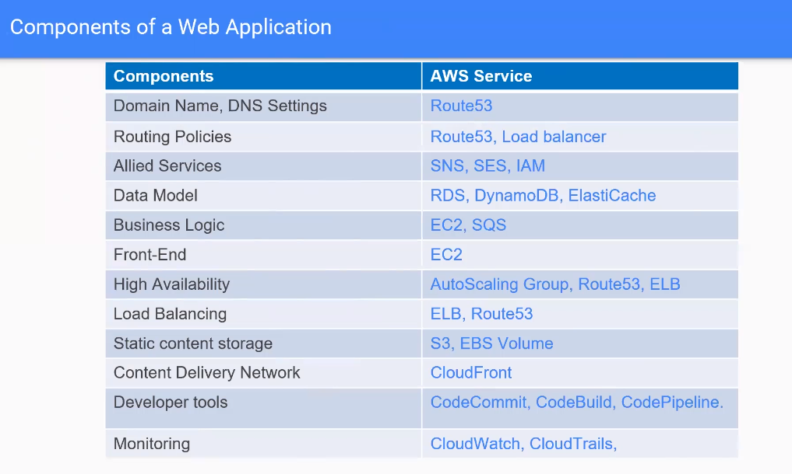

# AWS  

## GUÍA AWS  

+ [APUNTES DE AWS](https://apuntes.de/aws-certificacion-csaa/#gsc.tab=0)  

### S3 (Simple Storage)  

+ En esta parte podemos crear los llamados cajones/cestas en la nube para guardar ciertos tipo de datos en nuestro AWS. Se llaman BUCKETS.  

+ En estos BUCKETS podemos meter archivos, especificar distintas medidas de almacenamiento, podemos indicarle el versioning de lo que tenemos dentro a lo actualizado, logging si se necesita loguearse para poder acceder al bucket y podemos gestionar otro tipo de medidas y seguridad para poder acceder al bucket y conectarse a el.  

+ Otro tipo de uso de los BUCKETS son el uso de almacenar paginas web estaticas.

### IAM - SECURITY  

+ En esta sección podemos crear:  
  - Usuarios
  - Grupos
  - Politicas de grupo
  - Roles 

### EC2 (Elastic Compute Services)

- Para conectarnos a una instancia podemos verlo en las opciones de CONNECT y podemos hacerlo desde linux o windows. Para windows generamos la clave privada con PuttyGen y luego la añadimos a Putty normal para conectarse.  

+ Para conectanos a una instancia windows a la hora de conectar nos descargamos un archivo desktop remote file, descargamos el documento PEM, y lo iniciamos añadiendo la clave al programa y tendremos nuestra conexion a una instancia windows.  

+ De una instancia ya creada y configurada podemos crear una IMAGEN AMI del estado de esa instancia. Así luego podemos crear una nueva instancia a partir de esta imagen AMI.  

+ En los pasos de configuración de la instancia también se puede pasar script para por ejemplo instalar paquetes ya antes de arrancar la instancia.  

+ Los EBS son los volumenes elasticos que se pueden asignar a las instancias para que se vayan redimensionando a medida que se van llenando o vaciando.  

+ Podemos crear los EBS en volumenes o en la hora de crear la instancia en el apartado de añadir Storage y añadir un disco EBS. Si lo creamos aparte, luego lo vamos a acciones de instancia y ATTACH storage, seleccionamos el volumen EBS y luego lo formateamos con mkfs -t ext4 y lo montamos en un directorio. Si creamos algo dentro de el, si luego lo volvemos a separar y este volumen lo juntamos a otra instancia, tendrá el contenido de la otra. Se pueden crear SNAPSHOOTS de los volumenes EBS y asignarlo a otras instancias con ese contenido original.  


### AWS CLI  

+ Existe una herramienta de consola para conectarse a AWS.  

+ Instalamos con `pip install aws cli` 

+ Usamos con comandos `aws + comando + opciones`  

+ [DOCUMENTACION AWS CLI](https://docs.aws.amazon.com/cli/latest/index.html)  

+ En aws creamos un usuario `awscli`y ponemos su password roles administration access etc. Nos apuntamos las credenciales para poder conectarnos desde la herramienta de consola.  

+ Vamos a `aws configure` y metemos las credenciales que nos va pidiendo.  

+ Con `aws s3 ls` vemos todo lo que tenemos.  

+ Con `aws ec2 ?/help` vemos las opciones que podemos hacer en EC2.

+ Conectamos por ejemplo con `aws ec2 run-instances --image-id ami-xxxxxxxx --count 1 --instance-type t2.micro --key-name MyKeyPair --security-group-ids sg-903004f8 --subnet-id subnet-6e7f829e`  


### EFS  

+ Amazon Elastic File System: Sistema de archivos elástico, simple, sin servidor y con posibilidad de establecer y olvidar.  

+ Amazon Elastic File System (Amazon EFS) crece y se reduce automáticamente a medida que se agregan y eliminan archivos sin necesidad de administración o aprovisionamiento.  

+ Sistema de archivos elástico, simple, sin servidor y con posibilidad de establecer y olvidar

  + Cree y configure sistemas de archivos compartidos de forma sencilla y rápida para los servicios informáticos de AWS, sin necesidad de aprovisionamiento, implementación, parches ni mantenimiento.  

  + Escale su sistema de archivos automáticamente a medida que se agregan y eliminan archivos. Amplíe el rendimiento a niveles más altos cuando sea necesario.  

  + Pague solo por el almacenamiento que utilice y reduzca los costos hasta en un 92 % al trasladar automáticamente los archivos a los que se accede con poca frecuencia.  

  + Acceda de forma segura y fiable a los archivos con un sistema de archivos completamente administrado y diseñado para una alta disponibilidad y una durabilidad del 99,999999999 % (11 9).  

+ Para crearlo vamos a EFS y creamos un sistema de archivos elastico.  


### AWS STORAGE GATEWAY  

+ AWS Storage Gateway es un servicio de almacenamiento híbrido que permite que las aplicaciones que se encuentran en sitio puedan utilizar almacenamiento prácticamente ilimitado de la nube de AWS, de manera transparente y sin contratiempos. Storage Gateway no requiere cambios en sus aplicaciones y se integra fácilmente ya que utiliza protocolos de comunicación y almacenamiento estándar como HTTPS (HTTP sobre SSL/TLS) para comunicación con la nube, así como SMB (Server Message Block) y NFS (Network File System) para el acceso a los datos almacenados. Mediante Storage Gateway, usted puede ampliar su capacidad local de almacenamiento mientras reduce y simplifica la infraestructura de su centro de datos o de sus oficinas remotas.  

+ Las aplicaciones se conectan al servicio de Storage Gateway a través de una máquina virtual o dispositivo de hardware que se instala en sitio y que utiliza protocolos estándar como NFS, SMB e iSCSI. Este dispositivo local se conecta al servicio de Storage Gateway que a su vez se conecta con los servicios de almacenamiento de AWS tales como Amazon S3, Amazon S3 Glacier, Amazon S3 Glacier Deep Archive y Amazon EBS y de esta manera se provee almacenamiento para sus aplicaciones y usuarios que se encuentran en sitio. Este dispositivo también se utiliza como caché local para proveer un acceso de baja latencia a los datos más activos. Como en AWS nuestra prioridad es la seguridad, la conexión al servicio de AWS Storage Gateway se hace por medio de un canal seguro utilizando HTTPS.  

+ [CREACION DE AWS STORAGE](https://aws.amazon.com/es/blogs/aws-spanish/almacenamiento-hibrido-para-el-centro-de-datos-con-aws-storage-gateway/#:~:text=AWS%20Storage%20Gateway%20es%20un,manera%20transparente%20y%20sin%20contratiempos.)  

+ Las clases de almacenamiento de [AMAZON S3 GLACIER](https://aws.amazon.com/es/s3/storage-classes/glacier/) se crearon específicamente para el archivo de datos y le ofrecen el mayor rendimiento, la mayor flexibilidad de recuperación y el menor costo de almacenamiento de archivos en la nube. Todas las clases de almacenamiento S3 Glacier ofrecen escalabilidad prácticamente ilimitada y están diseñadas para lograr un 99,999999999 % (11 nueves) de durabilidad de datos. Las clases de almacenamiento S3 Glacier ofrecen opciones para acceder más rápidamente a los datos de archivos y el menor costo en almacenamiento de archivos en la nube.  

+ Amazon Glacier es un servicio de archivo de datos especialmente diseñado para las copias de seguridad o para aquellos datos que no se necesiten acceder constantemente o inmediatamente.

+ El archivo de datos en Amazon Glacier significa que aunque puede almacenar sus datos a un costo extremadamente bajo (incluso en comparación con Amazon S3), no puede recuperar sus datos inmediatamente cuando lo desee. Los datos almacenados en Amazon Glacier tardan varias horas en recuperarse, por lo que es ideal para archivar.

+ Hay tres opciones para recuperar datos con diferentes tiempos de acceso y costo: recuperaciones aceleradas, estándar y masivas, de la siguiente manera:

– Las recuperaciones aceleradas generalmente están disponibles dentro de 1 a 5 minutos.
– Las recuperaciones estándar generalmente se completan dentro de 3 a 5 horas.
– Las recuperaciones a granel generalmente se completan dentro de 5 a 12 horas. (AWS)

+ Los datos se almacenan en Amazon Glacier en «archivos». Un archivo puede ser cualquier información, como una foto, video o documento. Puede cargar un solo archivo como un archivo o agregar múltiples archivos en un archivo TAR o ZIP y cargarlo como un archivo.

+ Un solo archivo puede ser tan grande como 40 terabytes. Puede almacenar una cantidad ilimitada de archivos y una cantidad ilimitada de datos en Amazon Glacier. A cada archivo se le asigna una ID de archivo única en el momento de la creación, y el contenido del archivo es inmutable, lo que significa que después de que se crea un archivo, no se puede actualizar.


### AWS BBDD  

+ Existen varios tipos:  
  - DynamoBD: Document and key-value store.  
  - RDS: SQL database engines.  
  + ELASTICACHE: In-memory caché.  
  - REDSHIFT: data warehouse.  


+ [Amazon RDS](https://docs.aws.amazon.com/es_es/AmazonRDS/latest/UserGuide/Concepts.DBInstanceClass.html) proporciona una selección de tipos de instancias optimizadas para diferentes casos de uso de bases de datos relacionales. Los tipos de instancia abarcan varias combinaciones de capacidad de CPU, memoria, almacenamiento y redes. Le proporcionan flexibilidad para elegir la combinación de recursos adecuada para sus bases de datos. Cada tipo de instancia incluye varios tamaños de instancia, lo que le permite escalar su base de datos según los requisitos de la carga de trabajo de destino.  

+ Vamos a RDS y seleccionamos el tipo de bbdd que queremos crear. A partir de ahi creamos para que es el uso, usuario, password, base de datos, tamaño, backup, seguridad, logs, etc.  

+ Luego por ejemplo podemos conectarnos desde una instancia al nuestra bbdd como por ejemplo con `mysql -h endpoint_de_la_bbdd -u xxx -p` y desde ahi podemos crear tablas etc. Tambien podemos crear snapshoots y de ahi crear otra modificada etc.  

+ [AMAZON AURORA](https://docs.aws.amazon.com/es_es/AmazonRDS/latest/AuroraUserGuide/CHAP_AuroraOverview.html) es una base de datos relacional compatible con MySQL y PostgreSQL creada para la nube. Combina el rendimiento y la disponibilidad de las bases de datos empresariales tradicionales con la simplicidad y la rentabilidad de las bases de datos de código abierto.  

+ Amazon Aurora es hasta cinco veces más rápida que las bases de datos de MySQL estándar y tres veces más rápida que las bases de datos de PostgreSQL estándar. Ofrece la seguridad, disponibilidad y fiabilidad de las bases de datos de nivel comercial por una décima parte del costo. Amazon Aurora está completamente administrada por Amazon Relational Database Service (RDS), que automatiza las tareas administrativas demandantes como el aprovisionamiento de hardware, la configuración de bases de datos, la aplicación de parches y las copias de seguridad.  

+ Amazon Aurora ofrece un sistema de almacenamiento distribuido, tolerante a errores y de recuperación automática que ajusta su escala verticalmente de forma automática hasta 128 TB por instancia de base de datos. Amazon Aurora suministra alto rendimiento y disponibilidad con hasta 15 réplicas de lectura de baja latencia, recuperación a un momento dado, generación de copias de seguridad continua en Amazon S3 y replicación en tres zonas de disponibilidad.  


### DISEÑO DE ARQUITECTURAS  

+ Arquitectura diseño web:  

  

+ LoadBalancer: 3 tipos: basico, aplication y autoscaling.  

+ El basico se puede ir a loadbalancer y crear, meter las istancias que pertenecen y el puerto y security groups.

+ El aplication, se crea igual pero se suele crear un TargetGroup que diga que comprueba el index.html por el puerto 80. Un vez creado se va a editar y añadir instancias y se le indica que target group se le indica para que compruebe su health check de que esa parte funciona.  

+ El AutoScaling se puede crear un conjunto de instancias con la misma configuracion e ir indicando que aumente de instancia o disminuya segun criterios como el uso de cpu etc.  


### VPC  

+ Es crear una red privada y a partir de ahi montar todo tu insfraestructura.  

  
  


+ Si por ejemplo ponemos la red 10.0.0.0/16, no se pueden usar:  
  - .1/16 es router  
  - .2/16 es para dnd server  
  - .3/16 es para uso futuro de aws  
  - .255/16 es broadcast  
  - .0/16 es la red  

+ Vamos a VPC creamos una red con subnet y sus rangos. Despues creamos instancias y le asignamos esta redes. Tambien podemos crear Elastic IP y asignar IP fijas publicas a estas instancias para esta red. Se puede crear en modo de privada y publica subredes, segun la estructura que queramos.  

  


+ Se puede crear Internet gateway y hacer atach con el VPC que sirve para conectar esta red a Internet. El egress-only sirve para IPv6.  

+ Tambien se pueden crear ACL en el PVC.  

+ Listas de control de acceso (ACL) de red: las ACL de red actúan como firewall para las subredes asociadas y controlan el tráfico entrante y saliente en el ámbito de la subred.  

+ Grupos de seguridad: los grupos de seguridad actúan como firewall para las instancias Amazon EC2 asociadas, al controlar el tráfico entrante y saliente en el nivel de la instancia. Cuando lanza una instancia, puede asociarla a uno o varios grupos de seguridad que haya creado. Cada instancia de su VPC podría pertenecer a un conjunto distinto de grupos de seguridad. Si no especifica ningún grupo de seguridad al lanzar una instancia, esta se asocia automáticamente al grupo de seguridad predeterminado de la VPC.  

+ Connection peering para crear conexion entre diferentes VPC.  

+ Para hacer conexiones VPN se necesita tambien un Virtual Private Gateway para luego poder crear estos tuneles de la red de casa a la nube de amazon.  

  


### SERVICES AMAZON  

+ AWS Simple Notification Service (SNS): servicios de notificaciones de suscripciones, email etc.  

+ AWS Simple Queue Service (SQS): servicio de cola de mensajes.  

+ AWS CloudWatch: herramienta para gestionar las metricas de nuestras maquinas de aws.  

+ AWS CloudTrail: sirve para guardar datos de eventos de nuestras maquinas en un bucket s3.  

+ AWS Route53: herramienta que sirve para crear, registrar y gestionar dominios.  

+ AWS CloudFormation: crear todo mediante codigo json.  

+ AWS Developer tools: herramientas parecidad a git como CodeCommit y luego hay CodeStar que es muy parecido a crear un pod de openshift, y herramientas para test, dev y deploy.  

### LAMBDA  

+ [AWS Lambda](https://aws.amazon.com/es/lambda/) es un servicio informático sin servidor y basado en eventos que le permite ejecutar código para prácticamente cualquier tipo de aplicación o servicio backend sin necesidad de aprovisionar o administrar servidores. Puede activar Lambda desde más de 200 servicios de AWS y aplicaciones de software como servicio (SaaS), y solo paga por lo que utiliza.  

+ Ejecute el código sin aprovisionar ni administrar la infraestructura. Simplemente escriba y cargue el código como un archivo .zip o una imagen de contenedor.  

+ Responda automáticamente a las solicitudes de ejecución de código a cualquier escala, desde una docena de eventos al día hasta cientos de miles por segundo.  

+ Ahorre costos al pagar solamente por el tiempo de informática que utiliza, por milisegundo, en lugar de aprovisionar la infraestructura por adelantado para la capacidad máxima.  

+ Optimice el tiempo de ejecución del código y el rendimiento con el tamaño adecuado de la memoria de las funciones. Responda a la alta demanda en milisegundos de dos dígitos con simultaneidad aprovisionada.  


## IAC CLOUDFORMATION

+ IAC (Infrastructure as Code)

+ AWS CloudFormation le ofrece una forma sencilla de modelar un conjunto de recursos relacionados de AWS y de terceros, aprovisionarlos de manera rápida y consistente y administrarlos a lo largo de sus ciclos de vida tratando la infraestructura como un código. La plantilla de CloudFormation describe los recursos que desea y sus dependencias para que los pueda lanzar y configurar juntos como una pila. Puede usar la plantilla para crear, actualizar y eliminar toda una pila como una única unidad, tantas veces como lo necesite, en lugar de administrar los recursos de manera individual. Puede administrar y aprovisionar pilas en varias cuentas y regiones de AWS.

+ web (https://aws.amazon.com/es/cloudformation/)

+ Documentación (https://docs.aws.amazon.com/AWSCloudFormation/latest/UserGuide/Welcome.html)

+ Sintaxis simple:  
```
---
Resources:
    MyInstance:
        Type: AWS::EC2::Instance
        Properties:
            AvailabilityZone: us-east-1a
            ImageId: ami-123456789
            InstanceType: t2.micro
```

+ Sintaxis compleja:  
```
---
Parameters:
    SecurityGroupDescription:
        Description: Security-Group Description
        Type: String

Resources:
    MyInstance:
        Type: AWS::EC2::Instance
        Properties:
            AvailabilityZone: us-east-1a
            ImageId: ami-123456789
            InstanceType: t2.micro
            SecurityGroups:
                - !Ref SSHSecurityGroup
                - !Ref ServerSecurityGroup
    
    # an elastic Ip for our instance
    MyEIP:
        Type: AWS::EC2::EIP
        Properties:
            InstanceId: !Ref MyInstance

    # our EC2 security group
    SSHSecurityGroup:
        Type: AWS::EC2::SecurityGroup
        Properties:
            GroupDescription: Enable port 22
            SecurityGroupIngress:
            - CidrIp: 0.0.0.0/0
              FromPort: 22
              IpProtocol: tcp
              ToPort: 22

    # our second EC2 security group
    SSHSecurityGroup:
        Type: AWS::EC2::SecurityGroup
        Properties:
            GroupDescription: !Red SecurityGroupDescription
            SecurityGroupIngress:
            - IpProtocol: tcp
              FromPort: 80
              ToPort: 80
              CidrIp: 0.0.0.0/0
            - IpProtocol: tcp
              FromPort: 22
              ToPort: 22
              CidrIp: 10.10.0.1/32
```

### Create STACK  

+ Vamos a consola , cloudformation, crear stack, crear template, subir fichero y ponemos nuestra instancia simple de código en el fichero y veremos como crea una instancia del tipo que se le indica:  
```
---
Resources:
    MyInstance:
        Type: AWS::EC2::Instance
        Properties:
            AvailabilityZone: us-east-1a
            ImageId: ami-123456789
            InstanceType: t2.micro
```

+ Para actualizar la que tenemos vamos a crear stack, replace current template, subimos fichero y veremos en los eventos como se actualiza:  
```
---
Parameters:
    SecurityGroupDescription:
        Description: Security-Group Description
        Type: String

Resources:
    MyInstance:
        Type: AWS::EC2::Instance
        Properties:
            AvailabilityZone: us-east-1a
            ImageId: ami-123456789
            InstanceType: t2.micro
            SecurityGroups:
                - !Ref SSHSecurityGroup
                - !Ref ServerSecurityGroup
    
    # an elastic Ip for our instance
    MyEIP:
        Type: AWS::EC2::EIP
        Properties:
            InstanceId: !Ref MyInstance

    # our EC2 security group
    SSHSecurityGroup:
        Type: AWS::EC2::SecurityGroup
        Properties:
            GroupDescription: Enable port 22
            SecurityGroupIngress:
            - CidrIp: 0.0.0.0/0
              FromPort: 22
              IpProtocol: tcp
              ToPort: 22

    # our second EC2 security group
    SSHSecurityGroup:
        Type: AWS::EC2::SecurityGroup
        Properties:
            GroupDescription: !Red SecurityGroupDescription
            SecurityGroupIngress:
            - IpProtocol: tcp
              FromPort: 80
              ToPort: 80
              CidrIp: 0.0.0.0/0
            - IpProtocol: tcp
              FromPort: 22
              ToPort: 22
              CidrIp: 10.10.0.1/32
```
> Despues se puede borrar con Delete en los eventos.  

### Parámetros  

+ Podemos indicar una serie de [parametros](https://docs.aws.amazon.com/AWSCloudFormation/latest/UserGuide/parameters-section-structure.html) a la hora de crear nuestra IAC:  

+ Ejemplo 1:  
```
Parameters:
  InstanceTypeParameter:
    Type: String
    Default: t2.micro
    AllowedValues:
      - t2.micro
      - m1.small
      - m1.large
    Description: Enter t2.micro, m1.small, or m1.large. Default is t2.micro.
```

+ Ejemplo2:  
```
Parameters: 
  DBPort: 
    Default: 3306
    Description: TCP/IP port for the database
    Type: Number
    MinValue: 1150
    MaxValue: 65535
  DBPwd: 
    NoEcho: true
    Description: The database admin account password
    Type: String
    MinLength: 1
    MaxLength: 41
    AllowedPattern: ^[a-zA-Z0-9]*$
```  

### Recursos  

+ En esta sección declaramos qué [recursos](https://docs.aws.amazon.com/AWSCloudFormation/latest/UserGuide/resources-section-structure.html#resources-section-structure-examples) queremos crear en nuestro stack

+ Ejemplo:  
```
Resources: 
  MyInstance: 
    Type: "AWS::EC2::Instance"
    Properties: 
      UserData: 
        "Fn::Base64":
          !Sub |
            Queue=${MyQueue}
      AvailabilityZone: "us-east-1a"
      ImageId: "ami-0ff8a91507f77f867"
  MyQueue: 
    Type: "AWS::SQS::Queue"
    Properties: {}
```

+ Todos los tipos de [recursos](https://docs.aws.amazon.com/AWSCloudFormation/latest/UserGuide/AWS_EC2.html) 

+ Ejemplo:  
```
Type: AWS::EC2::Instance
Properties: 
  AdditionalInfo: String
  Affinity: String
  AvailabilityZone: String
  BlockDeviceMappings: 
    - BlockDeviceMapping
  CpuOptions: 
    CpuOptions
  CreditSpecification: 
    CreditSpecification
  DisableApiTermination: Boolean
  EbsOptimized: Boolean
  ElasticGpuSpecifications: 
    - ElasticGpuSpecification
  ElasticInferenceAccelerators: 
    - ElasticInferenceAccelerator
  EnclaveOptions: 
    EnclaveOptions
  HibernationOptions: 
    HibernationOptions
  HostId: String
  HostResourceGroupArn: String
  IamInstanceProfile: String
  ImageId: String
  InstanceInitiatedShutdownBehavior: String
  InstanceType: String
  Ipv6AddressCount: Integer
  Ipv6Addresses: 
    - InstanceIpv6Address
  KernelId: String
  KeyName: String
  LaunchTemplate: 
    LaunchTemplateSpecification
  LicenseSpecifications: 
    - LicenseSpecification
  Monitoring: Boolean
  NetworkInterfaces: 
    - NetworkInterface
  PlacementGroupName: String
  PrivateIpAddress: String
  RamdiskId: String
  SecurityGroupIds: 
    - String
  SecurityGroups: 
    - String
  SourceDestCheck: Boolean
  SsmAssociations: 
    - SsmAssociation
  SubnetId: String
  Tags: 
    - Tag
  Tenancy: String
  UserData: String
  Volumes: 
    - Volume
```  

### Mapping  

+ [Mapea](https://docs.aws.amazon.com/AWSCloudFormation/latest/UserGuide/mappings-section-structure.html) asignando una clave a un valor  

+ Ejemplo:  
```
AWSTemplateFormatVersion: "2010-09-09"
Mappings: 
  RegionMap: 
    us-east-1:
      HVM64: ami-0ff8a91507f77f867
      HVMG2: ami-0a584ac55a7631c0c
    us-west-1:
      HVM64: ami-0bdb828fd58c52235
      HVMG2: ami-066ee5fd4a9ef77f1
    eu-west-1:
      HVM64: ami-047bb4163c506cd98
      HVMG2: ami-0a7c483d527806435
    ap-northeast-1:
      HVM64: ami-06cd52961ce9f0d85
      HVMG2: ami-053cdd503598e4a9d
    ap-southeast-1:
      HVM64: ami-08569b978cc4dfa10
      HVMG2: ami-0be9df32ae9f92309
Resources: 
  myEC2Instance: 
    Type: "AWS::EC2::Instance"
    Properties: 
      ImageId: !FindInMap [RegionMap, !Ref "AWS::Region", HVM64]
      InstanceType: m1.small
```  


### Outputs  

+ Los [outputs](https://docs.aws.amazon.com/AWSCloudFormation/latest/UserGuide/outputs-section-structure.html) nos salidas de mensajes. Intentar no poner información sensible.  

+ Ejemplo:  
```
Outputs:
  BackupLoadBalancerDNSName:
    Description: The DNSName of the backup load balancer
    Value: !GetAtt BackupLoadBalancer.DNSName
    Condition: CreateProdResources
  InstanceID:
    Description: The Instance ID
    Value: !Ref EC2Instance
```  

```
Outputs:
  BackupLoadBalancerDNSName:
    Description: The DNSName of the backup load balancer
    Value: !GetAtt BackupLoadBalancer.DNSName
    Condition: CreateProdResources
  InstanceID:
    Description: The Instance ID
    Value: !Ref EC2Instance
``` 

### Conditions  

+ Los [conditions](https://docs.aws.amazon.com/AWSCloudFormation/latest/UserGuide/conditions-section-structure.html) nos indican que hace algo si se cumple tal condición.  

+ Ejemplo:  
```
AWSTemplateFormatVersion: 2010-09-09
Parameters:
  EnvType:
    Description: Environment type.
    Default: test
    Type: String
    AllowedValues:
      - prod
      - test
    ConstraintDescription: must specify prod or test.
Conditions:
  CreateProdResources: !Equals 
    - !Ref EnvType
    - prod
Resources:
  EC2Instance:
    Type: 'AWS::EC2::Instance'
    Properties:
      ImageId: ami-0ff8a91507f77f867
  MountPoint:
    Type: 'AWS::EC2::VolumeAttachment'
    Condition: CreateProdResources
    Properties:
      InstanceId: !Ref EC2Instance
      VolumeId: !Ref NewVolume
      Device: /dev/sdh
  NewVolume:
    Type: 'AWS::EC2::Volume'
    Condition: CreateProdResources
    Properties:
      Size: 100
      AvailabilityZone: !GetAtt 
        - EC2Instance
        - AvailabilityZone
```


### Functions  

+ Hay diferentes [funciones](https://docs.aws.amazon.com/AWSCloudFormation/latest/UserGuide/intrinsic-function-reference.html) internas en la creación de un template IAC 


### User data  

+ Podemos crear plantillas escribiendo ordenes de linux con [user data](https://docs.aws.amazon.com/AWSEC2/latest/UserGuide/user-data.html)  

+ Ejemplo:  
```
---
Parameters:
    SSHKey:
        Description: Name of an existing EC2 keypair to enable ssh access to the instance
        Type: AWS::EC2::KeyPair::KeyName

Resources:
    MyInstance:
        Type: AWS::EC2::Instance
        Properties:
            AvailabilityZone: us-east-1a
            ImageId: ami-009d6802948d06e52
            InstanceType: t2.micro
            KeyName: !Ref SSHKey
            SecurityGroups:
                - !Ref SSHSecurityGroup
            UserData:
              Fn::Base64: |
                #!/bin/bash -xe
                yum update -y
                yum install -y httpd
                systemctl start httpd
                systemctl enable httpd
                echo "Hello World from user data" > /var/www/html/index.html

    # our EC2 security group
    SSHSecurityGroup:
        Type: AWS::EC2::SecurityGroup
        Properties:
            GroupDescription: Enable port 22
            SecurityGroupIngress:
            - CidrIp: 0.0.0.0/0
              FromPort: 22
              IpProtocol: tcp
              ToPort: 22
            - CidrIp: 0.0.0.0/0
              FromPort: 80
              IpProtocol: tcp
              ToPort: 80
```  
> Creamos una stack con el template, ponemos el parametro creado y vemos que sea crea tanto por la ip:80 como por consola.  


### Cfn-init  

+ Vemos la docu de [cfn init](https://docs.aws.amazon.com/AWSCloudFormation/latest/UserGuide/cfn-init.html) 

+ Ejemplo:  
```
---
Parameters:
    SSHKey:
        Description: Name of an existing EC2 keypair to enable ssh access to the instance
        Type: AWS::EC2::KeyPair::KeyName

Resources:
    MyInstance:
        Type: AWS::EC2::Instance
        Properties:
            AvailabilityZone: us-east-1a
            ImageId: ami-009d6802948d06e52
            InstanceType: t2.micro
            KeyName: !Ref SSHKey
            SecurityGroups:
                - !Ref SSHSecurityGroup
            UserData:
              Fn::Base64:
                !Sub |
                  #!/bin/bash -xe
                  # get the latest cloudformation package
                  yum update -y aws-cfn-bootstrap
                  # start cfn-init
                  /opt/aws/bin/cfn-init -s ${AWS::StackId} -r MyInstance --region ${AWS::Region} || error_exit "Failed to run cfn-init"
    Metadata:
      Comment: Install a simple Apache HTTP page
      AWS::CloudFormation::Init:
        config:
          package:
            yum:
              httpd:[]
          files:
            "/var/www/html/index.html"
              content: |
                <h1>Hello word, using cfn-init</h1>
              mode: '000644'
          commands:
            hello:
              command: "echo 'hello world'"
          services:
            sysvinit:
              httpd:
                enabled: 'true'
                ensureRunning: 'true'

    # our EC2 security group
    SSHSecurityGroup:
        Type: AWS::EC2::SecurityGroup
        Properties:
            GroupDescription: Enable port 22
            SecurityGroupIngress:
            - CidrIp: 0.0.0.0/0
              FromPort: 22
              IpProtocol: tcp
              ToPort: 22
            - CidrIp: 0.0.0.0/0
              FromPort: 80
              IpProtocol: tcp
              ToPort: 80
```  

### Cfn-signal  

+ Docu de [cfn-signal](https://docs.aws.amazon.com/AWSCloudFormation/latest/UserGuide/cfn-signal.html)

+ Ejemplo:  
```
AWSTemplateFormatVersion: 2010-09-09
Description: Simple EC2 instance
Resources:
  MyInstance:
    Type: AWS::EC2::Instance
    Metadata:
      'AWS::CloudFormation::Init':
        config:
          files:
            /tmp/test.txt:
              content: Hello world!
              mode: '000755'
              owner: root
              group: root
    Properties:
      ImageId: ami-a4c7edb2
      InstanceType: t2.micro
      UserData: !Base64
        'Fn::Join':
          - ''
          - - |
              #!/bin/bash -x
            - |
              # Install the files and packages from the metadata
            - '/opt/aws/bin/cfn-init -v '
            - '         --stack '
            - !Ref 'AWS::StackName'
            - '         --resource MyInstance '
            - '         --region '
            - !Ref 'AWS::Region'
            - |+

            - |
              # Signal the status from cfn-init
            - '/opt/aws/bin/cfn-signal -e $? '
            - '         --stack '
            - !Ref 'AWS::StackName'
            - '         --resource MyInstance '
            - '         --region '
            - !Ref 'AWS::Region'
            - |+

    CreationPolicy:
      ResourceSignal:
        Timeout: PT5M
```  


### Rollback  

+ Cuando creamos una stack podemos indicar si queremos un rollback para poder volver a un estado anterior.  

### Cfn nested stacks  

+ Docu de stack anidadas entre sí[cfn nested](https://docs.aws.amazon.com/AWSCloudFormation/latest/UserGuide/using-cfn-nested-stacks.html)

+ Ejemplo:  
```
---
Parameters:
    SSHKey:
        Description: Name of an existing EC2 keypair to enable ssh access to the instance
        Type: AWS::EC2::KeyPair::KeyName

Resources:
    MyInstance:
        Type: AWS::EC2::Instance
        Properties:
          TemplateURL: https://s3.amazonaws.com/cloudformation-templates-us-east-1/LAMP_Single-Instance.template
          Parameters:
            KeyName: !Ref SSHKey
            DBName: "mydb"
            DBUser: "user"
            DBPassword: "pass"
            DBRootPassword: "passroot"
            InstanceType: t2.micro
            SSHLocation: "0.0.0.0/0"

Outputs:
  StackRef:
    value: !Ref myStack
  OutputFromNestedStack:
    value: !GetAtt mystack.Outputs.WebsiteURL
```  

### Change sets  

+ [DOCU](https://docs.aws.amazon.com/AWSCloudFormation/latest/UserGuide/using-cfn-updating-stacks-changesets.html)

+ Sirve para actualizar o subir otra cosa de una stack ya creada y podremos ver el proceso de si se haría bien o no. Si nos interesa, le damos a EXECUTE y empieza a cambiarse, sino DELETE.  


### Depends on  

+ [DOCU](https://docs.aws.amazon.com/AWSCloudFormation/latest/UserGuide/aws-attribute-dependson.html)  

+ De crear una instancia que depende de otra creada.  

+ Ejemplo:  
```
AWSTemplateFormatVersion: '2010-09-09'
Mappings:
  RegionMap:
    us-east-1:
      AMI: ami-0ff8a91507f77f867
    us-west-1:
      AMI: ami-0bdb828fd58c52235
    eu-west-1:
      AMI: ami-047bb4163c506cd98
    ap-northeast-1:
      AMI: ami-06cd52961ce9f0d85
    ap-southeast-1:
      AMI: ami-08569b978cc4dfa10
Resources:
  Ec2Instance:
    Type: AWS::EC2::Instance
    Properties:
      ImageId:
        Fn::FindInMap:
        - RegionMap
        - Ref: AWS::Region
        - AMI
    DependsOn: myDB
  myDB:
    Type: AWS::RDS::DBInstance
    Properties:
      AllocatedStorage: '5'
      DBInstanceClass: db.t2.small
      Engine: MySQL
      EngineVersion: '5.5'
      MasterUsername: MyName
      MasterUserPassword: MyPassword
```  

### Detect drift stack  

+ Sirve para hacer marcas y ver donde se cambió si actualizas la template o modificas algo de la template  

+ [DOCU](https://docs.aws.amazon.com/AWSCloudFormation/latest/UserGuide/detect-drift-stack.html)

+ Vamos a stack actions - detect drift una vez ya hemos metido nuestra template creada. Podemos ver en view drift y si modificamos cosas como el security groups veremos que la marca cambia.


