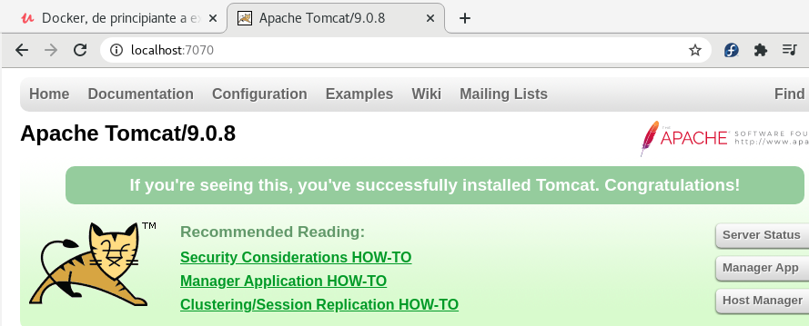
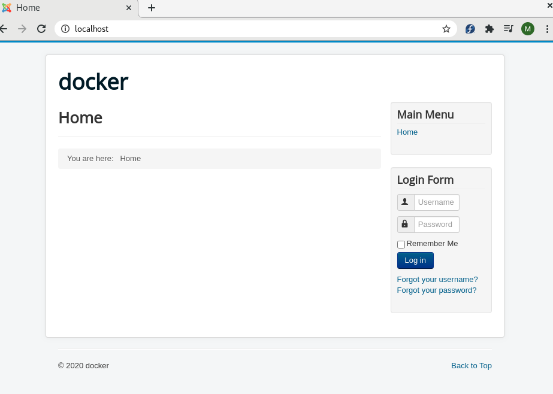

# DOCKER

+ [APUNTES DOCKER](https://apuntes.de/docker-certificacion-dca/#gsc.tab=0)  


## INSTALACIÓN  
+ Instalar Docker:  
```
$ sudo dnf remove docker \
                  docker-client \
                  docker-client-latest \
                  docker-common \
                  docker-latest \
                  docker-latest-logrotate \
                  docker-logrotate \
                  docker-selinux \
                  docker-engine-selinux \
                  docker-engine
$ sudo dnf -y install dnf-plugins-core
$ sudo dnf config-manager \
    --add-repo \
    https://download.docker.com/linux/fedora/docker-ce.repo   
$ sudo dnf install docker-ce docker-ce-cli containerd.io
$ sudo systemctl start docker
$ sudo docker run hello-world
```

## COMANDOS  
+ Crear un container Docker:  
```
docker run --rm -it fedora:27//isx46410800/netcat:latest /bin/bash
docker run --rm --name ldap -h ldap -d imagen
```
+ Descagar una imagen:  
`docker pull fedora:27/imagen`
+ Ver imagenes de mi sistema:  
`docker images`
+ Iniciar un container:  
`docker start container`
+ Entrar dentro de un container en otra terminal:  
`docker exec -it nomcontainer /bin/bash`
+ Entrar dentro de un container en detached:  
`docker attach container`
+ Procesos de docker:  
`docker ps -a`  
`docker top container`  
+ Último container creado:  
`docker ps -l`  
+ Document Root:  
`docker info | grep -i root`  
+ Memoria y cpu limitada y variables de entorno:  
`docker run -m "MB" --cpuset-cpus 0-1 -e "NAME=miguel"`  
+ Iniciar un container:  
`docker start/stop IDcontainer`
+ Cambiar nombre container:  
`docker rename IDcontainer NuevoNombre`  
+ Borrar varias cosas:  
`docker rm $(docker ps -aq)`
+ Docker version:  
`docker version`
+ Info de un docker:  
`docker info`
+ Lista de containers:  
`docker container ls -a`
+ Borrar una imagen:  
`docker rmi imagen`
+ Borrar un container:  
`docker rm container`
+ Cambiar etiqueta de un container:  
`docker tag imagen nombreNuevo:tag`  
+ Borrar imagenes none:  
`docker images -f dangling=true | xargs docker rmi`  
+ Crear y subir una imagen a DockerHub:  
```
docker login
docker tag imagen nuevoimagen:tag
docker push nuevoimagen:tag
```
+ Copiar un fichero a fuera del docker o dentro:  
```
docker cp file container:/opt/docker/.
docker cp container:/opt/docker/. file
```
+ Docker con puerto mapeado para el exterior:  
`docker run --rm --name ldap -h ldap -p 389:389 -p 80:80 -it isx/ldap /bin/bash`
> -p puertoMiMaquina:puertoContenedor  
> -x dirActivo dentro del container  


### Redes en Docker:  
```
docker network create NameRed
docker network rm NameRed
docker network inspect NameRed/container
docker network create --subnet 172.19.0.0/16 NameRed
```

### Volumes en Docker:  
```
docker volume create NOMBREVOLUMEN
docker volume ls
docker volume inspect NOMVOLUMEN
ls /var/lib/docker/volumes
--privileged
-v volumen:contenido
```
`docker run --rm --name ldap -h ldap -v NOMVOLUMEN:/var/lib/sambaloQueGuarda --privileged -it isx/ldap /bin/bash`

### Docker Compose:  
```
docker-compose up #enciende todos los dockers del file compose.yml
docker-compose -f fileCompose.yml up (-d) #elegimos que fichero encendemos del compose
docker-compose down #apaga todo
docker-compose ps
docker-compose images
docker-compose top nom_servei
docker-compose port ldap 389 #servicio y puerto elegido
docker-compose push/pull #subir o bajar images
docker-compose logs ldap #logs del servicio elegido
docker-compose pause/unpause ldap #pausar el servicio
docker-compose start/stop ldap #iniciar servicio
docker-compose scale ldap=2 #dos container ldap
```  

### Docker SWARM:  
```
docker swarm init #inicia el docker swarm
docker node ls # lista de nodos del swarm
docker swarm join-tocken manager/worker #une workers o manager
docker stack deploy -c docker_compose.yml nombreAPP #hace deploy
docker stack ps NombreAPP #procesos
docker stack ls #listado
docker stack services nombreAPP #servicios
docker stack rm NombreAPP #parar
docker service ls
docker service ps nombreservicio
docker service inspect nomservicio
docker service scale nomservicio=3
docker swarm leave --force #se desune del swarm
docker swarm init --advertise-addr IP
docker node update --label-add tipus=valor nomNode
docker node inspect nomNode
docker node update --availability active/drain/pause nomNode
```  

## ARQUITECTURA  

+ Docker Host es el servidor físico/real donde se encuentra instalado Docker.  

+ Docker servicio:  
  - Docker Client.  
  - Rest API: es el intermediario encargado de comunicar al Docker client con el Docker server.  
  - Docker Server.  

  

+ Arquitectura Imagen docker (Dockerfile):  
    1. Capa 1 - From: Sistema operativo minimo a elegir.  
    2. Capa 2 - Run: lo que se quiera instalar, ejemplo apache.  
    3. Capa 3 - CMD: lo que se tiene que poner para que cuando se arranque la imagen empiece con ese comando. Normalmente la activación de un servicio en detached.  
> SON CAPAS DE SOLO LECTURA Y NO SE PUEDE MODIFICAR NI BORRAR 

```
FROM centos:7
RUN yum install -y httpd
CMD["apachectl","-DFOREGROUND"]
```  

  

+ Contenedor es una capa addicional en tiempo real de ejecución, el empaquetado de todo el dockerfile. CAPA DE ESCRITURA. Recuerda que la capa del contenedor es temporal y que al eliminar el contenedor, todo lo que haya dentro de ella desaparecerá.    

  
  

+ Se diferencia de una máquina virtual es que un contenedor es como un proceso más del sistema mientras que una MV hay que bajarse una ISO, instalar y agregar RAM, CPU y HD de nuestra propia máquina real.  


## DOCKER IMAGES  
+ Poniendo `docker + SistemaOperativo` podemos adquirir [imágenes oficiales](https://hub.docker.com/) de los propios creadores para poder descargar del repositorio de __DockerHub__ para nuestros contenedores.  

+ Por defecto, sino podemos un tag a la distribución, nos cogerá el `tag latest` sino tendremos que poner la versión concreta como `docker pull mongo:3.6-jessie`. Se actualiza el tag si te bajas una imagen pero está recientemente actualizada y la antigua se queda en _none_.  

+ Vemos las imágenes con:  
`docker images`  

### DOCKERFILE  
+ El fichero para crear nuestra imagen Docker se llama `Dockerfile`.  

+ Para construir la imagen es `docker build -t/--tag imagen:tag . ó -f /rutaDockerfile` .:  
`docker build -t isx46410800/centos:inicial .`  

+ Si modificamos algo del Dockerfile, hay que volver hacer el comando anterior.  
`docker build -t isx46410800/centos:detached images/centos/.`  

+ Ver el historial de construcción de capas de mi imagen:  
`docker history -H imagen:tag`  

+ Borrar una imagen:  
`docker rmi idImagen`  

+ Borrar un contenedor:  
`docker rm contenedorName`  

+ Ver los contenedores:  
`docker ps / docker ps -a`  

+ COMANDOS DOCKERFILE:  
    - FROM: desde donde se baja la imagen de SO.  
    - RUN: para instalar paquetes.  
    - COPY: copia ficheros de fuera hacia el container, ponemos ruta absoluta o del directorio actual.  
    - ADD: lo mismo que copy pero se puede pasar URLs y copiaría la info de la url a donde indiquemos.  
    - ENV: crea variable de entorno.  
    - WORKDIR: directorio activo al entrar.  
    - LABEL: es una etiqueta que puede ir en cualquier sitio, son informativas, es metadata.  
    - USER: quien ejecuta la tarea, por defecto es root.  
    - EXPOSE: puertos por donde escucha y puedes indicar qué puertos va funcionar mi contenedor.  
    - VOLUME: indica donde metemos la data cuando el container se muere.  
    - CMD: comando por el cual se ejecuta el container, normalmente un servicio detached `CMD ["apachectl", "-DFOREGORUND"]`.  

+ Ejemplo Dockerfile:  

```
# De que sistema operativo partimos
FROM centos:7
# Labels de metadata extra
LABEL author="Miguel Amorós"
LABEL description="Mi primer container con Dockerfile"
# Que paquetes a instalar
RUN yum install -y httpd
# Creamos variables de entorno
ENV saludo "Hola Miguel"
# Directorio activo
WORKDIR /var/www/html
# Copiamos un fichero de fuera
COPY ./listaCompra.txt ~/listaCompra.txt
# Prueba de la variable
RUN echo "$saludo" > ~/saludo.txt
# Usuario que ejecuta la tarea
RUN echo "$(whoami)" > ~/user1.txt
RUN useradd miguel 
RUN useradd miguelito
RUN echo "miguel" | passwd --stdin miguel
RUN echo "miguelito" | passwd --stdin miguelito
RUN chown miguel /var/www/html
USER miguel
RUN echo "$(whoami)" > ~/user2.txt
USER root
# Volumen para meter la chicha de cuando se muere el container
VOLUME /tmp/
# Como arrancar el container
CMD ["apachectl", "-DFOREGROUND"]
```  

+ Podemos usar un fichero `.dockerignore` para ignorar ficheros que no queremos que copiemos en el container.  

+ Para ver cualquier CMD para dejar por ejemplo un servicio encendido en detached se usa el comando:  
`docker history -h SO / en docker hub`  

+ Buenas prácticas, cuantas menos lineas de codigo, menos capas se utilizan al construir la imagen:  
```
RUN \
  useradd miguel && \
  useradd miguelito
```  

#### CMD VS ENTRYPOINT  
+ __CMD__: Este comando se encarga de pasar valores por defecto a un contenedor. Entre estos valores se pueden pasar ejecutables. Este comando tiene tres posibles formas de pasar los parámetros:  

`CMD [“parametro1”, “parametro2”, ….]`  
`CMD ["apachectl", "-DFOREGORUND"]`  

+ __ENTRYPOINT__: Este comando se ejecuta cuando se quiere ejecutar un ejecutable en el contenedor en su arranque. Los ejemplos tipo de su uso, son cuando se quiere levantar un servidor web, una base de datos, etc ….  

`ENTRYPOINT comando parametro1 parametro2`  
`ENTRYPOINT cal 2020`  
`ENTRYPOINT cal` # Y pasar por comando los parámetros  

+ Como se ha comentado anteriormente el comando CMD se puede utilizar para pasar parámetros al comando ENRYPOINT. Una posible forma de realizarlo es:  

`ENTRYPOINT ["cal"]`  
`CMD ["2020"]`  

#### CENTOS-PHP-SSL  

+ Crear unaas llaves para certificado SSL:  
`openssl req -x509 -nodes -days 365 -newkey rsa:2048 -keyout dockerssl.key -out dockerssl.crt`  
> Ponemos de commom name localhost

+ Dockerfile:  
```
# SO
FROM centos:7
# paquetes de apache php y ssl 
RUN \
  yum -y install httpd php php-cli php-commom mod_ssl openssl
# dir creado
RUN mkdir /opt/docker
# indice de comprobacion de php
RUN echo "<?php phpinfo(); ?>" > /var/www/html/hola.php
# web de prueba
COPY startbootstrap /var/www/html
# conf del ssl en el fichero de apache de conf
COPY ssl.conf /etc/httpd/conf.d/default.conf
# copia de certificados y startup
COPY dockerssl.crt /opt/docker/dockerssl.crt
COPY dockerssl.key /opt/docker/dockerssl.key
COPY startup.sh /opt/docker/startup.sh
# permisos del startup
RUN chmod +x /opt/docker/startup.sh
# escuchar puerto 443
EXPOSE 443
# arranque
CMD ["/opt/docker/startup.sh"]
```  

+ Podemos eliminar imagenes none con el comando:  
`docker images -f dangling=true | xargs docker rmi`  


#### NGINX-PHP  

+ Dockerfile:  
```
# SO
FROM centos:7
# copiar el repo de nginx
COPY nginx.repo /etc/yum.repos.d/nginx.repo
# instalar paquetes
RUN \
  yum -y install nginx --enablerepo=nginx                         && \
  yum -y install https://repo.ius.io/ius-release-el7.rpm          && \
  yum -y install                                              \
    php71u-fpm \
    php71u-mysqlnd \
    php71u-soap \
    php71u-xml \
    php71u-zip \
    php71u-jason \
    php71u-mcrypt \
    php71u-mbstring \
    php71u-zip \
    php71u-gd \
      --enablerepo=ius-archive && yum clean all
# dir
RUN mkdir /opt/docker
# puertos escuchando
EXPOSE 80 443
# volumenes
VOLUME /var/www/html /var/log/nginx /var/log/php-fpm /var/lib/php-fpm
# copiamos files de conf
COPY index.php /var/www/html/index.php
COPY nginx.conf /etc/nginx/conf.d/default.conf
COPY startup.sh  /opt/docker/startup.sh
RUN chmod +x /opt/docker/startup.sh
# arranque
CMD /opt/docker/startup.sh
```  

#### MULTI-STAGE-BUILD  

+ Ejemplo de instalar varias capas de sistemas operativos:  

```
# SO
FROM maven:3.5-alpine as builder
# copiamos la carpeta dentro
COPY app /app
# entramos y empaquetamos
RUN cd /app && mvn package
# desde java 
FROM openjdk:8-alpine
# copiamos desde maven y lanzamos la app
COPY --from=builder /app/target/my-app-1.0-SNAPSHOT.jar /opt/app.jar
# ejecutamos la app
CMD java -jar /opt/app.jar
```  

```
[isx46410800@miguel multi]$ docker build -t isx46410800/java:app .
```  

```
[isx46410800@miguel multi]$ docker run -d isx46410800/java:app
```  

```
[isx46410800@miguel multi]$ docker logs trusting_galois
Hello World!
```  

+ Otro ejemplo:  

```
FROM centos as test
RUN fallocate -l 10M /opt/file1
RUN fallocate -l 20M /opt/file2
RUN fallocate -l 30M /opt/file3
FROM alpine
COPY --from=test /opt/file2 /opt/myfile
```  
> El centos con los 3 files serian 260M pero solo coge de alpine que son 4 y coge el file que le interesa. El total de la imagen es 24M y no la suma de todo.  

#### PRUEBA REAL  

+ La idea de este articulo es que le des solución al siguiente problema utilizando lo que has aprendido.

+ En donde trabajas, solicitan una imagen Docker base para ser reutilizada. Tu tarea es crear un Dockerfile con las siguientes especificaciones y entregarlo a tu jefe:

+ Sistema Operativo Base: CentOs o Debian (A tu elección):

+ Herramientas a instalar:  
  - Apache (Última versión)
  - PHP 7.0

+ Debes usar buenas prácticas.

+ Deberás comprobar su funcionamiento creando un index.php con la función de phpinfo.

+ Dockerfile:  
```
# SO
FROM centos:7
# Instalar apache
RUN yum install -y httpd
# Añadir repo de php para centos7 e instalamos version 7.0
RUN yum install -y http://rpms.remirepo.net/enterprise/remi-release-7.rpm && \
    yum update -y                                                         && \
    yum install -y yum-utils                                              && \
    yum install -y php php-mcrypt php-cli php-gd php-curl php-mysql php-ldap php-zip php-fileinfo 
# Test de pagina index de php
RUN echo "<?php phpinfo(); ?>" > /var/www/html/index.php
# Volumenes
VOLUME /var/www/html /var/log/php-fpm /var/lib/php-fpm
# copia del startup y permisos
COPY startup.sh opt/docker/startup.sh
RUN chmod +x opt/docker/startup.sh
# Arrancamos el servicio apache en segundo plano
CMD ["opt/docker/startup.sh"]
```  

+ Startup.sh:  
```
#!/bin/bash
# Iniciar contenedor
echo "iniciando container..."
# Encendiendo servicio apache
apachectl -DFOREGROUND
```  

+ Imagen:  
`docker build -t isx46410800/apache:php .`  

+ Contenedor:  
`docker run --name apache_php -p 80:80 -d isx46410800/apache:php`  

+ Funcionamiento:  
```
docker ps
CONTAINER ID        IMAGE                    COMMAND                  CREATED             STATUS              PORTS                NAMES
abda827fb9f5        isx46410800/apache:php   "opt/docker/startup.…"   3 seconds ago       Up 1 second         0.0.0.0:80->80/tcp   apache_php
```  

+ Entramos a `localhost:80` y nos saldrá la web `index.php`  

## DOCKER CONTAINERS  

* Son una instancia de ejecución de una imagen  
* Son temporales  
* Capa de lectura y escritura  
* Podemos crear varios partiendo de una misma imagen  

### LISTAR/MAPEO PUERTOS  

+ `docker ps / docker ps -a / docker ps -q(ids)`  

+ PuertoLocal-PuertoContainer:  
`docker run --name jenkins -p 8080:8080 -d jenkins`  
> 0.0.0.0:8080 todas las interfaces de nuestra máquina están mapeadas al puerto 8080. Si mapeamos la misma imagen con otros puertos, tenemos varias imagenes en diferentes puertos.  

+ `docker run --name jenkins -p :8080 -d jenkins`  
> Cualquier primer puerto libre que coja mi maquina se mapea al 8080.  

### INICIAR/DETENE/PAUSAR  

+ Renombrar un contenedor:  
`docker rename nombre_viejo nombre_nuevo`  

+ Parar contenedor:  
`docker stop nombre/id`  

+ Iniciar contenedor:  
`docker start nombre/id`  

+ Reiniciar contenedor:  
`docker restart nombre/id`  

+ Entrar con una terminal al contenedor:  
`docker exec -it nombre /bin/bash`  
`docker exec -u root/user -it nombre /bin/bash`  
> jenkins@bh45fdiu ---> user@id  


### VARIABLES DE ENTORNO  

+ En Dockerfile:  
`ENV variable valor`  

+ En la linea de construir container:  
`docker run --name jenkins -e "varible=valor" -p :8080 -d jenkins`  

### MYSQL  

+ Se ha de instalar el mysql client en las versiones que descargamos de dockerhub, ya que nos falta eso para poder usarlo:  
`yum install -y mysql / apt-get install mysql-client / dnf install mysql-community-server`  

+ [AYUDA MYSQL](https://hub.docker.com/_/mysql)  

+ Creamos contenedor MYSQL siguiendo las instrucciones:  
`docker run --name mysql-db --rm -e "MYSQL_ROOT_PASSWORD=jupiter" -d mysql:5.7`  

```
docker run --name mysql-db --rm -e "MYSQL_ROOT_PASSWORD=jupiter" -d mysql:5.7
fc84bdb48a389c9e7183fd633c0edfb03a7867104e1e867ef321a223f044fe87
docker ps
CONTAINER ID        IMAGE                    COMMAND                  CREATED             STATUS              PORTS                 NAMES
fc84bdb48a38        mysql:5.7                "docker-entrypoint.s…"   3 seconds ago       Up 2 seconds        3306/tcp, 33060/tcp   mysql-db
```  

+ Para que arranque con todo lo necesario el container:  
`docker logs -f mysql-db`  
> Mensaje final de ready for connections por tal puerto. 

+ Para conectarnos tendríamos que haber mapeado el puerto, no obstante podemos conectarnos sabiendo la IP de nuestro container y añadirsela al comando de mysql de conexion con `docker inspect mysql-db`:  

`[isx46410800@miguel mysql]$ mysql -u root -h 172.17.0.3 -pjupiter`  

  


+ Mapeando puerto(el de mysql del log) para también poder usarlo mi maquina local, con nuevas variables de entorno siguiendo la guía, creando una db con usuario y passwd:  

`docker run --name mysql-db2 --rm -e "MYSQL_ROOT_PASSWORD=jupiter" -e "MYSQL_DATABASE=docker-db" -e "MYSQL_USER=docker" -e "MYSQL_PASSWORD=docker" -p 3333:3306 -d mysql:5.7`  

```
[isx46410800@miguel mysql]$ docker run --name mysql-db2 --rm -e "MYSQL_ROOT_PASSWORD=jupiter" -e "MYSQL_DATABASE=docker-db" -e "MYSQL_USER=docker" -e "MYSQL_PASSWORD=docker" -p 3333:3306 -d mysql:5.7
b24dff85293ef892f2f9033c231e7a594a1261e9b5924e2a955691cc403eee11
[isx46410800@miguel mysql]$ docker ps
CONTAINER ID        IMAGE                    COMMAND                  CREATED             STATUS              PORTS                               NAMES
b24dff85293e        mysql:5.7                "docker-entrypoint.s…"   4 seconds ago       Up 2 seconds        33060/tcp, 0.0.0.0:3333->3306/tcp   mysql-db2
b3254fe3706b        mysql:5.7                "docker-entrypoint.s…"   3 minutes ago       Up 3 minutes        3306/tcp, 33060/tcp                 mysql-db
```  

+ Para que arranque con todo lo necesario el container:  
`docker logs -f mysql-db2`  

+ Comprobamos por localhost:  
`[isx46410800@miguel mysql]$ mysql -u root -h 127.0.0.1 -pjupiter --port=3333`  

  


### MONGODB  

+ Descargamos imagen [mongodb](https://hub.docker.com/_/mongo)  

+ Encendemos dos containers:  
`[isx46410800@miguel images]$ docker run --name mongodb -p 27017:27017 -d mongo`  
`[isx46410800@miguel images]$ docker run --name mongodb2 -p 27018:27017 -d mongo`  

+ Para ver cuanta memoria usa, se utiliza la orden:  
`docker stats mongodb`  

+ Con algun software de bbdd podemos conectarnos a este container poniendo la IP y el puerto y ya entraríamos remotamente.  

`robomongo es un cliente de mondodb para estas conexiones`  


### APACHE/NGINX/TOMCAT  

+ Creamos nuestro container nginx oficial mapeado:  
`[isx46410800@miguel images]$ docker run --name nginx -p 8888:80 -d nginx`  

  

+ Creamos nuestro container apache(httpd) oficial mapeado:  
`[isx46410800@miguel images]$ docker run --name apacheweb -p 9999:80 -d httpd`  

  

+ Creamos nuestro container tomcat version alpine oficial mapeado:  
`[isx46410800@miguel images]$ docker run --name tomcat -p 7070:8080 -d tomcat:9.0.8-jre8-alpine`  

  


### POSTGRES  

+ Descargamos [imagen](https://hub.docker.com/_/postgres):  
`docker pull postgres`  

+ Creamos container postgres creando user, pass y db:  
`docker run --name postgres -e "POSTGRES_PASSWORD=jupiter" -e "POSTGRES_USER=docker" -e "POSTGRES_DB=docker-db" -p 5432:5432 -d postgres`  

+ Entramos y comprobamos:  
```
root@1ff7388f08b3:/# psql -d docker-db -U docker
psql (13.0 (Debian 13.0-1.pgdg100+1))
Type "help" for help.
docker-db=# 
docker-db=# \l
                              List of databases
   Name    | Owner  | Encoding |  Collate   |   Ctype    | Access privileges 
-----------+--------+----------+------------+------------+-------------------
 docker-db | docker | UTF8     | en_US.utf8 | en_US.utf8 | 
 postgres  | docker | UTF8     | en_US.utf8 | en_US.utf8 | 
 template0 | docker | UTF8     | en_US.utf8 | en_US.utf8 | =c/docker        +
           |        |          |            |            | docker=CTc/docker
 template1 | docker | UTF8     | en_US.utf8 | en_US.utf8 | =c/docker        +
           |        |          |            |            | docker=CTc/docker
(4 rows)
```  

### JENKINS  

+ Descargamos [imagen](https://hub.docker.com/_/postgres):  
`docker pull jenkins`  

+ Creamos container jenkins:  
`docker run --name jenkins -p 9090:8080 -d jenkins`  

+ Luego tendríamos que copiar la contraseña del fichero de password y arrancar la instalación de Jenkins.  

### LIMITAR RECURSOS  

+ Ayuda con:  
`docker --help | grep "xxxx"`  

#### MEMORIA  

+ Para gestionar le memoria que puede usar mi docker se usa `-m "500Mb"`:  
`docker run --name web -m "500Mb" -d httpd`  

+ Lo comprobamos con:  
`docker stats web` --> LIMIT 10/500mb  


#### CPU  

+ Vemos cuantas CPUs tenemos con:  
`grep "model name" /proc/cpuinfo | wc -l` --> 4   

+ Indicar cual es la CPU que tiene usar `cpuset-cpus 0 /0-1/0-3`:  
`docker run --name web -m "500Mb" cpuset-cpus 0-2 -d httpd`  
> Comparte 3 cpus, la 0 , 1 y 2.  


### COPIA DE ARCHIVOS  

+ De mi directorio al contenedor:  
`docker cp index.html apache:/var/www/html`  

+ Del contenedor a mi directorio:  
`docker cp apache:/var/www/html/index.html /var/www/html/.`  

### CONTENEDOR A IMAGEN  

+ Para guardar todo lo añadido dentro de un contenedor y convertirlo en una imagen guardada y actualizada se hace:  
`docker commit imagen imagen-nueva`  

> Nota, todo lo que está dentro de un volumen NO SE GUARDARÁ!!


### SOBREESCRIBIR CMD  

+ Para que el ultimo comando del docker no sea en la gran mayoria el `/bin/bash` o el servicio en foreground podemos poner otras órdenes y el CMD será diferente:  
`docker run -p 8080:8080 -d centos python -m SimpleHTTPServer 8080`  
`docker ps`  
`docker logs centos`  

### DESTRUIR CONTAINER  

+ Para destruir containers automáticamente se usa en la linea de docker:  
`docker run --rm...`  


### DOCUMENT ROOT  

+ El directorio root de Docker está en:  
`docker info | grep -i root` --> `/var/libdocker`

+ Lo podemos cambiar añadiendo en el fichero `/var/lib/systemd/system/docker.service`:  

linea `ExecStart: xxxxx --data-root /opt/docker`  
> Tendriamos ahora en /opt/docker el nuevo document root.  

+ Cargamos y reiniciamos:  
`systemctl daemon-reload`  

`systemctl restart docker`

+ Podemos copiar todo el contenido de /var/lib/docker a la nueva carpeta y tendriamos todo ahi.  


## DOCKER VOLUMES  

+ Los volúmenes permiten almacenar data persistente del contenedor:  
   * Host  
   * Anonymous  
   * Named Volumes  


### VOLUMES HOST  

+ Son los que se han de crear una carpeta antes y mapear a la carpeta del contenedor el cual queremos guardar la xixa:  

```
mkdir mysql
docker run --name mysql-db -v mysql:/var/lib/sql -e "MYSQL_ROOT_PASSWORD=jupiter" -p 3306:3306 -d mysql:5-7
```  

### VOLUMES ANONYMOYS  

+ Son los que no ponemos ningún volumen de host y se nos añade a cualquier directorio al azar:  

```
docker run --name mysql-db -v /var/lib/sql -e "MYSQL_ROOT_PASSWORD=jupiter" -p 3306:3306 -d mysql:5-7
```  

+ Lo podemos descubrir(Normalmente en `/var/lib/docker/volumes // /user/home/docker/volumes`):  

`docker inspect container | grep mount`  

`docker info | grep -i root`  


### VOLUMES NAMED VOLUMES  

+ Son los que creamos directamente con las ordenes:  

`docker volume create my-vol`  

+ Lo vemos con:  

`docker volume ls`  

+ Y se guardan en:  

`/var/lib/docker/volumes // /user/home/docker/volumes`  

```
docker run --name mysql-db -v my-vol:/var/lib/sql -e "MYSQL_ROOT_PASSWORD=jupiter" -p 3306:3306 -d mysql:5-7
```  

+ Lo podemos descubrir(Normalmente en `/user/home/docker/volumes`):  

`docker volume inspect volumenName`  

`docker inspect container | grep mount`  

`docker info | grep -i root`  


### PRUEBA REAL  

+ Dockerfile:  

```
# SO
FROM centos:7
# Instalar apache
RUN yum install -y httpd
# Añadir repo de php para centos7 e instalamos version 7.0
RUN yum install -y http://rpms.remirepo.net/enterprise/remi-release-7.rpm && \
    yum update -y                                                         && \
    yum install -y yum-utils                                              && \
    yum install -y php php-mcrypt php-cli php-gd php-curl php-mysql php-ldap php-zip php-fileinfo 
# Test de pagina index de php
RUN echo "<?php phpinfo(); ?>" > /var/www/html/index.php
# copia del startup y permisos
COPY startup.sh /opt/docker/startup.sh
RUN chmod +x /opt/docker/startup.sh
# Arrancamos el servicio apache en segundo plano
CMD ["/opt/docker/startup.sh"]
```  

+ Startup.sh:  

```
[isx46410800@miguel prueba2]$ cat startup.sh 
#!/bin/bash
# Iniciar contenedor
echo "iniciando container..."
# Encendiendo servicio apache
apachectl -DFOREGROUND
```  

+ Creación volumen:  
`[isx46410800@miguel prueba2]$ mkdir data_apache`  

+ Imagen:  

`Sending build context to Docker daemon  4.096kB`  

`docker build -t apache_volume .`  

+ Contenedor con -m 500mb limite, uso en la cpu 0, -e las variables de entorno -v del volumen y -p del puerto indicado:  

`docker run --rm --name apache_volume -m 500Mb --cpuset-cpus 0 -v $PWD/data_apache:/var/www/html/ -e "ENV=dev" -e "VIRTUALIZATION=docker" -p 5555:80 -d apache_volume`  
+ Resultados:  

`set`  

```
VIRTUALIZATION=docker
ENV=dev
```  

  
  
  
  


## DOCKER NETWORK  

+ Tipos:  
  - Bridge  
  - Host  
  - None  
  - Overlay  

+ La red por defecto es `docker0` que se obtiene de `ip -a`:  

```
4: docker0: <NO-CARRIER,BROADCAST,MULTICAST,UP> mtu 1500 qdisc noqueue state DOWN 
    inet 172.17.0.1/16 brd 172.17.255.255 scope global docker0
```  

+ La red por defecto de docker es `bridge`:  
`docker network inspect bridge`  

+ Entre containers de misma red se pueden hacer `ping`  

### CREAR REDES  

+ Para crear redes:  
`docker network create netA`  

+ Para ver las redes:  
`docker network ls | grep netA`  

+ Opción `-d` para el driver de gestión de la red bridge:  
`docker network create -d bridge --subnet 172.124.10.0/24 --gateway 172.124.10.1 netB`  

### VER REDES  

+ Para ver las redes creadas:  
`docker network inspect netA`  

### AGREGAR/CONECTAR REDES  

+ Para agregar una red a un contenedor se una `--net`:  
`[isx46410800@miguel images]$ docker run --rm --name test1 --net netA -d nginx`  
`[isx46410800@miguel images]$ docker run --rm --name test2 --net netB -d nginx`  
`[isx46410800@miguel images]$ docker run --rm --name test3 --net netB -dit centos`  

+ Con contenedores de la misma red creadas con el network create, podemos hacer ping a la ip o al nombre del container, es como si tuviera un DNS resolver:  

```
test1-----> 172.18.0.2 -------> netA
test2-----> 172.124.10.2 -----> netB
test3-----> 172.124.10.3 -----> netB
```  

```
[isx46410800@miguel images]$ docker exec test3 /bin/bash -c "ping -c3 test2"
PING test2 (172.124.10.2) 56(84) bytes of data.
64 bytes from test2.netB (172.124.10.2): icmp_seq=1 ttl=64 time=0.148 ms
64 bytes from test2.netB (172.124.10.2): icmp_seq=2 ttl=64 time=0.090 ms
64 bytes from test2.netB (172.124.10.2): icmp_seq=3 ttl=64 time=0.101 ms
--- test2 ping statistics ---
3 packets transmitted, 3 received, 0% packet loss, time 26ms
rtt min/avg/max/mdev = 0.090/0.113/0.148/0.025 ms
[isx46410800@miguel images]$ docker exec test3 /bin/bash -c "ping -c3 172.124.10.2"
PING 172.124.10.2 (172.124.10.2) 56(84) bytes of data.
64 bytes from 172.124.10.2: icmp_seq=1 ttl=64 time=0.060 ms
64 bytes from 172.124.10.2: icmp_seq=2 ttl=64 time=0.131 ms
64 bytes from 172.124.10.2: icmp_seq=3 ttl=64 time=0.085 ms
--- 172.124.10.2 ping statistics ---
3 packets transmitted, 3 received, 0% packet loss, time 53ms
rtt min/avg/max/mdev = 0.060/0.092/0.131/0.029 ms
[isx46410800@miguel images]$ docker exec test3 /bin/bash -c "ping -c3 test1"
ping: test1: Name or service not known
[isx46410800@miguel images]$ docker exec test3 /bin/bash -c "ping -c3 172.18.0.2"
PING 172.18.0.2 (172.18.0.2) 56(84) bytes of data.
--- 172.18.0.2 ping statistics ---
3 packets transmitted, 0 received, 100% packet loss, time 61ms
```  

+ Para conectar con diferentes redes se utiliza `connect` pero solo se conectan con el nombre del container y no por la ip:  
`docker network connect netB test1`  
> Quiere decir que conectamos a test1 a la red de netB.  

```
"Networks": {
                "netA": {
                    "IPAMConfig": null,
                   ...
                },
                "netB": {
                    "IPAMConfig": {},
                    ....
```  

+ Comprobamos:  
```
[isx46410800@miguel images]$ docker exec test3 /bin/bash -c "ping -c3 test1"
PING test1 (172.124.10.4) 56(84) bytes of data.
64 bytes from test1.netB (172.124.10.4): icmp_seq=1 ttl=64 time=0.101 ms
64 bytes from test1.netB (172.124.10.4): icmp_seq=2 ttl=64 time=0.086 ms
64 bytes from test1.netB (172.124.10.4): icmp_seq=3 ttl=64 time=0.085 ms
--- test1 ping statistics ---
3 packets transmitted, 3 received, 0% packet loss, time 44ms
rtt min/avg/max/mdev = 0.085/0.090/0.101/0.013 ms
[isx46410800@miguel images]$ docker exec test3 /bin/bash -c "ping -c3 172.18.0.2"
PING 172.18.0.2 (172.18.0.2) 56(84) bytes of data.
--- 172.18.0.2 ping statistics ---
3 packets transmitted, 0 received, 100% packet loss, time 80ms
```  

+ Para volver a desconectar se utiliza:  
`docker network disconnect netB test1`  

```
[isx46410800@miguel images]$ docker exec test3 /bin/bash -c "ping -c3 test1"
ping: test1: Name or service not known
```  

### ELIMINAR REDES  

+ Para eliminar redes:  
`docker network remove netA netB`  

### ASIGNAR IPs  

+ Creamos una red:  
`docker network create -d bridge --subnet 172.124.10.0/24 --gateway 172.124.10.1 mynet`  

+ Asignamos una IP aleatoria que cogerá del rango que creamos:  
`docker run --rm --name test3 --net mynet -dit centos`  

+ Asignar una IP concreta con el `--ip`:  
`docker run --rm --name test3 --net mynet --ip 172.124.10.50 -dit centos`  


### RED HOST  

+ Esta red ya existe por defecto con docker igual que la de brigde. Para conectarnos a esta red, que sería la misma que la IP real de mi máquina, tendría todo, como el hostname, sería:  
`docker run --rm --name test3 --net host -dit centos`  

```
[root@miguel /]# ip a
1: lo: <LOOPBACK,UP,LOWER_UP> mtu 65536 qdisc noqueue state UNKNOWN group default qlen 1000
    link/loopback 00:00:00:00:00:00 brd 00:00:00:00:00:00
    inet 127.0.0.1/8 scope host lo
       valid_lft forever preferred_lft forever
    inet6 ::1/128 scope host 
       valid_lft forever preferred_lft forever
2: enp4s0: <BROADCAST,MULTICAST,UP,LOWER_UP> mtu 1500 qdisc fq_codel state UP group default qlen 1000
    link/ether b4:b5:2f:cb:e2:65 brd ff:ff:ff:ff:ff:ff
    inet 192.168.1.104/24 brd 192.168.1.255 scope global dynamic enp4s0
       valid_lft 66351sec preferred_lft 66351sec
    inet6 fe80::227a:4836:6df:23b/64 scope link 
       valid_lft forever preferred_lft forever
3: wlp3s0: <NO-CARRIER,BROADCAST,MULTICAST,UP> mtu 1500 qdisc mq state DOWN group default qlen 1000
    link/ether f2:aa:5b:7e:c0:70 brd ff:ff:ff:ff:ff:ff
4: docker0: <NO-CARRIER,BROADCAST,MULTICAST,UP> mtu 1500 qdisc noqueue state DOWN group default 
    link/ether 02:42:9f:2c:43:a0 brd ff:ff:ff:ff:ff:ff
    inet 172.17.0.1/16 brd 172.17.255.255 scope global docker0
       valid_lft forever preferred_lft forever
    inet6 fe80::42:9fff:fe2c:43a0/64 scope link 
       valid_lft forever preferred_lft forever
[root@miguel /]# hostname
miguel
```  

### RED NONE  

+ Esta red ya existe por defecto con docker igual que la de brigde. Sirve para que los container que creemos no tengan ninguna IP, no tendría apartado network:  
`docker run --rm --name test3 --net none -dit centos`  

### EXPONER IPs CONCRETAS  

+ Tomaremos como premisa que la IP de nuestro Docker Host es 192.168.100.2 

+ Al exponer un puerto en un contenedor, por defecto, este utiliza todas las interfaces de nuestra máquina. Veámos un ejemplo:  

```
docker run -d -p 8080:80 nginx
196a13fe6198e1a3e8d55aedda90882f6abd80f4cdf41b2f29219a9632e5e3a1
[docker ps -l
CONTAINER ID        IMAGE               COMMAND                  CREATED             STATUS              PORTS                  NAMES
196a13fe6198        nginx               "nginx -g 'daemon of…"   5 seconds ago       Up 2 seconds        0.0.0.0:8080->80/tcp   frosty_jenning
```

+ Si observamos la parte de ports, veremos un `0.0.0.0` . Esto significa que podremos acceder al servicio en el puerto `8080`  utilizando localhost:`8080` , o `127.0.0.1:8080` , `192.168.100.2:8080` .

+ Si quisiéramos que sea accesible solamente vía localhost  y no vía 192.168.100.2 , entonces haríamos lo siguiente:

```
docker run -d -p 127.0.0.1:8081:80 nginx
1d7e82ff15da55b8c774baae56827aef12d59ab848a5f5fb7f883d1f6d1ee6e1
docker ps -l
CONTAINER ID        IMAGE               COMMAND                  CREATED             STATUS              PORTS                    NAMES
1d7e82ff15da        nginx               "nginx -g 'daemon of…"   3 seconds ago       Up 1 second         127.0.0.1:8081->80/tcp   musing_tesla
```

+ Como observamos, ahora en vez de `0.0.0.0`  vemos un `127.0.0.1` , lo que indica que nuestro servicio es accesible sólo vía localhost  y no usando `192.168.100.2` 


## DOCKER COMPOSE  

+ Herramienta de Docker de aplicaciones multicontenedor.  

+ El archivo es `docker-compose.yml` y contiene:  
  - Contenedores  
  - Imágenes  
  - Volúmenes  
  - Redes  

### INSTALACIÓN  
[Docker-compose del curso](https://github.com/ricardoandre97/docker-es-resources)  

+ Instalación:  
`sudo curl -L "https://github.com/docker/compose/releases/download/1.27.4/docker-compose-$(uname -s)-$(uname -m)" -o /usr/local/bin/docker-compose`  

`sudo chmod +x /usr/local/bin/docker-compose`  

### EJEMPLO  

[Documentación](https://docs.docker.com/compose/compose-file/)  

+ Siempre ha de ponerse si hay como secciones principales:  
  1. Version
  2. Services
  3. Volumes
  4. Networks

+ Ejemplo:  

```
version: '3'
services:
  nginx:
    container_name: nginx
    image: nginx
    ports:
      - "8080:80"
```  

+ Para arrancarlo:  
`docker-compose up -d`  

+ Para apagarlo:  
`docker-compose down`  

### VARIABLES ENTORNO  

+ Podemos poner las variables con la opción `environment` o a través de un ficheros con todas las variables de entono con la opción `env_file`:  

```
version: '3'
services:
  db:
    container_name: mysql
    image: mysql:5.7
    ports:
      - "3306:3306"
    environment:
      - "MYSQL_ROOT_PASSWORD=jupiter"
```  

```
version: '3'
services:
  db:
    container_name: mysql
    image: mysql:5.7
    ports:
      - "3306:3306"
    env_file: variables.env
```  

### VOLÚMENES  

+ Para los volúmenes, podemos crearlo añandiendolo en su sección y luego para asignarlo a un contenedor, añadimos la subsección volumes:  

```
version: '3'
services:
  nginx:
    container_name: nginx
    image: nginx
    ports:
      - "8081:80"
    volumes:
      - "my-vol:/usr/share/nginx/html"
volumes:
   my-vol:
```  
> Creamos el volumen Named my-vol y lo añadimos al contenedor de nginx.  

+ El volumen se crea en la ruta del `Document Root--> docker info | grep -i root`.  

```
[isx46410800@miguel nginx]$ docker-compose -f docker-compose_volumes.yml up -d
Creating network "nginx_default" with the default driver
Creating volume "nginx_my-vol" with default driver
Creating nginx ... 
Creating nginx ... done
```  
> se llama de prefijo nginx, porque siempre coge el nombre del directorio actual.  

+ Si vamos al volumen y cambiamos el contenido, al volver a formarse saldrá lo que hayamos puesto.  

+ Para un volumen de host, hemos de poner la ruta absoluta de la carpeta que usaremos como volumen, en este caso creamos el volumen de `html`:  

```
version: '3'
services:
  nginx:
    container_name: nginx
    image: nginx
    ports:
      - "8081:80"
    volumes:
      - "/home/isx46410800/Documents/curso_docker/docker-compose/nginx/html:/usr/share/nginx/html"
```

### REDES  

+ Para crear redes, se ha de crear la seccion de `networks` y de cada contenedor si son diferentes, indicar la subsección network indicando la red:  

```
version: '3'
services:
  web:
    container_name: apache
    image: httpd
    ports:
      - "8081:80"
    volumes:
      - "/home/isx46410800/Documents/curso_docker/docker-compose/apache/html:/var/www/html"
    networks:
      - my-net
  web2: 
    container_name: apache2
    image: httpd
    ports:
      - "8082:80"
    volumes:
      - "/home/isx46410800/Documents/curso_docker/docker-compose/apache/html:/var/www/html"
    networks:
      - my-net
networks:
  my-net:
```  
> Creamos la red `my-net` y al estar en una red creada tiene DNS y podemos contactar por nombre de container, por nombre de servicio o por IP.  

```
root@3893b20251af:/usr/local/apache2# ping web 
PING web (172.21.0.2) 56(84) bytes of data.
64 bytes from 3893b20251af (172.21.0.2): icmp_seq=1 ttl=64 time=0.056 ms
64 bytes from 3893b20251af (172.21.0.2): icmp_seq=2 ttl=64 time=0.041 ms
^C
--- web ping statistics ---
2 packets transmitted, 2 received, 0% packet loss, time 16ms
rtt min/avg/max/mdev = 0.041/0.048/0.056/0.010 ms
root@3893b20251af:/usr/local/apache2# ping apache 
PING apache (172.21.0.2) 56(84) bytes of data.
64 bytes from 3893b20251af (172.21.0.2): icmp_seq=1 ttl=64 time=0.046 ms
64 bytes from 3893b20251af (172.21.0.2): icmp_seq=2 ttl=64 time=0.056 ms
^C
--- apache ping statistics ---
2 packets transmitted, 2 received, 0% packet loss, time 65ms
rtt min/avg/max/mdev = 0.046/0.051/0.056/0.005 ms
root@3893b20251af:/usr/local/apache2# ping 172.21.0.2
PING 172.21.0.2 (172.21.0.2) 56(84) bytes of data.
64 bytes from 172.21.0.2: icmp_seq=1 ttl=64 time=0.080 ms
^C
--- 172.21.0.2 ping statistics ---
1 packets transmitted, 1 received, 0% packet loss, time 0ms
rtt min/avg/max/mdev = 0.080/0.080/0.080/0.000 ms
```  

### BUILD DOCKERFILE  

+ Para poder poner en el docker-compose nuestra imagen personalizada de un `Dockerfile`:  

+ Podemos o solo construir la imagen indicando donde está según si se llama Dockerfile o con otro nombre y en qué carpeta.   

+ Si se llama Dockerfile y ruta del directorio ('.' si está aquí), ponemos la opción `build`. Le ponemos también nombre de la imagen a construir: 

```
version: '3'
services:
  web:
    container_name: apache
    image: isx46410800/httpd-build
    build: .
    ports:
      - "8081:80"
    volumes:
      - "/home/isx46410800/Documents/curso_docker/docker-compose/build/html:/var/www/html"
    networks:
      - my-net
networks:
  my-net:
```  

+ Si se llama diferente a Dockerfile, ponemos `context` para ver en que directorio está y `dockerfile` y el nombre del archivo:  

```
web2:
    container_name: apache2
    image: isx46410800/httpd-build2
    build: 
      context: . (directorio donde está el dockerfile)
      dockerfile: Dockerfile2
    ports:
      - "8082:80"
    volumes:
      - "/home/isx46410800/Documents/curso_docker/docker-compose/build/html:/var/www/html"
    networks:
      - my-net
```  

La construimos con `docker-compose build`:  

```
[isx46410800@miguel build]$ docker-compose build
Building web
Step 1/1 : FROM httpd
 ---> 417af7dc28bc
Successfully built 417af7dc28bc
Successfully tagged isx46410800/httpd-build:latest
```  

+ O construir image y hacer container de golpe con `docker-compose up -d`:  

```
[isx46410800@miguel build]$ docker-compose up -d
apache is up-to-date
Recreating apache2 ... 
Recreating apache2 ... done
[isx46410800@miguel build]$ docker ps
CONTAINER ID        IMAGE                      COMMAND              CREATED             STATUS              PORTS                  NAMES
240530fbf981        isx46410800/httpd-build2   "httpd-foreground"   4 seconds ago       Up 2 seconds        0.0.0.0:8082->80/tcp   apache2
e8722f8e391d        isx46410800/httpd-build    "httpd-foreground"   29 seconds ago      Up 27 seconds       0.0.0.0:8081->80/tcp   apache
```  

### CMD CAMBIADO  

+ Para cambiar el CMD de por defecto cuando se crea un contenedor podemos cambiarlo añadiendo la subsección `command`:  

```
version: '3'
services:
  web:
    container_name: centos
    image: centos
    command: python -m SimpleHTTPServer 8080
    ports:
      - "8080:8080"
    networks:
      - my-net
networks:
  my-net:
```  

### LIMITAR RECURSOS  

+ Solo se puede en versión 2 con opciones como `mem_limit` o `cpuset`:  

```
version: '2'
services:
  web:
    container_name: nginx
    image: nginx:alpine
    mem_limit: 20Mb
    cpuset: "0"
```  

### POLÍTICA DE REINICIO  

+ Existe la subsección `restart` que indica cuando se reinicia un contenedor. Por defecto es `restart: no`, no se reinicie nunca pero están estas opciones:  

  - `restart: no`
  - `restart: always`: siempre se reinicie cuando muera.  
  - `restart: unless-stopped`: siempre se reinicia a no ser que lo pare manualmente.  
  - `restart: on failure`: a no ser que tenga fallos distinto a 0, no se reinicia nunca.  


### NOMBRE PROYECTO  

+ Cuando haces un `docker-compose up -d` coge el nombre de proyecto, redes, etc por el nombre del directorio actual, para cambiarlo:  

`docker-compose -p proyecto_web up -d`  

### DIFERENTE DOCKER-COMPOSE  

+ Cuando haces un `docker-compose up -d` coge el nombre de docker-compose.yml, para cambiarlo por un diferente:  

`docker-compose -f nombre_docker_compose.yml up -d`  


### OTROS COMANDOS  

```
docker-compose up #enciende todos los dockers del file compose.yml
docker-compose -f fileCompose.yml up (-d) #elegimos que fichero encendemos del compose
docker-compose down #apaga todo
docker-compose ps
docker-compose images
docker-compose top nom_servei
docker-compose port ldap 389 #servicio y puerto elegido
docker-compose push/pull #subir o bajar images
docker-compose logs ldap #logs del servicio elegido
docker-compose pause/unpause ldap #pausar el servicio
docker-compose start/stop ldap #iniciar servicio
docker-compose scale ldap=2 #dos container ldap
```  

## PROYECTOS DOCKER-COMPOSE  

### MYSQL-WORDPRESS  

+ Podemos crear una base de datos mysql y un wordpress via web en el que la bbdd se comunique con el wordpress con la subsección `depends_on`:  

+ `docker-compose.yml`:  

```
version: '3'
services:
  bbdd:
    container_name: bd-mysql
    image: mysql:5.7
    volumes:
      - "$PWD/data:/var/lib/mysql"
    environment:
      - "MYSQL_ROOT_PASSWORD=jupiter"
      - "MYSQL_DATABASE=wordpress"
      - "MYSQL_USER=wordpress"
      - "MYSQL_PASSWORD=wordpress"
    ports:
      - "3306:3306"
    networks:
      - my-net
  wordpress:
    container_name: wordpress
    image: wordpress
    volumes:
      - "$PWD/html:/var/www/html"
    depends_on:
      - bbdd
    environment:
      - "WORDPRESS_DB_HOST=bbdd:3306"
      - "WORDPRESS_DB_USER=wordpress"
      - "WORDPRESS_DB_PASSWORD=wordpress"
    ports:
      - "80:80"
    networks:
      - my-net
networks:
  my-net:
```  

+ Resultados:  

  

  


### DRUPAL-POSTGRESQL  

+ Podemos crear una base de datos postgres y un drupal via web en el que la bbdd se comunique con el drupal con la subsección `depends_on`. Al entrar en drupal nos pedirá la contraseña que le ponemos de variable y por defecto el user es `postgres`:  

+ `docker-compose.yml`:  

```
version: '3'
services:
  postgresql:
    container_name: postgres
    image: postgres:11
    volumes:
      - "$PWD/postgresql:/var/lib/postgresql/data"
    environment:
      - "POSTGRESQL_PASSWORD=jupiter"
    networks:
      - my-net
  drupal:
    container_name: drupal
    image: drupal:8-apache
    volumes:
      - "drupal:/var/www/html"
    ports:
      - "81:80"
    networks:
      - my-net
volumes:
  drupal:
networks:
  my-net:
```  

+ Resultados:  

  

  


### PRESTASHOP-MYSQL  

+ Podemos crear una base de datos mysql y un prestashop via web en el que la bbdd se comunique con el prestashop con la subsección `depends_on`:  

+ `docker-compose.yml`:  

```
version: '3'
services:
  bbdd:
    container_name: bd-mysql
    image: mysql:5.7
    volumes:
      - "$PWD/data:/var/lib/mysql"
    environment:
      - "MYSQL_ROOT_PASSWORD=jupiter"
      - "MYSQL_DATABASE=prestashop"
      - "MYSQL_USER=prestashop"
      - "MYSQL_PASSWORD=prestashop"
    ports:
      - "3306:3306"
    networks:
      - my-net
  prestashop:
    container_name: prestashop
    image: prestashop/prestashop
    volumes:
      - "$PWD/html:/var/www/html"
    depends_on:
      - bbdd
    environment:
      - "DB_SERVER=bbdd:3306"
      - "DB_USER=presta"
      - "DB_PASSWD=presta"
      - "DB_NAME=presta"
    ports:
      - "80:80"
    networks:
      - my-net
networks:
  my-net:
```  

+ Resultados:  

  

  

  

  


### JOOMLA-MYSQL  

+ Podemos crear una base de datos mysql y un joomla via web en el que la bbdd se comunique con el joomla con la subsección `depends_on`:  

+ `docker-compose.yml`:  

```
version: '3'
services:
  bbdd:
    container_name: bd-mysql
    image: mysql:5.7
    volumes:
      - "$PWD/data:/var/lib/mysql"
    environment:
      - "MYSQL_ROOT_PASSWORD=jupiter"
      - "MYSQL_DATABASE=joomla"
      - "MYSQL_USER=joomla"
      - "MYSQL_PASSWORD=joomla"
    ports:
      - "3306:3306"
    networks:
      - my-net
  joomla:
    container_name: joomla
    image: joomla
    volumes:
      - "$PWD/html:/var/www/html"
    environment:
      - "JOOMLA_DB_HOST=bbdd"
      - "JOOMLA_DB_USER=joomla"
      - "JOOMLA_DB_PASSWORD=joomla"
      - "JOOMLA_DB_NAME=joomla"
    ports:
      - "80:80"
    networks:
      - my-net
networks:
  my-net:
```  

+ Resultados:  

  

  

  


### REACT-MONGODB-NODE.JS  

+ Podemos crear una base de datos mongo y un react ecommerce hecha en node.js via web en el que la bbdd se comunique con el react con la subsección `depends_on`:  

+ `docker-compose.yml`:  

```
version: '3'
services:
  mongo:
    container_name: mongo
    image: mongo
    ports:
      - "27017:27017"
    volumes:
      - "$PWD/data:/data/db"
    networks:
      - my-net
  react:
    container_name: react-nodejs
    image: reactioncommerce/reaction
    depends_on:
      - mongo
    environment:
      - "ROOT_URL=http://localhost"
      - "MONGO_URL=mongodb://mongo:27017/reaction"
    ports:
      - "3000:3000"
    networks:
      - my-net
networks:
  my-net:
```  

+ Resultados:  

  

  

  


### GUACAMOLE  

+ [DOCUMENTACIÓN](https://guacamole.apache.org/doc/gug/guacamole-docker.html)

+ Para sacar el fichero necesario de bbdd:  
`$ docker run --rm guacamole/guacamole /opt/guacamole/bin/initdb.sh --postgres > initdb.sql`  

+ Sirve para que desde el navegador te puedes conectar a escritorios remotos por ssh:  

+ `docker-compose.yml`:  

```
version: '3'
services:
  db:
    container_name: guacamole-db
    networks:
      - net
    image: mysql:5.7
    volumes:
      - $PWD/initdb.sql:/docker-entrypoint-initdb.d/initdb.sql
      - $PWD/data:/var/lib/mysql
    env_file: .env
  daemon:
    container_name: guacamole-daemon
    networks:
      - net
    image: guacamole/guacd
    depends_on:
      - db
  web:
    container_name: guacamole-web
    networks:
      - net
    image: guacamole/guacamole
    env_file: .env
    depends_on:
      - daemon
  proxy:
    container_name: guacamole-proxy
    networks:
      - net
    image: nginx
    ports:
      - "80:80"
    volumes:
      - $PWD/nginx.conf:/etc/nginx/nginx.conf
    depends_on:
      - web
networks:
  net:
```  

+ Resultados:  

  

  


### ZABBIX  

+ Sirve para monitorizar servidores:  

+ Dockerfile de Zabbix:  

```
FROM centos:7
ENV ZABBIX_REPO http://repo.zabbix.com/zabbix/3.4/rhel/7/x86_64/zabbix-release-3.4-1.el7.centos.noarch.rpm
RUN                              \
  yum -y install $ZABBIX_REPO && \
  yum -y install                 \
     zabbix-get                  \
     zabbix-server-mysql         \
     zabbix-web-mysql            \
     zabbix-agent
EXPOSE 80 443
COPY ./bin/start.sh /start.sh
COPY ./conf/zabbix-http.conf /etc/httpd/conf.d/zabbix.conf
COPY ./conf/zabbix-server.conf  /etc/zabbix/zabbix_server.conf
COPY ./conf/zabbix-conf.conf /etc/zabbix/web/zabbix.conf.php
VOLUME /usr/share/zabbix /var/log/httpd
RUN chmod +x /start.sh
CMD /start.sh
```  

+ `docker-compose.yml`:  

```
version: '3'
services:
  zabbix:
    container_name: zabbix-web
    image: zabbix
    build: .
    volumes:
      - "$PWD/html:/usr/share/zabbix"
    ports:
      - "80:80"
    networks:
      - net
  db:
    container_name: zabbix-db
    image: mysql:5.7
    environment:
      MYSQL_ROOT_PASSWORD: 123456
      MYSQL_USER: zabbix
      MYSQL_PASSWORD: zabbix
      MYSQL_DATABASE: zabbix
    volumes:
      - "$PWD/data:/var/lib/mysql"
      - "$PWD/conf/create.sql:/docker-entrypoint-initdb.d/zabbix.sql"
    ports:
      - "3306:3306"
    networks:
      - net
networks:
  net:
```  

+ Resultados:  

  


### PHPMYADMIN-MYSL  

+ Crear un docker-compose v3 con dos servicios:  
  - db
  - admin.

+ En el servicio DB, debe ir una db con mysql:5.7 y las credenciales de tu preferencia.  

+ En el admin, debes usar la imagen oficial de phpmyadmin, y por medio de redes, comunicarla con mysql. Debes exponer el puerto de tu preferencia y para validar que funcione, debes loguearte en el UI de phpmyadmin vía navegador, usando las credenciales del root de mysql.  

+ Docker-compose.yml:  

```
version: '3'
services:
  db:
    container_name: mysql-db
    image: mysql:5.7
    volumes:
      - "$PWD/data:/var/lib/mysql"
    environment:
      - "MYSQL_ROOT_PASSWORD=jupiter"
      - "MYSQL_DATABASE=phpmyadmin"
      - "MYSQL_USER=miguel"
      - "MYSQL_PASSWORD=jupiter"
    ports:
      - "3306:3306"
    networks:
      - my-net
  admin:
    container_name: phpmyadmin
    image: phpmyadmin/phpmyadmin
    depends_on:
      - db
    environment:
      - "PMA_HOST=db"
      - "PMA_PASSWORD=jupiter"
      - "PMA_USER=miguel"
    ports:
      - "9090:80"
    networks:
      - my-net
networks:
  my-net:
```  

+ Resultados:  

  

  

  


## DOCKER SWARM  

+ Orquestador de servicios en diferentes máquinas obteniendo así clusters en máquinas.  

+ Tiene que haber mínimo un __MANAGER__, el resto son __workers__.  

+ Los __nodos__ son los diferentes hosts que forman el swarm.  

+ Los __stacks__ son el conjunts de APPs.  

+ La __RED MESH__ es la red que hace que todos los nodes respondan a todos los servicios aunque no lo tengan en el suyo. Puerto 2377.  

  - TCP port 2377 for cluster management communications
  - TCP and UDP port 7946 for communication among nodes
  - UDP port 4789 for overlay network traffic

+ El __routing Mesh__ hace el load balance en puertos 80 y 9000.  

+ Las órdenes `docker stack / services` solo se pueden hacer desde el manager.  

+ Los deploys se pueden hacer:  
  - Modo global: un servicio se despliega a todos aleatoriamente.  
  - Modo individual: para cada nodo, se despliega el servicio.  
  - Modo replicas: varias veces el mismo servicio.  


### COMANDOS BÁSICOS  

+ `docker swarm init`  
+ `docker swarm init --advertise-addr IP`  
+ `docker swarm join-token manager/worker`  
+ `docker swarm leave --force`  
+ `docker node ls`  
+ `docker node update --availability active/drain/pause nodeName`  
+ `docker node update --label-add tipo=valor nodeName`  
+ `docker node inspect nodeName`  
+ `docker stack deploy -c docker-compose.yml nombreApp`  
+ `docker stack ps nombreApp`  
+ `docker stack ls`  
+ `docker stack rm nombreApp`  
+ `docker stack services nombreApp`  
+ `docker service ls`  
+ `docker service ps nombreServicio`  
+ `docker service inspect nombreServicio`  
+ `docker service scale nombreServicio=2`  


### INICIALIZAR  

+ Al que queremos como manager, le indicamos la siguiente orden con la IP pública, este caso en una AWS:  

`docker swarm init --advertise-addr 35.177.139.97`  

  

> Nos dará un token que para cualquier nodo worker que queramos agregar al cluster,tendremos que poner eso. En nuestro caso en una máquina AWS y otro el de mi casa:  

`docker swarm join --token SWMTKN-1-2et2rzxn0kyfzsh8dmop8n2grqri001owhomhk7ggfr3tbls4b-587tzjo1dxtmpbpmrqldtddu1 35.177.139.97:2377`  

  


### DEPLOY SWARM  

+ Creamos un docker-compose.yml:  

```
version: "3"
services:
  hello:
    image: isx46410800/k19:hello
    deploy:
      replicas: 6
    ports:
    - "80:80"
  visualizer:
    image: dockersamples/visualizer:stable
    ports:
    - "8080:8080"
    volumes:
    - "/var/run/docker.sock:/var/run/docker.sock"
    deploy:
      placement:
        constraints: [node.role == manager]
```  

+ Desplegamos con la orden:  

`docker stack deploy -c docker-compose.yml AppMiguel`  

```
[fedora@ip-172-31-18-60 swarm]$ sudo docker stack deploy -c docker-compose.yml AppMiguel
Creating network AppMiguel_default
Creating service AppMiguel_hello
Creating service AppMiguel_visualizer
```  

+ Comprobaciones de que estan los dos servicios `k19:hello(6) y visualizer`(1):  

```
[fedora@ip-172-31-18-60 swarm]$ docker stack ls
NAME                SERVICES            ORCHESTRATOR
AppMiguel           2                   Swarm
[fedora@ip-172-31-18-60 swarm]$ docker stack ps AppMiguel
ID                  NAME                     IMAGE                             NODE                                          DESIRED STATE       CURRENT STATE                ERROR               PORTS
bdbfuun9q7my        AppMiguel_visualizer.1   dockersamples/visualizer:stable   ip-172-31-18-60.eu-west-2.compute.internal    Running             Running about a minute ago                       
w9f3dkx7rqic        AppMiguel_hello.1        isx46410800/k19:hello             ip-172-31-19-185.eu-west-2.compute.internal   Running             Running about a minute ago                       
og22dynjynb1        AppMiguel_hello.2        isx46410800/k19:hello             ip-172-31-18-60.eu-west-2.compute.internal    Running             Running about a minute ago                       
9qk5v9nixvc5        AppMiguel_hello.3        isx46410800/k19:hello             miguel                                        Running             Running about a minute ago                       
c0hgdykvxub7        AppMiguel_hello.4        isx46410800/k19:hello             ip-172-31-19-185.eu-west-2.compute.internal   Running             Running about a minute ago                       
rx4khrovr84t        AppMiguel_hello.5        isx46410800/k19:hello             ip-172-31-18-60.eu-west-2.compute.internal    Running             Running about a minute ago                       
fyxes66lquup        AppMiguel_hello.6        isx46410800/k19:hello             miguel                                        Running             Running about a minute ago                       
```

  
  

### ESCALAR SERVICIOS  

+ Como vemos los dos servicios que tenemos se llaman:  

```
[fedora@ip-172-31-18-60 swarm]$ docker service ls
ID                  NAME                   MODE                REPLICAS            IMAGE                             PORTS
p46df6579rup        AppMiguel_hello        replicated          6/6                 isx46410800/k19:hello             *:80->80/tcp
9n3iyb7ofvfx        AppMiguel_visualizer   replicated          1/1                 dockersamples/visualizer:stable   *:8080->8080/tcp
```  

+ Escalamos con `docker service scale AppMiguel_hello=3`:  

```
[fedora@ip-172-31-18-60 swarm]$ docker service ls
ID                  NAME                   MODE                REPLICAS            IMAGE                             PORTS
p46df6579rup        AppMiguel_hello        replicated          3/3                 isx46410800/k19:hello             *:80->80/tcp
9n3iyb7ofvfx        AppMiguel_visualizer   replicated          1/1                 dockersamples/visualizer:stable   *:8080->8080/tcp
```  

  

### MODO GLOBAL  

+ Para que haya un servicio en cada hosts:  
```
version: "3"
services:
  hello:
    image: isx46410800/k19:hello
    deploy:
      mode: global
    ports:
    - "80:80"
  visualizer:
    image: dockersamples/visualizer:stable
    ports:
    - "8080:8080"
    volumes:
    - "/var/run/docker.sock:/var/run/docker.sock"
    deploy:
      placement:
        constraints: [node.role == manager]
```  

### NODO DRAIN/PAUSE/ACTIVE  

+ DRAIN: hace que el nodo, todos sus servicios se los pasa a otro.  

+ PAUSE: pausa el nodo, siguen sus servicios pero no acepta más.  

+ ACTIVE: volvemos activar el nodo. 

+ Orden:  

`docker node update --availability active/drain/pause nodeName` 


### LABELS  

+ Podemos poner etiquetas a los nodos y hacer deploy segun etiquetas.  

+ Orden:  

`docker node update --label-add tipo=valor nodeName`  

```
[fedora@ip-172-31-18-60 swarm]$ docker node update --label-add sexo=hombre miguel
miguel
```  

+ Y hacemos deploy segun etiquetas:  

```
version: "3"
services:
  hello:
    image: isx46410800/k19:hello
    deploy:
      replicas: 6
      placement:
        constraints: [node.labels.sexo == hombre]
    ports:
    - "80:80"
  visualizer:
    image: dockersamples/visualizer:stable
    ports:
    - "8080:8080"
    volumes:
    - "/var/run/docker.sock:/var/run/docker.sock"
    deploy:
      placement:
        constraints: [node.role == manager]
```  


## DOCKER REGISTRY  

+ Sería la misma función que crear una cuenta en `Dockerhub` y después hacer:  
- `docker login`  
- `docker tag nombre isx4610800/nombre:tag`
- `docker commit isx4610800/nombre:tag`  
- `docker push isx4610800/nombre:tag`  

+ [Documentación Docker Registry](https://docs.docker.com/registry/)  

+ Lo creamos:  
`docker run --name registry -v $PWD/data:/var/lib/registry -p 5000:5000 registry:2`  
> Tenemos que crear un diretorio data donde estemos y podemos ponerle cualquier puerto.  

```
[isx46410800@miguel registry]$ ls
data
[isx46410800@miguel registry]$ docker run --name registry -v $PWD/data:/var/lib/registry -p 5000:5000 -d registry:2
a52169f2861d43450071e5bedeb01380fc2a26fe9030975b127b4a2452e5f62e
[isx46410800@miguel registry]$ docker ps
CONTAINER ID        IMAGE               COMMAND                  CREATED             STATUS              PORTS                    NAMES
a52169f2861d        registry:2          "/entrypoint.sh /etc…"   3 seconds ago       Up 1 second         0.0.0.0:5000->5000/tcp   registry
```  

+ Subimos una imagen:  
```
[isx46410800@miguel registry]$ docker pull hello-world
Using default tag: latest
latest: Pulling from library/hello-world
Digest: sha256:4cf9c47f86df71d48364001ede3a4fcd85ae80ce02ebad74156906caff5378bc
Status: Image is up to date for hello-world:latest
[isx46410800@miguel registry]$ docker tag hello-world:latest localhost:5000/hello:registry
[isx46410800@miguel registry]$ docker push localhost:5000/hello:registry
The push refers to repository [localhost:5000/hello]
9c27e219663c: Pushed 
registry: digest: sha256:90659bf80b44ce6be8234e6ff90a1ac34acbeb826903b02cfa0da11c82cbc042 size: 525
[isx46410800@miguel registry]$ ls data/docker/registry/v2/repositories/hello/
_layers  _manifests  _uploads
```  

+ Bajar la imagen del registry:  
`docker pull localhost:5000/hello:registry`  

+ Subir/Bajar una imagen desde nuestra IP o hacía nuestra IP:

`[isx46410800@miguel registry]$ sudo vi /lib/systemd/system/docker.service`  

`ExecStart=/usr/bin/dockerd -H unix:// --insecure-registry 192.168.1.144:5000`  

`systemctl daemon-reload`  

`[isx46410800@miguel registry]$ docker push 192.168.1.144:5000/hello:registry`  

+ Ya podremos hacer pull/push a esta IP o por ejemplo a una IP de AWS donde tuvieramos el registry.  


