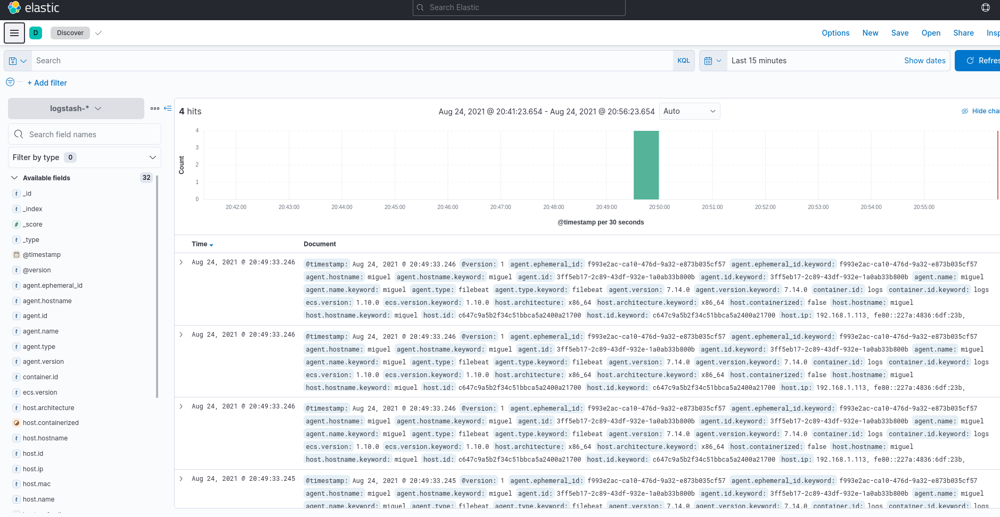
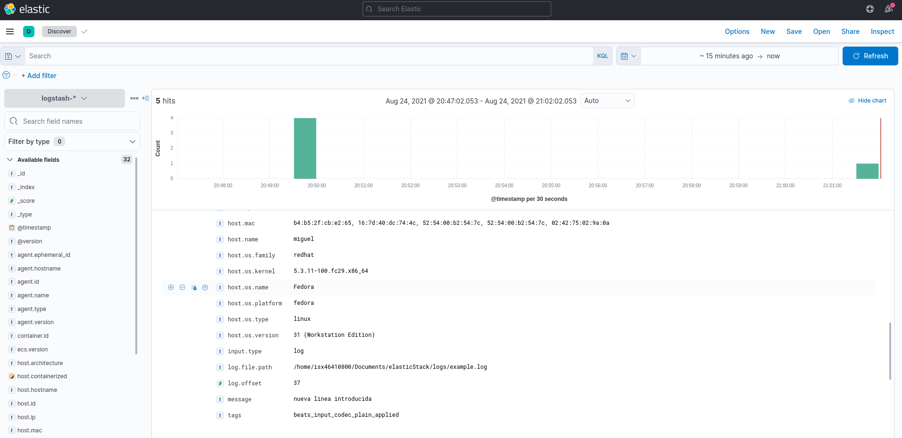

# ELASTIC STACK  

+ ELK Stack (o Elastic Stack) es un conjunto de herramientas open source desarrolladas por Elastics que permite recoger datos de cualquier tipo de fuente y en cualquier formato para realizar búsquedas, análisis y visualización de los datos en tiempo real.  

  

+ La velocidad y escalabilidad de Elasticsearch y su capacidad de indexar muchos tipos de contenido significan que puede usarse para una variedad de casos de uso:
    + Búsqueda de aplicaciones
    + Búsqueda de sitio web
    + Búsqueda Empresarial
    + Logging y analíticas de log
    + Métricas de infraestructura y monitoreo de contenedores
    + Monitoreo de rendimiento de aplicaciones
    + Análisis y visualización de datos geoespaciales
    + Analítica de Seguridad
    + Analítica de Negocios

+ [Página oficial](https://www.elastic.co/es/)  

## COMPONENTES/INSTALACIÓN  

### BEATS  

+ Los Beats son excelentes para recopilar datos. Se quedan en tus servidores, con tus contenedores, o se despliegan como funciones, y después centralizan los datos en Elasticsearch. Los Beats envían datos que cumplen con Elastic Common Schema (ECS), y si deseas una mayor potencia de procesamiento, pueden enviarlos a Logstash para las tareas de transformación y parseo.  

+ Filebeat y Metricbeat incluyen módulos que simplifican la recopilación, el parseo y la visualización de la información de fuentes de datos clave, como sistemas, contenedores y plataformas cloud, y tecnologías de red. Ejecuta un solo comando y explora más allá.  

+ Beats reúne los logs y las métricas de tus entornos únicos y los documenta con metadatos esenciales de hosts, plataformas de contenedores como Docker y Kubernetes y Proveedores Cloud antes de enviarlos al Elastic Stack. Desde el monitoreo de contenedores hasta el envío de datos desde arquitecturas sin servidor, nos aseguramos de que tengas el contexto que necesitas.  

+ [Descargar](https://www.elastic.co/es/downloads/beats/metricbeat)  
    + `[isx46410800@miguel metricbeat-7.14.0-linux-x86_64]$ tar -zxvf metricbeat-7.14.0-linux-x86_64.tar.gz`  
    + Abrimos el fichero de conf metricbeat.yaml, comentamos el apartado del output elasticsearch y le ponemos por ahora uno basico de consola:  
```
# ================================== Outputs ===================================
# Configure what output to use when sending the data collected by the beat.
output.console:
pretty: true
# ---------------------------- Elasticsearch Output ----------------------------
#output.elasticsearch:
# Array of hosts to connect to.
#hosts: ["localhost:9200"]
```  
    + Lo encendemos con `[isx46410800@miguel metricbeat-7.14.0-linux-x86_64]$ ./metricbeat -c metricbeat.yml`  


+ [Descargar](https://www.elastic.co/es/downloads/beats/filebeat)  
    + `[isx46410800@miguel elasticStack]$ tar -zxvf filebeat-7.14.0-linux-x86_64.tar.gz`  
    + En el fichero de conf filebeat.yaml activamos el type log y comentamos la salida elasticsearch y activamos la de logstash:  
```
- type: log
# Change to true to enable this input configuration.
enabled: true
# Paths that should be crawled and fetched. Glob based paths.
paths:
    - ../logs/example.log
#output.elasticsearch:
# Array of hosts to connect to.
#hosts: ["localhost:9200"]
# Protocol - either `http` (default) or `https`.
#protocol: "https"
# Authentication credentials - either API key or username/password.
#api_key: "id:api_key"
#username: "elastic"
#password: "changeme"
# ------------------------------ Logstash Output -------------------------------
output.logstash:
# The Logstash hosts
hosts: ["localhost:5044"]
```  
    + Se arranca con `./filebeat`  


### LOGSTASH  

+ Logstash ingesta, transforma y envía de forma dinámica tus datos independientemente de su formato o complejidad. Deriva estructura a partir de datos no estructurados con grok, descifra las coordenadas geográficas de las direcciones IP, anonimiza o excluye los campos sensibles y facilita el procesamiento general.  

+ Los datos a menudo se encuentran repartidos o en silos en muchos sistemas en diversos formatos. Logstash admite una variedad de entradas que extraen eventos de una multitud de fuentes comunes, todo al mismo tiempo. Ingesta fácilmente desde tus logs, métricas, aplicaciones web, almacenes de datos y varios servicios de AWS, todo de una manera de transmisión continua.  

+ A medida que los datos viajan de la fuente al almacén, los filtros Logstash parsean cada evento, identifican los campos con nombre para crear la estructura y los transforman para que converjan en un formato común para un análisis y un valor comercial más poderosos.

+ Logstash transforma y prepara de forma dinámica tus datos independientemente de su formato o complejidad:
    + Deriva estructura a partir de datos no estructurados con grok
    + Descifra las coordenadas geográficas a partir de las direcciones IP
    + Anonimiza datos PII y excluye campos sensibles por completo
    + Facilita el procesamiento general, independientemente de la fuente de datos, el formato o el esquema.
    + Las posibilidades son infinitas con nuestra completa biblioteca de filtros y el versátil Elastic Common Schema.

+ [Descargar](https://www.elastic.co/es/downloads/logstash)  
    + `[isx46410800@miguel elasticStack]$ tar -zxvf logstash-7.14.0-linux-x86_64.tar.gz`  
    + Creamos un fichero básico de conf, `example.conf` y ponemos:  
    ```
    input {
    stdin{}
    }

    output {
    stdout {
        codec => json_lines
        }
    }
    ```  
    + Encendemos con `[isx46410800@miguel logstash-7.14.0]$ bin/logstash -f example.conf` y veremos que cuando arranca para introducir algo en por teclado y sale por pantalla.  

### ELASTICSEARCH  

+ Elasticsearch es un motor de búsqueda y analítica de RESTful distribuido capaz de abordar un número creciente de casos de uso. Como núcleo del Elastic Stack, almacena de forma central tus datos para una búsqueda a la velocidad de la luz, relevancia refinada y analíticas poderosas que escalan con facilidad.  

+ Elasticsearch te permite realizar y combinar muchos tipos de búsquedas: estructuradas, no estructuradas, geográficas, métricas, de la forma que desees. Comienza por lo más simple con una pregunta y observa a dónde te lleva.  

+ Una cosa es encontrar los 10 mejores documentos que coincidan con tu búsqueda. Pero ¿cómo le das sentido, digamos, a mil millones de líneas de log? Las agregaciones de Elasticsearch te permiten obtener una vista más general para explorar tendencias y patrones en tus datos.  

+ Resultados rápidos: Cuando obtienes respuestas al instante, la relación con tus datos cambia. Puedes permitirte iterar y cubrir más terreno.  

+ Diseño poderoso: Ser así de rápido no es fácil. Hemos implementado índices invertidos con transductores de estado finito para búsquedas de texto completo, árboles de BKD para almacenar datos numéricos y geográficos, y un almacén de columnas para analíticas.  

+ Todo incluido: Y como todo está indexado, nunca te quedarás con la envidia de la indexación. Puedes aprovechar y acceder a todos tus datos a velocidades ridículamente asombrosas.  

+ [Descargar](https://www.elastic.co/es/downloads/elasticsearch)  
    + `[isx46410800@miguel elasticStack]$ tar -zxvf elasticsearch-7.14.0-linux-x86_64.tar.gz`  
    + En config tenemos los fichero de configuración.  
    + Arrancamos como `./bin/elasticsearch -d`
    + Hacemos una prueba con `curl localhost:9200` para probar el funcionamiento.  


### KIBANA  

+ Kibana te da la libertad de seleccionar la manera en que les das forma a tus datos. Con sus visualizaciones interactivas, comienza con una pregunta y mira hacia dónde te lleva.  

+ Kibana envía datos de forma central con los clásicos: histogramas, grafos de líneas, gráficos circulares, proyecciones solares y más. Y, por supuesto, puedes buscar en todos tus documentos.  

+ Aprovecha Elastic Maps para explorar datos de ubicación o vuélvete creativo y visualiza capas y formas de vectores personalizadas.  

+ Realiza un análisis avanzado de series temporales en tus datos de Elasticsearch con nuestras UI de series temporales seleccionadas. Describe búsquedas, transformaciones y visualizaciones con expresiones poderosas y fáciles de aprender.

+ Detecta las anomalías que se esconden en tus datos de Elasticsearch y explora las propiedades que influyen significativamente en ellas con características de Machine Learning sin supervisión.  

+ Toma las capacidades de relevancia de un motor de búsqueda, combínalas con la exploración de grafos y descubre las relaciones inusualmente comunes en tus datos de Elasticsearch.  

+ [Descargar](https://www.elastic.co/es/downloads/kibana)  
    + `[isx46410800@miguel elasticStack]$ tar -zxvf kibana-7.14.0-linux-x86_64.tar.gz`  
    + Editamos el `vim config/kibana.yaml` e indicamos que pueda escuchar de otros sitios y no solo de local `server.host: "0.0.0.0"` si estamos en otro host.  
    + Para que funcione primero se tiene que arrancar elasticsearch y luego kibana.  
    + Encendemos `[isx46410800@miguel kibana-7.14.0-linux-x86_64]$ ./bin/kibana`  
    + Entramos en `http://localhost:5601`


### DOCKER ELKS  

+ [DOC](https://www.elastic.co/guide/en/elasticsearch/reference/current/docker.html)  

+ Ejemplo de creación de `docker-compose.yaml:  
```
version: '3.7'
services:
  elasticsearch:
    image: docker.elastic.co/elasticsearch/elasticsearch:7.6.0
    ulimits:
      memlock:
        soft: -1
        hard: -1
    environment:
      - bootstrap.memory_lock=true
      - "ES_JAVA_OPTS=-Xms512m -Xmx512m"
      - discovery.type=single-node
    volumes:
      - ./elasticsearch/data:/usr/share/elasticsearch/data
    ports:
      - 9200:9200
      - 9300:9300

  logstash:
    image: docker.elastic.co/logstash/logstash:7.6.0
    volumes:
      - ./logstash/pipeline:/usr/share/logstash/pipeline

  kibana:
    image: docker.elastic.co/kibana/kibana:7.6.0
    ports:
      - 5601:5601
```  

### PRUEBA FUNCIONAMIENTO  

+ Creamos un directorio de logs con un fichero básico `logs/example.log`:  
```
hello world
bye bye
hola mundo
adios
```  

+ Editamos info en FILEBEAT:  
    + En el fichero de conf filebeat.yaml activamos el type log y comentamos la salida elasticsearch y activamos la de logstash:  
```
- type: log
# Change to true to enable this input configuration.
enabled: true
# Paths that should be crawled and fetched. Glob based paths.
paths:
    - ../logs/example.log
#output.elasticsearch:
# Array of hosts to connect to.
#hosts: ["localhost:9200"]
# Protocol - either `http` (default) or `https`.
#protocol: "https"
# Authentication credentials - either API key or username/password.
#api_key: "id:api_key"
#username: "elastic"
#password: "changeme"
# ------------------------------ Logstash Out-------------------------------
output.logstash:
# The Logstash hosts
hosts: ["localhost:5044"]
```  

+ Editamos info en LOGSTASH:  
    + Creamos un fichero de conf personalizado con `test.yml`:  
```
input {
beats {
    port => 5044
}

output {
elasticsearch {
    hosts => "localhost:9200"
}
}
```  

+ Arrancamos primero elasticsearch `[isx46410800@miguel elasticsearch-7.14.0]$ ./bin/elasticsearch -d`  

+ Arrancamos KIBANA: `./bin/kibana`

+ Arrancamos LOGSTASH: `[isx46410800@miguel logstash-7.14.0]$ bin/logstash -f test.yml`  

+ Arrancamos FILEBEAT: `[isx46410800@miguel filebeat-7.14.0-linux-x86_64]$ ./filebeat -c filebeat.yml`  

+ Dirección: http://localhost:5601. Si entramos y vamos al apartado de Discover de Kibana veremos que tenemos un indice. Creamos uno de logsstah para que coincida con el que crea por defecto(logstash-*) y vemos el campo de timestamp.  

+ Vemos ahora como se ha indexada 4 cosas, que corresponden a las 4 lineas del fichero de logs creado.  

  

+ Si ahora añadimos una nueva linea al documento, veremos como ahora se indexa 5 documentos a kibana `[isx46410800@miguel logs]$ echo "nueva linea introducida" >> example.log`. Si lo editamos con vim, entonces duplicaría las entradas como documento nuevo.

  

+ Si paramos filebeat y volvemos a arrancar, sigue el inode por la ultima linea leida, si queremos volver desde el principio o alguna linea en concreto tenemos que tocar el fichero en filebeat de data/registry

## BEATS  

### METRICBEATS  

+ [DOCS](https://www.elastic.co/guide/en/beats/metricbeat/current/index.html)  

+ Sirve para que nos saque estadisticas del sistema, docker, etc  

+ Se ha de configurar el fichero de `metricbeat.yml`. Primero nos indica los modulos que se van a cargar, activar la salida, importar los dashboards al kibana(descomentando la linea localhost)  

+ Si ponemos `./metricbeat modules list` vemos los modulos activados y desactivados. Los modulos estan en su directorio modules.d.  

+ Para validar una configuración se usa `./metricbeat test config -c metricbeat.yml`  

 

+ Para activar otro modulo seria con la orden `./metricbeat modules enable docker` y en el yml podriamos poner un ejemplo como:  
```
- module: docker
  metricsets:
    - container
    - cpu
    - diskio
    - event
    - healthcheck
    - info
    - memory
    - network
    - network_summary
  period: 10s
  hosts: ["unix:///var/run/docker.sock"]
```  

### PACKETBEAT  

+ [DOCS](https://www.elastic.co/guide/en/beats/packetbeat/current/index.html)  

+ Sirve para monitorizar la red entrante como saliente.  

+ En el fichero de configuración cambiamos lo necesario en `./packetbeat.yml`.  

+ Para los inputs en este fichero, debemos saber cual es la interfaz por la que queremos que escuche, podemos saberlo con `./packetbeat devices`.  

+ Podemos comprobar si está bien el fichero con `./packetbeat test config -c packetbeat.yml`  

+ Como no tenemos permisos suficientes para monitorizar la red de mi interfaz. hay que hacerlo como sudo o como root cambiando el fichero a root(chown root packetbeat.yml) y arrancamos con `sudo ./packetbeat -c packetbeat.yml`  


### HEARTBEAT  

+ Nos indica el estado de salud de los servicios que están corriendo. Podremos saber si algun servidor se ha caido, alguna base de datos, etc.  

+ [DOCS](https://www.elastic.co/guide/en/beats/heartbeat/current/heartbeat-installation-configuration.html)  

+ El fichero de configuración está en heartbeat.yml 

+ Arrancamos con `./heartbeat -c heartbeat.yml`  

### FILEBEAT  

+ [DOCS](https://www.elastic.co/guide/en/beats/filebeat/current/index.html)  

+ Filebeat es un cargador ligero para reenviar y centralizar datos de registro. Instalado como un agente en sus servidores, Filebeat monitorea los archivos de registro o las ubicaciones que usted especifica, recopila eventos de registro y los reenvía a Elasticsearch o Logstash para su indexación.  

+ Utilizamos una herramienta para generar [logs](https://bitbucket.org/kuroobicoders/log-generator/downloads/) y se usa `[isx46410800@miguel logs]$ java -jar log-generator-1.0.jar -h` como por ejemplo `java -jar log-generator-1.0.jar -l -1 -d 0`  

+ Despues de crear unas trazas de logs para usarlos de ejemplo, modificamos el archivo de conf para indicar la ruta de los logs: `- ../logs/log-generator*.log`  

+ Para probar quitamos los outputs y ponemos uno de consola:  
```
output.console:
    pretty: true
```  
+ Vamos probando con `java -jar log-generator-1.0.jar -l 20 -d 1000`  

+ Excluimos lineas DEBUG:  
`exclude_lines: ['^DEBUG']`  

+ Hay grupos de lineas de traza en el log que no empiezan por DEBUG, INFO, TRACE...y contienen varias lineas que hace como si fuera un evento cada linea. Se ha de poner que sea solo un evento y se asigne al evento anterior. Esto se hace con expresiones regulares [HERRAMIENTA RUBULAR](https://rubular.com/)  
```
# The regexp Pattern that has to be matched. The example pattern matches all lines starting with [
multiline.pattern: ^(DEBUG|INFO|ERROR|TRACE|FATAL).*
# Defines if the pattern set under pattern should be negated or not. Default isfalse.
multiline.negate: true
# Match can be set to "after" or "before". It is used to define if lines should beappend to a pattern
# that was (not) matched before or after or as long as a pattern is not matchedbased on negate.
# Note: After is the equivalent to previous and before is the equivalent to to nextin Logstash
multiline.match: after
```  
> Se indica que se niegue todo lo que empieze tal y tal y se añada al evento anterior  

+ Vemos como ahora arrancando el filebeat y haciendo logs nos agrupa el log como hemos indicado:  
`./filebeat -c filebeat.yml`  
`java -jar log-generator-1.0.jar -l 20 -d 1000`  
```
  "log": {
    "offset": 1111503,
    "file": {
      "path": "/home/isx46410800/Documents/elasticStack/logs/log-generator.log"
    },
    "flags": [
      "multiline"
    ]
  },
  "message": "ERROR 2021-08-25 02:08:16 [main] a.b.t.loggenerator.LogGenerator - Document not found|\njava.lang.Exception: Document not found\n\tat am.ballesteros.training.loggenerator.LogGeneratorKt.generateExceptionTrace(LogGenerator.kt:66)\n\tat am.ballesteros.training.loggenerator.LogGeneratorKt.generateTraces(LogGenerator.kt:31)\n\tat am.ballesteros.training.loggenerator.LogGeneratorKt$main$1.invoke(LogGenerator.kt:17)\n\tat am.ballesteros.training.loggenerator.LogGeneratorKt$main$1.invoke(LogGenerator.kt)\n\tat com.xenomachina.argparser.SystemExitExceptionKt.mainBody(SystemExitException.kt:74)\n\tat com.xenomachina.argparser.SystemExitExceptionKt.mainBody$default(SystemExitException.kt:72)\n\tat am.ballesteros.training.loggenerator.LogGeneratorKt.main(LogGenerator.kt:14)"
}
```  

+ Hay también modulos preconfigurados y podemos verlos en `./filebeat modules list` y para activar `./filebeat modules enable logstash system`.  

+ Los podemos configurar en `vim modules.d/logstah.yml` y las rutas de log por defecto las tiene en `logs/logstash-plain.log`.  
```
- module: logstash
  # logs
  log:
    enabled: true
    # Set custom paths for the log files. If left empty,
    # Filebeat will choose the paths depending on your OS.
    var.paths: ["/home/isx46410800/Documents/elasticStack/logstash-7.14.0/logs/logstash-plain.log"]

  # Slow logs
  slowlog:
    enabled: true
    # Set custom paths for the log files. If left empty,
    # Filebeat will choose the paths depending on your OS.
    var.paths: ["/home/isx46410800/Documents/elasticStack/logstash-7.14.0/logs/logstash-slowlog-plain.log"]
```  

+ Ahora activamos el setup de kibana, quitamos el output de antes y ponemos el de elasticsearch y activamos la monitorización.  

+ En el filebeat_reference.yml vemos todo mas extenso y explicado.  

+ Ahora preparamos el filebeat para poder tratarlo con logstash. Desactivamos los outputs y ponemos el de logstash, quitamos kibana y dejamos igual lo de los patterns y activamos los monitoring.  

### OTROS BEATS  

+ WINLOGBEAT sirve para monitorizar los sistemas windows.  

+ AUDITBEAT sirve para monitorizar los sistemas linux.

+ COMMUNITY BEATS son beats creados por la gente para diferentes productos y servicios. 


## LOGSTASH  

+ De la info que hay en los beats, llega a logstash, la procesa y la enriquece de info extrayendo datos y en el caso de salida irá a elasticsearch aunque también la info se puede procesar a un fichero, email, naggios, redis, kafka, amazon etc.  

+ Todo el proceso se llama PIPELINE (input -> filter -> output). También elastic hay un proceso más que se le puede llamar, el CODEC, que sirve para transformar la info en un formato en concreto, como por ejemplo en CODEC JSON, MULTILINE,etc.  

### INPUTS  

#### PLUGIN STDIN  

+ Sirve para indicar cual es el metodo de entrada. Normalmente usado para el testing y comprobar cosas de funcionamiento.  

+ [DOCS](https://www.elastic.co/guide/en/logstash/current/plugins-inputs-stdin.html)  

+ Un ejemplo básico de fichero de configuración seria una entrada por teclado basica y salida por pantalla en formato json:  
```
input {
  stdin{}
}
output {
  stdout {
    codec => json_lines
  }
}
```  
> arrancamos logstash con ./logstach -f example.conf y luego escribimos por pantalla y nos devuelve la salida en formato json.  

+ Otro ejemplo es la entrada en multiline:  
```
input {
  stdin{
    codec => multiline {
      pattern => "fin"
      negate => "true"
      what => "next"
    }
  }
}
output {
  stdout {
    codec => json_lines
  }
}
```  
> Esto hace que todo lo que se ponga en multilineas, hasta que no se escriba FIN, no termina el evento.  

+ Tambien se le puede pasar la entrada en json y lo detecta como json y saca la salida del evento bien:  
```
input {
  stdin{
    codec => json_lines
  }
}
output {
  stdout {
    codec => json_lines
  }
}
```  

#### FILE INPUT  

+ Sirve para poner un input de tipo archivo.  

+ [DOCS](https://www.elastic.co/guide/en/logstash/current/plugins-inputs-file.html)  

+ Ejemplo donde se le pasa las trazas de log, indicando que lea desde el principio, y donde guarde el puntero desde donde ha acabado de leer(logs/log-generator.sincedb), donde el nombre se indica en el fichero de conf.  

+ Para comprobar el fichero de conf se usa `./bin/logstash -t -f example.conf`  
```
input {
  file {
    path => "/home/isx46410800/Documents/elasticStack/logstash-7.14.0/logs/log-generator*.log"
    #excluse => "*.gz" //para excluir archivos .gz
    start_position => "beginning" # o end
    sincedb_path => "/home/isx46410800/Documents/elasticStack/logstash-7.14.0/logs/log-generator.sincedb"
    codec => multiline {
      pattern => "^(DEBUG|INFO|ERROR|TRACE|FATAL|WARN).*"
      negate => "true"
      what => "previous"
    }
  }
}
output {
  stdout {
    codec => json_lines
  }
}
```  

#### BEATS INPUT  

+ Es un pequeño agente que instalamos en los servidores y que nos permite el envío de datos recolectados en nuestro servidor a un procesador (Logstash) o directamente al repositorio (Elasticsearch.  Cabe destacar que existen distintos tipos de Beats, según nuestra necesidad: FileBeat (para el envío de logs/ficheros), WinLogBeat (envío de eventos en un servidor Windows), MetricBeat (envío de métricas), etc.  

+ [DOCS](https://www.elastic.co/guide/en/logstash/current/plugins-inputs-beats.html)  

+ Como vemos en la configuracion de `filebeat.yml` vemos cual es el puerto de salida para logstash:  
```
output.logstash:
  # The Logstash hosts
  hosts: ["localhost:5044"]
```  

+ Lo que hacemos es que desde la conf de beats está indicado de donde coge logs(log-generator) y lo envia de salida a logstash para que lo proceso y veremos por pantalla todo lo que va saliendo mientras vamos haciendo trazas:  
```
input {
  beats { 
    port => 5044
    #hosts => 0.0.0.0
  }
}
output {
  stdout {
    #codec => json_lines
  }
}
```  
> Arrancamos primero filebeat con `./filebeat -c filebeat.yml` y luego logstash con el nuevo fichero de conf `./bin/logstash -f beats.conf`  


### FILTERS  

#### FILTER GROK  

+ [DOCS](https://www.elastic.co/guide/en/logstash/current/plugins-filters-grok.html)  

+ Nos sirve para poder ir recortando los campos con diferentes patrones de expresiones regulares. Podemos encontrarlo en el apartado de kibana -> dev tools -> grok debugger o directamente hay una web que hace los mismo y nos indican chuletas de patterns de [grok](https://grokdebug.herokuapp.com/)  

+ Cogemos este evento y vemos como lo traducimos con un pattern:  
`INFO 2021-08-25 21:23:57 [main] a.b.t.loggenerator.LogGenerator - LOGIN|150|Filemon|180.86.181.252`  
PATTERN: `%{WORD:level} %{TIMESTAMP_ISO8601:date} \[%{WORD:thread}\] %{JAVACLASS:class} - %{WORD:type}\|%{NUMBER:status}\|%{USERNAME:user}\|%{IP:ip}`  

+ Cogemos este evento y vemos como lo traducimos con un pattern:  
`INFO 2021-08-25 21:23:55 [main] a.b.t.loggenerator.LogGenerator - PERFORMANCE|3.37|SEND EMAIL|FAILURE|Pantuflo`  
PATTERN: `%{WORD:level} %{TIMESTAMP_ISO8601:date} \[%{WORD:thread}\] %{JAVACLASS:class} - %{WORD:type}\|%{NUMBER:duration}\|%{DATA:action}\|%{WORD:status}\|%{USERNAME:user}`  

+ Cogemos este evento y vemos como lo traducimos con un pattern:  
```
ERROR 2021-08-25 21:24:02 [main] a.b.t.loggenerator.LogGenerator - User can not be null. Can not fetch information from the database|
java.lang.Exception: User can not be null. Can not fetch information from the database
	at am.ballesteros.training.loggenerator.LogGeneratorKt.generateExceptionTrace(LogGenerator.kt:66)
	at am.ballesteros.training.loggenerator.LogGeneratorKt.generateTraces(LogGenerator.kt:31)
	at am.ballesteros.training.loggenerator.LogGeneratorKt$main$1.invoke(LogGenerator.kt:17)
	at am.ballesteros.training.loggenerator.LogGeneratorKt$main$1.invoke(LogGenerator.kt)
	at com.xenomachina.argparser.SystemExitExceptionKt.mainBody(SystemExitException.kt:74)
	at com.xenomachina.argparser.SystemExitExceptionKt.mainBody$default(SystemExitException.kt:72)
	at am.ballesteros.training.loggenerator.LogGeneratorKt.main(LogGenerator.kt:14)
```  
PATTERN: `(?m)%{WORD:level} %{TIMESTAMP_ISO8601:date} \[%{WORD:thread}\] %{JAVACLASS:class} - %{DATA:description}\|%{GREEDYDATA:stacktrace}`  
EXPRESION REGULAR: `(?m)%{WORD:level} %{TIMESTAMP_ISO8601:date} \[%{WORD:thread}\] %{JAVACLASS:class} - %{DATA:description}\|(?<stacktrace>.*)`  

+ Tambien podemos crear PATTERNS propios como por ejemplo algo que se repite mucho, en nuestro caso se repite esto `%{WORD:level} %{TIMESTAMP_ISO8601:date} \[%{WORD:thread}\] %{JAVACLASS:class} -`.  

+ Se crea en custom patterns o en fichero aparte:  
`COMMON_LOG %{WORD:level} %{TIMESTAMP_ISO8601:date} \[%{WORD:thread}\] %{JAVACLASS:class} -`  
PATTERN: `(?m)%{COMMON_LOG} %{DATA:description}\|(?<stacktrace>.*)`  

+ El fichero de configuración de FILEBEAT sin la variable de pattern quedaría:  
```
input {
  beats { 
    port => 5044
    #hosts => 0.0.0.0
  }
}
filter {
    grok {
        match => {"message" => [
            "%{WORD:level} %{TIMESTAMP_ISO8601:date} \[%{WORD:thread}\] %{JAVACLASS:class} - %{WORD:type}\|%{NUMBER:status}\|%{USERNAME:user}\|%{IP:ip}"},
            "%{WORD:level} %{TIMESTAMP_ISO8601:date} \[%{WORD:thread}\] %{JAVACLASS:class} - %{WORD:type}\|%{NUMBER:duration}\|%{DATA:action}\|%{WORD:status}\|%{USERNAME:user}",
            "(?m)%{WORD:level} %{TIMESTAMP_ISO8601:date} \[%{WORD:thread}\] %{JAVACLASS:class} - %{DATA:description}\|%{GREEDYDATA:stacktrace}"
        ]
        }
    }
}
output {
  stdout {
    #codec => json_lines
  }
}
```  

+ Con la variable en un directorio `patterns` y en un fichero `log-generator-patterns`:  
`COMMON_LOG %{WORD:level} %{TIMESTAMP_ISO8601:date} \[%{WORD:thread}\] %{JAVACLASS:class} -`  
```
input {
  beats { 
    port => 5044
    #hosts => 0.0.0.0
  }
}
filter {
    grok {
        patterns_dir => "patterns"
        match => {"message" => [
            "%{COMMON_LOG} %{WORD:type}\|%{NUMBER:status}\|%{USERNAME:user}\|%{IP:ip}",
            "%{COMMON_LOG} %{WORD:type}\|%{NUMBER:duration}\|%{DATA:action}\|%{WORD:status}\|%{USERNAME:user}",
            "(?m)%{COMMON_LOG} %{DATA:description}\|%{GREEDYDATA:stacktrace}"
        ]}
    }
}
output {
  stdout {
    #codec => json_lines
  }
}
```  

#### FILTER MUTATE  

+ Sirve para cambiar campos, eliminar, copiar, pasar a mayusculas, dividir un campo en varios,etc.  

+ [DOC](https://www.elastic.co/guide/en/logstash/current/plugins-filters-mutate.html)  

+ En este caso vamos a cambiar tipos de campo de string a number, añadir campos, conficionales...  
```
input {
  beats { 
    port => 5044
    #hosts => 0.0.0.0
  }
}

filter {
    grok {
        patterns_dir => "patterns"
        match => {"message" => [
            "%{COMMON_LOG} %{WORD:type}\|%{NUMBER:status}\|%{USERNAME:user}\|%{IP:ip}",
            "%{COMMON_LOG} %{WORD:type}\|%{NUMBER:duration}\|%{DATA:action}\|%{WORD:status}\|%{USERNAME:user}",
            "(?m)%{COMMON_LOG} %{DATA:description}\|%{GREEDYDATA:stacktrace}"
        ]}
    }

    mutate {
        convert => {"duration" => "float"} #en grok se puede poner %{NUMBER:duration:int}
        remove_field => ["message", "prospector", "input"]
    }

    if ![type] {
        mutate {
            add_field => {"type" => "JAVA_ERROR"} #XK CUANDO NO SALE ESTE CAMPO, SON ERRORES
        }
    }

    if [type] == "LOGIN" {
        mutate {
            convert => {"status" => "integer"}
            add_field => {"login" => true}
        }
        if [status] > 300 {
            mutate {
                replace => {"login" => false}
            }
        }
    }
}
output {
  stdout {
    #codec => json_lines
  }
}
```  
> en grok se puede poner %{NUMBER:duration:int/float}, solo en estos tipos.  


#### FILTER DATE  

+ [DOCS](https://www.elastic.co/guide/en/logstash/current/plugins-filters-date.html)  

+ En este caso renombramos el campo timestamp para no confundir con la fecha del log, y la fecha del log le cambiamos el formato con el filter date:  
```
input {
  beats { 
    port => 5044
    #hosts => 0.0.0.0
  }
}

filter {
    grok {
        patterns_dir => "patterns"
        match => {"message" => [
            "%{COMMON_LOG} %{WORD:type}\|%{NUMBER:status}\|%{USERNAME:user}\|%{IP:ip}",
            "%{COMMON_LOG} %{WORD:type}\|%{NUMBER:duration}\|%{DATA:action}\|%{WORD:status}\|%{USERNAME:user}",
            "(?m)%{COMMON_LOG} %{DATA:description}\|%{GREEDYDATA:stacktrace}"
        ]}
    }

    mutate {
        convert => {"duration" => "float"} #en grok se puede poner %{NUMBER:duration:int}
        remove_field => ["message", "prospector", "input"]
        rename => {"@timestamp" => "processTime"}
    }

    if ![type] {
        mutate {
            add_field => {"type" => "JAVA_ERROR"} #XK CUANDO NO SALE ESTE CAMPO, SON ERRORES
        }
    }

    if [type] == "LOGIN" {
        mutate {
            convert => {"status" => "integer"}
            add_field => {"login" => true}
        }
        if [status] > 300 {
            mutate {
                replace => {"login" => false}
            }
        }
    }

    date {
        match => ["date", "YYYY-MM-dd HH:mm:ss"]
    }
}

output {
  stdout {
    #codec => json_lines
  }
}
```  

#### FILTER TRANSLATE  

+ [DOCS](https://www.elastic.co/guide/en/logstash/current/plugins-filters-translate.html)  

+ Nos permite hacer traducciones de codigos o informaciones indexando bien la información.  

+ En este caso en el campo login añadimos traducciones segun el codigo que nos den:  
```
input {
  beats { 
    port => 5044
    #hosts => 0.0.0.0
  }
}

filter {
    grok {
        patterns_dir => "patterns"
        match => {"message" => [
            "%{COMMON_LOG} %{WORD:type}\|%{NUMBER:status}\|%{USERNAME:user}\|%{IP:ip}",
            "%{COMMON_LOG} %{WORD:type}\|%{NUMBER:duration}\|%{DATA:action}\|%{WORD:status}\|%{USERNAME:user}",
            "(?m)%{COMMON_LOG} %{DATA:description}\|%{GREEDYDATA:stacktrace}"
        ]}
    }

    mutate {
        convert => {"duration" => "float"} #en grok se puede poner %{NUMBER:duration:int}
        remove_field => ["message", "prospector", "input"]
        rename => {"@timestamp" => "processTime"}
    }

    if ![type] {
        mutate {
            add_field => {"type" => "JAVA_ERROR"} #XK CUANDO NO SALE ESTE CAMPO, SON ERRORES
        }
    }

    if [type] == "LOGIN" {
        mutate {
            convert => {"status" => "integer"}
            add_field => {"login" => true}
        }
        if [status] > 300 {
            mutate {
                replace => {"login" => false}
            }
        }
        translate {
            field => "status"
            destination => "statusText"
            dictionary => {
                "200" => "Login correcto"
                "201" => "Login correcto tras varios intentos"
                "202" => "Login con actualización de password"
                "204" => "login automatico"
                "250" => "Login recordado"
                "100" => "Usuario suplantado"
                "150" => "Usuario suplantado automaticamente"
                "400" => "Usuario bloqeuado"
                "404" => "Usuario no encontrado"
                "500" => "Contraseña expirada"
            }
        }
    }

    date {
        match => [ "date", "YYYY-MM-dd HH:mm:ss" ]
    }
}

output {
  stdout {
    #codec => json_lines
  }
}
```  

#### FILTER GEOLP  

+ [DOCS](https://www.elastic.co/guide/en/logstash/current/plugins-filters-geoip.html)  

+ Nos indica info de geolocalización de la red, ips.  

+ En este caso se los añadimos a los de login para ver donde para su ip:  
```
input {
  beats { 
    port => 5044
    #hosts => 0.0.0.0
  }
}

filter {
    grok {
        patterns_dir => "patterns"
        match => {"message" => [
            "%{COMMON_LOG} %{WORD:type}\|%{NUMBER:status}\|%{USERNAME:user}\|%{IP:ip}",
            "%{COMMON_LOG} %{WORD:type}\|%{NUMBER:duration}\|%{DATA:action}\|%{WORD:status}\|%{USERNAME:user}",
            "(?m)%{COMMON_LOG} %{DATA:description}\|%{GREEDYDATA:stacktrace}"
        ]}
    }

    mutate {
        convert => {"duration" => "float"} #en grok se puede poner %{NUMBER:duration:int}
        remove_field => ["message", "prospector", "input"]
        rename => {"@timestamp" => "processTime"}
    }

    if ![type] {
        mutate {
            add_field => {"type" => "JAVA_ERROR"} #XK CUANDO NO SALE ESTE CAMPO, SON ERRORES
        }
    }

    if [type] == "LOGIN" {
        mutate {
            convert => {"status" => "integer"}
            add_field => {"login" => true}
        }
        if [status] > 300 {
            mutate {
                replace => {"login" => false}
            }
        }
        translate {
            field => "status"
            destination => "statusText"
            dictionary => {
                "200" => "Login correcto"
                "201" => "Login correcto tras varios intentos"
                "202" => "Login con actualización de password"
                "204" => "login automatico"
                "250" => "Login recordado"
                "100" => "Usuario suplantado"
                "150" => "Usuario suplantado automaticamente"
                "400" => "Usuario bloqeuado"
                "404" => "Usuario no encontrado"
                "500" => "Contraseña expirada"
            }
        }
        geoip {
            source => "ip"
        }
    }

    date {
        match => [ "date", "YYYY-MM-dd HH:mm:ss" ]
    }
}

output {
  stdout {
    #codec => json_lines
  }
}
```  

#### FILTER RUBY  

+ [DOCS](https://www.elastic.co/guide/en/logstash/current/plugins-filters-ruby.html)  

+ Logstash está escrito en RUBY. Es el plugin más polivalente ya que con este podemos hacer todo lo que hacen el resto de plugins.  

+ Un ejemplo:  
```
input {
  stdin {
    codec =>
  }
}

filter {
  ruby {
    code => "
      event.set('name_normalized', event.get('name').gsub('ñ', 'n'))

      total_in_seconds = 0:
      event.get('total').split(':').each_with_index do [v, i]
        if i == 0
          total_in_seconds += v.to_i * 3600;
        elsif i == 1
          total_in_seconds += v.to_i * 60;
        elsif i == 2
          total_in_seconds += v.to_i;
        end
      end

      event.set('total', total_in_seconds);
    "
  }
}

output {
  stdout {}
}

## { "total": "00:00:00", "name": "Nombre", "equipo": "Equipo"}
## convertir en segundos el tiempo y quitar las Ñ de los nombres
```

#### OTROS FILTERS  

+ [DOCS](https://www.elastic.co/guide/en/logstash/current/filter-plugins.html)  


### OUTPUTS  

+ [DOCS](https://www.elastic.co/guide/en/logstash/current/plugins-outputs-stdout.html)  


