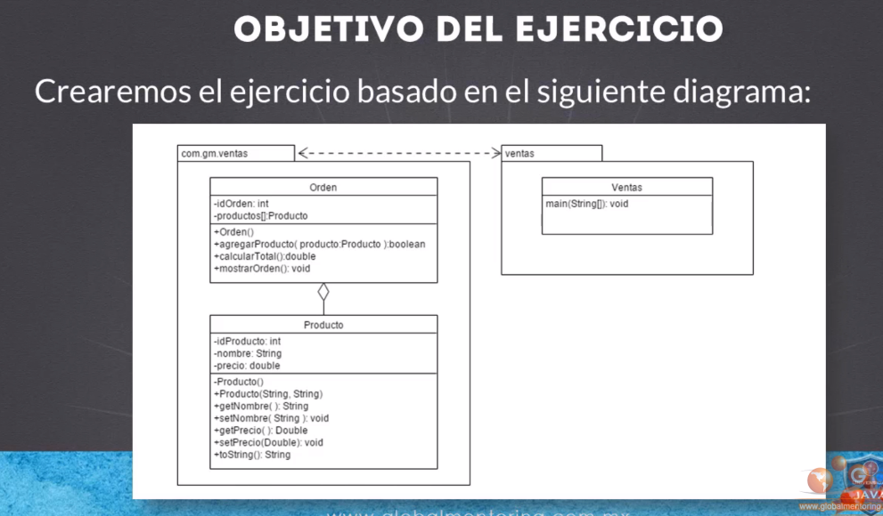
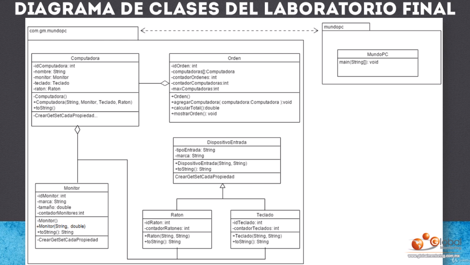

# CURSO JAVA  

## INSTALACION  

+ Instalamos [JAVA](https://docs.oracle.com/en/java/javase/17/install/installation-jdk-linux-platforms.html#GUID-4A6BD592-1840-4BB4-A758-4CD49E9EE88B)  
```
# cd /opt
# wget https://download.java.net/java/GA/jdk13/5b8a42f3905b406298b72d750b6919f6/33/GPL/openjdk-13_linux-x64_bin.tar.gz
# tar -xvf openjdk-13_linux-x64_bin.tar.gz
# export JAVA_HOME=/opt/jdk-13/
# export PATH=$PATH:/opt/jdk-13/bin
También puede definirlo en el archivo de inicio del shell global / etc / environment como se muestra.
# vi /etc/environment
# export JAVA_HOME=/usr/lib/jvm/java-17-openjdk
# export PATH=$PATH:/usr/lib/jvm/java-17-openjdk/bin
# source /etc/environment
```  

+ Instalamos [Apache Netbeans](https://netbeans.apache.org/download/nb126/nb126.html):  
```
wget https://dlcdn.apache.org/netbeans/netbeans-installers/12.6/Apache-NetBeans-12.6-bin-linux-x64.sh
chmod +x Apache-NetBeans-12.6-bin-linux-x64.sh
sudo ./Apache-NetBeans-12.6-bin-linux-x64.sh
```  
> Seguimos los pasos para instalar y arrancamos con `netbeans`.    
> Podemos instalar plugins en my Netbeans - available plugins.  

+ [DOCS](https://netbeans.apache.org/help/index.html)  

+ Version oscura instalando el plugin DRACULA APACHE NETBEANS.  

## HELLOWORLD  

+ CONTROL + E borra comentarios.  
+ CONTROL + SHIFT + F ajusta bien el codigo.  
+ Creamos un proyecto nuevo de Helloworld con las caracteristicas que le digamos.  
+ En pom.xml nos indica las caracteristicas de java.  
+ En source package hacemos boton derecho y nueva clase con el mismo nombre,siempre se empieza por mayusculas.  
```java
//Mi clase en Java
public class HelloWorld {  
    public static void main(String args[]){
        System.out.println("Hola Mundo desde Java"); 
    }
}
```  
> psvm y sout + tabulador y agrega ese codigo rapido  
> Si se pone solo `print` y no `println` no lo imprime en otra linea.  

## VARIABLES  

### String  

+ Se puede poner el tipo como String, int, float, chart... o var en las nuevas versiones:  
```java
public class HelloWorld {  
    public static void main(String args[]){
        String saludar = "Saludos!";
        System.out.println("Hola Mundo desde Java"); 
        System.out.println(saludar);
        //nuevas versiones se va usando var para variables
        var despedirse = "Adios";
        System.out.println(despedirse);
        // variable entero
        var numero = 1;
        System.out.println(numero);
        System.out.println(saludar + despedirse);//se junta y numeros primero lo suma
        System.out.println(saludar + " " + despedirse);
        // tipo input
        Scanner scanner = new Scanner(System.in);
        System.out.println("Proporciona un usuario: ");
        var usuario = scanner.nextLine();
        System.out.println("Usuario = " + usuario);
    }
}
```  

### Enteros  

+ Short,int,long,byte:  
```java
import java.util.Scanner;

/*
Esto es un comentario
*/
//Mi clase en Java
public class HelloWorld {  
    public static void main(String args[]){
    //byte, short, int, long
        byte byteVar = 127;
        System.out.println("byteVar = " + byteVar);

        System.out.println("bits tipo byte:" + Byte.SIZE);
        System.out.println("bytes tipos byte:" + Byte.BYTES);
        System.out.println("valor minimo tipo byte:" + Byte.MIN_VALUE);
        System.out.println("valor maximo tipo byte:" + Byte.MAX_VALUE);

        short shortVar = 32767;
        System.out.println("shortVar = " + shortVar);

        System.out.println("bits tipo short:" + Short.SIZE);
        System.out.println("bytes tipos short:" + Short.BYTES);
        System.out.println("valor minimo tipo short:" + Short.MIN_VALUE);
        System.out.println("valor maximo tipo short:" + Short.MAX_VALUE);

        int intVar = 2147483647;
        System.out.println("intVar = " + intVar);

        System.out.println("bits tipo int:" + Integer.SIZE);
        System.out.println("bytes tipos int:" + Integer.BYTES);
        System.out.println("valor minimo tipo int:" + Integer.MIN_VALUE);
        System.out.println("valor maximo tipo int:" + Integer.MAX_VALUE);

        long longVar = 9223372036854775807L;
        System.out.println("longVar = " + longVar);
        System.out.println("bits tipo long:" + Long.SIZE);
        System.out.println("bytes tipos long:" + Long.BYTES);
        System.out.println("valor minimo tipo long:" + Long.MIN_VALUE);
        System.out.println("valor maximo tipo long:" + Long.MAX_VALUE);
        
        var numeroInt = 2147483647;
        System.out.println("numeroInt = " + numeroInt);
        
        var numeroLong = 2147483648L;
        System.out.println("numeroLong = " + numeroLong);
    }
}
```  

### Flotantes  

```java
import java.util.Scanner;

public class HelloWorld {

    public static void main(String args[]) {

        var floatVar = 1000.10F;
        System.out.println("floatVar = " + floatVar);
        
        System.out.println("bits tipo float:" + Float.SIZE);
        System.out.println("bytes tipo float:" + Float.BYTES);
        System.out.println("valor minimo tipo float:" + Float.MIN_VALUE);
        System.out.println("valor maximo tipo float:" + Float.MAX_VALUE);
        
        var doubleVar = 100D;
        System.out.println("doubleVar = " + doubleVar);
        
        System.out.println("bits tipo double:" + Double.SIZE);
        System.out.println("bytes tipo double:" + Double.BYTES);
        System.out.println("valor minimo tipo double:" + Double.MIN_VALUE);
        System.out.println("valor maximo tipo double:" + Double.MAX_VALUE);
        
    }
}
```  

### Tipo chart  

+ Solo soporta un caracter.  
```java
import java.util.Scanner;

public class HelloWorld {

    public static void main(String args[]) {

        System.out.println("bits tipo char:" + Character.SIZE);
        System.out.println("bytes tipo char:" + Character.BYTES);
        System.out.println("valor minimo tipo char:" + Character.MIN_VALUE);
        System.out.println("valor maximo tipo char:" + Character.MAX_VALUE);
        
        var varChar = '\u0021';
        System.out.println("varChar = " + varChar);
        
        var varCharDecimal = 33;
        System.out.println("varCharDecimal = " + varCharDecimal);
        
        var varCharSimbolo = '!';
        System.out.println("varCharSimbolo = " + varCharSimbolo);
        
    }
}
```  


### Boleanos  

+ True o False:  
```java
import java.util.Scanner;

public class HelloWorld {

    public static void main(String args[]) {

        //boolean
        System.out.println("true tipo boolean: " + Boolean.TRUE);
        System.out.println("false tipo boolean: " + Boolean.FALSE);
        
        boolean booleanVar = false;
        
        if(booleanVar){
            System.out.println("el valor es verdadero");
        }
        else{
            System.out.println("el valor es falso");
        }
        
        System.out.println("");
        
        var edad = 30;
        var esAdulto = edad >= 18;
        System.out.println("esAdulto = " + esAdulto);
    }
}
```  

### Conversion de variables  

```java
import java.util.Scanner;

public class HelloWorld {

    public static void main(String args[]) {

        //convertir un String a un tipo int 
        var edad = Integer.parseInt("20");
        System.out.println("edad = " + edad);
        
        double valorPI = Double.parseDouble("3.1416");
        System.out.println("valorPI = " + valorPI);
        
        char c = "hola".charAt(3);
        System.out.println("c = " + c);
        //introducir una edad
        var scanner = new Scanner(System.in);
        edad = Integer.parseInt(scanner.nextLine()) ;
        System.out.println("edad = " + edad);
        
        char caracter = scanner.nextLine().charAt(0);
        System.out.println("caracter = " + caracter);
        
        String edadTexto = String.valueOf(false);
        System.out.println("edadTexto = " + edadTexto);
        
        short s = 129;
        byte b = (byte) s;
        System.out.println("b = " + b);
    }
}
```  

## OPERACIONES  

+ Aritmeticos:  
```java
import java.util.Scanner;

public class HelloWorld {

    public static void main(String args[]) {

        int a = 3, b = 2;

        var resultado = a + b;
        System.out.println("resultado suma = " + resultado);

        System.out.println("resultado suma=" + (a  + b) );
        
        resultado = a - b;
        System.out.println("resultado resta = " + resultado);
        
        System.out.println("resultado resta = " + (a - b));
        
        resultado = a * b;
        System.out.println("resultado multiplicacion = " + resultado);
        
        double resultado2 = 3D / b;
        System.out.println("resultado division = " + resultado2);
        
        resultado = a % b;
        System.out.println("resultado modulo= " + resultado);
        
        resultado = a % 2;
        System.out.println("resultado = " + resultado);
        
        resultado = 123 % 2;
        System.out.println("resultado = " + resultado);
        
        if(resultado == 0)
            System.out.println("es numero par");
        else
            System.out.println("es numero impar");
    }
}
```  

+ De asignacion:  
```java
import java.util.Scanner;

public class HelloWorld {

    public static void main(String args[]) {

        int a = 3, b = 2;

        int c = a + 5 - b;
        System.out.println("c = " + c);

        a += 1;//a=a+1
        System.out.println("a = " + a);
        
        a += 3;//a=a+3
        System.out.println("a = " + a);
        
        b -= 1;//b=b-1
        System.out.println("b = " + b);
        
        // *=, /=, %= 
    }
}
```  

+ Unarios:  
```java
import java.util.Scanner;

public class HelloWorld {

    public static void main(String args[]) {
        // el negativo para invertir
        int a = 3;
        int b = -a;
        System.out.println("b = " + b);
        // el ! para invertir el booleano
        boolean c = true;
        boolean d = !c;
        System.out.println("d = " + d);
        
        //incremento
        //preincremento
        int e = 3;
        int f = ++e; //la e se incrementa 1 y f se queda con este valor
        System.out.println("e = " + e);
        System.out.println("f = " + f);
        
        //postincrement
        int g = 5;
        int h = g++;//la g se incrementa 1 y f se queda sin incremento
        System.out.println("g = " + g);
        System.out.println("h = " + h);
        
        //decremento
        //predecremento
        int i=2;
        int j = --i;//la i se disminuye 1 y f se queda con este valor
        System.out.println("i = " + i);
        System.out.println("j = " + j);
        
        //postdecremento
        int k=4;
        int l= k--;//la k se disminuye 1 y f se queda sin restar
        System.out.println("k = " + k);
        System.out.println("l = " + l);
    }
}
```  

+ De comparacion:  
```java

import java.util.Scanner;

public class HelloWorld {

    public static void main(String args[]) {
        int a = 3, b = 4;

        boolean c = (a == b);
        System.out.println("c = " + c);

        c = (a != b);
        System.out.println("c = " + c);

        String cadena = "hola";
        String cadena2 = "hola";
        // printa comparando las dos cadenas
        System.out.println(cadena.equals(cadena2));

        boolean d = a <= b;
        System.out.println("d = " + d);

        if (b % 2 == 0) {
            System.out.println("numero par");
        } else {
            System.out.println("numero impar");
        }

        int edad = 31;
        int adulto = 18;
        if (edad >= adulto)
            System.out.println("es un adulto");
        else
            System.out.println("es menor de edad");
    }
}
```  

+ Booleanos:  
```java

import java.util.Scanner;

public class HelloWorld {

    public static void main(String args[]) {
        int a = 15;
        int valorMinimo = 0, valorMaximo=10;
        // && es un AND de si y si
        boolean resultado = a >= valorMinimo && a <= valorMaximo;
        System.out.println("resultado = " + resultado);
        
        boolean vacaciones = false;
        boolean diaDescanso = true;
        // || es un OR es de si o si
        if(vacaciones || diaDescanso)
            System.out.println("Padre puede asistir al juego del hijo");
        else
            System.out.println("Padre ocupado");
    }
}
```  

+ Ternario:  
```java

import java.util.Scanner;

public class HelloWorld {

    public static void main(String args[]) {
        // ternacio es una condicion
        // (expresion) ? true(si es verdadera) :false(o falsa)
        var resultado = (3 > 2) ? "verdadero" : false;
        System.out.println("resultado = " + resultado);
        // o la expresion puede dar un resultado entre dos
        var numero = 8;
        var par = (numero % 2 == 0) ? "numero par" : "numero impar";
        System.out.println("par = " + par);
    }
}
```  

+ Prioridad de operaciones:  
```java

import java.util.Scanner;

public class HelloWorld {

    public static void main(String args[]) {
        var x = 5;
        var y = 10;
        var z = ++x + y--;//x=6, y=9, z=(6+10)16
        System.out.println("x = " + x);
        System.out.println("y = " + y);
        System.out.println("z = " + z);

        System.out.println("\nEjemplo 2 precedencia operadores");
        var resultado = 4 + 5 * 6 / 3;// 4+((5*6)/3) => 4+(30/3) => 4+10 => 14
        System.out.println("resultado = " + resultado);

        resultado = (4 + 5) * 6 / 3; //18
        System.out.println("resultado = " + resultado);
    }
}
```  

## CONDICIONALES  

+ Cuando es una linea de sentencia se pueden ahorrar las llaves:  

+ COndicion basica:  
```java
import java.util.Scanner;
public class HelloWorld {
    public static void main(String args[]) {
        var condition = true;
        if (condition) {
            System.out.println("Es verdadera");
        } else {
            System.out.println("Es falsa");
        }
        
        var numero = 12;
        var texto = "Numero desconocido"
        if (numero == 1) {
            texto = "Numero 1";
            //System.out.println("Numero igual a 1");
        } else if (numero == 2) {
            texto = "Numero 2";
            //System.out.println("No es igual a 2");
        } else {
            texto = "Numero desconocido";
            //System.out.println("No es igual a 1 ni 2");
        }
        System.out.println(texto);
    }
}
```  

+ Ejemplo con mas condiciones y entrada input:  
```java
import java.util.Scanner;
public class HelloWorld {
    public static void main(String args[]) {
        var scanner = new Scanner(System.in);
        System.out.println("Proporciona el mes del año:");
        var mes = scanner.nextInt();//mes del año

        String estacion = null;

        if (mes == 1 || mes == 2 || mes == 12) {
            estacion = "Invierno";
        } else if (mes == 3 || mes == 4 || mes == 5) {
            estacion = "Primavera";
        } else if (mes == 6 || mes == 7 || mes == 8) {
            estacion = "Verano";
        } else if (mes == 9 || mes == 10 || mes == 11) {
            estacion = "Otoño";
        } else {
            estacion = "Mes incorrecto";
        }
        System.out.println("estacion:" + estacion + " para el mes: " + mes);
    }
}
```  

+ ESTRUCTURA SWITCH para diferentes opciones:  
```java
import java.util.Scanner;
public class HelloWorld {
    public static void main(String args[]) {
        var numero = 1;
        var numeroTexto = "numero desconocido";

        switch (numero) {
            case 1:
                numeroTexto = "numero uno";
                break;
            case 2:
                numeroTexto = "numero dos";
                break;
            case 3:
                numeroTexto = "numero tres";
                break;
            default:
                numeroTexto = "numero desconocido";
        }
        System.out.println("numero texto:" + numeroTexto + " para el numero proporcionado:" + numero);
    }
}
```  

```java
import java.util.Scanner;
public class HelloWorld {

    public static void main(String args[]) {
        var scanner = new Scanner(System.in);
        System.out.println("Proporcionar el valor del mes");
        var mes = scanner.nextInt();
        String estacion = null;
        
        switch ( mes ){
            case 1: case 2: case 12:
                estacion = "Invierno";
                break;
            case 3: case 4: case 5:
                estacion = "Primavera";
                break;
            case 6: case 7: case 8:
                estacion = "Verano";
                break;
            case 9: case 10: case 11:
                estacion = "Otoño";
                break;
            default:
                estacion = "Mes incorrecto";
        }
        
        System.out.println("estacion: " + estacion + " para el mes:" + mes);
    }
}
```  
> Para varios case a la vez.  


## BUCLES  

+ BUCLE WHILE / DO WHILE:  
```java
import java.util.Scanner;
public class HelloWorld {
    public static void main(String args[]) {
        var contador = 0;
        while (contador < 3) {
            System.out.println("contador = " + contador);
            contador++; //PARA QUE INCREMENTE 1
        }
        do {
            System.out.println("contador = " + contador);
            contador++;
        } while (contador < 3);
    }
}
```  

+ BUCLE FOR:  
```java
import java.util.Scanner;
public class HelloWorld {
    public static void main(String args[]) {
        for (var i = 0; i < 3; i++) {
            System.out.println("i = " + i);
        }
    }
}
```  
> Iniciar, condicion, incremento.  

+ BUCLES CON BREAK/CONTINUE:  
```java
import java.util.Scanner;
public class HelloWorld {
    public static void main(String args[]) {
        for (var i = 0; i < 3; i++) {
           //Imprimimos solo numeros pares
           if (i % 2 == 0) {
               System.out.println("i = " + i);
               break;
           }
       }

        for (var i = 0; i < 3; i++) {
            //Imprimimos solo numeros pares
            if (i % 2 != 0) {
                continue;
            }
            System.out.println("i = " + i);
        }
    }
}
```  

+ LABELS en los bucles:  
```java
import java.util.Scanner;
public class HelloWorld {
    public static void main(String args[]) {
        Inicio:
        for (var i = 0; i < 3; i++) {
           //Imprimimos solo numeros pares
           if (i % 2 == 0) {
               System.out.println("i = " + i);
               break Inicio;
           }
       }
    }
}
```  
> Se le pone una etiqueta antes del bucle y para hacer break/continue se llama al label.  


## CLASES JAVA  

+ Una clase es una plantilla que sirven para crear objetos. Tienen nombre, atributos y metodos.  

+ Una clase debe terminar en .java y empieza en mayusculas.  

+ Creamos un nuevo proyecto - nombre - maven - java app.  
+ Una vez creado vamos a source package - new java class y ponemos un nombre de la clase, ejemplo "Persona".  

+ El nombre de la clase a rellenar tiene que ser mismo nombre que al crear java class.  

+ Ejemplo:  
```java
public class Persona {
    //atributos de nuesta clase
    string nombre;
    string apellido;
    
    //metodos de la clase
    //lo usuaran los objetos de esta clase
    public void desplegarNombre(){
    // se pone void porque no regresa ningun dato, sino seria int,etc
        System.out.println("nombre: ", nombre);
        System.out.println("apellido; ", apellido);
    }
}
```  

## OBJETOS  

+ Cuando creamos un objeto o una clase, se reserva en memoria espacio para futuros objetos con sus atributos.  

+ la clase string para crear variables y objetos puede ser:  
`String saludo = "Hola mundo"`  
`saludo = new String("Hola Mundo")`  

+ Creamos una nueva clase java class en source packages de "PruebaPersonas".  

+ Ejemplo:  
```java
public class PruebaPersonas {
    public static void main(String[] args) {
        // creacion de un objeto de tipo persona

        // definimos la variable de tipo Persona en ref class Persona
        Persona persona1;

        // creando un objeto de la clase Persona
        persona1 = new Persona();

        // accedemos al objeto y llamamos a los metodos y atributos de clase Persona
        persona1.desplegarNombre();
        
        // asignamos valores de los atributos del objeto Persona
        persona1.nombre = "Miguel";
        persona1.apellido = "Amoros";
        persona1.desplegarNombre();
        
        // creamos otro objeto
        Persona persona2 = new Persona();
        persona2.nombre = "Natalia";
        persona2.apellido = "Sendra";
        persona2.desplegarNombre();
    }
}
```  

## METODOS  

+ Son funciones dentro de una clase.  
+ Creamos un nuevo proyecto "ProyectoAritmetica" y creamos una nueva clase "Aritmetica".   
```java
public class Aritmetica {
    // si ponemos argumentos, no son las variables de los atributos
    public int sumar(int a, int b){
        //cuerpo de creacion de nuestro metodo
        int resultado = a + b;
        return resultado; //el valor debe ser mismo tipo que sintaxi de public    
    }
}
```  

+ Despues creamos otra java class "PruebaAritmetica para llamar a nuestro metodo creado a través de la creacion de un objeto con la clase Aritmetica:  
```java
public class PruebaAritmetica {
    public static void main(String[] args) {
        // creamos un objeto de tipo Aritmetica
        Aritmetica mates = new Aritmetica();
        
        //llamamos al metodo para nuestra variable del objeto
        //mismo tipo guardado que creacion de metodo "int" ejemplo
        int resultado = mates.sumar(5, 3);
        System.out.println("El resultado es: "+ resultado);
    }
}
```  

## CONSTRUCTORES  

+ Son como los metodos pero ya se inician a la creacion del objeto.  

+ Tiene que tener el mismo nombre que la clase.  

+ Los constructores vacíos se agregan solos al compilar si no son llamados.  

+ Los constructores solo son llamados cuando creamos el objeto, no se pueden llamar como los metodos:  
```java
public class Aritmetica {
    //definimos un constructor vacio y se llama como la clase
    public Aritmetica(){
        System.out.println("Ejecutando constructor vacio");
    }
    // si ponemos argumentos, no son las variables de los atributos
    public int sumar(int a, int b){
        //cuerpo de creacion de nuestro metodo
        int resultado = a + b;
        return resultado; //el valor debe ser mismo tipo que sintaxi de public    
    }
}
```  

```java
public class PruebaAritmetica {
    public static void main(String[] args) {
        // creamos un objeto de tipo Aritmetica
        Aritmetica mates = new Aritmetica();
        
        //llamamos al metodo para nuestra variable del objeto
        //mismo tipo guardado que creacion de metodo "int" ejemplo
        int resultado = mates.sumar(5, 3);
        System.out.println("El resultado es: "+ resultado);
    }
}
```  
> Ejecutando constructor vacio  
> El resultado es: 8  

+ Constructor con argumentos, ya no agrega el vacio, solo el de argumentos:  
```java
public class Aritmetica {
    // atributos de la clase. Por defecto es 0
    int a;
    int b;
    
    //definimos un constructor vacio y se llama como la clase
    public Aritmetica(){
        //a = 2;
        //b = 5; //llamariamos al metodo de suma sin argumentos
        System.out.println("Ejecutando constructor vacio");
    }
    
    //definimos un constructor de tipo publico con argumentos
    public Aritmetica(int arg1, int arg2){
        a = arg1;
        b = arg2;
        System.out.println("Ejecutando constuctor con argumentos");
    }
    
    // creacion de un metodo
    // si ponemos argumentos, no son las variables de los atributos
    public int sumar(){
        //cuerpo de creacion de nuestro metodo
        int resultado = a + b;
        return resultado; //el valor debe ser mismo tipo que sintaxi de public    
    }
}
```  

```java
public class PruebaAritmetica {
    public static void main(String[] args) {
        // creamos un objeto de tipo Aritmetica
        Aritmetica mates = new Aritmetica();
        
        //podemos dar valores accediendo a atributos de nuestra clase
        mates.a = 3;
        mates.b = 5;
        //llamamos al metodo para nuestra variable del objeto
        //mismo tipo guardado que creacion de metodo "int" ejemplo
        int resultado = mates.sumar();
        System.out.println("El resultado es: "+ resultado);
        
        // creacion de otro objeto de tipo Aritmetica
        Aritmetica mates2 = new Aritmetica(4, 3);
        System.out.println("El resultado es: "+ mates2.sumar());
    }
}
```  
> Ejecutando constructor vacio
> El resultado es: 8
> Ejecutando constuctor con argumentos
> El resultado es: 7


## OPERANDO THIS  

+ El operando THIS sirve para quitar la ambiguedad de variables o argumentos que sean iguales al nombre de estas variables, ejemplo a=a, sería this.a = a:  

+ Ejemplo del laboratotio de crear una clase de una caja, calcular volumen de la caja y crear una clase de prueba creando el objeto y pritando el volumen:  
```java
public class Caja {

    private int ancho;
    private int alto;
    private int profundo;

    public Caja() {
    }

    public Caja(int ancho, int alto, int profundo) {
        this.ancho = ancho;
        this.alto = alto;
        this.profundo = profundo;
    }

    public int calcularVolumen() {
        return ancho * alto * profundo;
    }

    public int calcularVolumen(int ancho, int alto, int profundo) {
        return ancho * alto * profundo;
    }
}
```  

```java
public class PruebaCaja {

    public static void main(String args[]) {

        int medidaAncho = 3;
        int medidaAlto = 2;
        int medidaProf = 6;

        Caja caja1 = new Caja();
        int resultado = caja1.calcularVolumen(medidaAncho, medidaAlto, medidaProf);

        System.out.println("resultado de caja 1:" + resultado);

        Caja caja2 = new Caja(2, 4, 6);
        System.out.println("resultado de caja 2:" + caja2.calcularVolumen());
    }
}
```  

+ This tambien puede hacer referencia asi mismo donde esté:  
```java
public class PalabraThis {
    //metodo
    public static void main(String[] args) {
        Persona persona = new Persona("Miguel");
    }
}

class Persona{
    String nombre;
    
    //constructor
    Persona(String nombre){
        this.nombre = nombre;//this apunta a un objeto tipo persona
        // creamos objeto
        Imprimir imprimir = new Imprimir();
        imprimir.imprimir(this);//contiene ref al objeto persona
        
    }
}

class Imprimir{
    //metodo
    public void imprimir(Persona p1) {
        //valor del objeto persona
        System.out.println("Impresion argumento persona; " + p1);
        // this apunta a un objeto de tipo imprimir
        System.out.println("Impresion objeto actual(this); " + this);
    }
}
```  

## PASO POR VALOR Y REFERENCIA  

+ El paso por valor son de valores de tipo primitivo. Se pasa una copia del valor iriginal de la variable.  
+ Ejemplo en un nuevo proyecto:  
```java

public class PasoPorValor {

    public static void main(String[] args) {
        // valor primitivo
        var x = 10;
        System.out.println("x = " + x);

        // metodo
        // vemos que se le pasa la copia pero no cambia el valor de x despues
        cambiarValor(x); //click a la alerta y se crea el metodo debajo

        //vuelve a tener x su valor
        System.out.println("x = " + x);
    }

    //privado significa que solo se puede usar en esta clase
    private static void cambiarValor(int arg) {
        arg = 20;
        System.out.println("x = " + arg);
    }
}
```  

+ El paso por referencia se aplica en objetos cuando se pasa argumentos y se pasa dirrectamente la referencia de la variable y no una copia.  
+ Ejemplo en un nuevo proyecto:  
```java
public class Persona {
    //atributo
    String nombre;
    
    //metodo
    public String obtenerNombre(){
        return this.nombre;
    }
    //metodo
    public void cambiarNombre(String nuevoNombre) {
        this.nombre = nuevoNombre;
    }
}
```  

```java
public class PasoPorReferencia {
    public static void main(String[] args) {
        // objeto
        Persona persona = new Persona();
        
        //usamos los metodos para cambiar el nombre
        persona.cambiarNombre("Miguel");
        System.out.println("Nombre: "+ persona.obtenerNombre());
        
        //metodo
        modificarPersona(persona);
        
        System.out.println("Nombre: "+ persona.obtenerNombre());

    }
    //metodo modificarPersona (cambiamos nombre de arg)
    private static void modificarPersona(Persona personaArg) {
        personaArg.cambiarNombre("Miguelito");
    }
}
```  

## RETURN  

+ Se usa para retornar un resultado de una variable, ejemplo `return resultado`.  
```java
public class ReturnTipoPrimitivo {
    public static void main(String[] args) {
        sumarSinRetornarValor(3,9);
        int resultado = sumarRetornarValor(5,5);
        System.out.println("Return retornar valor: "+ resultado);
    }

    private static void sumarSinRetornarValor(int a, int b) {
        System.out.println("Return sin retornar valor: "+ (a+b));
        //return; es opcional, si es tipo void no retorna nada
    }

    private static int sumarRetornarValor(int a, int b) {
        if (a==0 && b==0){
            return 0; //si llega a este return no llega al otro.
        }
        return a+b; //obligatorio al poner tipo int y no void
    }
}
```  

+ Se encuentra en tipo objeto:  
```java
public class ReturnClases {
    public static void main(String[] args) {
        // crea el objeto indirectamente con el metodo
        Suma s = creaObjetoSuma();
        
        //objeto con los metodos
        System.out.println("Resultado metodo sumar: "+ s.sumar());
    }
    
    //metodo
    private static Suma creaObjetoSuma(){
        Suma suma = new Suma(3,2);
        return suma;
    }
}

class Suma {
    //atributos
    int a;
    int b;
    
    //constructor
    public Suma(int a, int b){
        this.a = a;
        this.b = b;
    }
    
    //metodo
    public int sumar(){
        return this.a + this.b;
    }
}
```  

## NULL  

+ Cuando una variable no tiene asignado nada.  

+ Ejemplo:  
```java
public class PalabraNull {
    public static void main(String[] args) {
        // crear objeto y llamar al metodo de la clase Persona
        Persona persona1 = new Persona("Miguel");
        System.out.println("Nombre: "+ persona1.ObtenerNombre());
        
        Persona persona2 = persona1;
        System.out.println("Nombre: "+ persona2.ObtenerNombre());
        
        persona1 = null;
        if (persona1!=null){
            System.out.println("Nombre: "+ persona1.ObtenerNombre());
        } else {
            System.out.println("Nombre: nulo");
        }
    }
}

class Persona{
    String nombre;
    //constructor
    Persona(String nombre){
        this.nombre = nombre;
    }
    //metodo
    public String ObtenerNombre(){
        return this.nombre;
    }
}
```  

## ENCAPSULAMIENTO  

+ MODIFICADORES DE ACCESO:  
    - PRIVATE: permite acceder solo desde la misma clase al metodo o atributo marcado con este modificador.  
    - PUBLIC: perimite acceder desde cualquier clase a cualquier metodo o atributo definido con este modificador.  
> Metodo GET siempre para obtener y metodo SET para modificar.  

+ Ejemplo classe Persona:  
```java
public class Persona {
    //atributos
    private String nombre;
    private double sueldo;
    private boolean eliminado;
    
    public Persona(String nombre, double sueldo, boolean eliminado){
        this.nombre = nombre;
        this.sueldo = sueldo;
        this.eliminado = eliminado;
    }
    //metodo get para retornar solo en nombre en privado y este metodo será llamado desde otros
    public String getNombre(){
        return this.nombre;
    }
    //metodo publico de la variable private nombre
    public void setNombre(String nombre){
        this.nombre = nombre;
    }
    // al poner privado la variable se puede insertar automaticamente set/get
    public double getSueldo() {
        return sueldo;
    }

    public void setSueldo(double sueldo) {
        this.sueldo = sueldo;
    }

    public boolean isEliminado() {
        return eliminado;
    }

    public void setEliminado(boolean eliminado) {
        this.eliminado = eliminado;
    }
    // para no imprimir tantas veces la linea de print para cada variable
    //metodo DOSTRING
    public String toString(){
        return "Nombre: "+ nombre+ " " + "Sueldo: " + sueldo + " "+ "Eliminado: "+ eliminado;   
    }       
}
```  
> Podemos generar directamente con private el codigo de los SET/GET/TOSTRING con boton derecho INSERT CODE.  

+ Ejemplo de pruebaPersona:  
```java
public class PruebaPersona {
    public static void main(String[] args) {
        Persona persona = new Persona("Miguel",5000, false);
        // cuando la variable es publica
        //System.out.println("Nombre: "+ persona.nombre);
        // cuando la variable es privada de otra clase, se llama al metodo publico GET/SET
        System.out.println("Nombre: "+ persona.getNombre());
        //llamamos al metodo set de moficiar nombre
        persona.setNombre("MIguelito");
        System.out.println("Nombre: "+ persona.getNombre());
        System.out.println("Sueldo: "+ persona.getSueldo());
        System.out.println("Eliminado?: "+ persona.isEliminado());
        persona.setSueldo(2000);
        persona.setEliminado(true);
        System.out.println("Sueldo: "+ persona.getSueldo());
        System.out.println("Eliminado?: "+ persona.isEliminado());
        // IMPRIMIR TODO EN UNO CON METODO TOSTRING
        System.out.println("persona: "+ persona.toString());
        System.out.println("persona: "+ persona);//default es tostring
    }
}
```  

## STATIC  

+ Van relacionado con las clases.  
+ No se usa THIS en un metodo STATIC.  
+ Los atributos estaticos hacen referencia ala clase y no cambia d valor mientras que los no staticos se asocian al objeto y se puede asignar el que quiera.  

+ Ejemplo:  
```java
public class Persona {
    
    private int idPersona;//se asocia con un objeto (instancia)
    private String nombre;//se asocia con un objeto (instancia)
    private static int contadorPersonas;//se asocia con la clase
    
    public Persona(String nombre){
        this.idPersona = ++contadorPersonas;
        this.nombre = nombre;
    }
    
    public int getIdPersona(){
        return this.idPersona;
    }
    
//    public void setIdPersona(int idPersona){
//        this.idPersona = idPersona;
//    }
    
    public String getNombre(){
        return this.nombre;
    }
    
    public void setNombre(String nombre){
        this.nombre = nombre;
    }
    
    public static int getContadorPersonas(){
        return contadorPersonas;
    }
    
    @Override
    public String toString(){
        return "idPersona: " + idPersona + ", nombre: " + nombre + ", contadorPersonas:" + contadorPersonas; 
    }
}
```  

+ Prueba:  
```java

public class EjemploEstatico {

    public static void main(String[] args) {
        Persona persona1 = new Persona("Juan");
        System.out.println(persona1);
        
        Persona persona2 = new Persona("Karla");
        System.out.println(persona2);
        
        Persona persona3 = new Persona("Carlos");
        System.out.println(persona3);
        
        System.out.println("contadorPersonas:" + Persona.getContadorPersonas());
    }
}
```   

## HERENCIA  

+ Hay una clase padre y todos suss hijos heredas todos sus atributos y metodos publicos.  
+ Se utiliza EXTENDS para heredar del padre.  
+ Se utiliza SUPER para llamar a un atributo padre.  

+ Ejemplo clase padre:  
```java
public class Persona {
    //atributos
    private String nombre;
    private char genero;
    private int edad;
    private String direccion;
    
    //constructor vacio
    public Persona(){
    
    }
    
    //constructor con argumento
    public Persona(String nombre){
        this.nombre = nombre;
    }
    
    //constructor completo
    public Persona(String nombre,char genero,int edad,String direccion){
        this.nombre = nombre;
        this.genero = genero;
        this.edad = edad;
        this.direccion = direccion;
    }
    
    //metodos get/set con boton derecho insert code

    public String getNombre() {
        return nombre;
    }

    public void setNombre(String nombre) {
        this.nombre = nombre;
    }

    public char getGenero() {
        return genero;
    }

    public void setGenero(char genero) {
        this.genero = genero;
    }

    public int getEdad() {
        return edad;
    }

    public void setEdad(int edad) {
        this.edad = edad;
    }

    public String getDireccion() {
        return direccion;
    }

    public void setDireccion(String direccion) {
        this.direccion = direccion;
    }
    //metodo tostring boton derecho insert code
    @Override
    public String toString() {
        return "Persona{" + "nombre=" + nombre + ", genero=" + genero + ", edad=" + edad + ", direccion=" + direccion + '}';
    }
}
```  

+ Ejemplo clase hijos:  
```java
public class Empleado extends Persona {
    //al poner extends hereda todos las class public de Persona
    //atributos
    private int idEmpleado;
    private double sueldo;
    private static int contadorEmpleado;
    
    //constructor
    //se utiliza super para llamar a un atributo de la clase padre
    //ha de ser siempre la primera linea SUPER
    public Empleado(String nombre,double sueldo){
        super(nombre);
        this.idEmpleado = ++contadorEmpleado;
        this.sueldo = sueldo;
    }
    //metodos get /set

    public int getIdEmpleado() {
        return idEmpleado;
    }

    public double getSueldo() {
        return sueldo;
    }

    public void setSueldo(double sueldo) {
        this.sueldo = sueldo;
    }

    public static int getContadorEmpleado() {
        return contadorEmpleado;
    }

    @Override
    public String toString() {
        return super.toString() + "Empleado{" + "idEmpleado=" + idEmpleado + ", sueldo=" + sueldo + '}';
    }   
}
```  

+ Ejemplo clase hijos:  
```java

import java.util.Date;

public class Cliente extends Persona {
    //al poner extends hereda todos las class public de Persona
    //atributos
    private int idCliente;
    private Date fechaRegistro;
    private boolean vip;
    private static int contadorClientes;
    //constructor
    //se utiliza super para llamar a un atributo de la clase padre
    public Cliente(Date fechaRegistro, boolean vip){
        this.idCliente = idCliente;
        this.idCliente = ++contadorClientes;
        this.vip = vip;
    }
    //metodos get /set

    public int getIdCliente() {
        return idCliente;
    }

    public Date getFechaRegistro() {
        return fechaRegistro;
    }

    public void setFechaRegistro(Date fechaRegistro) {
        this.fechaRegistro = fechaRegistro;
    }

    public boolean isVip() {
        return vip;
    }

    public void setVip(boolean vip) {
        this.vip = vip;
    }

    public static int getContadorClientes() {
        return contadorClientes;
    }
    //metodo to string
    @Override
    public String toString() {
        return super.toString() + "Cliente{" + "idCliente=" + idCliente + ", fechaRegistro=" + fechaRegistro + ", vip=" + vip + '}';
    }   
}
```  

+ Ejemplo prueba clases padre/hijos:  
```java

import java.util.Date;


public class EjemploHerencia {

    public static void main(String[] args) {
        //creamos objeto
        Empleado empleado1 = new Empleado("Miguel", 2000);
        //podemos llamarlo porque hereda del padre este atributo
        empleado1.setEdad(28);
        empleado1.setDireccion("Agudells 66");
        System.out.println(empleado1);
        
        //creamos objeto
        Cliente cliente1 = new Cliente(new Date(),true);
        System.out.println(cliente1);
    }
}
```  

## PAQUETES JAVA  

+ Son carpetas que agrupan clases,etc.  
+ Estandar de paquetes:  
    - Todo en minisculas.  
    - si es web, dominio nombre invertido: `mx.com.globalmentoring` 
    - nombre de un proyecto: `mx.com.globalmentoring.miproyecto`  
    - subpaquetes: `mx.com.globalmentoring.contabilidad.miproyecto`  
+ Definimos paquete con `package com.gm;`  
+ Importamos paquete con `import static com.gm.Utileria.imprimir`  
+ Mas usados:  
    - java.lang: clases esenciales  
    - java.util: clases de utilerias como date  
    - java.io: datos input/output  
    - java.net: leer/escribir datos en la red  
    - java.applet: para crear applets en la ventana navegador  
    - java.awt: para crear aplicacion GUI
+ Crear new package.  
+ Por cada punto en el nombre del paquete, se crea una carpeta.  
+ Despues creamos un java class dentro de esta direccion del paquete.  

+ Ejemplo:  
```java
package com.gm;

public class Utileria {
    public static void imprimir(String g){
        System.out.println(g);
    }
}
```  

+ Prueba paquete:  
```java
//importamos con.gm.utileria o todas con com.gm.*
import com.gm.Utileria;
//import com.gm.*;
//import static com.gm.utileria.imprimir

public class EjemploPaquetesPrueba {
    public static void main(String[] args) {
        //importamos paquete con el nombre de la clase completo
        com.gm.Utileria.imprimir("Hola Miguel!");
        
        //import de la clase(se agrega automaticamente arriba)
        Utileria.imprimir("Holaaaa");
        //imprimit("holaaa); si importamos `import static com.gm.utileria.imprimir
    }
}
```  


## ARREGLOS  

+ Ejemplo:  
```
package arreglos;

public class Persona {
    private String nombre;

    public Persona(String nombre) {
        this.nombre = nombre;
    }

    public String getNombre() {
        return nombre;
    }

    public void setNombre(String nombre) {
        this.nombre = nombre;
    }

    @Override
    public String toString() {
        return "Persona{" + "nombre=" + nombre + '}';
    }
    
}
```  

+ Prueba:  
```
package arreglos;

public class EjemploArreglos {
    public static void main(String[] args) {
        //1. Declaramos una variable de tipo arreglo, un arreglo de int
        int edades[];
        
        //2. Instanciamos el arreglo de int
        edades = new int[3];
        
        //3. Inicializamos los valores de los elementos del arreglo
        edades[0] = 30;
        edades[1] = 15;
        edades[2] = 20;
        
        //4.imprimimos los valores del arreglo
        System.out.println("arreglo enteros indice 0:" + edades[0]);
        System.out.println("arreglo enteros indice 1:" + edades[1]);
        System.out.println("arreglo enteros indice 2:" + edades[2]);
        //System.out.println("arreglo enteros indice 0:" + edades[3]);
        
        //1. Declarar e instanciar un arreglo de tipos object
        Persona personas[] = new Persona[4];
        //2. Inicializar los valores del arreglo
        personas[0] = new Persona("Juan");
        personas[2] = new Persona("Karla");
        
        System.out.println("Arreglo personas indice 0:" + personas[0]);
        System.out.println("Arreglo personas indice 1:" + personas[1]);
        System.out.println("Arreglo personas indice 2:" + personas[2]);
        System.out.println("Arreglo personas indice 3:" + personas[3]);
        //System.out.println("Arreglo personas indice 4:" + personas[4]);
        
        //Arreglo utilizando notacion simplificada
        String nombres[] = {"Sara","Laura","Carlos","Carmen"};
        //imprimir los elementos de un arreglo
        for(int i=0; i < nombres.length ; i++){
            System.out.println("Arreglo String indice:" + i + ": " + nombres[i]);
        }
        
    }
}
```  

## MATRICES  

+ Ejemplo de iniciar matriz, asiñarla e iterar segun su longitud asignada a un objeto persona:  
```java
package matrices;

public class EjemploMatricesPrueba {
    public static void main(String[] args) {
        //1. Declaramos una matriz de int
        int edades[][];
        //2. Instanciamos la matriz de int
        edades = new int[3][2];
        //3. instanciar los valores de la matriz
        edades[0][0] = 30;
        edades[0][1] = 15;
        edades[1][0] = 20;
        edades[1][1] = 45;
        edades[2][0] = 5;
        edades[2][1] = 38;
        
        //4.imprimir
        System.out.println("Matriz enteros indice 0 0:" + edades[0][0]);
        System.out.println("Matriz enteros indice 2 0:" + edades[2][0]);
        
        //1. declara e instanciar una matriz de objetos de tipo persona
        Persona personas[][] = new Persona[1][2];
        
        //2.inicializamos valores
        personas[0][0] = new Persona("Juan");
        personas[0][1] = new Persona("Karla");
        
        //3.imprimimos valores
        System.out.println("Matriz persona indice 0 0:" + personas[0][0]);
        System.out.println("Matriz personas indice 0 1:" + personas[0][1]);
        
        for(int renglon = 0; renglon < personas.length; renglon++){
            for(int columna = 0; columna < personas[renglon].length; columna++){
                System.out.println("Matriz personas indice:" + renglon + " - " + columna + ": " + personas[renglon][columna]);
            }
        }
    }
}
```  

```java
package matrices;

public class Persona {
    private String nombre;

    public Persona(String nombre) {
        this.nombre = nombre;
    }

    public String getNombre() {
        return nombre;
    }

    public void setNombre(String nombre) {
        this.nombre = nombre;
    }

    @Override
    public String toString() {
        return "Persona{" + "nombre=" + nombre + '}';
    }
    
}
```  

## DISEÑO DE CLASES  

  

+ Diseño de clases donde hay un paquete que engloba orden y producto y otro ventas:  
```java
package gm.com.ventas;

public class Producto {
    //atributos
    private int idProducto;
    private String nombre;
    private double precio;
    private static int contadorProductos;
    //constructor vacio
    public Producto(){
        this.idProducto = ++contadorProductos;
    }
    //constructor con 2 argumentos
    public Producto(String nombre, double precio){
        this();
        this.nombre = nombre;
        this.precio = precio;
    }
    //metodos get/set
    public int getIdProducto() {
        return idProducto;
    }

    public String getNombre() {
        return nombre;
    }

    public void setNombre(String nombre) {
        this.nombre = nombre;
    }

    public double getPrecio() {
        return precio;
    }

    public void setPrecio(double precio) {
        this.precio = precio;
    }

    public static int getContadorProductos() {
        return contadorProductos;
    }

    @Override
    public String toString() {
        return "Producto{" + "idProducto=" + idProducto + ", nombre=" + nombre + ", precio=" + precio + '}';
    }
    
}
```  

```java
package gm.com.ventas;

public class Orden {
    //atributos
    private int idOrden;
    private Producto productos[];//es un arreglo referencia a producto
    private static int contadorOrdenes;
    private int contadorProductos;
    private static final int MAX_PRODUCTOS = 10;//constante sin poder modificar
    
    // constructor vacio
    public Orden(){
        this.idOrden = ++contadorOrdenes;
        //inicializamos el arreglo
        productos = new Producto[MAX_PRODUCTOS];
    }
    // metodo agregamos producto
    public void agregarProducto(Producto producto){
        if (this.contadorProductos < MAX_PRODUCTOS) {
            productos[this.contadorProductos++] = producto;
        } else {
            System.out.println("Se ha superado el maximo de productos: "+ MAX_PRODUCTOS);
        }
    }
    // metodo calcular total
    public double calcularTotal(){
        double total = 0;
        for(int i=0; i < this.contadorProductos;i++){
            Producto producto = this.productos[i];
            total += producto.getPrecio();
        }
        return total;
    }
    //mostrar orden
    public void mostrarOrden(){
        System.out.println("Orden: "+ this.idOrden);
        double totalOrden = this.calcularTotal();
        System.out.println("Total de la orden: "+ totalOrden);
        System.out.println("Productos de la orden: ");
        for(int i=0;i < this.contadorProductos++;i++){
            Producto producto = productos[i];
            System.out.println(productos[i]);
        }
    }
}
```  

```java
package ventas;

import gm.com.ventas.*;

public class Ventas {
    public static void main(String[] args) {
        //crear varios objetos de tipo producto
        Producto producto1 = new Producto("Camisa",50);
        Producto producto2 = new Producto("Pantalon",100);
        
        // crear objetos de tipo orden
        Orden orden1 = new Orden();
        //agregamos los productos a la orden
        orden1.agregarProducto(producto1);
        orden1.agregarProducto(producto2);
        
        //imprimir esta orden
        orden1.mostrarOrden();
    }
}
```  

+ Resultados:  
```
Orden: 1
Total de la orden: 150.0
Productos de la orden: 
Producto{idProducto=1, nombre=Camisa, precio=50.0}
Producto{idProducto=2, nombre=Pantalon, precio=100.0}
```  

## LABORATORIO FINAL  

  

+ PAQUETE `com.gm.mundopc`:  
`COMPUTADORA`  
```java
package com.gm.mundopc;

public class Computadora {

    private int idComputadora;
    private String nombre;
    private Monitor monitor;
    private Teclado teclado;
    private Raton raton;
    private static int contadorComputadoras;

    //constructor vacio
    private Computadora() {
        idComputadora = ++contadorComputadoras;
    }

    //constructor que inicializa variables
    public Computadora(String nombre, Monitor monitor, Teclado teclado, Raton raton) {
        this();
        this.nombre = nombre;
        this.monitor = monitor;
        this.raton = raton;
        this.teclado = teclado;
    }

    public String getNombre() {
        return nombre;
    }

    public void setNombre(String nombre) {
        this.nombre = nombre;
    }

    public Monitor getMonitor() {
        return monitor;
    }

    public void setMonitor(Monitor monitor) {
        this.monitor = monitor;
    }

    public Teclado getTeclado() {
        return teclado;
    }

    public void setTeclado(Teclado teclado) {
        this.teclado = teclado;
    }

    public Raton getRaton() {
        return raton;
    }

    public void setRaton(Raton raton) {
        this.raton = raton;
    }

    @Override
    public String toString() {
        return "Computadora{ idComputadora=" + idComputadora + ", nombre=" + nombre + ", monitor=" + monitor + ", teclado=" + teclado + ", raton=" + raton + '}';
    }
}
```  

`MONITOR`  
```java
package com.gm.mundopc;

//Creación de la clase
public class Monitor {
    //Declaración de variables
    private final int idMonitor;
    private String marca;
    private double tamaño;
    private static int contadorMonitores;

    private Monitor(){
         idMonitor = ++contadorMonitores;
   }
    
    //Constructor que inicializa las variables
    public Monitor(String marca, double tamaño) {
        this();
        this.marca = marca;
        this.tamaño = tamaño;
    }

    public String getMarca() {
        return marca;
    }

    public void setMarca(String marca) {
        this.marca = marca;
    }
    
      public double getTamaño() {
        return tamaño;
    }

    public void setTamaño(double tamaño) {
        this.tamaño = tamaño;
    }

    //Método que concatena las variables y regresa una cadena
    @Override
    public String toString() {
        return "Monitor{" + " idMonitor=" + idMonitor + ", marca=" + marca + ", tamaño=" + tamaño + '}';
    }
}
```  

`ORDEN`  
```java
package com.gm.mundopc;

public class Orden {

    private final int idOrden;
    //Declaracion del arreglo de computadoras
    private final Computadora computadoras[];
    private static int contadorOrdenes;
    private int contadorComputadoras;
    //Definimos el maximo elementos del arreglo
    private static final int maxComputadoras = 10;

    public Orden() {
        this.idOrden = ++contadorOrdenes;
        //Se instancia el arreglo de computadoras
        computadoras = new Computadora[maxComputadoras];
    }

    public void agregarComputadora(Computadora computadora) {
        //Si las computadoras agregadas no superan al máximo de computadoras
        //agregamos la nueva computadora
        if (contadorComputadoras < maxComputadoras) {
            //Agregamos la nueva computadora al arreglo
            //e incrementamos el contador de computadoras
            computadoras[contadorComputadoras++] = computadora;
        }
        else{
            System.out.println("Se ha superado el maximo de productos: " + maxComputadoras);
        }
    }

    public void mostrarOrden() {
        System.out.println("Orden #:" + idOrden);
        System.out.println("Computadoras de la orden #" + idOrden + ":");
        for (int i = 0; i < contadorComputadoras; i++) {
            System.out.println(computadoras[i]);
        }
    }
}
```  

`DISPOSITIVO DE ENTRADA`  
```java
package com.gm.mundopc;

public class DispositivoEntrada {

    private String tipoDeEntrada;
    private String marca;

    //constructor que inicializa las variables
    public DispositivoEntrada(String tipoDeEntrada, String marca) {
        this.tipoDeEntrada = tipoDeEntrada;
        this.marca = marca;
    }

    public String getTipoDeEntrada() {
        return tipoDeEntrada;
    }

    public void setTipoDeEntrada(String tipoDeEntrada) {
        this.tipoDeEntrada = tipoDeEntrada;
    }

    public String getMarca() {
        return marca;
    }

    public void setMarca(String marca) {
        this.marca = marca;
    }

    @Override
    public String toString() {
        return "DispositivoEntrada{ marca=" + marca + ", tipoDeEntrada=" + tipoDeEntrada + "}";
    }
}
```  

`RATON`(HIJO DISPOS ENTRADA)  
```java
package com.gm.mundopc;

public class Raton extends DispositivoEntrada {

    private final int idRaton;
    private static int contadorRatones;

    //constructor que inicializa las variables
    public Raton(String tipoEntrada, String marca) {
        super(tipoEntrada, marca);
        idRaton = ++contadorRatones;
    }

    @Override
    public String toString() {
        return "Raton{" + "idRaton=" + idRaton + ", " + super.toString();
    }
}
```  

`TECLADO`(HIJO DISPOS ENTRADA)  
```java
package com.gm.mundopc;

public class Teclado extends DispositivoEntrada {

    private final int idTeclado;
    private static int contadorTeclado;

    //constructor que inicializa las variables
    public Teclado(String tipoEntrada, String marca) {
        super(tipoEntrada, marca);
        idTeclado = ++contadorTeclado;
    }

    @Override
    public String toString() {
        return "Teclado{" + "idTeclado=" + idTeclado + ", " + super.toString();
    }
}
```  

+ PAQUETE `mundopc`:  
```java
package mundopc;

import com.gm.mundopc.*;

public class MundoPC {

    public static void main(String args[]) {

        //creacion de computadora Toshiba
        Monitor monitorToshi = new Monitor("Toshiba", 13);
        Teclado tecladoToshi = new Teclado("bluetooth", "Toshiba");
        Raton ratonToshi = new Raton("bluetooth", "Toshiba");
        Computadora compuToshiba = new Computadora("Computadora Toshiba", monitorToshi, tecladoToshi, ratonToshi);

        //creacion de computadora dell
        Monitor monitorDell = new Monitor("Dell", 15);
        Teclado tecladoDell = new Teclado("usb", "Dell");
        Raton ratonDell = new Raton("usb", "Dell");
        Computadora compuDell = new Computadora("Computadora Dell", monitorDell, tecladoDell, ratonDell);

        //creacion de computadora armada
        Computadora compuArmada = new Computadora("Computadora Armada", monitorDell, tecladoToshi, ratonToshi);

        //Agregamos las computadoras a la orden 
        Orden orden1 = new Orden();
        orden1.agregarComputadora(compuToshiba);
        orden1.agregarComputadora(compuDell);
        orden1.agregarComputadora(compuArmada);
        //Imprimimos la orden
        orden1.mostrarOrden();
        
        //Agregamos una segunda orden
        Orden orden2 = new Orden();
        orden2.agregarComputadora(compuArmada);
        orden2.agregarComputadora(compuDell);
        System.out.println("");
        orden2.mostrarOrden();
    }
}
```  

+ RESULTADOS:  
```
Orden #:1
Computadoras de la orden #1:
Computadora{ idComputadora=1, nombre=Computadora Toshiba, monitor=Monitor{ idMonitor=1, marca=Toshiba, tamaño=13.0}, teclado=Teclado{idTeclado=1, DispositivoEntrada{ marca=Toshiba, tipoDeEntrada=bluetooth}, raton=Raton{idRaton=1, DispositivoEntrada{ marca=Toshiba, tipoDeEntrada=bluetooth}}
Computadora{ idComputadora=2, nombre=Computadora Dell, monitor=Monitor{ idMonitor=2, marca=Dell, tamaño=15.0}, teclado=Teclado{idTeclado=2, DispositivoEntrada{ marca=Dell, tipoDeEntrada=usb}, raton=Raton{idRaton=2, DispositivoEntrada{ marca=Dell, tipoDeEntrada=usb}}
Computadora{ idComputadora=3, nombre=Computadora Armada, monitor=Monitor{ idMonitor=2, marca=Dell, tamaño=15.0}, teclado=Teclado{idTeclado=1, DispositivoEntrada{ marca=Toshiba, tipoDeEntrada=bluetooth}, raton=Raton{idRaton=1, DispositivoEntrada{ marca=Toshiba, tipoDeEntrada=bluetooth}}

Orden #:2
Computadoras de la orden #2:
Computadora{ idComputadora=3, nombre=Computadora Armada, monitor=Monitor{ idMonitor=2, marca=Dell, tamaño=15.0}, teclado=Teclado{idTeclado=1, DispositivoEntrada{ marca=Toshiba, tipoDeEntrada=bluetooth}, raton=Raton{idRaton=1, DispositivoEntrada{ marca=Toshiba, tipoDeEntrada=bluetooth}}
Computadora{ idComputadora=2, nombre=Computadora Dell, monitor=Monitor{ idMonitor=2, marca=Dell, tamaño=15.0}, teclado=Teclado{idTeclado=2, DispositivoEntrada{ marca=Dell, tipoDeEntrada=usb}, raton=Raton{idRaton=2, DispositivoEntrada{ marca=Dell, tipoDeEntrada=usb}}
------------------------------------------------------------------------
BUILD SUCCESS
```  


