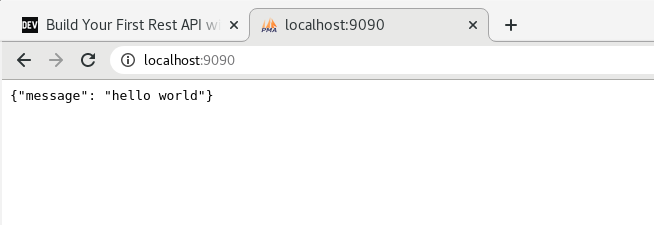

# KUBERNETES  

+ `K8S` Es una herramienta extensible y de código abierto para gestionar cargas de trabajo y servicios en contenedores, que facilita tanto la configuración declarativa como la automatización. Tiene un ecosistema grande y de rápido crecimiento. Los servicios, el soporte y las herramientas están ampliamente disponibles.  

+ Funciones:  
    - Service discovery: mira cuantos nodos hay, los escanea para saber de ellos.  
    - Rollouts/Rollbacks: para desplegar versiones nuevas o volver a la misma.  
    - Optimización de recursos en nodos: mira donde colocar el contenedor al host con menos carga.  
    - Self-healing: crea automaticamente un contenedor cuando uno muere.  
    - Configuración de secretos
    - Escalamiento horizontal


## ARQUITECTURA

  

+ __MASTER/NODE__: Kubernetes se divide en master, es el cerebro, es la parte que se encarga de todo el procesamiento, es donde estan todas las herramientas, es el centro de operaciones. Los nodos son las máquinas, host, máquinas virutal.  
El master es como la aduana y los nodes son  los barcos que se llevan los contenedores de la duana.  

+ __API SERVER__: Aplication Program Interface, significa que yo me puedo comunicar con un servicio a través de la API. Puedo hacerlo con la herramienta kubectl o directamente por fichero de programación. Ambos son en JSON, por lo que acaba procesando todo en código JSON.  

+ __KUBE-SCHEDULE__: es el que se encarga de colocar las cosas donde deben ir. Cuando comunico algo a la API, este le pasa las especificaciones al Schedule y éste busca a ver que nodo va mejor para poner todo, si hay muchos, mirar los 15 primeros aprox y lo pone donde mejor vea. Si no encuentra sitio, se espera hasta que quede uno libre correctamente para poder meter el contenedor.  

+ __KUBE-CONTROLLER__: dentro tiene el _node controler_ (se encarga de ver nodos, si se cae uno, levanta otra máquina), el _replication_(encargado de mantener todas las réplicas especificadas), el _end point controller_(se encarga de la red y pods) y tenemos el _service account y tokens controller_(para la autenticación).  

+ __ETCD__: es la base de datos de kubernetes donde están todas las configuraciones, cambios, estados nuevos, anteriores, etc. Si ponemos algo en una versión nueva y queremos volver atrás, en el _etcd_ está guardado el estado y configuración anterior.  

+ __KUBELET__: se encuentra en cada nodo y tienen dos funciones, en enviar y recibir información al master y por otro lado, habla con el run controller(normalmente docker),que tiene que estar instalado en cada nodo, para decirle las especificaciones que debe desplegar/montar en el POD del nodo.  

+ __KUBE-PROXY__:  se encuentra en cada nodo y se encarga de todo lo relacionado con la red del nodo y que se puedan comunicar entre contenedores/pods.  

+ __CONTAINER-RUNTIME__: el software de contenedores que tiene instalado el nodo: docker,etc.  


## INSTALACIÓN MINIKUBE/KUBECTL  

+ __MINIKUBE__: crea o simula un cluster pequeño que nos permite hacerlo en local.  

+ [Documentación Kubernetes](https://kubernetes.io/docs/tasks/tools/install-minikube/)  

+ Ejecutamos esta orden y sino sale vacío , vamos bien:  
`grep -E --color 'vmx|svm' /proc/cpuinfo`  

+ Instalamos `kubectl`, la intermediario para hablar con kubernetes:  
    - `curl -LO "https://storage.googleapis.com/kubernetes-release/release/$(curl -s https://storage.googleapis.com/kubernetes-release/release/stable.txt)/bin/linux/amd64/kubectl"`  

    - `chmod +x ./kubectl`  

    - `sudo mv ./kubectl /usr/bin/kubectl`  

    - `kubectl version --client`  

+ Para usar minikube se necesita un `Hypervisor`(o monitor de máquina virtual (virtual machine monitor)1​ es una plataforma que permite aplicar diversas técnicas de control de virtualización para utilizar, al mismo tiempo, diferentes sistemas operativos en una misma computadora):  
    - KVM
    - VirtualBox
    - Docker

+ Descargamos `minikube`:  
    - `curl -Lo minikube https://storage.googleapis.com/minikube/releases/latest/minikube-linux-amd64 && chmod +x minikube`  

    - `sudo mv minikube /usr/bin/`  

    - `minikube status`  

    ```
    [isx46410800@miguel curso_kubernetes]$ minikube status
    🤷  There is no local cluster named "minikube"
    👉  To fix this, run: "minikube start"
    [isx46410800@miguel curso_kubernetes]$ minikube start
    😄  minikube v1.13.1 on Fedora 27
    ✨  Automatically selected the docker driver
    👍  Starting control plane node minikube in cluster minikube
    🚜  Pulling base image ...
    💾  Downloading Kubernetes v1.19.2 preload ...
        > preloaded-images-k8s-v6-v1.19.2-docker-overlay2-amd64.tar.lz4: 486.36 MiB
    🔥  Creating docker container (CPUs=2, Memory=2200MB) ...
    🧯  Docker is nearly out of disk space, which may cause deployments to fail! (93% of capacity)
    💡  Suggestion: 
        Try at least one of the following to free up space on the device:
        1. Run "docker system prune" to remove unused docker data
        2. Increase the amount of memory allocated to Docker for Desktop via
        Docker icon > Preferences > Resources > Disk Image Size
        3. Run "minikube ssh -- docker system prune" if using the docker container runtime
    🍿  Related issue: https://github.com/kubernetes/minikube/issues/9024
    🐳  Preparing Kubernetes v1.19.2 on Docker 19.03.8 ...
    🔎  Verifying Kubernetes components...
    🌟  Enabled addons: default-storageclass, storage-provisioner
    🏄  Done! kubectl is now configured to use "minikube" by default
    ```  

+ Comprobamos de nuevo que sí funciona `minikube status`:  

```
[isx46410800@miguel curso_kubernetes]$ minikube status
minikube
type: Control Plane
host: Running
kubelet: Running
apiserver: Running
kubeconfig: Configured
```  

+ __COMANDOS BÁSICOS MINIKUBE__:  

    - `minikube status`
    - `minikube stop/start/delete`

+ Repositorio [curso Kubernetes](https://github.com/ricardoandre97/k8s-resources)  


## PODS VS CONTENEDORES  

  

+ Los __contenedores__ se ejecutan de manera aislada en un namespace:  
    - IPC (Inter Process Communication)
    - Cgroup
    - Network
    - Mount
    - PID
    - User
    - UTS (Unix Timesharing System)


+ Los __PODS__ sirven para compartir namespaces entre contenedores. Con docker permite que varios contenedores se puedan comunicar entre ellos por procesos, redes, files,etc. Kubernetes levanta un servicio y hace que el resto de contenedores compartan ese ID por ejemplo de red y se puedan comunicar y compartir namespaces como:  
    - De red(verse en la misma red)
    - IPC(verse los procesos)
    - UTS

> Cuando hablamos de PODs entonces nos referimos a que solo tiene una unica IP para todo lo que haya dentro comunicado. Solo es una capa que agrupa estos contenedores.


## PODS  

### CREAR POD  

+ Primero tenemos que tener encendido el simulador:  
`minikube start`  

+ [Documentación](https://kubernetes.io/docs/reference/kubectl/conventions/):  
`versión v1.19 la última`  

+ Creamos un pod de prueba `kubectl run nombrePod --image:xxx:tag`:  
```
[isx46410800@miguel curso_kubernetes]$ 

pod/pod-test created
```  

+ Vemos que lo hemos creado y está corriendo:  
```
[isx46410800@miguel curso_kubernetes]$ kubectl get pods
NAME       READY   STATUS    RESTARTS   AGE
pod-test   1/1     Running   0          22s
```  
> Normalmente hay un contenedor por pod, se suele asimilar a eso.  


### LOGS PODS  

+ Un pod es la unidad más pequeña para poder trabajar en Kubernetes. Se le notifica a la API que hable con Schedule y Controller y busquen un nodo donde crear ese pod con ciertas especifiaciones. Lo que corre dentro es el contenedor, el POD no corre.   

+ Creamos uno pod mal aposta para ver el error:  

```
[isx46410800@miguel curso_kubernetes]$ kubectl run pod-test2 --image=nginx:miguelllll
pod/pod-test2 created
[isx46410800@miguel curso_kubernetes]$ kubectl get pods
NAME        READY   STATUS         RESTARTS   AGE
pod-test    1/1     Running        0          5m19s
pod-test2   0/1     ErrImagePull   0          14s
```  

+ Para ver los ´logs´ usamos `kubectl describe pod nombrePod`:  
`kubectl describe pod pod-test`  
> En el apartado `events` nos describe los logs paso a paso.  


### API-RESOURCES  

+ Para ver todos los recursos que hay y los shortnames de comandos se usa:  
`kubectl api-resources`  


### ELIMINAR PODS

+ Para eliminar pods usamos `kubectl delete pod podName ...`:  
`kubectl delete pod pod-test2`  

+ Todos:  
`kubectl delete pod --all`  


### OBTENER YAML POD  

+ Podemos obtener info solo del pod concreto:  
`kubectl get pod pod-test`

+ Para más info para obtener el contenido YAML, lo que comunica al API de kubernetes en los request:  
`kubectl get pod pod-test -o yaml`  

+ Es mejor enviar las cosas por manifiestos en YAML ya que si quieres crear 50 pods, a través de un fichero será mejor que no ir poniendo una orden 50 veces.  


### IP POD  

+ Para poder ver la IP del POD podemos usar cualquiera de estos comandos:  
`kubectl describe pod pod-test`  
`kubectl get pod pod-test -o yaml`  

> En este caso es 172.18.0.3  

+ Para verlo ingresamos directamente al navegador la ip.  

+ Si no funciona tenemos que mapear el puerto:  
`kubectl port-forward pod-test 7000:80`  

  

+ Comprobamos la respuesta:  
`curl 172.18.0.3:80`  


### ENTRAR AL POD  

+ Para ingresar a la consola del POD:  
`kubectl exec -it pod-test -- sh`  
> Cuando solo hay un contenedor, no se especifica el nombre del pod.  

+ Cuando hay más contenedores `c, --container=''`:  
`kubectl exec -it pod-test -c containerName -- sh`  


### CREAR POD YAML  

+ Ejemplo:  
```
apiVersion: v1
kind: Pod
metadata:
  name: pod-test2
spec:
  containers:
    - name: container1
      image: nginx:alpine
```  

+ Las api versions las podemos ver en:  
`kubectl api-versions`  

+ Los kind los podemos ver en:  
`kubectl api-resources`  

+ Para crearlo a través del fichero YAML:  
`kubectl apply -f pod.yaml`  

```
[isx46410800@miguel pods]$ kubectl apply -f pod.yaml
pod/pod-test2 created
[isx46410800@miguel pods]$ kubectl get pods
NAME        READY   STATUS    RESTARTS   AGE
pod-test    1/1     Running   0          6h54m
pod-test2   1/1     Running   0          7s
```  

+ Para borrarlo:  
`kubectl delete -f pod.yaml`  

+ Para crear dos o más PODS, se pone `---` de separación:  
```
apiVersion: v1
kind: Pod
metadata:
  name: pod-test2
spec:
  containers:
    - name: container1
      image: nginx:alpine
---
apiVersion: v1
kind: Pod
metadata:
  name: pod-test3
spec:
  containers:
    - name: container2
      image: nginx:alpine
```  

### 2+ CONTAINER POR POD  

+ Para crear dos o  más containers en un POD se añade en la subsección containers:  
```
apiVersion: v1
kind: Pod
metadata:
  name: pod-test2
spec:
  containers:
    - name: container1
      image: python:3.6-alpine
      command: ['sh', '-c', 'echo "cont1" > index.html && python -m http.server 8082']
    - name: container2
      image: python:3.6-alpine
      command: ['sh', '-c', 'echo "cont2" > index.html && python -m http.server 8082']
```  

> Nos dará error porque estamos levantando dos container en el mismo puerto. El problema es que en un POD todos los containers comparten la misma red , por lo que si se levanta uno en el puerto 8082, el otro tiene que ser diferente.  

+ Vemos los `logs` en `kubectl logs podName -c container`:  
```
263dab[isx46410800@miguel pods]$ kubectl logs pod-test2 -c container2
Traceback (most recent call last):
...
  File "/usr/local/lib/python3.6/socketserver.py", line 470, in server_bind
    self.socket.bind(self.server_address)
OSError: [Errno 98] Address in use
```  

+ Arreglamos el fallo del puerto y comprobamos cada container del POD:  
```
[isx46410800@miguel pods]$ kubectl exec -it pod-test2 -c container1 -- sh
/ # cat index.html 
cont1
/ # exit
[isx46410800@miguel pods]$ kubectl exec -it pod-test2 -c container2 -- sh
/ # cat index.html 
cont2
```  

### LABELS  

+ Los labels son etiquetas que se ponen debajo de los `metadata`:  
```
apiVersion: v1
kind: Pod
metadata:
  name: pod-test2
  labels:
    app: front-end
    env: dev
spec:
  containers:
    - name: container1
      image: nginx:alpine
---   
apiVersion: v1
kind: Pod
metadata:
  name: pod-test3
  labels:
    app: back-end
    env: dev
spec:
  containers:
    - name: container1
      image: nginx:alpine
```  

+ Los labels nos sirve para poder filtrar PODs con `kubectl get pods -l nombre=valor`:
```
[isx46410800@miguel pods]$ kubectl get pods -l app=back-end
NAME        READY   STATUS    RESTARTS   AGE
pod-test3   1/1     Running   0          62s
[isx46410800@miguel pods]$ kubectl get pods -l env=dev
NAME        READY   STATUS    RESTARTS   AGE
pod-test2   1/1     Running   0          78s
pod-test3   1/1     Running   0          78s
```  
> Los LABELS más usado es el de APP. Muy importantes para administrar replicas.  


### PROBLEMAS PODs  

+ Los PODS no se regeneran solos si lo eliminamos manualmente, aunque se diga que haya dos replicas siempre. Tiene que ser un objeto mayor quien lo haga.   

+ Los PODs por si solo en un archivo YAML no puede indicarse que haya 50 replicas por ejemplo. Tiene que ser un objeto mayor quien lo haga.   

+ Los PODs no se pueden actualizar directamente, tiene que hacerlo alguien externo. Como mucho solo se puede modificar la seccion `image` y al hacer el apply puede ser que te deje actualizar.  


## REPLICASETS  

+ Es un objeto separado del POD a un nivel más alto(el replicaset crea PODs y es su dueño).  

+ Si se le indica que haya dos, si se muere uno y solo queda un POD, levanta uno nuevo. Para ello es muy importante los LABELS para ver que PODs tiene que manejar.  

+ En la metadata del POD mete el `OWNER REFERENCE` para indicar quien el propietario de los PODs y los suyos no los maneje otro ReplicaSet.  


### CREAR REPLICASET  

+ Vemos a donde pertenece la api-version y el kind de los replicasets en:  
`kubectl api-resources`  

+ Ejemplo:  
```
apiVersion: apps/v1
kind: ReplicaSet
metadata:
  name: rs-test
  labels:
    app: rs-test
spec:
  # modify replicas according to your case
  replicas: 5
  selector:
    matchLabels:
      app: pod-label
  # pertenece a los PODs que vas a crear
  template:
    metadata:
      labels:
        app: pod-label
    spec:
      containers:
        - name: container1
          image: python:3.6-alpine
          command: ['sh', '-c', 'echo "cont1" > index.html && python -m http.server 8082']
        - name: container2
          image: python:3.6-alpine
          command: ['sh', '-c', 'echo "cont2" > index.html && python -m http.server 8083']
```  

+ Lo creamos:  
`kubectl apply -f replica-set.yaml`  
> Lo que creamos son 5 PODs con label(pod-label, sino está lo crea) y dentro de cada POD creamos dos containers con label(pod-label)  

+ Comprobamos:  
```
[isx46410800@miguel replicaset]$ kubectl get pods
NAME            READY   STATUS    RESTARTS   AGE
rs-test-5tsfh   2/2     Running   0          105s
rs-test-9jpjg   2/2     Running   0          105s
rs-test-fbwjb   2/2     Running   0          105s
rs-test-hz2kx   2/2     Running   0          105s
rs-test-s6cxx   2/2     Running   0          105s
[isx46410800@miguel replicaset]$ kubectl get pods -l app=pod-label
NAME            READY   STATUS    RESTARTS   AGE
rs-test-5tsfh   2/2     Running   0          119s
rs-test-9jpjg   2/2     Running   0          119s
rs-test-fbwjb   2/2     Running   0          119s
rs-test-hz2kx   2/2     Running   0          119s
rs-test-s6cxx   2/2     Running   0          119s
```  

+ Ver los `replicasets` con `kubectl get rs`:  
```
[isx46410800@miguel replicaset]$ kubectl get rs
NAME      DESIRED   CURRENT   READY   AGE
rs-test   5         5         5       3m53s
[isx46410800@miguel replicaset]$ kubectl get replicaset
NAME      DESIRED   CURRENT   READY   AGE
rs-test   5         5         5       3m56s
```  


### ELIMINAR/MODIFICAR    

+ En un replicaset creado, si borramos un pod, vemos como actualiza directamente para mantener los 5 pods indicados:  
```
[isx46410800@miguel replicaset]$ kubectl delete pod rs-test-s6cxx
pod "rs-test-s6cxx" deleted
[isx46410800@miguel replicaset]$ kubectl get pods
NAME            READY   STATUS    RESTARTS   AGE
rs-test-5tsfh   2/2     Running   0          5m43s
rs-test-9jpjg   2/2     Running   0          5m43s
rs-test-b9lf4   2/2     Running   0          43s
rs-test-fbwjb   2/2     Running   0          5m43s
rs-test-hz2kx   2/2     Running   0          5m43s
```  

+ Si modifico el replicaset a 2 copias, veremos como se eliminan 3, se quedan dos:  
```
[isx46410800@miguel replicaset]$ vim replica-set.yaml 
[isx46410800@miguel replicaset]$ kubectl apply -f replica-set.yaml 
replicaset.apps/rs-test configured
[isx46410800@miguel replicaset]$ kubectl get pods
NAME            READY   STATUS        RESTARTS   AGE
rs-test-5tsfh   2/2     Running       0          8m29s
rs-test-9jpjg   2/2     Terminating   0          8m29s
rs-test-b9lf4   2/2     Terminating   0          3m29s
rs-test-fbwjb   2/2     Running       0          8m29s
rs-test-hz2kx   2/2     Terminating   0          8m29s
[isx46410800@miguel replicaset]$ kubectl get pods
NAME            READY   STATUS    RESTARTS   AGE
rs-test-5tsfh   2/2     Running   0          9m26s
rs-test-fbwjb   2/2     Running   0          9m26s
```  


### LOGS  

+ Por describe:  
`kubectl get rs rs-test -o yaml`  

+ Por manifiesto YAML:  
`kubectl describe rs rs-test`  


### OWNER REFERNCE  

+ Lo vemos en la metadata de un pod creado por ReplicaSet `kubectl get pod podName -o yaml`:  
```
kubectl get pod rs-test-5tsfh -o yaml
name: rs-test-5tsfh
  namespace: default
  ownerReferences:
  - apiVersion: apps/v1
    blockOwnerDeletion: true
    controller: true
    kind: ReplicaSet
    name: rs-test
    uid: 646a4a62-6acc-41a7-b3d1-7fe095c441d0
```  

+ Comprobamos que el `UID` anterior coincide con el replicaset creado `kubectl get rs rsName -o yaml`:  
```
kubectl get rs rs-test -o yaml
name: rs-test
  namespace: default
  resourceVersion: "22732"
  selfLink: /apis/apps/v1/namespaces/default/replicasets/rs-test
  uid: 646a4a62-6acc-41a7-b3d1-7fe095c441d0
```  


### ADOPCIÓN DE PODS PLANOS  

+ Vamos a crear primero dos PODs manualmente:  
```
[isx46410800@miguel replicaset]$ kubectl run pod-test --image=nginx:alpine
pod/pod-test created
[isx46410800@miguel replicaset]$ kubectl run pod-test2 --image=nginx:alpine
pod/pod-test2 created
```  

+ Les creamos un LABEL a cada uno con `kubectl label pods podName label=valor`:  
```
[isx46410800@miguel replicaset]$ kubectl label pods pod-test app=pod-label
pod/pod-test labeled
[isx46410800@miguel replicaset]$ kubectl label pods pod-test2 app=pod-label
pod/pod-test2 labeled
```  
> Tendran el nuevo label pero no tendrán ningun OWNER REFERENCE porque no han sido creados por ningun REPLICASET.  

+ Ahora mediante replicaset cremos 3 replicas con mismo label:  
```
[isx46410800@miguel replicaset]$ kubectl apply -f replica-set.yaml
replicaset.apps/rs-test created
[isx46410800@miguel replicaset]$ kubectl get pods
NAME            READY   STATUS    RESTARTS   AGE
pod-test        1/1     Running   0          3m49s
pod-test2       1/1     Running   0          3m45s
rs-test-8mk72   2/2     Running   0          10s
```  
> Tenemos un GRAN PROBLEMA ya que adopta dos pods huerfanos sin owner y los coge pero los adopta y ellos solo tienen un container y no dos con la estructura del replicaset. Si borramos un pod de uno, el replicaset regenera uno nuevo con la estructura buena.  


### PROBLEMAS  

+ Si modificamos cosas del container como la imagen, nombre container, etc. Si hacemos un apply no se actualiza nada, ya que como sigue con los mismos LABELS, el replicaset solo se guia por pods y labels y no de actualizar nada de lo que contiene.  

+ NO se auto-actualizan solos.  

+ Si modificamos por ejemplo la imagen de un container de un pod de python de 3.6 a 3.7, se actualiza el ReplicSet pero no los PODs. Si se borra un POD, entonces el nuevo POD si que tiene las nuevas actualizaciones.  


## DEPLOYMENTS  

+ Es un objeto de nivel mayor que los replicaset. Es el dueño del replicaset que a su vez es de sus PODs.  

+ Al deployment se le da una imagen o una nueva versión: genera un replicaset con sus pods. Si se actualiza algo, se crea un segundo replicaset con un primer POD, y luego va matando del primer POD el pod viejo de v1 y crea otro POD en el nuevo replicaset con V2, y así succesivamente.  

+ Esto se logra porque los deployments tienen dos valores: Uno de máximo extra y otra de un máximo de inutilizado. Normalmente este valor por defecto es un 25%. Por lo que en el ejemplo anterior podemos hacer 1 pod más y solo dejar 1 pod inutilizado.    

+ Los deployments pueden mantener un máximo de 10 replicasets  


### CREAR DEPLOYMENT  

+ Vemos a donde pertenece la api-version y el kind de los deployments en:  
`kubectl api-resources`  

+ Ejemplo:  
```
# esto es del deployment
apiVersion: apps/v1
kind: Deployment
metadata:
  name: deployment-test
  labels:
    app: front
# aqui viene el replicaset
spec:
  replicas: 3
  selector:
    matchLabels:
      app: front
  # aqui viene el pod
  template:
    metadata:
      labels:
        app: front
    spec:
      containers:
      - name: nginx
        image: nginx:alpine
        ports:
        - containerPort: 80
```  

+ Lo creamos con `kubectl apply -f deployment.yaml`:  
```
[isx46410800@miguel deployments]$ kubectl apply -f deployment.yaml 
deployment.apps/deployment-test created
```  

+ Vemos el deployment creado `kubectl get deployment`:  
```
[isx46410800@miguel deployments]$ kubectl get deployment
NAME              READY   UP-TO-DATE   AVAILABLE   AGE
deployment-test   3/3     3            3           8s
```  

+ Vemos los labels del deployment `kubectl get deployment --show-labels`:  
```
[isx46410800@miguel deployments]$ kubectl get deployment --show-labels
NAME              READY   UP-TO-DATE   AVAILABLE   AGE   LABELS
deployment-test   3/3     3            3           21s   app=front
```  

+ Vemos el estado del deployment `kubectl rollout status deployment deploymentName`:  
```
[isx46410800@miguel deployments]$ kubectl rollout status deployment deployment-test
deployment "deployment-test" successfully rolled out
```  

+ Vemos que se ha creado un replicaset y tiene los mismo labels:  
```
[isx46410800@miguel deployments]$ kubectl get replicaset
NAME                         DESIRED   CURRENT   READY   AGE
deployment-test-659b64d66c   3         3         3       4m28s
[isx46410800@miguel deployments]$ kubectl get replicaset --show-labels
NAME                         DESIRED   CURRENT   READY   AGE    LABELS
deployment-test-659b64d66c   3         3         3       5m8s   app=front,pod-template-hash=659b64d66c
```  

+ Vemos que se ha creado 3 replicas del pod y tiene los mismo labels:  
```
[isx46410800@miguel deployments]$ kubectl get pods
NAME                               READY   STATUS    RESTARTS   AGE
deployment-test-659b64d66c-n5qgr   1/1     Running   0          4m32s
deployment-test-659b64d66c-pzdct   1/1     Running   0          4m32s
deployment-test-659b64d66c-thknz   1/1     Running   0          4m32s
[isx46410800@miguel deployments]$ kubectl get pods --show-labels
NAME                               READY   STATUS    RESTARTS   AGE     LABELS
deployment-test-659b64d66c-n5qgr   1/1     Running   0          5m14s   app=front,pod-template-hash=659b64d66c
deployment-test-659b64d66c-pzdct   1/1     Running   0          5m14s   app=front,pod-template-hash=659b64d66c
deployment-test-659b64d66c-thknz   1/1     Running   0          5m14s   app=front,pod-template-hash=659b64d66c
```  

+ Vemos la jerarquía de lo creado para saber quien es el `owner reference` de cada cosa con `kubectl get rs/pod/deployment NAME -o yaml`:  
  - Deployment no tiene dueño
  - Replicaset su dueño es deployment
  - Pod su dueño es replicaset


### ROLLING UPDATE  

+ Actualizamos por ejemplo la imagen de un container del POD en vez de `nginx:alpine` ponemos `nginx` y hacemos de nuevo el `kubectl apply -f deployment.yaml`:  
```
[isx46410800@miguel deployments]$ kubectl apply -f deployment.yaml 
deployment.apps/deployment-test configured
[isx46410800@miguel deployments]$ kubectl get pods
NAME                               READY   STATUS              RESTARTS   AGE
deployment-test-659b64d66c-n5qgr   1/1     Running             0          13m
deployment-test-659b64d66c-pzdct   1/1     Running             0          13m
deployment-test-659b64d66c-thknz   1/1     Running             0          13m
deployment-test-69b674677d-2cq4l   0/1     ContainerCreating   0          5s
[isx46410800@miguel deployments]$ kubectl get deployment
NAME              READY   UP-TO-DATE   AVAILABLE   AGE
deployment-test   3/3     1            3           14m
[isx46410800@miguel deployments]$ kubectl get replicaset
NAME                         DESIRED   CURRENT   READY   AGE
deployment-test-659b64d66c   3         3         3       14m
deployment-test-69b674677d   1         1         0       18s
[isx46410800@miguel deployments]$ kubectl get pods
NAME                               READY   STATUS              RESTARTS   AGE
deployment-test-659b64d66c-n5qgr   0/1     Terminating         0          14m
deployment-test-659b64d66c-pzdct   1/1     Running             0          14m
deployment-test-659b64d66c-thknz   1/1     Terminating         0          14m
deployment-test-69b674677d-2cq4l   1/1     Running             0          25s
deployment-test-69b674677d-dwdlr   0/1     ContainerCreating   0          1s
deployment-test-69b674677d-dwspw   1/1     Running             0          6s
[isx46410800@miguel deployments]$ kubectl get pods
NAME                               READY   STATUS    RESTARTS   AGE
deployment-test-69b674677d-2cq4l   1/1     Running   0          43s
deployment-test-69b674677d-dwdlr   1/1     Running   0          19s
deployment-test-69b674677d-dwspw   1/1     Running   0          24s
```  

+ Vemos el estado en directo de lo que hace con `ubectl rollout status deployment deploymentName`:  
```
[isx46410800@miguel deployments]$ kubectl rollout status deployment deployment-test
Waiting for deployment "deployment-test" rollout to finish: 1 out of 3 new replicas have been updated...
Waiting for deployment "deployment-test" rollout to finish: 1 out of 3 new replicas have been updated...
Waiting for deployment "deployment-test" rollout to finish: 1 out of 3 new replicas have been updated...
Waiting for deployment "deployment-test" rollout to finish: 2 out of 3 new replicas have been updated...
Waiting for deployment "deployment-test" rollout to finish: 2 out of 3 new replicas have been updated...
Waiting for deployment "deployment-test" rollout to finish: 2 out of 3 new replicas have been updated...
Waiting for deployment "deployment-test" rollout to finish: 1 old replicas are pending termination...
Waiting for deployment "deployment-test" rollout to finish: 1 old replicas are pending termination...
deployment "deployment-test" successfully rolled out
```  

+ También podemos ver el resultado en `kubectl describe deployment deploymentName`:  
```
Events:
  Type    Reason             Age                    From                   Message
  ----    ------             ----                   ----                   -------
  Normal  ScalingReplicaSet  19m                    deployment-controller  Scaled up replica set deployment-test-659b64d66c to 3
  Normal  ScalingReplicaSet  5m18s                  deployment-controller  Scaled up replica set deployment-test-69b674677d to 1
  Normal  ScalingReplicaSet  4m59s                  deployment-controller  Scaled down replica set deploy
```  

+ Aquí vemos también la estrategía de los valores que comentamos en la introducción:  
`RollingUpdateStrategy:  25% max unavailable, 25% max surge`  


### HISTORIAL DE DEPLOYMENTS  

+ Podemos ver las actualizaciones o revisiones en el historial de deployments en `kubectl rollout history deployment deployment`:  
```
[isx46410800@miguel deployments]$ kubectl rollout history deployment deployment-test
deployment.apps/deployment-test 
REVISION  CHANGE-CAUSE
2         <none>
3         <none>
4         <none>
```  

+ Podemos con esto volver a cualquier versión anterior. Por defecto es 10 replicasets que guarda pero podemos cambiarlo añadiento en la parte de replicaset del manifiesto YAML `revisionHistoryLimit: 5`:  

```
# esto es del deployment
apiVersion: apps/v1
kind: Deployment
metadata:
  name: deployment-test
  labels:
    app: front
# aqui viene el replicaset
spec:
  revisionHistoryLimit: 5
  replicas: 3
  selector:
    matchLabels:
      app: front
  # aqui viene el pod
  template:
    metadata:
      labels:
        app: front
    spec:
      containers:
      - name: nginx
        image: nginx:alpine
        ports:
        - containerPort: 80
```  

+ Para poner un motivo en el `change-cause` cuando hacemos una versión de deployments indicamos dos maneras:  

  - Con la linea de desplegar `kubectl apply -f deployment.yaml --record`:  
  ```  
  [isx46410800@miguel deployments]$ kubectl apply -f deployment.yaml --record
  deployment.apps/deployment-test configured
  [isx46410800@miguel deployments]$ kubectl rollout history deployment deployment-test
  deployment.apps/deployment-test 
  REVISION  CHANGE-CAUSE
  1         <none>
  2         <none>
  3         kubectl apply --filename=deployment.yaml --record=true
  ```  

  - Con una subsección en el manifiesto deployment.yaml `annotations-> kubernetes.io/change-cause: "message"`:  
  ```
  esto es del deployment
  apiVersion: apps/v1
  kind: Deployment
  metadata:
    name: deployment-test
    annotations:
      kubernetes.io/change-cause: "changes port to 110"
    labels:
      app: front
  ```  
  ```
  kubectl rollout history deployment deployment-test
  deployment.apps/deployment-test 
  REVISION  CHANGE-CAUSE
  1         <none>
  2         <none>
  3         kubectl apply --filename=deployment.yaml --record=true
  4         changes port to 110
  ```  

+ Para luego ver una revisión en concreta usamos `kubectl rollout history deployment deployment-test --revision=3`:  
```
deployment.apps/deployment-test with revision #3
Pod Template:
  Labels:	app=front
	pod-template-hash=fd8445c88
  Annotations:	kubernetes.io/change-cause: kubectl apply --filename=deployment.yaml --record=true
  Containers:
   nginx:
    Image:	nginx:alpine
    Port:	90/TCP
    Host Port:	0/TCP
    Environment:	<none>
    Mounts:	<none>
  Volumes:	<none>
```  


### ROLL BACKS  

+ Se utiliza para volver a un estado bien porque por ejemplo ha ido mal una actualización de la imagen:  
```
containers:
      - name: nginx
        image: nginx:fake
        ports:
        - containerPort: 110
```  

+ Vemos el nuevo historial y su fallo:  
```
[isx46410800@miguel deployments]$ kubectl rollout history deployment deployment-test
deployment.apps/deployment-test 
REVISION  CHANGE-CAUSE
1         <none>
2         <none>
3         kubectl apply --filename=deployment.yaml --record=true
4         changes port to 110
5         new version nginx
#
[isx46410800@miguel deployments]$ kubectl get pods
NAME                               READY   STATUS         RESTARTS   AGE
deployment-test-5c6896bcd5-h5qts   0/1     ErrImagePull   0          32s
deployment-test-74fb9c6d9f-7dwnr   1/1     Running        0          6m50s
deployment-test-74fb9c6d9f-f5qs8   1/1     Running        0          6m45s
deployment-test-74fb9c6d9f-lsmzj   1/1     Running        0          6m54s
```  

+ Volvemos haciendo un `rollback` a una versión anterior con `kubectl rollout undo deployment deployment-test --to-revision=4`:  
```
[isx46410800@miguel deployments]$ kubectl rollout undo deployment deployment-test --to-revision=4
deployment.apps/deployment-test rolled back
#
[isx46410800@miguel deployments]$ kubectl rollout status deployment deployment-test
deployment "deployment-test" successfully rolled out
#
[isx46410800@miguel deployments]$ kubectl describe deployment deployment-test
Name:                   deployment-test
Namespace:              default
CreationTimestamp:      Sun, 11 Oct 2020 19:21:04 +0200
Labels:                 app=front
Annotations:            deployment.kubernetes.io/revision: 6
                        kubernetes.io/change-cause: changes port to 110
Selector:               app=front
Replicas:               3 desired | 3 updated | 3 total | 3 available | 0 unavailable
StrategyType:           RollingUpdate
MinReadySeconds:        0
RollingUpdateStrategy:  25% max unavailable, 25% max surge
Pod Template:
  Labels:  app=front
  Containers:
   nginx:
    Image:        nginx:alpine
    Port:         110/TCP
    Host Port:    0/TCP
#
[isx46410800@miguel deployments]$ kubectl describe deployment deployment-test 
Normal  ScalingReplicaSet  117s (x12 over 15m)  deployment-controller  (combined from similar events): Scaled down replica set deployment-test-5c6896bcd5 to 0
```  


## SERVICIOS  

+ Los servicios es una cosa aparte en el que el usuario se comunica a su IP del servicio y éste observar todos los pods que tienen un label con ese servicio y actua como balanzador de carga para ver a donde llamar para que le de la data. Siempre va a tener la misma data con cualquier que se comunique.  

+ Los PODs tienen una IP unica cada uno, que si se muere, se regenera con otra IP. El servicio también tiene su IP unica en el que kubernetes se encarga de que siempre tenga la misma con el tiempo.  

+ Los `endpoints` se crean automaticamente cuando se crea un servicio. Todas las IPs de los PODs se van guardando en el endpoint y así el servicio sabe a que IPs se puede comunicar para los PODs con su mismo label de servicio.  


### CREAR SERVICIO  

+ Vemos a donde pertenece la api-version y el kind de los servicios en:  
`kubectl api-resources`  

+ Ejemplo:  
```
# esto es del deployment
apiVersion: apps/v1
kind: Deployment
metadata:
  name: deployment-test
  labels:
    app: front
# aqui viene el replicaset
spec:
  replicas: 3
  selector:
    matchLabels:
      app: front
  # aqui viene el pod
  template:
    metadata:
      labels:
        app: front
    spec:
      containers:
      - name: nginx
        image: nginx:alpine
---       
# añadimos el servicio que observará los FRONT
apiVersion: v1
kind: Service
metadata:
  name: my-service
  labels:
    app: front
spec:
  selector:
    app: front
  ports:
    - protocol: TCP
      port: 8888 # servicio por donde escucha
      targetPort: 80 # a que puerto dentro del pod vamos a mandar la peticion(nginx 80)
```  
> El puerto del servicio MY-SERVICE es el 8888 y se comunica a la IP de cada POD por el 80.  


### INFO SERVICIO  

+ Vemos lo creado con `kubectl get services/svc`:  
```
[isx46410800@miguel services]$ kubectl get services
NAME         TYPE        CLUSTER-IP      EXTERNAL-IP   PORT(S)    AGE
kubernetes   ClusterIP   10.96.0.1       <none>        443/TCP    41h
my-service   ClusterIP   10.97.182.119   <none>        8888/TCP   63s
[isx46410800@miguel services]$ kubectl get deployment
NAME              READY   UP-TO-DATE   AVAILABLE   AGE
deployment-test   3/3     3            3           79s
```  

+ Vemos por el label que le indicamos en el YAML:  
```
[isx46410800@miguel services]$ kubectl get services -l app=front
NAME         TYPE        CLUSTER-IP      EXTERNAL-IP   PORT(S)    AGE
my-service   ClusterIP   10.97.182.119   <none>        8888/TCP   3m35s
```  
> El cluster-ip se lo da kubernetes si no se lo asignamos directamente  

+ Profundizamos el servicio con `kubectl describe svc my-service`:  
```
[isx46410800@miguel services]$ kubectl describe svc my-service
Name:              my-service
Namespace:         default
Labels:            app=front
Annotations:       <none>
Selector:          app=front
Type:              ClusterIP
IP:                10.97.182.119
Port:              <unset>  8888/TCP
TargetPort:        80/TCP
Endpoints:         172.18.0.2:80,172.18.0.4:80,172.18.0.5:80
Session Affinity:  None
Events:            <none>
```  
> Vemos nuestra IP como antes y la lista de IPs de los pods que nos podemos comunicar en el endpoint.  


### ENDPOINTS  

+ Lista de IPs de los pods que tienen el label de mi servicio creado.  

+ Vemos la lista de endpoints con `kubectl get endpoints`:  
```
[isx46410800@miguel services]$ kubectl get endpoints
NAME         ENDPOINTS                                   AGE
kubernetes   172.17.0.2:8443                             41h
my-service   172.18.0.2:80,172.18.0.4:80,172.18.0.5:80   10m
```  

+ Comprobamos que son las mismas de los PODS:  
```
[isx46410800@miguel services]$ kubectl get pods -l app=front -o wide
NAME                              READY   STATUS    RESTARTS   AGE   IP           NODE       NOMINATED NODE   READINESS GATES
deployment-test-b7c99d94b-cgds6   1/1     Running   0          10m   172.18.0.4   minikube   <none>           <none>
deployment-test-b7c99d94b-fmpdc   1/1     Running   0          10m   172.18.0.2   minikube   <none>           <none>
deployment-test-b7c99d94b-t8bdz   1/1     Running   0          10m   172.18.0.5   minikube   <none>           <none>
```

+ Si eliminamos un Pod, se crea uno nuevo con otra ip y se actualiza el endpoint:  
```
[isx46410800@miguel services]$ kubectl delete pod deployment-test-b7c99d94b-cgds6
pod "deployment-test-b7c99d94b-cgds6" deleted
[isx46410800@miguel services]$ kubectl get endpoints
NAME         ENDPOINTS                                   AGE
kubernetes   172.17.0.2:8443                             41h
my-service   172.18.0.2:80,172.18.0.5:80,172.18.0.6:80   13m
[isx46410800@miguel services]$ kubectl get pods -l app=front -o wide
NAME                              READY   STATUS    RESTARTS   AGE   IP           NODE       NOMINATED NODE   READINESS GATES
deployment-test-b7c99d94b-fmpdc   1/1     Running   0          14m   172.18.0.2   minikube   <none>           <none>
deployment-test-b7c99d94b-kcdnx   1/1     Running   0          39s   172.18.0.6   minikube   <none>           <none>
deployment-test-b7c99d94b-t8bdz   1/1     Running   0          14m   172.18.0.5   minikube   <none>           <none>
```  

### DNS  

+ Creamos un POD nuevo:  
`[isx46410800@miguel services]$ kubectl run --rm -it podtest2 --image=nginx:alpine -- sh`  

+ Funciona que escucha al servicio:  
```
# curl 10.97.182.119:8888
<!DOCTYPE html>
<html>
<head>
<title>Welcome to nginx!</title>
<style>
    body {
        width: 35em;
        margin: 0 auto;
        font-family: Tahoma, Verdana, Arial, sans-serif;
    }
</style>
</head>
<body>
<h1>Welcome to nginx!</h1>
<p>If you see this page, the nginx web server is successfully installed and
working. Further configuration is required.</p>
<p>For online documentation and support please refer to
<a href="http://nginx.org/">nginx.org</a>.<br/>
Commercial support is available at
<a href="http://nginx.com/">nginx.com</a>.</p>
<p><em>Thank you for using nginx.</em></p>
</body>
</html>
```  
> Con esto hacemos que desde un pod llamamos al servicio web de nginx que lo coge de sus pods de label web.  

+ Se crea como un tipo de DNS ya que por el nombre del servicio también se comunica y obtiene respuesta:  
`# curl my-service:8888`  


### SERVICIO CLUSTER-IP  

+ IP permanente que le da kubernetes y es solo para ambito privado, no desde el exterior.  

+ Le podemos poner un tipo de servicio a los servicios que creamos:  
```
# añadimos el servicio que observará los FRONT
apiVersion: v1
kind: Service
metadata:
  name: my-service
  labels:
    app: front
spec:
  type: ClusterIP
  selector:
    app: front
  ports:
    - protocol: TCP
      port: 8888 # servicio por donde escucha
      targetPort: 80 # a que puerto dentro del pod vamos a mandar la peticion(nginx 80)
```  


### SERVICIO NODE-PORT  

+ IP que nos permite conectar la IP desde el exterior exponendo su puerto abriendose desde el nodo. A la vez se crea también un ClusterIP.  

+ Ejemplo:  
```
# esto es del deployment
apiVersion: apps/v1
kind: Deployment
metadata:
  name: deployment-test2
  labels:
    app: backend
# aqui viene el replicaset
spec:
  replicas: 3
  selector:
    matchLabels:
      app: backend
  # aqui viene el pod
  template:
    metadata:
      labels:
        app: backend
    spec:
      containers:
      - name: nginx
        image: nginx:alpine
---
# añadimos el servicio que observará los FRONT
apiVersion: v1
kind: Service
metadata:
  name: my-service2
  labels:
    app: backend
spec:
  type: NodePort
  selector:
    app: backend
  ports:
    - protocol: TCP
      port: 8888 # servicio por donde escucha
      targetPort: 80 # a que puerto dentro del pod vamos a mandar la peticion(nginx 80)
```  

+ Resultados:  
```
[isx46410800@miguel services]$ kubectl get services -l app=backend
NAME          TYPE       CLUSTER-IP      EXTERNAL-IP   PORT(S)          AGE
my-service2   NodePort   10.101.52.193   <none>        8888:30072/TCP   21s
[isx46410800@miguel services]$ kubectl get pods -l app=backend
NAME                                READY   STATUS    RESTARTS   AGE
deployment-test2-77448c6d65-gj6l7   1/1     Running   0          36s
deployment-test2-77448c6d65-n8td7   1/1     Running   0          36s
deployment-test2-77448c6d65-sd6zq   1/1     Running   0          36s
```

+ Si pusiera mi IP y el puerto que redirige el nodo, veriamos el servicio:  
`http://192.168.1.104:30072`  

+ Si no hace en minikube podemos hacer lo siguiente y lo veremos:  
```
[isx46410800@miguel services]$ minikube service my-service2
|-----------|-------------|-------------|-------------------------|
| NAMESPACE |    NAME     | TARGET PORT |           URL           |
|-----------|-------------|-------------|-------------------------|
| default   | my-service2 |        8888 | http://172.17.0.2:30072 |
|-----------|-------------|-------------|-------------------------|
```  
> Esa url nos dará el servicio web a través del node port.  


### SERVICIO LOAD BALANCER  

+ Hace referencia a un servicio de balanzador de carga.  

+ Se crea un load balancer, que a su vez crea un node port para poder conectarnos desde la nube por ejemplo y a su vez crea un cluster IP.  


## GOLANG  

+ Queremos crear dos deployments, uno de backend y otro de front, uno con servicio clusterip y otro nodeip. Queremos que el usuario de fuera haga una petición al front y este le devuelva el servicio que está en backend.  


### CREAR API REST GO  

+ [DOCUMENTACIÓN](https://dev.to/moficodes/build-your-first-rest-api-with-go-2gcj)  

+ Creamos un fichero simple de API REST en Goland:  
```
[isx46410800@miguel src]$ cat main.go 
package main
import (
    "log"
    "net/http"
)
func ServeHTTP(w http.ResponseWriter, r *http.Request) {
    w.Header().Set("Content-Type", "application/json")
    w.WriteHeader(http.StatusOK)
    w.Write([]byte(`{"message": "hello world"}`))
}
func main() {
    http.HandleFunc("/", ServerHTTP)
    http.ListenAndServe(":9090", nil))
}
```  
> Esto crea una funcion principal de que corra el servicio http cuando encuentre la /, nos contestará a la petición el hello wolld como respuesta.  

+ Descargamos la imagen Goland y construimos un docker con el volumen del main.go creado para probarlo:  
`[isx46410800@miguel k8s-hands-on]$ docker pull golang`  

`[isx46410800@miguel src]$ docker run --rm --name goland -v $PWD/:/go --net host -dti golang /bin/bash`  

+ Iniciamos el fichero y comprobamos el resultado:  
```
[isx46410800@miguel src]$ docker exec -it goland /bin/bash
root@miguel:/go# go run main.go 
```  

![./images/kubernetes4.png]  


### CAMBIOS MENSAJE RESPUESTA  

### MENSAJE 1  

+ Añadimos unas variables para cambiar el mensaje de respuesta a la petición de request:  
```
package main
import (
    "net/http"
    "fmt"
    "os"
    "time"
)
func ServerHTTP(w http.ResponseWriter, r *http.Request) {
    w.Header().Set("Content-Type", "application/json")
    w.WriteHeader(http.StatusOK)
    resp := fmt.Sprintf("La hora es %v y el hostname es %v", time.Now(), os.Getenv("HOSTNAME"))
    w.Write([]byte(resp))
}
func main() {
    http.HandleFunc("/", ServerHTTP)
    http.ListenAndServe(":9090", nil)
}
```  

![./images/kubernetes5.png]  


#### MENSAJE 2  

+ Añadimos unas variables para cambiar el mensaje de respuesta a la petición de request:  
```
package main
import (
    "net/http"
    "os"
    "time"
    "encoding/json"
)
type HandsOn struct {
   Time	    time.Time   `json:"time"`
   Hostname string      `json:"hostname"`
}
func ServerHTTP(w http.ResponseWriter, r *http.Request) {
    if r.URL.Path != "/" {
        http.NotFound(w, r)
        return
    }
    resp := HandsOn{
        Time:       time.Now(),
        Hostname:   os.Getenv("HOSTNAME"),
    }
    jsonResp, err := json.Marshal(&resp)
    if err != nil {
        w.Write([]byte("Error"))
        return
    }
    w.Header().Set("Content-Type", "application/json")
    w.WriteHeader(http.StatusOK)
    w.Write(jsonResp)
}
func main() {
    http.HandleFunc("/", ServerHTTP)
    http.ListenAndServe(":9090", nil)
}
```  
> Hemos creado una estructura con type y luego hemos creado un objetivo y convertido a string para cambiar el mensaje y también darle un mensaje de error si no acaba en /.  

![./images/kubernetes6.png]  

![./images/kubernetes7.png]  


### DOCKERFILE GOLANG  

+ Ejemplo:  
```
# IMAGEN DE GOLAND
FROM golang:1.13 as builder
# DIRECTORIO A TRABAJAR
WORKDIR /app
# COPIAMOS FICHERO MAIN
COPY main.go .
RUN CGO_ENABLED=0 GOOS=linux GOPROXY=https://proxy.golang.org go build -o app ./main.go
# DESDE IMAGEN ALPINE
FROM alpine:latest
# mailcap adds mime detection and ca-certificates help with TLS (basic stuff)
WORKDIR /app
COPY --from=builder /app/app .
# PARA EJECUTARLO
ENTRYPOINT ["./app"]
```

+ Construimos imagen:  
`[isx46410800@miguel src]$ docker build -t isx46410800/k8s-hands-on .`  

+ Encendemos:  
`[isx46410800@miguel src]$ docker run --rm --name k8s-hands-on -p 9091:9090 -d isx46410800/k8s-hands-on`  

![./images/kubernetes8.png]  
> Ahora nuestra aplicación de golang ya puede correr en un contenedor y entramos a localhost:9091 y lo vemos.  


### DEPLOYMENT GOLANG  

+ Ejemplo:  
```
# esto es del deployment
apiVersion: apps/v1
kind: Deployment
metadata:
  name: backend-k8s-hands-on
  labels:
    app: backend
# aqui viene el replicaset
spec:
  replicas: 3
  selector:
    matchLabels:
      app: backend
  # aqui viene el pod
  template:
    metadata:
      labels:
        app: backend
    spec:
      containers:
      - name: backend
        image: isx46410800/k8s-hands-on
        imagePullPolicy: IfNotPresent
---
# añadimos el servicio
apiVersion: v1
kind: Service
metadata:
  name: backend-k8s-hands-on
  labels:
    app: backend
spec:
  selector:
    app: backend
  ports:
    - protocol: TCP
      port: 80 # servicio por donde escucha
      targetPort: 9090
```  
> Ponemos lo de `imagePullPolicy: IfNotPresent` para que primero busque si la imagen está constuida localmente antes de mirar en los repos de internet de dockerhub.  

+ Comprobaciones:  
```
[isx46410800@miguel backend]$ kubectl get pods
NAME                                    READY   STATUS    RESTARTS   AGE
backend-k8s-hands-on-5d548949c7-dgw9l   1/1     Running   0          15m
backend-k8s-hands-on-5d548949c7-fg8wr   1/1     Running   0          15m
backend-k8s-hands-on-5d548949c7-q9s6g   1/1     Running   0          15m
[isx46410800@miguel backend]$ kubectl get rs
NAME                              DESIRED   CURRENT   READY   AGE
backend-k8s-hands-on-5d548949c7   3         3         3       15m
[isx46410800@miguel backend]$ kubectl get deploy
NAME                   READY   UP-TO-DATE   AVAILABLE   AGE
backend-k8s-hands-on   3/3     3            3           15m
[isx46410800@miguel backend]$ kubectl get svc
NAME                   TYPE        CLUSTER-IP     EXTERNAL-IP   PORT(S)   AGE
backend-k8s-hands-on   ClusterIP   10.101.44.56   <none>        80/TCP    16m
kubernetes             ClusterIP   10.96.0.1      <none>        443/TCP   3d19h
```  

+ Visual cambiando a nodeport, nos contestará unos de los PODs la respuesta a la request del usuario:  

![./images/kubernetes9.png]  


### CONSUMO DEL SERVICIO  

+ Si creamos un POD aparte como si fuera de FRONT, comprobamos que nos podemos conectar tanto por la IP como por el nombre como si tuviera un DNS y nos darán las respuestas los PODs del servicio:  
```
[isx46410800@miguel backend]$ kubectl run --rm -ti pod-test2 --image=nginx:alpine -- sh
/ # apk add -U curl
/ # curl 10.111.54.241:80
{"time":"2020-10-13T19:57:49.446174694Z","hostname":"backend-k8s-hands-on-5d548949c7-9qp82"}/ # 
/ # curl 10.111.54.241:80
{"time":"2020-10-13T19:58:10.218346403Z","hostname":"backend-k8s-hands-on-5d548949c7-9qp82"}/ # 
{"time":"2020-10-13T19:58:25.365295183Z","hostname":"backend-k8s-hands-on-5d548949c7-66dgx"}/ # 
```  


### FRONTED  

+ Creamos ahora un index.html de respuesta en un fronted/src/index.html:  

```
[isx46410800@miguel backend]$ kubectl run pod-test2 --image=nginx:alpine
vi /usr/share/nginx/html/index.html
<div id="id01"></div>

<script>
var xmlhttp = new XMLHttpRequest();
var url = "http://backend-k8s-hands-on";

xmlhttp.onreadystatechange = function() {
    if (this.readyState == 4 && this.status == 200) {
        var resp = JSON.parse(this.responseText);
        document.getElementById("id01").innerHTML = "<h2>La hora es " + resp.time + "y el hostname es" + resp.hostname "</h2">;
    }
};
xmlhttp.open("GET", url, true);
xmlhttp.send();
</script>
```  

+ Dockerfile:  
```
# IMAGEN DE GOLAND
FROM nginx:alpine
# COPIAMOS FICHERO MAIN
COPY ./src/index.html /usr/share/nginx/html/index.html
```  

### MANIFIESTO FRONTED  

+ Despliegue del fronted:  
```
# esto es del deployment
apiVersion: apps/v1
kind: Deployment
metadata:
  name: fronted-k8s-hands-on
  labels:
    app: fronted
# aqui viene el replicaset
spec:
  replicas: 3
  selector:
    matchLabels:
      app: fronted
  # aqui viene el pod
  template:
    metadata:
      labels:
        app: fronted
    spec:
      containers:
      - name: fronted
        image: isx46410800/k8s-hands-on:fronted
        imagePullPolicy: IfNotPresent
---
# añadimos el servicio
apiVersion: v1
kind: Service
metadata:
  name: fronted-k8s-hands-on
  labels:
    app: fronted
spec:
  type: NodePort
  selector:
    app: fronted
  ports:
    - protocol: TCP
      port: 80 # servicio por donde escucha
      targetPort: 80
```  

+ Resultados:  
```
[isx46410800@miguel k8s-hands-on]$ kubectl get svc
NAME                   TYPE        CLUSTER-IP      EXTERNAL-IP   PORT(S)        AGE
backend-k8s-hands-on   NodePort    10.111.54.241   <none>        80:30740/TCP   78m
fronted-k8s-hands-on   NodePort    10.105.156.14   <none>        80:30159/TCP   9m22s
kubernetes             ClusterIP   10.96.0.1       <none>        443/TCP        3d20h
[isx46410800@miguel k8s-hands-on]$ kubectl get pods
NAME                                    READY   STATUS    RESTARTS   AGE
backend-k8s-hands-on-7d5b6dc559-lzrr4   1/1     Running   0          51m
backend-k8s-hands-on-7d5b6dc559-mdjh7   1/1     Running   0          51m
backend-k8s-hands-on-7d5b6dc559-qxzdv   1/1     Running   0          51m
fronted-k8s-hands-on-78f59c5f77-dpvck   1/1     Running   0          9m27s
fronted-k8s-hands-on-78f59c5f77-q7h9r   1/1     Running   0          9m27s
fronted-k8s-hands-on-78f59c5f77-r7fnm   1/1     Running   0          9m27s
[isx46410800@miguel k8s-hands-on]$ kubectl cluster-info
Kubernetes master is running at https://172.17.0.2:8443
KubeDNS is running at https://172.17.0.2:8443/api/v1/namespaces/kube-system/services/kube-dns:dns/proxy
```

## NAMESPACES  

+ Son como ambientes separados dentro del cluster de kubernetes.  

+ Cada uno de estos ambientes tienen su deployment, replicaset, pods...  

+ Pueden haber namespaces de dev, test, de finanzas...son identicos y se pueden usar para hacer pruebas sin tener que crear otro cluster.  

+ En cada namespace se puede limitar los pods, la memoria, usuarios...

+ Ordenes básicas:  
`kubectl get namespaces`  

```
[isx46410800@miguel k8s-hands-on]$ kubectl get namespaces
NAME              STATUS   AGE
default           Active   3d23h
kube-node-lease   Active   3d23h
kube-public       Active   3d23h
kube-system       Active   3d23h
```  

+ Especifica por namespace:  
`kubectl get pods --namespace default`  

1. El default van todos los recursos, lo creado donde no se asignan ningun namespace.  
2. Todos los usuarios pueden ver este namespace kube-public.  
3. El kube-system tiene todos los objetos del kubernetes.  

+ Si cuando queremos mirar pods, rs, deploys no ponemos nada, seran los defaults y no saldrán los asignados. Habrá que poner -n/--namespace namespaceName


### CREAR NAMESPACE  

+ Por comando `kubectl create namespace nameNamespace`:  
```
[isx46410800@miguel k8s-hands-on]$ kubectl create namespace test-ns
namespace/test-ns created
```  

+ Para verlo `kubectl get namespaces` y `kubectl describe namespaces test-ns`:  
```
[isx46410800@miguel k8s-hands-on]$ kubectl get namespaces
NAME              STATUS   AGE
default           Active   4d
kube-node-lease   Active   4d
kube-public       Active   4d
kube-system       Active   4d
test-ns           Active   4s
[isx46410800@miguel k8s-hands-on]$ kubectl describe namespaces test-ns
Name:         test-ns
Labels:       <none>
Annotations:  <none>
Status:       Active
No resource quota.
No LimitRange resource.
```  

+ Por manifiesto YAML:  
```
apiVersion: v1
kind: Namespace
metadata:
  name: development
  labels:
    name: development
```  

+ Comprobamos `kubectl get namespaces --show-labels`:  
```
[isx46410800@miguel namespaces]$ kubectl apply -f namespace.yaml 
namespace/development created
[isx46410800@miguel namespaces]$ kubectl get namespaces --show-labels
NAME              STATUS   AGE     LABELS
default           Active   4d      <none>
development       Active   19s     name=development
kube-node-lease   Active   4d      <none>
kube-public       Active   4d      <none>
kube-system       Active   4d      <none>
test-ns           Active   6m33s   <none>
```  


### ASIGNAR NAMESPACES  

+ Creamos un pod y lo asignamos:  
```
[isx46410800@miguel namespaces]$ kubectl run podtest2 --image=nginx:alpine --namespace test-ns
pod/podtest2 created
[isx46410800@miguel namespaces]$ kubectl get pods -n test-ns
NAME       READY   STATUS    RESTARTS   AGE
podtest2   1/1     Running   0          22s
```  


### BORRAR NAMESPACES  

+ Borramos POD asignado a namespace:  
`[isx46410800@miguel namespaces]$ kubectl delete pods podtest2 -n test-ns`  

+ Borrar manifiesto:  
`[isx46410800@miguel namespaces]$ kubectl delete -f namespace.yaml`  

+ Borrar namespace:  
`[isx46410800@miguel namespaces]$ kubectl delete namespaces test-ns`  


### DEPLOY NAMESPACES  

+ Creamos dos namespaces:  
```
apiVersion: v1
kind: Namespace
metadata:
  name: dev
  labels:
    name: dev
--- 
apiVersion: v1
kind: Namespace
metadata:
  name: prod
  labels:
    name: prod
```  

+ Lo vemos `kubectl get namespaces --show-labels`:  
```
[isx46410800@miguel namespaces]$ kubectl get namespaces --show-labels
NAME              STATUS   AGE   LABELS
default           Active   4d    <none>
dev               Active   6s    name=dev
kube-node-lease   Active   4d    <none>
kube-public       Active   4d    <none>
kube-system       Active   4d    <none>
prod              Active   6s    name=prod
```  

+ Creamos un deployment con los namespaces:  
```
apiVersion: v1
kind: Namespace
metadata:
  name: dev
  labels:
    name: dev
---
apiVersion: v1
kind: Namespace
metadata:
  name: prod
  labels:
    name: prod
--- 
# esto es del deployment
apiVersion: apps/v1
kind: Deployment
metadata:
  name: deploy-dev
  namespace: dev
  labels:
    app: front
# aqui viene el replicaset
spec:
  replicas: 1
  selector:
    matchLabels:
      app: front
  # aqui viene el pod
  template:
    metadata:
      labels:
        app: front
    spec:
      containers:
      - name: nginx
        image: nginx:alpine
---     
# esto es del deployment
apiVersion: apps/v1
kind: Deployment
metadata:
  name: deploy-prod
  namespace: prod
  labels:
    app: back
# aqui viene el replicaset
spec:
  replicas: 5
  selector:
    matchLabels:
      app: back
  # aqui viene el pod
  template:
    metadata:
      labels:
        app: back
    spec:
      containers:
      - name: nginx
        image: nginx:alpine
```  

+ Resultados:  
```
[isx46410800@miguel namespaces]$ kubectl apply -f deploy-namespace.yaml 
namespace/dev unchanged
namespace/prod unchanged
deployment.apps/deploy-dev created
deployment.apps/deploy-prod created
[isx46410800@miguel namespaces]$ kubectl get deploy -n dev
NAME         READY   UP-TO-DATE   AVAILABLE   AGE
deploy-dev   1/1     1            1           26s
[isx46410800@miguel namespaces]$ kubectl get deploy -n prod
NAME          READY   UP-TO-DATE   AVAILABLE   AGE
deploy-prod   5/5     5            5           29s
[isx46410800@miguel namespaces]$ kubectl get rs -n dev
NAME                   DESIRED   CURRENT   READY   AGE
deploy-dev-b7c99d94b   1         1         1       36s
[isx46410800@miguel namespaces]$ kubectl get rs -n prod
NAME                     DESIRED   CURRENT   READY   AGE
deploy-prod-7bfb7875fd   5         5         5       38s
[isx46410800@miguel namespaces]$ kubectl get pods -n dev
NAME                         READY   STATUS    RESTARTS   AGE
deploy-dev-b7c99d94b-xc696   1/1     Running   0          50s
[isx46410800@miguel namespaces]$ kubectl get pods -n prod
NAME                           READY   STATUS    RESTARTS   AGE
deploy-prod-7bfb7875fd-49kzd   1/1     Running   0          54s
deploy-prod-7bfb7875fd-9m7x8   1/1     Running   0          54s
deploy-prod-7bfb7875fd-nbhfd   1/1     Running   0          54s
deploy-prod-7bfb7875fd-tl5gs   1/1     Running   0          54s
deploy-prod-7bfb7875fd-wxrwc   1/1     Running   0          54s
[isx46410800@miguel namespaces]$ kubectl get namespaces
NAME              STATUS   AGE
default           Active   4d
dev               Active   10m
kube-node-lease   Active   4d
kube-public       Active   4d
kube-system       Active   4d
prod              Active   10m
```  


### DNS NAMESPACES  

+ Creamos un namespace y un deploy asignados:  
```
apiVersion: v1
kind: Namespace
metadata:
  name: ci
  labels:
    name: ci
---
# esto es del deployment
apiVersion: apps/v1
kind: Deployment
metadata:
  name: backend-k8s-hands-on
  namespace: ci
  labels:
    app: backend
# aqui viene el replicaset
spec:
  replicas: 3
  selector:
    matchLabels:
      app: backend
  # aqui viene el pod
  template:
    metadata:
      labels:
        app: backend
    spec:
      containers:
      - name: backend
        image: isx46410800/k8s-hands-on:v2
        imagePullPolicy: IfNotPresent
---
# añadimos el servicio
apiVersion: v1
kind: Service
metadata:
  name: backend-k8s-hands-on
  namespace: ci
  labels:
    app: backend
spec:
  type: NodePort
  selector:
    app: backend
  ports:
    - protocol: TCP
      port: 80 # servicio por donde escucha
      targetPort: 9090
```  

+ Resultados:  
```
[isx46410800@miguel namespaces]$ kubectl apply -f dns-namespace.yaml 
namespace/ci created
deployment.apps/backend-k8s-hands-on created
service/backend-k8s-hands-on created
[isx46410800@miguel namespaces]$ kubectl get namespaces
NAME              STATUS   AGE
ci                Active   15s
default           Active   4d
kube-node-lease   Active   4d
kube-public       Active   4d
kube-system       Active   4d
[isx46410800@miguel namespaces]$ kubectl get deploy -n ci
NAME                   READY   UP-TO-DATE   AVAILABLE   AGE
backend-k8s-hands-on   3/3     3            3           32s
[isx46410800@miguel namespaces]$ kubectl get svc -n ci
NAME                   TYPE       CLUSTER-IP      EXTERNAL-IP   PORT(S)        AGE
backend-k8s-hands-on   NodePort   10.105.98.188   <none>        80:31030/TCP   38s
[isx46410800@miguel namespaces]$ kubectl get rs -n ci
NAME                              DESIRED   CURRENT   READY   AGE
backend-k8s-hands-on-7d5b6dc559   3         3         3       46s
[isx46410800@miguel namespaces]$ kubectl get pods -n ci
NAME                                    READY   STATUS    RESTARTS   AGE
backend-k8s-hands-on-7d5b6dc559-7xv59   1/1     Running   0          49s
backend-k8s-hands-on-7d5b6dc559-b4sqq   1/1     Running   0          49s
backend-k8s-hands-on-7d5b6dc559-bdktk   1/1     Running   0          49s
```  

+ Ahora creamos un POD con el namespace default:  
`[isx46410800@miguel namespaces]$ kubectl run --rm -it podtest2 --image=nginx:alpine --namespace default -- sh`  

+ Por defecto, cuando los dns que se crean en un namespace siguen esta regla:  
`serviceName + namespaceName + service.cluster.local`  

+ Así desde un pod fuera del namespace se comunicaria al namespaces del deploy backend siguiendo lo anterior:  
`/ # curl backend-k8s-hands-on.ci.svc.cluster.local`  
`{"time":"2020-10-14T01:09:56.22990857Z","hostname":"backend-k8s-hands-on-7d5b6dc559-7xv59"}/`  

+ Si no daría error:  
```
/ # curl backend-k8s-hands-on
curl: (6) Could not resolve host: backend-k8s-hands-on
```  


### CONTEXTOS NAMESPACES  

+ Esto significa que cuando creamos algo lo creamos en default y todas las ordenes se refieren aqui, si creamos cosas en otros namespaces, podemos cambiarnos y asi no tenemos que poner el --namespace nsName todo el rato.  

+ Para ver en que contexto estamos usamos:  
`kubectl config current-context`  
```
[isx46410800@miguel namespaces]$ kubectl config current-context
minikube
```  

+ Vemos el archivo de configuración `./kube/config` que es de donde lee el current-context:  
```
[root@miguel ~]# cat /home/isx46410800/.kube/config
apiVersion: v1
clusters:
- cluster:
    certificate-authority: /home/isx46410800/.minikube/ca.crt
    server: https://172.17.0.2:8443
  name: minikube
contexts:
- context:
    cluster: minikube
    user: minikube
  name: minikube
current-context: minikube
kind: Config
preferences: {}
users:
- name: minikube
  user:
    client-certificate: /home/isx46410800/.minikube/profiles/minikube/client.crt
    client-key: /home/isx46410800/.minikube/profiles/minikube/client.key
```  

+ Mejor con este comando `kubectl config view`:  
```
[isx46410800@miguel namespaces]$ kubectl config view
apiVersion: v1
clusters:
- cluster:
    certificate-authority: /home/isx46410800/.minikube/ca.crt
    server: https://172.17.0.2:8443
  name: minikube
contexts:
- context:
    cluster: minikube
    user: minikube
  name: minikube
current-context: minikube
kind: Config
preferences: {}
users:
- name: minikube
  user:
    client-certificate: /home/isx46410800/.minikube/profiles/minikube/client.crt
    client-key: /home/isx46410800/.minikube/profiles/minikube/client.key
```  

+ Crear un nuevo contexto `ubectl config set-context Namecontext --namespace=nsName --cluster=clusterName --user=userName`:  
```
[isx46410800@miguel namespaces]$ kubectl config set-context ci-context --namespace=ci --cluster=minikube --user=minikube
Context "ci-context" created.
```  

+ Ahora vemos que tenemos dos contextos y uno apuntando al namespace creado de ci:  
```
[isx46410800@miguel namespaces]$ kubectl config view
apiVersion: v1
clusters:
- cluster:
    certificate-authority: /home/isx46410800/.minikube/ca.crt
    server: https://172.17.0.2:8443
  name: minikube
contexts:
- context:
    cluster: minikube
    namespace: ci
    user: minikube
  name: ci-context
- context:
    cluster: minikube
    user: minikube
  name: minikube
current-context: minikube
kind: Config
preferences: {}
users:
- name: minikube
  user:
    client-certificate: /home/isx46410800/.minikube/profiles/minikube/client.crt
    client-key: /home/isx46410800/.minikube/profiles/minikube/client.key
```  

+ Para cambiar de contexto usamos `kubectl config use-context Namecontext`:  
```
[isx46410800@miguel namespaces]$ kubectl config use-context ci-context
Switched to context "ci-context".
[isx46410800@miguel namespaces]$ kubectl get pods
NAME                                    READY   STATUS    RESTARTS   AGE
backend-k8s-hands-on-7d5b6dc559-7xv59   1/1     Running   0          19m
backend-k8s-hands-on-7d5b6dc559-b4sqq   1/1     Running   0          19m
backend-k8s-hands-on-7d5b6dc559-bdktk   1/1     Running   0          19m
[isx46410800@miguel namespaces]$ kubectl get deploy
NAME                   READY   UP-TO-DATE   AVAILABLE   AGE
backend-k8s-hands-on   3/3     3            3           19m
[isx46410800@miguel namespaces]$ kubectl get rs
NAME                              DESIRED   CURRENT   READY   AGE
backend-k8s-hands-on-7d5b6dc559   3         3         3       20m
[isx46410800@miguel namespaces]$ kubectl get services
NAME                   TYPE       CLUSTER-IP      EXTERNAL-IP   PORT(S)        AGE
backend-k8s-hands-on   NodePort   10.105.98.188   <none>        80:31030/TCP   20m
[isx46410800@miguel namespaces]$ kubectl config use-context minikube
Switched to context "minikube".
[isx46410800@miguel namespaces]$ kubectl get pods
No resources found in default namespace.
[isx46410800@miguel namespaces]$ kubectl get services
NAME         TYPE        CLUSTER-IP   EXTERNAL-IP   PORT(S)   AGE
kubernetes   ClusterIP   10.96.0.1    <none>        443/TCP   4d
```  


## LIMITAR RAM/CPU  

+ La RAM se puede limitar en B, MB y G.  

+ La CPU: 1 cpu es 1000 milicores/milicpus.  


### LIMITS/REQUEST  

+ Los __LIMITS__ es la cifra marcada de cantidad que tiene de limite. Puede tener 30M y un pod con 20M podría tener más si tiene ese espacio libre. Si lo sobrepasa el pod ese limite, kubernetes eliminará o reiniciará el pod y lo pondrá en otro sitio que le garantice esa cantidad de recursos indicada.  

+ Los __REQUESTS__ es la cantidad de recursos que el pod siempre va a poder disponer. Estará garantizado la cantidad que se le indique.  

#### RAM  

+ Creamos un ejemplo de limite de RAM:  
```
apiVersion: v1
kind: Pod
metadata:
  name: memory-demo
spec:
  containers:
  - name: memory-demo-ctr
    image: polinux/stress
    resources:
      limits:
        memory: "200Mi"
      requests:
        memory: "100Mi"
    command: ["stress"]
    # se indica que le va a dar 150Megas
    args: ["--vm", "1", "--vm-bytes", "150M", "--vm-hang", "1"]
```  
> Garantizamos que va a tener 100Megas seguras y un limite maximo de 200. Se le asignar a crear un pod de 150M.  

+ Comprobamos que lo ha creado `kubectl apply -f limit-request.yaml`:  
```
[isx46410800@miguel limits-requests]$ kubectl get pods
NAME          READY   STATUS    RESTARTS   AGE
memory-demo   1/1     Running   0          38s
```  

+ Si ponemos el ejemplo anterior con 250M vemos los errores:  
```
[isx46410800@miguel limits-requests]$ kubectl apply -f limit-request2.yaml 
pod/memory-demo created
[isx46410800@miguel limits-requests]$ kubectl get pods
NAME          READY   STATUS              RESTARTS   AGE
memory-demo   0/1     ContainerCreating   0          4s
[isx46410800@miguel limits-requests]$ kubectl get pods --watch
NAME          READY   STATUS             RESTARTS   AGE
memory-demo   0/1     CrashLoopBackOff   1          12s
memory-demo   0/1     OOMKilled          2          25s
memory-demo   0/1     CrashLoopBackOff   2          26s
^C[isx46410800@miguel limits-requests]$ kubectl get pods
NAME          READY   STATUS             RESTARTS   AGE
memory-demo   0/1     CrashLoopBackOff   2          48s
```  

+ Si ponemos un limit y request de 1000G de Ram (algo imposible), veremos los errores:  
```
[isx46410800@miguel limits-requests]$ kubectl get pods
NAME          READY   STATUS    RESTARTS   AGE
memory-demo   0/1     Pending   0          5s
[isx46410800@miguel limits-requests]$ kubectl describe pod memory-demo
Events:
  Type     Reason            Age                From               Message
  ----     ------            ----               ----               -------
  Warning  FailedScheduling  25s (x2 over 25s)  default-scheduler  0/1 nodes are available: 1 Insufficient memory.
```

#### CPU  

+ Ejemplo de limitar CPU:  
```
apiVersion: v1
kind: Pod
metadata:
  name: cpu-demo
spec:
  containers:
  - name: cpu-demo-ctr
    image: vish/stress
    resources:
      limits:
        cpu: "1"
      requests:
        cpu: "0.5"
    args:
    - -cpus
    - "2"
    # se le pide 2 cpus y hay limite de 1
```  
> Aunque se le pida 2, no se eliminará como la RAM sino que soolo tendrá de máximo el LIMIT indicado(1).  

+ Resultados:  
```
[isx46410800@miguel limits-requests]$ kubectl apply -f limitar-cpu.yaml 
pod/cpu-demo created
[isx46410800@miguel limits-requests]$ kubectl get pods
NAME       READY   STATUS              RESTARTS   AGE
cpu-demo   0/1     ContainerCreating   0          7s
[isx46410800@miguel limits-requests]$ kubectl get pods
NAME       READY   STATUS    RESTARTS   AGE
cpu-demo   1/1     Running   0          11s
```  

+ Si vemos la capacidad total de mi cluster `kubectl describe node minikube`: 
```
Allocated resources:
  (Total limits may be over 100 percent, i.e., overcommitted.)
  Resource           Requests     Limits
  --------           --------     ------
  cpu                1150m (28%)  1 (25%)
  memory             70Mi (0%)    170Mi (2%)
  ephemeral-storage  0 (0%)       0 (0%)
  hugepages-2Mi      0 (0%)       0 (0%)
```  
> Siempre hay un poco más para que no sobrepase el limite y me vaya todo lento.  

+ Nuestra cantidad de CPU `kubectl describe node minikube`:  
```
kubectl describe node minikube
Capacity:
  cpu:                4
```  

+ Si le ponemos limite y request 100 cpu veremos que nos sale los mismos errores que la RAM:  
```
[isx46410800@miguel limits-requests]$ kubectl get pods
NAME          READY   STATUS    RESTARTS   AGE
cpu-demo   0/1     Pending   0          5s
[isx46410800@miguel limits-requests]$ kubectl describe pod cpu-demo
Events:
  Type     Reason            Age                From               Message
  ----     ------            ----               ----               -------
  Warning  FailedScheduling  25s (x2 over 25s)  default-scheduler  0/1 nodes are available: 1 Insufficient cpu.
```  


### QOS(Quality of Service)  

+ Es una propiedad que se le asigna a los pods.  

+ Podemos ver el estado de QoS con:  
`kubectl get pod podName -o yaml | grep -i qos`  

+ Hay diferentes tipos de clases de estado en el que entra el POD:  
    -  __BestEffort__: No se definen los limites y request. Los asignará el schedule pero puede ser que este consuma y consuma recursos sin parar.
    - __Guaranteed__: Tiene los mismos limites que de request
    - __Burstable__: cuando pueda aumentar el request. El limite es mayor que el request.  


## LIMITRANGE  

+ Es un objeto de kubernetes que nos permite controlar limites a nivel de objetos, a nivel de namespaces.  

+ Puedo indicar limites por defectos de los pods en el namespaces si no tiene asignado ninguno, podemos definir minimos y maxinos de recursos de los pods


### VALORES POR DEFECTO  

+ Ejemplo:  
```
apiVersion: v1
kind: Namespace
metadata:
  name: dev
  labels:
    name: dev
---
# limit range para el namespace dev
apiVersion: v1
kind: LimitRange
metadata:
  name: mem-limit-range
  namespace: dev
spec:
  limits:
  - default:
      memory: 512Mi
      cpu: 1
    defaultRequest:
      memory: 256Mi
      cpu: 0.5
    type: Container
```  
> El objeto LIMITRANGE se crea en el namespace indicado, sino, se crea en el default.  

+ Comprobamos con `kubectl get limitrange -n namespaceName`:  
```
[isx46410800@miguel limitRange]$ kubectl apply -f default-cpu-ram.yaml 
namespace/dev created
limitrange/mem-limit-range created
#
[isx46410800@miguel limitRange]$ kubectl get limitrange -n dev
NAME              CREATED AT
mem-limit-range   2020-10-14T18:10:15Z
```  

+ Comprobamos con `kubectl describe limitrange LRName -n NSName`:  
```
[isx46410800@miguel limitRange]$ kubectl describe limitrange mem-limit-range -n dev
Name:       mem-limit-range
Namespace:  dev
Type        Resource  Min  Max  Default Request  Default Limit  Max Limit/Request Ratio
----        --------  ---  ---  ---------------  -------------  -----------------------
Container   cpu       -    -    500m             1              -
Container   memory    -    -    256Mi            512Mi          -
```  

### VALORES POD  

+ Ejemplo:  
```
# namespace
apiVersion: v1
kind: Namespace
metadata:
  name: dev
  labels:
    name: dev
---
# limit range para el namespace dev
apiVersion: v1
kind: LimitRange
metadata:
  name: mem-limit-range
  namespace: dev
spec:
  limits:
  - default:
      memory: 512Mi
      cpu: 1
    defaultRequest:
      memory: 256Mi
      cpu: 0.5
    type: Container
---
# pod
apiVersion: v1
kind: Pod
metadata:
  name: pod-test3
  namespace: dev
  labels:
    app: back-end
    env: dev
spec:
  containers:
    - name: container1
      image: nginx:alpine
```  

+ Comprobamos los resultados del pod y sus limites creados al asignarlo a este namespaces con el objeto de limitRange:  
```
[isx46410800@miguel limitRange]$ kubectl describe pods pod-test3 -n dev | grep -i limits -C3
      Started:      Wed, 14 Oct 2020 20:21:43 +0200
    Ready:          True
    Restart Count:  0
    Limits:
      cpu:     1
      memory:  512Mi
    Requests:
[isx46410800@miguel limitRange]$ kubectl describe pods pod-test3 -n dev | grep -i requests -C3
    Limits:
      cpu:     1
      memory:  512Mi
    Requests:
      cpu:        500m
      memory:     256Mi
    Environment:  <none>
```  
> Vemos que se han asignado la cpu de 0.5 y Ram 256M.  


### LIMITES  

+ Ejemplo:  
```
# namespace
apiVersion: v1
kind: Namespace
metadata:
  name: dev
  labels:
    name: dev
---
# limit range para el namespace dev
apiVersion: v1
kind: LimitRange
metadata:
  name: mem-limit-range
  namespace: dev
spec:
  limits:
  - default:
      memory: 512Mi
      cpu: 1
    defaultRequest:
      memory: 256Mi
      cpu: 0.5
    type: Container
---
# pod
apiVersion: v1
kind: Pod
metadata:
  name: pod-test3
  namespace: dev
  labels:
    app: back-end
    env: dev
spec:
  containers:
    - name: container1
      image: nginx:alpine
    resources:
      limits:
        memory: 500M
        cpu: 0.5
      requests:
        memory: 400M
        cpu: 0.3
```  
> Si se superan los limites en los PODs te dará error, ya que sobrepasa los limites de memoria y ram  


## RESOURCE QUOTA  

+ Actua a nivel de namespace. Limita la sumatoria de todos los objetos individuales de lo que tiene dentro.  

+ Si el RQ tiene limite 3cpu, la suma de sus pods dentro del namespaces de no puede sobrepasar el uso de 3 cpus.  

+ El limitrange opera por objeto, por pod.  


### CREAR RQ  

+ Ejemplo:  
```
---
# creamos namespaces
apiVersion: v1
kind: Namespace
metadata:
  name: uat
  labels:
    name: uat
---
# creamos resoucequota
apiVersion: v1
kind: ResourceQuota
metadata:
  name: mem-cpu-demo
  namespace: uat
spec:
  hard:
    requests.cpu: "1"
    requests.memory: 1Gi
    limits.cpu: "2"
    limits.memory: 2Gi
```  

+ Comprobamos con `kubectl describe resourcequota -n nsName`:  
```
[isx46410800@miguel resource-quota]$ kubectl apply -f resource_quota.yaml 
namespace/uat created
resourcequota/mem-cpu-demo created
[isx46410800@miguel resource-quota]$ kubectl describe resourcequota -n uat mem-cpu-demo
Name:            mem-cpu-demo
Namespace:       uat
Resource         Used  Hard
--------         ----  ----
limits.cpu       0     2
limits.memory    0     2Gi
requests.cpu     0     1
requests.memory  0     1Gi
```

+ Resultados:  
```
[isx46410800@miguel resource-quota]$ kubectl describe ns uat 
Name:         uat
Labels:       name=uat
Annotations:  <none>
Status:       Active
Resource Quotas
 Name:            mem-cpu-demo
 Resource         Used  Hard
 --------         ---   ---
 limits.cpu       0     2
 limits.memory    0     2Gi
 requests.cpu     0     1
 requests.memory  0     1Gi
No LimitRange resource.
```  


### DEPLOY RQ  

+ Ejemplo:  
```
---
# creamos namespaces
apiVersion: v1
kind: Namespace
metadata:
  name: uat
  labels:
    name: uat
---
# creamos resoucequota
apiVersion: v1
kind: ResourceQuota
metadata:
  name: mem-cpu-demo
  namespace: uat
spec:
  hard:
    requests.cpu: "1"
    requests.memory: 1Gi
    limits.cpu: "2"
    limits.memory: 2Gi
--- 
# esto es del deployment
apiVersion: apps/v1
kind: Deployment
metadata:
  name: deployment-test
  namespace: uat
  labels:
    app: front
# aqui viene el replicaset
spec:
  replicas: 2
  selector:
    matchLabels:
      app: front
  # aqui viene el pod
  template:
    metadata:
      labels:
        app: front
    spec:
      containers:
      - name: nginx
        image: nginx:alpine
        resources:
          requests:
            memory: 500M
            cpu: 0.5
          limits:
            memory: 500M
            cpu: 0.5
```  

+ Comprobamos lo creado:  
```
[isx46410800@miguel resource-quota]$ kubectl get pods -n uat
NAME                               READY   STATUS    RESTARTS   AGE
deployment-test-5f869977fb-84nqs   1/1     Running   0          2m40s
deployment-test-5f869977fb-vg5cj   1/1     Running   0          2m45s
[isx46410800@miguel resource-quota]$ kubectl get rs -n uat
NAME                         DESIRED   CURRENT   READY   AGE
deployment-test-5f869977fb   2         2         2       2m54s
deployment-test-df54c6d6d    0         0         0       5m41s
[isx46410800@miguel resource-quota]$ kubectl get deploy -n uat
NAME              READY   UP-TO-DATE   AVAILABLE   AGE
deployment-test   2/2     2            2           5m47s
[isx46410800@miguel resource-quota]$ kubectl get resourcequota -n uat
NAME           AGE     REQUEST                                      LIMIT
mem-cpu-demo   5m57s   requests.cpu: 1/1, requests.memory: 1G/1Gi   limits.cpu: 1/2, limits.memory: 1G/2Gi
```  

+ Con lo creado ahora podemos ver que hemos llegado a los limites `kubectl describe ns nsName`:  
```
[isx46410800@miguel resource-quota]$ kubectl describe ns uat
Name:         uat
Labels:       name=uat
Annotations:  <none>
Status:       Active
Resource Quotas
 Name:            mem-cpu-demo
 Resource         Used  Hard
 --------         ---   ---
 limits.cpu       1     2
 limits.memory    1G    2Gi
 requests.cpu     1     1
 requests.memory  1G    1Gi
No LimitRange resource.
```  

+ Si ahora modificamos el fichero y creamos 3 replicas, superará el limite indicado. Por lo que solo creará dos y no tres, ya que el 3 superará los limites asignados en el RESOURCE QUOTA.  


### LIMITAR Nº PODS EN NS  

+ Vemos un ejemplo de como limitar el número de pods que se pueden crear en un namespace a través del ResourceQuota:  
```
---
# creamos namespaces
apiVersion: v1
kind: Namespace
metadata:
  name: qa
  labels:
    name: qa
---
# creamos resoucequota
apiVersion: v1
kind: ResourceQuota
metadata:
  name: pod-demo
  namespace: qa
spec:
  hard:
    pods: "3"
---
# esto es del deployment
apiVersion: apps/v1
kind: Deployment
metadata:
  name: deployment-qa
  namespace: qa
  labels:
    app: front
# aqui viene el replicaset
spec:
  replicas: 3
  selector:
    matchLabels:
      app: front
  # aqui viene el pod
  template:
    metadata:
      labels:
        app: front
    spec:
      containers:
      - name: nginx
        image: nginx:alpine
```  

+ Comprobamos lo creado:  
```
[isx46410800@miguel resource-quota]$ kubectl apply -f resource_quota_limitarPods.yaml 
namespace/qa created
resourcequota/pod-demo created
deployment.apps/deployment-qa created
#
[isx46410800@miguel resource-quota]$ kubectl get pods -n qa
NAME                            READY   STATUS    RESTARTS   AGE
deployment-qa-b7c99d94b-h5bxr   1/1     Running   0          10s
deployment-qa-b7c99d94b-tttpn   1/1     Running   0          10s
deployment-qa-b7c99d94b-xdl45   1/1     Running   0          10s
[isx46410800@miguel resource-quota]$ kubectl get rs -n qa
NAME                      DESIRED   CURRENT   READY   AGE
deployment-qa-b7c99d94b   3         3         3       14s
#
[isx46410800@miguel resource-quota]$ kubectl get ns -n qa
NAME              STATUS   AGE
ci                Active   18h
default           Active   4d19h
kube-node-lease   Active   4d19h
kube-public       Active   4d19h
kube-system       Active   4d19h
qa                Active   18s
#
[isx46410800@miguel resource-quota]$ kubectl get resourcequota -n qa
NAME       AGE   REQUEST     LIMIT
pod-demo   99s   pods: 3/3   
```  

+ Más info `kubectl describe resourcequota pod-demo -n qa`:  
```
[isx46410800@miguel resource-quota]$ kubectl describe resourcequota pod-demo -n qa
Name:       pod-demo
Namespace:  qa
Resource    Used  Hard
--------    ----  ----
pods        3     3
```  

+ Si ponemos 4 replicas, solo se habrán creado 3 y el 4 veremos en errores de NS que no se pudo crear un 4 pod porque supera los limites asignados al Resource Quota.  


## PROBES  

+ Es una prueba diagnostico que se ejecuta en un POD para saber el estado de un container.  

+ Cada cierto tiempo va ir preguntando al POD para ver como se encuentra y si tiene algun fallo sino contesta.  

+ Puede ser este PROBE por:  
  - Comando
  - TCP
  - HTTP


### TIPOS PROBES  

+ Liveness: es una prueba que se ejecuta en el contenedor cada N tiempo. Esperamos una respuesta de este contenedor. Asegurarnos que esté funcionando la aplicación del contenedor.  

+ Readiness:  nos ayuda a garantizar el servicio del pod está listo para el request.  

+ Startup: es una prueba que se sube para ver que esté todo configurado y este listo la aplicación para ejecutarse.  


### CREAR LIVENESS PROBE  

+ Ejemplo:  
```
# probe liveness
apiVersion: v1
kind: Pod
metadata:
  labels:
    test: liveness
  name: liveness-exec
spec:
  containers:
  - name: liveness
    image: k8s.gcr.io/busybox
    args:
    - /bin/sh
    - -c
    - touch /tmp/healthy; sleep 30; rm -rf /tmp/healthy; sleep 600
    livenessProbe:
      exec:
        command:
        - cat
        - /tmp/healthy
      initialDelaySeconds: 5
      periodSeconds: 5
```  
> Cada 5 segundos crea un fichero, y al 35 se elimina. Va haciendo una prueba de que sigue vivo.  

+ Vemos resultados de lo que pasa en `kubectl describe pod podName`  

+ Pruebas:  
```
[isx46410800@miguel probes]$ kubectl apply -f liveness.yaml 
pod/liveness-exec created
[isx46410800@miguel probes]$ kubectl get pods
NAME            READY   STATUS    RESTARTS   AGE
liveness-exec   1/1     Running   0          9s
#
[isx46410800@miguel probes]$ kubectl describe pod liveness-exec
Events:
  Type     Reason     Age                From               Message
  ----     ------     ----               ----               -------
  Normal   Scheduled  95s                default-scheduler  Successfully assigned default/liveness-exec to minikube
  Normal   Pulled     90s                kubelet            Successfully pulled image "k8s.gcr.io/busybox" in 3.165552593s
  Warning  Unhealthy  46s (x3 over 56s)  kubelet            Liveness probe failed: cat: can't open '/tmp/healthy': No such file or directory
  Normal   Killing    46s                kubelet            Container liveness failed liveness probe, will be restarted
  Normal   Pulling    15s (x2 over 93s)  kubelet            Pulling image "k8s.gcr.io/busybox"
  Normal   Pulled     15s                kubelet            Successfully pulled image "k8s.gcr.io/busybox" in 751.39074ms
  Normal   Created    14s (x2 over 89s)  kubelet            Created container liveness
  Normal   Started    14s (x2 over 88s)  kubelet            Started container liveness
```  

### LIVENESS TCP  

+ Una probe con liveness TCP:  
```
apiVersion: v1
kind: Pod
metadata:
  name: goproxy
  labels:
    app: goproxy
spec:
  containers:
  - name: goproxy
    image: k8s.gcr.io/goproxy:0.1
    ports:
    - containerPort: 8080
    readinessProbe:
      tcpSocket:
        port: 8080
      initialDelaySeconds: 5
      periodSeconds: 10
    livenessProbe:
      tcpSocket:
        port: 8080
      initialDelaySeconds: 15
      periodSeconds: 20
```  

+ Vemos resultados de lo que pasa en `kubectl describe pod podName`  


### LIVENESS HTTP  

+ Ejemplo:  
```
apiVersion: v1
kind: Pod
metadata:
  labels:
    test: liveness
  name: liveness-http
spec:
  containers:
  - name: liveness
    image: k8s.gcr.io/liveness
    args:
    - /server
    livenessProbe:
      httpGet:
        path: /healthz
        port: 8080
        httpHeaders:
        - name: Custom-Header
          value: Awesome
      initialDelaySeconds: 5
      periodSeconds: 3
```  

+ Vemos resultados de lo que pasa en `kubectl describe pod podName`  


### READINESS PROBE  

+ Una probe con readiness TCP:  
```
apiVersion: v1
kind: Pod
metadata:
  name: goproxy
  labels:
    app: goproxy
spec:
  containers:
  - name: goproxy
    image: k8s.gcr.io/goproxy:0.1
    ports:
    - containerPort: 8080
    readinessProbe:
      tcpSocket:
        port: 8080
      initialDelaySeconds: 5
      periodSeconds: 10
    livenessProbe:
      tcpSocket:
        port: 8080
      initialDelaySeconds: 15
      periodSeconds: 20
```  
> La diferencia es que el readiness no reinicia el contenedor, sino que desenregistra el puerto para que no entren más peticiones de request y por lo tanto no se le de más carga a este contenedor/pod.  


## VARIABLES Y CONFIGMAP  

### CREAR VARIABLES  

+ Ejemplo:  
```
apiVersion: v1
kind: Pod
metadata:
  name: envar-demo
spec:
  containers:
  - name: envar-demo-container
    image: nginx:alpine
    env:
    - name: VAR1
      value: "valor de prueba 1"
    - name: VAR2
      value: "valor de prubea 2"
    - name: VAR3
      value: "valor de prubea 3"
```  

+ Prueba:  
```
[isx46410800@miguel env_variables]$ kubectl apply -f env.yaml 
pod/envar-demo created
#
[isx46410800@miguel env_variables]$ kubectl get pods
NAME         READY   STATUS    RESTARTS   AGE
envar-demo   1/1     Running   0          12s
#
[isx46410800@miguel env_variables]$ kubectl exec -it envar-demo -- sh
/ # env
KUBERNETES_SERVICE_PORT=443
KUBERNETES_PORT=tcp://10.96.0.1:443
HOSTNAME=envar-demo
SHLVL=1
HOME=/root
VAR1=valor de prueba 1
PATH=/usr/local/sbin:/usr/local/bin:/usr/sbin:/usr/bin:/sbin:/bin
VAR2=valor de prubea 2
VAR3=valor de prubea 3
PWD=/
#
/ # echo $VAR1
valor de prueba 1
```  


### VARIABLES REFERENCIADAS  

+ Se crearian a partir de conseguir la info del pod a partir del `[isx46410800@miguel env_variables]$ kubectl get pods envar-demo -o yaml`:  
```
apiVersion: v1
kind: Pod
metadata:
  name: dapi-envars-fieldref
spec:
  containers:
    - name: test-container
      image: ngix:alpine
      env:
        - name: MY_NODE_NAME
          valueFrom:
            fieldRef:
              fieldPath: spec.nodeName
        - name: MY_POD_NAME
          valueFrom:
            fieldRef:
              fieldPath: metadata.name
        - name: MY_POD_NAMESPACE
          valueFrom:
            fieldRef:
              fieldPath: metadata.namespace
        - name: MY_POD_IP
          valueFrom:
            fieldRef:
              fieldPath: status.podIP
  restartPolicy: Never
```  
> Dentro del POD tendremos estas variables con el valor obtenido de su spec, metadata,etc.  


### CONFIGMAP  

+ Es un objeto de kubernetes distinto a un POD en el cual tienes configuraciones que un POD puede consumir de el para su creación.  

+ Se forma con la estructura `clave: valor`. Desde el POD se indica que llave quiere consumir del configmap.  

+ Se puede crear mediante un file.conf o en un objeto configmap.  

+ Copiamos en un subdirectorio el fichero de conf de nginx y creamos un confimap a partir de este fichero.

+ Lo creamos con `kubectl create configmap nginx-config --from-file=examples/nginx.conf` y lo vemos con `kubectl get cm`:  

```
[isx46410800@miguel configmap]$ kubectl create configmap nginx-config --from-file=examples/nginx.conf
configmap/nginx-config created
#
[isx46410800@miguel configmap]$ kubectl get cm
NAME           DATA   AGE
nginx-config   1      14s
#
[isx46410800@miguel configmap]$ kubectl describe configmaps nginx-config
Name:         nginx-config
Namespace:    default
Labels:       <none>
Annotations:  <none>
Data
====
nginx.conf:
----
server {
    listen       80;
    server_name  localhost;

    location / {
        root   /usr/share/nginx/html;
        index  index.html index.htm;
    }
    error_page   500 502 503 504  /50x.html;
    location = /50x.html {
        root   /usr/share/nginx/html;
    }
}
Events:  <none>
```  
> Vemos que se ha creado en formato llave(nginx.conf) y valor la configuración.  

+ Ejemplo con todos los archivos del subdirectorio y vemos que se crean más llaves-valor:  
```
[isx46410800@miguel configmap]$ kubectl create configmap nginx-config2 --from-file=examples
configmap/nginx-config2 created
#
[isx46410800@miguel configmap]$ kubectl get cm
NAME            DATA   AGE
nginx-config    1      4m27s
nginx-config2   2      4s
#
[isx46410800@miguel configmap]$ kubectl describe configmaps nginx-config2
Name:         nginx-config2
Namespace:    default
Labels:       <none>
Annotations:  <none>
Data
====
index.html:
----
hola nginx
nginx.conf:
----
server {
    listen       80;
    server_name  localhost;

    location / {
        root   /usr/share/nginx/html;
        index  index.html index.htm;
    }
    error_page   500 502 503 504  /50x.html;
    location = /50x.html {
        root   /usr/share/nginx/html;
    }
}
Events:  <none>
```  

### MONTANDO VOLUMEN CONFIGMAP  

+ Ejemplo:  
```
apiVersion: v1
kind: ConfigMap
metadata:
  name: nginx-config
  labels:
    app: front
  data:
    test: hola
    nginx: |
      server {
        listen       80;
        server_name  localhost;

        location / {
                root   /usr/share/nginx/html;
                index  index.html index.htm;
         }
        error_page   500 502 503 504  /50x.html;
        location = /50x.html {
                root   /usr/share/nginx/html;
         }
      }
---
# esto es del deployment
apiVersion: apps/v1
kind: Deployment
metadata:
  name: deployment-test
  annotations:
    kubernetes.io/change-cause: "new version nginx"
  labels:
    app: front
# aqui viene el replicaset
spec:
  replicas: 1
  selector:
    matchLabels:
      app: front
  # aqui viene el pod
  template:
    metadata:
      labels:
        app: front
        apiVersion: v1
        kind: Pod
        metadata:
          name: dapi-test-pod
        spec:
          containers:
            - name: nginx
              image: nginx:alpine
              volumeMounts:
              - name: nginx-volume
                mountPath: /etc/nginx/conf.d/ ## la ruta que va a tener, solo carpetas
          volumes:
            - name: nginx-volume
              configMap:
                name: nginx-config
                items:
                - key: nginx
                  path: default.conf
```  
> En la data son las llaves-valor del configmap. Volumemount el volumen a crear y a que carpeta ira sin coger la ruta de los archivos. Volumes el que se crea a raiz del nombre de configmap y items son que llave coge y path el nombre que le pondremos al valor de la llave. Si no se pone items, creara varios archivos con los nombres de las keys y su contenido como archivo.  


### VOLUMEN-ENV CONFIGMAP  

+ Ejemplo de montar un volumen y variables de entorno referenciando otro configmap con las variables y creando otro volumen para montar una llave que es un script:  
```
apiVersion: v1
kind: ConfigMap
metadata:
  name: nginx-config
  labels:
    app: front
data:
  nginx: |
    server {
        listen       9090;
        server_name  localhost;
        location / {
            root   /usr/share/nginx/html;
            index  index.html index.htm;
        }
        error_page   500 502 503 504  /50x.html;
        location = /50x.html {
            root   /usr/share/nginx/html;
        }
    }
---
apiVersion: v1
kind: ConfigMap
metadata:
  name: vars
  labels:
    app: front
data:
  db_host: dev.host.local
  db_user: dev_user
  script: |
    echo DB host es $DB_HOST y DB user es $DB_USER > /usr/share/nginx/html/test.html
---
apiVersion: apps/v1
kind: Deployment
metadata:
  name: deployment-test
  labels:
    app: front
spec:
  replicas: 1
  selector:
    matchLabels:
      app: front
  template:
    metadata:
      labels:
        app: front
    spec:
      containers:
        - name: nginx
          image: nginx:alpine
          env:
            - name: DB_HOST
              valueFrom:
                configMapKeyRef:
                  name: vars
                  key: db_host
            - name: DB_USER
              valueFrom:
                configMapKeyRef:
                  name: vars
                  key: db_user
          volumeMounts:
          - name: nginx-vol
            mountPath: /etc/nginx/conf.d
          - name: script-vol
            mountPath: /opt
      volumes:
        - name: nginx-vol
          configMap:
            name: nginx-config
            items:
            - key: nginx
              path: default.conf
        - name: script-vol
          configMap:
            name: vars
            items:
            - key: script
              path: script.sh
```  

+ Comprobamos:  
```
[isx46410800@miguel configmap]$ kubectl exec -it deployment-test-56457d48c5-7sg8z -- sh
/ # ls /opt
script.sh
PATH=/usr/local/sbin:/usr/local/bin:/usr/sbin:/usr/bin:/sbin:/bin
KUBERNETES_PORT_443_TCP_PORT=443
NJS_VERSION=0.4.4
KUBERNETES_PORT_443_TCP_PROTO=tcp
KUBERNETES_PORT_443_TCP=tcp://10.96.0.1:443
KUBERNETES_SERVICE_PORT_HTTPS=443
KUBERNETES_SERVICE_HOST=10.96.0.1
PWD=/
DB_HOST=dev.host.local
DB_USER=dev_user
/ # echo $DB_HOST
dev.host.local
/ # apk add python
/ # sh /opt/script.sh 
/ # cat /usr/share/nginx/html/test.html
DB host es dev.host.local y DB user es dev_user
```  


## SECRETS  

+ Un secreto es un objeto que nos ayuda a guardar data sensible, aquella que no debería de verse. Funciona al estilo configmap.  

+ Lo podemos montar como una variable de entorno o como un volumen.  


### CREAR  

+ Ejemplo de como crearlo:  
`kubectl create secret generic mysecret --from-file=secret-files/text.txt`  
`kubectl get secrets`  

```
[isx46410800@miguel secrets]$ cat secret-files/text.txt 
secret1=hola
#
[isx46410800@miguel secrets]$ kubectl create secret generic mysecret --from-file=secret-files/text.txt
secret/mysecret created
#
[isx46410800@miguel secrets]$ kubectl get secrets
NAME                  TYPE                                  DATA   AGE
default-token-xbv2l   kubernetes.io/service-account-token   3      7d
mysecret              Opaque                                1      7s
#
[isx46410800@miguel secrets]$ kubectl describe secrets mysecret
Name:         mysecret
Namespace:    default
Labels:       <none>
Annotations:  <none>
Type:  Opaque
Data
====
text.txt:  26 bytes
#
secret2=adios[isx46410800@miguel secrets]$ kubectl get secrets mysecret -o yaml
apiVersion: v1
data:
  text.txt: c2VjcmV0MT1ob2xhCnNlY3JldDI9YWRpb3M=
kind: Secret
metadata:
  creationTimestamp: "2020-10-17T00:55:07Z"
  managedFields:
  - apiVersion: v1
    fieldsType: FieldsV1
    fieldsV1:
      f:data:
        .: {}
        f:text.txt: {}
      f:type: {}
    manager: kubectl-create
    operation: Update
    time: "2020-10-17T00:55:07Z"
  name: mysecret
  namespace: default
  resourceVersion: "72991"
  selfLink: /api/v1/namespaces/default/secrets/mysecret
  uid: 46d433c6-2c0f-4646-aa9d-b165c6abfee2
type: Opaque
```  
> Vemos que el contenido de los secretos no se ven, están cifrados en BASE64, que se puede descrifrar poniendo `| base65 -decode`  


### MANIFIESTOS  

+ Creando SECRETS con manifiesto:  
```
apiVersion: v1
kind: Secret
metadata:
  name: mysecret
type: opaque
data:
  username: YWRtaW4=
  password: MWYyZDFlMmU2N2Rm
```  
> Para descrifrarlo hay que pasarlo de base64.  

+ Con Datastring para que lo codifique en base64:  
```
apiVersion: v1
kind: Secret
metadata:
  name: mysecret
type: opaque
stringData:
  username: usertest
  password: test
```  


### ENVSUBTS  

+ Herramienta para poder reemplazar contenido de variables por el contenido:  
```
apiVersion: v1
kind: Secret
metadata:
  name: mysecret2
type: opaque
data:
  username: $VAR1
  password: $VAR2
```  

```
[isx46410800@miguel secrets]$ export VAR1=miguel
[isx46410800@miguel secrets]$ export VAR2=amoros
[isx46410800@miguel secrets]$ envsubst < secret-secure.yaml > tmp.yaml
[isx46410800@miguel secrets]$ cat tmp.yaml 
apiVersion: v1
kind: Secret
metadata:
  name: mysecret2
type: opaque
data:
  username: miguel
  password: amoros
[isx46410800@miguel secrets]$ kubectl apply -f tmp.yaml
```  
> Luego podemos decode con base64 y obtenemos el resultado.  


### VOLUME SECRETS  

+ Un ejemplo de crear un secreto y montarlo como volumen:  
```
# creamos el secreto
apiVersion: v1
kind: Secret
metadata:
  name: secret1
type: opaque
stringData:
  username: admin
  password: "123456"
---
# montamos el secreto
apiVersion: v1
kind: Pod
metadata:
  name: mypod
spec:
  containers:
  - name: mypod
    image: nginx:alpine
    volumeMounts:
    - name: test
      #donde montamos el secreto
      mountPath: "/opt"
      readOnly: true
  volumes:
  - name: test
    secret:
      secretName: secret1
```  
> En lo ultimo tambien podemos crearlo poniendo items e indicarle el path. ahora nos creara dos files al no ponerlo.  

+ Comprobamos:  
```
[isx46410800@miguel secrets]$ kubectl apply -f pod-vol-secret.yaml 
secret/secret1 created
pod/mypod created
#
[isx46410800@miguel secrets]$ kubectl get secrets
NAME                  TYPE                                  DATA   AGE
default-token-xbv2l   kubernetes.io/service-account-token   3      7d
secret1               opaque                                2      6s
#
[isx46410800@miguel secrets]$ kubectl exec -it mypod -- sh
/ # ls /opt/
password  username
/ # cat /opt/password 
123456/ # 
/ # cat /opt/username 
admin/ # 
```  

### ENV SECRETS  

+ Un ejemplo de crear un secreto y montarlo como varibale de entorno:  
```
# creamos el secreto
apiVersion: v1
kind: Secret
metadata:
  name: secret1
type: opaque
stringData:
  username: admin
  password: "123456"
---
# montamos el secreto
apiVersion: v1
kind: Pod
metadata:
  name: mypod
spec:
  containers:
  - name: mypod
    image: nginx:alpine
    env:
      - name: USERTEST
        valueFrom:
          secretKeyRef:
            name: secret1
            key: username
      - name: PASSWORDTEST
        valueFrom:
          secretKeyRef:
            name: secret1
            key: password
    volumeMounts:
    - name: test
      #donde montamos el secreto
      mountPath: "/opt"
      readOnly: true
  volumes:
  - name: test
    secret:
      secretName: secret1
```  

+ Comprobamos:  
```
[isx46410800@miguel secrets]$ kubectl apply -f pod-vol-env-secret.yaml 
secret/secret1 created
pod/mypod created
[isx46410800@miguel secrets]$ kubectl exec -it mypod -- sh
/ # ls /opt/
password  username
/ # echo $USERTEST $PASSWORDTEST
admin 123456
```  


## VOLUMES  

+ Sirven para persistir data de los container y no se pierdan cuando se borran.  

+ Tipos de volumenes:  
  1. __EMPTYDIR__: es un directorio vacio que se crea cuando se crea el pod. Si se elimina el container se pierde la xixa, pero esta xixa se queda como en un directorio de pod y cuando se crea de nuevo el container, el container puede recuperar esta xixa montandola.  
  2. __HOSTPATH__: nos ayuda a crear un volumen en el nodo donde corre el pod. Si se elimina el pod no se pierde todo como en el anterior, sino que solo se pierde si se elimina el nodo.  
  3. __CLOUDVOLS__: en amazon son discos que se llaman EBS y en GCP se llaman PD. Busca el contenido en la nube. Así si se elimina el POD puede construirse de nuevo y la info sigue apuntando en el volumen de la nube.  
  4. __PV y PVC__: es la reclamación de un PV. El PV contiene un mount y un volume de origen. A través del PVC accedemos al PV, reclamando los recursos que necesita, y éste accede al cloud.  
  5. __RECLAIM__: un PV se puede hacer un retain(se mantiene la data en el cloud y se ha de crear otro PV vacio para reclamarlo); Recycle(se elimina el contenido del cloud) y Delete(que elimina el pV y la data).  

  