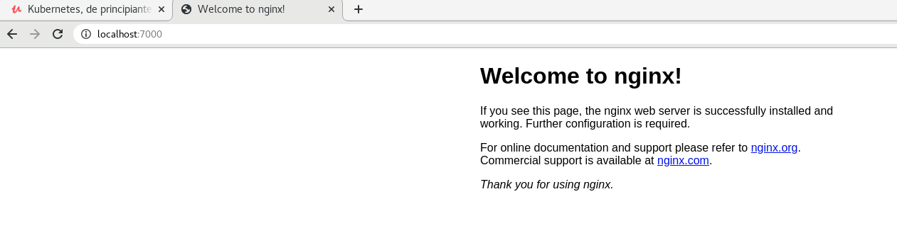

# KUBERNETES  

+ `K8S` Es una herramienta extensible y de código abierto para gestionar cargas de trabajo y servicios en contenedores, que facilita tanto la configuración declarativa como la automatización. Tiene un ecosistema grande y de rápido crecimiento. Los servicios, el soporte y las herramientas están ampliamente disponibles.  

+ Funciones:  
    - Service discovery: mira cuantos nodos hay, los escanea para saber de ellos.  
    - Rollouts/Rollbacks: para desplegar versiones nuevas o volver a la misma.  
    - Optimización de recursos en nodos: mira donde colocar el contenedor al host con menos carga.  
    - Self-healing: crea automaticamente un contenedor cuando uno muere.  
    - Configuración de secretos
    - Escalamiento horizontal


## ARQUITECTURA

  

+ __MASTER/NODE__: Kubernetes se divide en master, es el cerebro, es la parte que se encarga de todo el procesamiento, es donde estan todas las herramientas, es el centro de operaciones. Los nodos son las máquinas, host, máquinas virutal.  
El master es como la aduana y los nodes son  los barcos que se llevan los contenedores de la duana.  

+ __API SERVER__: Aplication Program Interface, significa que yo me puedo comunicar con un servicio a través de la API. Puedo hacerlo con la herramienta kubectl o directamente por fichero de programación. Ambos son en JSON, por lo que acaba procesando todo en código JSON.  

+ __KUBE-SCHEDULE__: es el que se encarga de colocar las cosas donde deben ir. Cuando comunico algo a la API, este le pasa las especificaciones al Schedule y éste busca a ver que nodo va mejor para poner todo, si hay muchos, mirar los 15 primeros aprox y lo pone donde mejor vea. Si no encuentra sitio, se espera hasta que quede uno libre correctamente para poder meter el contenedor.  

+ __KUBE-CONTROLLER__: dentro tiene el _node controler_ (se encarga de ver nodos, si se cae uno, levanta otra máquina), el _replication_(encargado de mantener todas las réplicas especificadas), el _end point controller_(se encarga de la red y pods) y tenemos el _service account y tokens controller_(para la autenticación).  

+ __ETCD__: es la base de datos de kubernetes donde están todas las configuraciones, cambios, estados nuevos, anteriores, etc. Si ponemos algo en una versión nueva y queremos volver atrás, en el _etcd_ está guardado el estado y configuración anterior.  

+ __KUBELET__: se encuentra en cada nodo y tienen dos funciones, en enviar y recibir información al master y por otro lado, habla con el run controller(normalmente docker),que tiene que estar instalado en cada nodo, para decirle las especificaciones que debe desplegar/montar en el POD del nodo.  

+ __KUBE-PROXY__:  se encuentra en cada nodo y se encarga de todo lo relacionado con la red del nodo y que se puedan comunicar entre contenedores/pods.  

+ __CONTAINER-RUNTIME__: el software de contenedores que tiene instalado el nodo: docker,etc.  


## INSTALACIÓN MINIKUBE/KUBECTL  

+ __MINIKUBE__: crea o simula un cluster pequeño que nos permite hacerlo en local.  

+ [Documentación Kubernetes](https://kubernetes.io/docs/tasks/tools/install-minikube/)  

+ Ejecutamos esta orden y sino sale vacío , vamos bien:  
`grep -E --color 'vmx|svm' /proc/cpuinfo`  

+ Instalamos `kubectl`, la intermediario para hablar con kubernetes:  
    - `curl -LO "https://storage.googleapis.com/kubernetes-release/release/$(curl -s https://storage.googleapis.com/kubernetes-release/release/stable.txt)/bin/linux/amd64/kubectl"`  

    - `chmod +x ./kubectl`  

    - `sudo mv ./kubectl /usr/bin/kubectl`  

    - `kubectl version --client`  

+ Para usar minikube se necesita un `Hypervisor`(o monitor de máquina virtual (virtual machine monitor)1​ es una plataforma que permite aplicar diversas técnicas de control de virtualización para utilizar, al mismo tiempo, diferentes sistemas operativos en una misma computadora):  
    - KVM
    - VirtualBox
    - Docker

+ Descargamos `minikube`:  
    - `curl -Lo minikube https://storage.googleapis.com/minikube/releases/latest/minikube-linux-amd64 && chmod +x minikube`  

    - `sudo mv minikube /usr/bin/`  

    - `minikube status`  

    ```
    [isx46410800@miguel curso_kubernetes]$ minikube status
    🤷  There is no local cluster named "minikube"
    👉  To fix this, run: "minikube start"
    [isx46410800@miguel curso_kubernetes]$ minikube start
    😄  minikube v1.13.1 on Fedora 27
    ✨  Automatically selected the docker driver
    👍  Starting control plane node minikube in cluster minikube
    🚜  Pulling base image ...
    💾  Downloading Kubernetes v1.19.2 preload ...
        > preloaded-images-k8s-v6-v1.19.2-docker-overlay2-amd64.tar.lz4: 486.36 MiB
    🔥  Creating docker container (CPUs=2, Memory=2200MB) ...
    🧯  Docker is nearly out of disk space, which may cause deployments to fail! (93% of capacity)
    💡  Suggestion: 
        Try at least one of the following to free up space on the device:
        1. Run "docker system prune" to remove unused docker data
        2. Increase the amount of memory allocated to Docker for Desktop via
        Docker icon > Preferences > Resources > Disk Image Size
        3. Run "minikube ssh -- docker system prune" if using the docker container runtime
    🍿  Related issue: https://github.com/kubernetes/minikube/issues/9024
    🐳  Preparing Kubernetes v1.19.2 on Docker 19.03.8 ...
    🔎  Verifying Kubernetes components...
    🌟  Enabled addons: default-storageclass, storage-provisioner
    🏄  Done! kubectl is now configured to use "minikube" by default
    ```  

+ Comprobamos de nuevo que sí funciona `minikube status`:  

```
[isx46410800@miguel curso_kubernetes]$ minikube status
minikube
type: Control Plane
host: Running
kubelet: Running
apiserver: Running
kubeconfig: Configured
```  

+ __COMANDOS BÁSICOS MINIKUBE__:  

    - `minikube status`
    - `minikube stop/start/delete`

+ Repositorio [curso Kubernetes](https://github.com/ricardoandre97/k8s-resources)  


## PODS VS CONTENEDORES  

  

+ Los __contenedores__ se ejecutan de manera aislada en un namespace:  
    - IPC (Inter Process Communication)
    - Cgroup
    - Network
    - Mount
    - PID
    - User
    - UTS (Unix Timesharing System)


+ Los __PODS__ sirven para compartir namespaces entre contenedores. Con docker permite que varios contenedores se puedan comunicar entre ellos por procesos, redes, files,etc. Kubernetes levanta un servicio y hace que el resto de contenedores compartan ese ID por ejemplo de red y se puedan comunicar y compartir namespaces como:  
    - De red(verse en la misma red)
    - IPC(verse los procesos)
    - UTS

> Cuando hablamos de PODs entonces nos referimos a que solo tiene una unica IP para todo lo que haya dentro comunicado. Solo es una capa que agrupa estos contenedores.


## PODS  

### CREAR POD  

+ Primero tenemos que tener encendido el simulador:  
`minikube start`  

+ [Documentación](https://kubernetes.io/docs/reference/kubectl/conventions/):  
`versión v1.19 la última`  

+ Creamos un pod de prueba `kubectl run nombrePod --image:xxx:tag`:  
```
[isx46410800@miguel curso_kubernetes]$ kubectl run pod-test --image=nginx:alpine
pod/pod-test created
```  

+ Vemos que lo hemos creado y está corriendo:  
```
[isx46410800@miguel curso_kubernetes]$ kubectl get pods
NAME       READY   STATUS    RESTARTS   AGE
pod-test   1/1     Running   0          22s
```  
> Normalmente hay un contenedor por pod, se suele asimilar a eso.  


### LOGS PODS  

+ Un pod es la unidad más pequeña para poder trabajar en Kubernetes. Se le notifica a la API que hable con Schedule y Controller y busquen un nodo donde crear ese pod con ciertas especifiaciones. Lo que corre dentro es el contenedor, el POD no corre.   

+ Creamos uno pod mal aposta para ver el error:  

```
[isx46410800@miguel curso_kubernetes]$ kubectl run pod-test2 --image=nginx:miguelllll
pod/pod-test2 created
[isx46410800@miguel curso_kubernetes]$ kubectl get pods
NAME        READY   STATUS         RESTARTS   AGE
pod-test    1/1     Running        0          5m19s
pod-test2   0/1     ErrImagePull   0          14s
```  

+ Para ver los ´logs´ usamos `kubectl describe pod nombrePod`:  
`kubectl describe pod pod-test`  
> En el apartado `events` nos describe los logs paso a paso.  


### API-RESOURCES  

+ Para ver todos los recursos que hay y los shortnames de comandos se usa:  
`kubectl api-resources`  


### ELIMINAR PODS

+ Para eliminar pods usamos `kubectl delete pod podName ...`:  
`kubectl delete pod pod-test2`  

+ Todos:  
`kubectl delete pod --all`  


### OBTENER YAML POD  

+ Podemos obtener info solo del pod concreto:  
`kubectl get pod pod-test`

+ Para más info para obtener el contenido YAML, lo que comunica al API de kubernetes en los request:  
`kubectl get pod pod-test -o yaml`  

+ Es mejor enviar las cosas por manifiestos en YAML ya que si quieres crear 50 pods, a través de un fichero será mejor que no ir poniendo una orden 50 veces.  


### IP POD  

+ Para poder ver la IP del POD podemos usar cualquiera de estos comandos:  
`kubectl describe pod pod-test`  
`kubectl get pod pod-test -o yaml`  

> En este caso es 172.18.0.3  

  

+ Para verlo ingresamos directamente al navegador la ip.  

+ Si no funciona tenemos que mapear el puerto:  
`kubectl port-forward pod-test 7000:80`  

  

+ Comprobamos la respuesta:  
`curl 172.18.0.3:80`  


### ENTRAR AL POD  

+ Para ingresar a la consola del POD:  
`kubectl exec -it pod-test -- sh`  
> Cuando solo hay un contenedor, no se especifica el nombre del pod.  

+ Cuando hay más contenedores `c, --container=''`:  
`kubectl exec -it pod-test -c containerName -- sh`  


### CREAR POD YAML  

+ Ejemplo:  
```
apiVersion: v1
kind: Pod
metadata:
  name: pod-test2
spec:
  containers:
    - name: container1
      image: nginx:alpine
```  

+ Las api versions las podemos ver en:  
`kubectl api-versions`  

+ Los kind los podemos ver en:  
`kubectl api-resources`  

+ Para crearlo a través del fichero YAML:  
`kubectl apply -f pod.yaml`  

```
[isx46410800@miguel pods]$ kubectl apply -f pod.yaml
pod/pod-test2 created
[isx46410800@miguel pods]$ kubectl get pods
NAME        READY   STATUS    RESTARTS   AGE
pod-test    1/1     Running   0          6h54m
pod-test2   1/1     Running   0          7s
```  

+ Para borrarlo:  
`kubectl delete -f pod.yaml`  

+ Para crear dos o más PODS, se pone `---` de separación:  
```
apiVersion: v1
kind: Pod
metadata:
  name: pod-test2
spec:
  containers:
    - name: container1
      image: nginx:alpine
---
apiVersion: v1
kind: Pod
metadata:
  name: pod-test3
spec:
  containers:
    - name: container2
      image: nginx:alpine
```  

### 2+ CONTAINER POR POD  

+ Para crear dos o  más containers en un POD se añade en la subsección containers:  
```
apiVersion: v1
kind: Pod
metadata:
  name: pod-test2
spec:
  containers:
    - name: container1
      image: python:3.6-alpine
      command: ['sh', '-c', 'echo "cont1" > index.html && python -m http.server 8082']
    - name: container2
      image: python:3.6-alpine
      command: ['sh', '-c', 'echo "cont2" > index.html && python -m http.server 8082']
```  

> Nos dará error porque estamos levantando dos container en el mismo puerto. El problema es que en un POD todos los containers comparten la misma red , por lo que si se levanta uno en el puerto 8082, el otro tiene que ser diferente.  

+ Vemos los `logs` en `kubectl logs podName -c container`:  
```
263dab[isx46410800@miguel pods]$ kubectl logs pod-test2 -c container2
Traceback (most recent call last):
...
  File "/usr/local/lib/python3.6/socketserver.py", line 470, in server_bind
    self.socket.bind(self.server_address)
OSError: [Errno 98] Address in use
```  

+ Arreglamos el fallo del puerto y comprobamos cada container del POD:  
```
[isx46410800@miguel pods]$ kubectl exec -it pod-test2 -c container1 -- sh
/ # cat index.html 
cont1
/ # exit
[isx46410800@miguel pods]$ kubectl exec -it pod-test2 -c container2 -- sh
/ # cat index.html 
cont2
```  

### LABELS  

+ Los labels son etiquetas que se ponen debajo de los `metadata`:  
```
apiVersion: v1
kind: Pod
metadata:
  name: pod-test2
  labels:
    app: front-end
    env: dev
spec:
  containers:
    - name: container1
      image: nginx:alpine
---   
apiVersion: v1
kind: Pod
metadata:
  name: pod-test3
  labels:
    app: back-end
    env: dev
spec:
  containers:
    - name: container1
      image: nginx:alpine
```  

+ Los labels nos sirve para poder filtrar PODs con `kubectl get pods -l nombre=valor`:
```
[isx46410800@miguel pods]$ kubectl get pods -l app=back-end
NAME        READY   STATUS    RESTARTS   AGE
pod-test3   1/1     Running   0          62s
[isx46410800@miguel pods]$ kubectl get pods -l env=dev
NAME        READY   STATUS    RESTARTS   AGE
pod-test2   1/1     Running   0          78s
pod-test3   1/1     Running   0          78s
```  
> Los LABELS más usado es el de APP. Muy importantes para administrar replicas.  


### PROBLEMAS PODs  

+ Los PODS no se regeneran solos si lo eliminamos manualmente, aunque se diga que haya dos replicas siempre. Tiene que ser un objeto mayor quien lo haga.   

+ Los PODs por si solo en un archivo YAML no puede indicarse que haya 50 replicas por ejemplo. Tiene que ser un objeto mayor quien lo haga.   

+ Los PODs no se pueden actualizar directamente, tiene que hacerlo alguien externo. Como mucho solo se puede modificar la seccion `image` y al hacer el apply puede ser que te deje actualizar.  


## REPLICASETS  

+ Es un objeto separado del POD a un nivel más alto(el replicaset crea PODs y es su dueño).  

+ Si se le indica que haya dos, si se muere uno y solo queda un POD, levanta uno nuevo. Para ello es muy importante los LABELS para ver que PODs tiene que manejar.  

+ En la metadata del POD mete el `OWNER REFERENCE` para indicar quien el propietario de los PODs y los suyos no los maneje otro ReplicaSet.  


### CREAR REPLICASET  

+ Vemos a donde pertenece la api-version y el kind de los replicasets en:  
`kubectl api-resources`  

+ Ejemplo:  
```
apiVersion: apps/v1
kind: ReplicaSet
metadata:
  name: rs-test
  labels:
    app: rs-test
spec:
  # modify replicas according to your case
  replicas: 5
  selector:
    matchLabels:
      app: pod-label
  # pertenece a los PODs que vas a crear
  template:
    metadata:
      labels:
        app: pod-label
    spec:
      containers:
        - name: container1
          image: python:3.6-alpine
          command: ['sh', '-c', 'echo "cont1" > index.html && python -m http.server 8082']
        - name: container2
          image: python:3.6-alpine
          command: ['sh', '-c', 'echo "cont2" > index.html && python -m http.server 8083']
```  

+ Lo creamos:  
`kubectl apply -f replica-set.yaml`  
> Lo que creamos son 5 PODs con label(pod-label, sino está lo crea) y dentro de cada POD creamos dos containers con label(pod-label)  

+ Comprobamos:  
```
[isx46410800@miguel replicaset]$ kubectl get pods
NAME            READY   STATUS    RESTARTS   AGE
rs-test-5tsfh   2/2     Running   0          105s
rs-test-9jpjg   2/2     Running   0          105s
rs-test-fbwjb   2/2     Running   0          105s
rs-test-hz2kx   2/2     Running   0          105s
rs-test-s6cxx   2/2     Running   0          105s
[isx46410800@miguel replicaset]$ kubectl get pods -l app=pod-label
NAME            READY   STATUS    RESTARTS   AGE
rs-test-5tsfh   2/2     Running   0          119s
rs-test-9jpjg   2/2     Running   0          119s
rs-test-fbwjb   2/2     Running   0          119s
rs-test-hz2kx   2/2     Running   0          119s
rs-test-s6cxx   2/2     Running   0          119s
```  

+ Ver los `replicasets` con `kubectl get rs`:  
```
[isx46410800@miguel replicaset]$ kubectl get rs
NAME      DESIRED   CURRENT   READY   AGE
rs-test   5         5         5       3m53s
[isx46410800@miguel replicaset]$ kubectl get replicaset
NAME      DESIRED   CURRENT   READY   AGE
rs-test   5         5         5       3m56s
```  


### ELIMINAR/MODIFICAR    

+ En un replicaset creado, si borramos un pod, vemos como actualiza directamente para mantener los 5 pods indicados:  
```
[isx46410800@miguel replicaset]$ kubectl delete pod rs-test-s6cxx
pod "rs-test-s6cxx" deleted
[isx46410800@miguel replicaset]$ kubectl get pods
NAME            READY   STATUS    RESTARTS   AGE
rs-test-5tsfh   2/2     Running   0          5m43s
rs-test-9jpjg   2/2     Running   0          5m43s
rs-test-b9lf4   2/2     Running   0          43s
rs-test-fbwjb   2/2     Running   0          5m43s
rs-test-hz2kx   2/2     Running   0          5m43s
```  

+ Si modifico el replicaset a 2 copias, veremos como se eliminan 3, se quedan dos:  
```
[isx46410800@miguel replicaset]$ vim replica-set.yaml 
[isx46410800@miguel replicaset]$ kubectl apply -f replica-set.yaml 
replicaset.apps/rs-test configured
[isx46410800@miguel replicaset]$ kubectl get pods
NAME            READY   STATUS        RESTARTS   AGE
rs-test-5tsfh   2/2     Running       0          8m29s
rs-test-9jpjg   2/2     Terminating   0          8m29s
rs-test-b9lf4   2/2     Terminating   0          3m29s
rs-test-fbwjb   2/2     Running       0          8m29s
rs-test-hz2kx   2/2     Terminating   0          8m29s
[isx46410800@miguel replicaset]$ kubectl get pods
NAME            READY   STATUS    RESTARTS   AGE
rs-test-5tsfh   2/2     Running   0          9m26s
rs-test-fbwjb   2/2     Running   0          9m26s
```  


### LOGS  

+ Por describe:  
`kubectl get rs rs-test -o yaml`  

+ Por manifiesto YAML:  
`kubectl describe rs rs-test`  


### OWNER REFERNCE  

+ Lo vemos en la metadata de un pod creado por ReplicaSet `kubectl get pod podName -o yaml`:  
```
kubectl get pod rs-test-5tsfh -o yaml
name: rs-test-5tsfh
  namespace: default
  ownerReferences:
  - apiVersion: apps/v1
    blockOwnerDeletion: true
    controller: true
    kind: ReplicaSet
    name: rs-test
    uid: 646a4a62-6acc-41a7-b3d1-7fe095c441d0
```  

+ Comprobamos que el `UID` anterior coincide con el replicaset creado `kubectl get rs rsName -o yaml`:  
```
kubectl get rs rs-test -o yaml
name: rs-test
  namespace: default
  resourceVersion: "22732"
  selfLink: /apis/apps/v1/namespaces/default/replicasets/rs-test
  uid: 646a4a62-6acc-41a7-b3d1-7fe095c441d0
```  


### ADOPCIÓN DE PODS PLANOS  

+ Vamos a crear primero dos PODs manualmente:  
```
[isx46410800@miguel replicaset]$ kubectl run pod-test --image=nginx:alpine
pod/pod-test created
[isx46410800@miguel replicaset]$ kubectl run pod-test2 --image=nginx:alpine
pod/pod-test2 created
```  

+ Les creamos un LABEL a cada uno con `kubectl label pods podName label=valor`:  
```
[isx46410800@miguel replicaset]$ kubectl label pods pod-test app=pod-label
pod/pod-test labeled
[isx46410800@miguel replicaset]$ kubectl label pods pod-test2 app=pod-label
pod/pod-test2 labeled
```  
> Tendran el nuevo label pero no tendrán ningun OWNER REFERENCE porque no han sido creados por ningun REPLICASET.  

+ Ahora mediante replicaset cremos 3 replicas con mismo label:  
```
[isx46410800@miguel replicaset]$ kubectl apply -f replica-set.yaml
replicaset.apps/rs-test created
[isx46410800@miguel replicaset]$ kubectl get pods
NAME            READY   STATUS    RESTARTS   AGE
pod-test        1/1     Running   0          3m49s
pod-test2       1/1     Running   0          3m45s
rs-test-8mk72   2/2     Running   0          10s
```  
> Tenemos un GRAN PROBLEMA ya que adopta dos pods huerfanos sin owner y los coge pero los adopta y ellos solo tienen un container y no dos con la estructura del replicaset. Si borramos un pod de uno, el replicaset regenera uno nuevo con la estructura buena.  


### PROBLEMAS  

+ Si modificamos cosas del container como la imagen, nombre container, etc. Si hacemos un apply no se actualiza nada, ya que como sigue con los mismos LABELS, el replicaset solo se guia por pods y labels y no de actualizar nada de lo que contiene.  

+ NO se auto-actualizan solos.  

+ Si modificamos por ejemplo la imagen de un container de un pod de python de 3.6 a 3.7, se actualiza el ReplicSet pero no los PODs. Si se borra un POD, entonces el nuevo POD si que tiene las nuevas actualizaciones.  


## DEPLOYMENTS  

+ Es un objeto de nivel mayor que los replicaset. Es el dueño del replicaset que a su vez es de sus PODs.  

