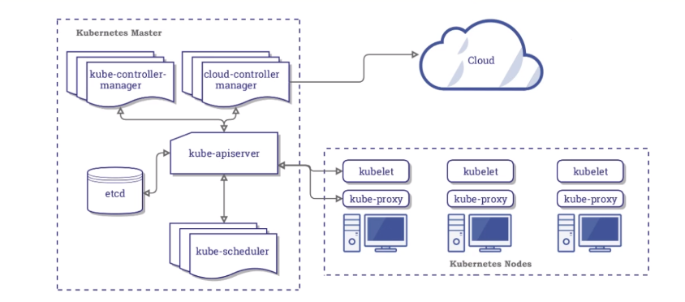
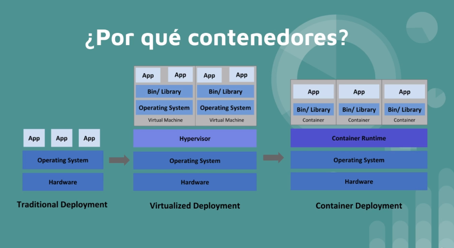

# KUBERNETES  

+ `K8S` Es una herramienta extensible y de código abierto para gestionar cargas de trabajo y servicios en contenedores, que facilita tanto la configuración declarativa como la automatización. Tiene un ecosistema grande y de rápido crecimiento. Los servicios, el soporte y las herramientas están ampliamente disponibles.  

+ Funciones:  
    - Service discovery: mira cuantos nodos hay, los escanea para saber de ellos.  
    - Rollouts/Rollbacks: para desplegar versiones nuevas o volver a la misma.  
    - Optimización de recursos en nodos: mira donde colocar el contenedor al host con menos carga.  
    - Self-healing: crea automaticamente un contenedor cuando uno muere.  
    - Configuración de secretos
    - Escalamiento horizontal


## ARQUITECTURA

  

+ __MASTER/NODE__: Kubernetes se divide en master, es el cerebro, es la parte que se encarga de todo el procesamiento, es donde estan todas las herramientas, es el centro de operaciones. Los nodos son las máquinas, host, máquinas virutal.  
El master es como la aduana y los nodes son  los barcos que se llevan los contenedores de la duana.  

+ __API SERVER__: Aplication Program Interface, significa que yo me puedo comunicar con un servicio a través de la API. Puedo hacerlo con la herramienta kubectl o directamente por fichero de programación. Ambos son en JSON, por lo que acaba procesando todo en código JSON.  

+ __KUBE-SCHEDULE__: es el que se encarga de colocar las cosas donde deben ir. Cuando comunico algo a la API, este le pasa las especificaciones al Schedule y éste busca a ver que nodo va mejor para poner todo, si hay muchos, mirar los 15 primeros aprox y lo pone donde mejor vea. Si no encuentra sitio, se espera hasta que quede uno libre correctamente para poder meter el contenedor.  

+ __KUBE-CONTROLLER__: dentro tiene el _node controler_ (se encarga de ver nodos, si se cae uno, levanta otra máquina), el _replication_(encargado de mantener todas las réplicas especificadas), el _end point controller_(se encarga de la red y pods) y tenemos el _service account y tokens controller_(para la autenticación).  

+ __ETCD__: es la base de datos de kubernetes donde están todas las configuraciones, cambios, estados nuevos, anteriores, etc. Si ponemos algo en una versión nueva y queremos volver atrás, en el _etcd_ está guardado el estado y configuración anterior.  

+ __KUBELET__: se encuentra en cada nodo y tienen dos funciones, en enviar y recibir información al master y por otro lado, habla con el run controller(normalmente docker),que tiene que estar instalado en cada nodo, para decirle las especificaciones que debe desplegar/montar en el POD del nodo.  

+ __KUBE-PROXY__:  se encuentra en cada nodo y se encarga de todo lo relacionado con la red del nodo y que se puedan comunicar entre contenedores/pods.  

+ __CONTAINER-RUNTIME__: el software de contenedores que tiene instalado el nodo: docker,etc.  


## INSTALACIÓN MINIKUBE/KUBECTL  

+ __MINIKUBE__: crea o simula un cluster pequeño que nos permite hacerlo en local.  

+ [Documentación Kubernetes](https://kubernetes.io/docs/tasks/tools/install-minikube/)  

+ Ejecutamos esta orden y sino sale vacío , vamos bien:  
`grep -E --color 'vmx|svm' /proc/cpuinfo`  

+ Instalamos `kubectl`, la intermediario para hablar con kubernetes:  
    - `curl -LO "https://storage.googleapis.com/kubernetes-release/release/$(curl -s https://storage.googleapis.com/kubernetes-release/release/stable.txt)/bin/linux/amd64/kubectl"`  

    - `chmod +x ./kubectl`  

    - `sudo mv ./kubectl /usr/bin/kubectl`  

    - `kubectl version --client`  

+ Para usar minikube se necesita un `Hypervisor`(o monitor de máquina virtual (virtual machine monitor)1​ es una plataforma que permite aplicar diversas técnicas de control de virtualización para utilizar, al mismo tiempo, diferentes sistemas operativos en una misma computadora):  
    - KVM
    - VirtualBox
    - Docker

+ Descargamos `minikube`:  
    - `curl -Lo minikube https://storage.googleapis.com/minikube/releases/latest/minikube-linux-amd64 && chmod +x minikube`  

    - `sudo mv minikube /usr/bin/`  

    - `minikube status`  

    ```
    [isx46410800@miguel curso_kubernetes]$ minikube status
    🤷  There is no local cluster named "minikube"
    👉  To fix this, run: "minikube start"
    [isx46410800@miguel curso_kubernetes]$ minikube start
    😄  minikube v1.13.1 on Fedora 27
    ✨  Automatically selected the docker driver
    👍  Starting control plane node minikube in cluster minikube
    🚜  Pulling base image ...
    💾  Downloading Kubernetes v1.19.2 preload ...
        > preloaded-images-k8s-v6-v1.19.2-docker-overlay2-amd64.tar.lz4: 486.36 MiB
    🔥  Creating docker container (CPUs=2, Memory=2200MB) ...
    🧯  Docker is nearly out of disk space, which may cause deployments to fail! (93% of capacity)
    💡  Suggestion: 
        Try at least one of the following to free up space on the device:
        1. Run "docker system prune" to remove unused docker data
        2. Increase the amount of memory allocated to Docker for Desktop via
        Docker icon > Preferences > Resources > Disk Image Size
        3. Run "minikube ssh -- docker system prune" if using the docker container runtime
    🍿  Related issue: https://github.com/kubernetes/minikube/issues/9024
    🐳  Preparing Kubernetes v1.19.2 on Docker 19.03.8 ...
    🔎  Verifying Kubernetes components...
    🌟  Enabled addons: default-storageclass, storage-provisioner
    🏄  Done! kubectl is now configured to use "minikube" by default
    ```  

+ Comprobamos de nuevo que sí funciona `minikube status`:  

```
[isx46410800@miguel curso_kubernetes]$ minikube status
minikube
type: Control Plane
host: Running
kubelet: Running
apiserver: Running
kubeconfig: Configured
```  

+ __COMANDOS BÁSICOS MINIKUBE__:  

    - `minikube status`
    - `minikube stop/start/delete`

+ Repositorio [curso Kubernetes](https://github.com/ricardoandre97/k8s-resources)  


## PODS VS CONTENEDORES  

  

+ Los __contenedores__ se ejecutan de manera aislada en un namespace:  
    - IPC (Inter Process Communication)
    - Cgroup
    - Network
    - Mount
    - PID
    - User
    - UTS (Unix Timesharing System)


+ Los __PODS__ sirven para compartir namespaces entre contenedores. Con docker permite que varios contenedores se puedan comunicar entre ellos por procesos, redes, files,etc. Kubernetes levanta un servicio y hace que el resto de contenedores compartan ese ID por ejemplo de red y se puedan comunicar y compartir namespaces como:  
    - De red(verse en la misma red)
    - IPC(verse los procesos)
    - UTS

> Cuando hablamos de PODs entonces nos referimos a que solo tiene una unica IP para todo lo que haya dentro comunicado. Solo es una capa que agrupa estos contenedores.


