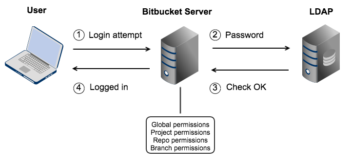

# LDAP  

  

+ Administra un servicio de directorios.  

+ Autenticación: demuestra quien soy (auth)
+ Autorizar: que derechos tiene (autz)
+ Information Provider: la info de la cuenta de usuario
+ Authenticaction Provider: quien da el password

+ Es una base de datos no relacional:  
    - Jerarquica
    - Distribuida
    - Optimizada por las lecturas
    - Forma de arbol
    - Trabaja con identidades

+ Ejemplo EDT: Escola utiliza LDAP/Kerberos y unix solo utiliza /etc/passwd.

+ Una caja es una entidad y las caracteristicas de la caja son atributos.  

+ Formato ldif para los datos de LDAP

+ Paquetes de instalación: `openldap-clients openldap-servers`
+ `slapd` ordenes de bajo nivel para el servidor

+ `/var/lib/ldap` directorio donde se guarda las bbdd
> ldap.ldap

+ `/etc/openldap/slapd.d` directorio de condiguración
> formato ldap

`rootdn "cn=Manager,dc=edt,dc=org"` es el root total de una bbdd.  

+ Puertos LDAP 389

+ Encender servicio `/sbin/slapd -d`

## CREACION  

+ Ejemplo [ldap normal](https://github.com/isx46410800/ldapserver19/tree/master/ldapserver19:group)  

+ Dockerfile:  
```
# ldapserver
FROM fedora:27
LABEL version="1.0"
LABEL author="Miguel Amorós"
LABEL subject="ldapserver"
RUN dnf install -y openldap-servers openldap-clients
RUN mkdir /opt/docker
COPY * /opt/docker/
RUN chmod +x /opt/docker/startup.sh
WORKDIR /opt/docker
CMD /opt/docker/startup.sh
```  

+ Install.sh:  
```
#! /bin/bash
# Install ldap server
rm -rf /etc/openldap/slapd.d/*
rm -rf /var/lib/ldap/*
cp /opt/docker/DB_CONFIG /var/lib/ldap/. 
slaptest -f /opt/docker/slapd.conf -F /etc/openldap/slapd.d/
slapadd -F /etc/openldap/slapd.d/ -l /opt/docker/edt.org.ldif
chown -R ldap.ldap /etc/openldap/slapd.d
chown -R ldap.ldap /var/lib/ldap
cp /opt/docker/ldap.conf /etc/openldap/.
```

+ Startup.sh:  
```
#! /bin/bash
bash /opt/docker/install.sh
ulimit -n 1024
/sbin/slapd 
a=1
while [ $a -eq 1 ]
do
  a=1	
done
```  


## FICHEROS LDAP  

+ Fichero slapd.conf. A partir de este file generamos el directorio de configuración:  
```
#
# See slapd.conf(5) for details on configuration options.
# This file should NOT be world readable.
#
include		/etc/openldap/schema/corba.schema
include		/etc/openldap/schema/core.schema
include		/etc/openldap/schema/cosine.schema
include		/etc/openldap/schema/duaconf.schema
include		/etc/openldap/schema/dyngroup.schema
include		/etc/openldap/schema/inetorgperson.schema
include		/etc/openldap/schema/java.schema
include		/etc/openldap/schema/misc.schema
include		/etc/openldap/schema/nis.schema
include		/etc/openldap/schema/openldap.schema
include		/etc/openldap/schema/ppolicy.schema
include		/etc/openldap/schema/collective.schema
# Allow LDAPv2 client connections.  This is NOT the default.
allow bind_v2
pidfile		/var/run/openldap/slapd.pid
#argsfile	/var/run/openldap/slapd.args
# ----------------------------------------------------------------------
database mdb
suffix "dc=edt,dc=org"
rootdn "cn=Manager,dc=edt,dc=org"
rootpw secret
directory /var/lib/ldap
index objectClass                       eq,pres
access to *	by self write by * read
# ----------------------------------------------------------------------
# ----------------------------------------------------------------------
database config
rootdn "cn=Sysadmin,cn=config"
rootpw {SSHA}5DfZc1WXeIwrP7C3fr23WLZiPZ5YHMgA
# el passwd es syskey
# ----------------------------------------------------------------------
# enable monitoring
database monitor
```  

+ `ldap.conf` configuración para conectar a ldap:  
```
#
# LDAP Defaults
#
# See ldap.conf(5) for details
# This file should be world readable but not world writable.
#BASE	dc=example,dc=com
#URI	ldap://ldap.example.com ldap://ldap-master.example.com:666
#SIZELIMIT	12
#TIMELIMIT	15
#DEREF		never
TLS_CACERTDIR	/etc/openldap/certs
# Turning this off breaks GSSAPI used with krb5 when rdns = false
SASL_NOCANON	on
URI ldap://ldapserver
BASE dc=edt,dc=org
```

+ Fichero `edt.org.ldif` fichero donde esta el arbol de root, subgrupos,usuarios, grupos:  
```
dn: dc=edt,dc=org
dc: edt
description: Escola del treball de Barcelona
objectClass: dcObject
objectClass: organization
o: edt.org
#
dn: ou=maquines,dc=edt,dc=org
ou: maquines
description: Container per a maquines linux
objectclass: organizationalunit
#
dn: ou=clients,dc=edt,dc=org
ou: clients
description: Container per a clients linux
objectclass: organizationalunit
#
dn: ou=usuaris,dc=edt,dc=org
ou: usuaris
description: Container per usuaris del sistema linux
objectclass: organizationalunit
#
dn: ou=grups,dc=edt,dc=org
ou: grups
description: Container per grups del sistema linux
objectclass: organizationalunit
#
dn: cn=1asix,ou=grups,dc=edt,dc=org
cn: 1asix
gidNumber: 610
description: Grup de 1asix
memberUid: user01
memberUid: user02
memberUid: user03
memberUid: user04
memberUid: user15
objectclass: posixGroup
#
dn: cn=2asix,ou=grups,dc=edt,dc=org
cn: 2asix
gidNumber: 611
description: Grup de 2asix
memberUid: user06
memberUid: user07
memberUid: user08
memberUid: user09
memberUid: user10
objectclass: posixGroup
#
dn: cn=profesasix,ou=grups,dc=edt,dc=org
cn: profesasix
gidNumber: 612
description: Profes de asix
memberUid: pere
memberUid: anna
memberUid: jordi
memberUid: marta
memberUid: pau
objectclass: posixGroup
#
dn: cn=Pau Pou,ou=usuaris,dc=edt,dc=org
objectclass: posixAccount
objectclass: inetOrgPerson
cn: Pau Pou
cn: Pauet Pou
sn: Pou
homephone: 555-222-2220
mail: pau@edt.org
description: Watch out for this guy
ou: Profes
uid: pau
uidNumber: 5000
gidNumber: 612
homeDirectory: /tmp/home/pau
userPassword: {SSHA}NDkipesNQqTFDgGJfyraLz/csZAIlk2/
#
dn: cn=Pere Pou,ou=usuaris,dc=edt,dc=org
objectclass: posixAccount
objectclass: inetOrgPerson
cn: Pere Pou
sn: Pou
homephone: 555-222-2221
mail: pere@edt.org
description: Watch out for this guy
ou: Profes
uid: pere
uidNumber: 5001
gidNumber: 612
homeDirectory: /tmp/home/pere
userPassword: {SSHA}ghmtRL11YtXoUhIP7z6f7nb8RCNadFe+
```

+ `DB_CONFIG` configuracion de bbdd:  
```
# $OpenLDAP$
# Example DB_CONFIG file for use with slapd(8) BDB/HDB databases.
#
# See the Oracle Berkeley DB documentation
#   <http://www.oracle.com/technology/documentation/berkeley-db/db/ref/env/db_config.html>
# for detail description of DB_CONFIG syntax and semantics.
#
# Hints can also be found in the OpenLDAP Software FAQ
#	<http://www.openldap.org/faq/index.cgi?file=2>
# in particular:
#   <http://www.openldap.org/faq/index.cgi?file=1075>
# Note: most DB_CONFIG settings will take effect only upon rebuilding
# the DB environment.
# one 0.25 GB cache
set_cachesize 0 268435456 1
# Data Directory
#set_data_dir db
# Transaction Log settings
set_lg_regionmax 262144
set_lg_bsize 2097152
#set_lg_dir logs
# Note: special DB_CONFIG flags are no longer needed for "quick"
# slapadd(8) or slapindex(8) access (see their -q option). 
```  

## SCHEMA  

+ Ejemplo de `nombre.schema`:  
```
attributetype ( 1.1.2.1.1 NAME 'x-equip' 
  DESC 'equip del futbolista'
  EQUALITY caseIgnoreMatch
  SUBSTR caseIgnoreSubstringsMatch
  SYNTAX 1.3.6.1.4.1.1466.115.121.1.15
  SINGLE-VALUE )
attributetype ( 1.1.2.1.2 NAME 'x-dorsal' 
  DESC 'dorsal del futbolista'
  SYNTAX 1.3.6.1.4.1.1466.115.121.1.27
  SINGLE-VALUE )
attributetype ( 1.1.2.1.3 NAME 'x-web' 
  DESC 'pagina web del futbolista'
  EQUALITY caseExactMatch
  SYNTAX 1.3.6.1.4.1.1466.115.121.1.15 )
attributetype ( 1.1.2.1.4 NAME 'x-foto'  
  DESC 'foto del futbolista'
  SYNTAX 1.3.6.1.4.1.1466.115.121.1.40 )
attributetype ( 1.1.2.1.5 NAME 'x-lesionat'
  DESC 'foto del futbolista'
  SYNTAX 1.3.6.1.4.1.1466.115.121.1.7
  SINGLE-VALUE )
objectclass ( 1.1.2.2.1 NAME 'x-futbolistes' 
  DESC 'futboleros'
  SUP inetOrgPerson
  STRUCTURAL
  MUST x-equip
  MAY ( x-dorsal $ x-web $ x-foto $ x-lesionat ) )
```

+ Creacion de un usuario con este schema:  
```
dn: cn=kaka,ou=Productes,dc=edt,dc=org
objectclass: x-futbolistes
cn: kaka
sn: kaka
x-equip: los pimientos
x-dorsal: 7
x-web: www.kaka.com
x-foto: //var/tmp/foto.jpg
x-lesionat: FALSE
```

+ Añadimos en el fichero `slapd.conf` el schema:  
`include		/opt/docker/futbolista-C.schema`  


## ACL  

+ En el slapd.conf está el user y pass del ACL.  

+ Ejemplos de ACL, son directrices y permisos que tienen ciertos grupos, usuarios etc:  
```
Implementar a la base de dades edt.org les següents ACLS:
1. L’usuari “Anna Pou” és ajudant de l’administrador i té permisos per modificar-ho tot.
---
dn: olcDatabase={1}mdb,cn=config
changetype: modify
replace: olcAccess
olcAccess: to * by dn.exact=”cn=Anna Pou,ou=usuaris,dc=edt,dc=org” write by * read [by * none]
[acces to * by * none]
---
**[implicitas aunque no salgan]
[isx46410800@miguel-fedora27 ldapserver19:acl]$ ldapmodify -vx -c -h 172.17.0.2 -D 'cn=Jordi Mas,ou=usuaris,dc=edt,dc=org' -w jordi -f mod01.ldif 
ldap_initialize( ldap://172.17.0.2 )
replace mail:
	newmarta10@edt.org
modifying entry "cn=Marta Mas,ou=usuaris,dc=edt,dc=org"
ldap_modify: Insufficient access (50)

replace mail:
	newmjordi10@edt.org
modifying entry "cn=Jordi Mas,ou=usuaris,dc=edt,dc=org"
modify complete
#
#
2. L’usuari “Anna Pou” és ajudant d’administració. Tothom es pot modificar el seu propi
email i homePhone. Tothom pot veure totes les dades de tothom.
---
dn: olcDatabase={1}mdb,cn=config
changetype: modify
replace: olcAccess
olcAccess: to attrs=mail 
 by dn.exact="cn=Anna Pou,ou=usuaris,dc=edt,dc=org" write
 by self write
 by * read
 [by * none]
olcAccess: to attrs=homePhone 
 by dn.exact="cn=Anna Pou,ou=usuaris,dc=edt,dc=org" write
 by self write
 by * read
 [by * none]
olcAccess: to * by dn.exact=”cn=Anna Pou,ou=usuaris,dc=edt,dc=org” write by * read [by * none]
[acces to * by * none]
---
#
#
3. Tot usuari es pot modificar el seu mail. Tothom pot veure totes les dades de tothom.
---
dn: olcDatabase={1}mdb,cn=config
changetype: modify
replace: olcAccess
olcAccess: to attrs=mail by self write by * read [by * none]
olcAccess: to * by * read [by * none]
[acces to * by * none]
---
#
#
4. Tothom pot veure totes les dades de tothom, excepte els mail dels altres.
---
dn: olcDatabase={1}mdb,cn=config
changetype: modify
replace: olcAccess
olcAccess: to attrs=mail by self read [by * none]
olcAccess: to * by * read
[acces to * by * none]
---
[root@ldapserver docker]# ldapsearch -x -LLL -D 'cn=Anna Pou,ou=usuaris,dc=edt,dc=org' -w anna dn mail
#
#
5. Tot usuari es pot modificar el seu propi password i tothom pot veure totes les dades de tothom.
---
dn: olcDatabase={1}mdb,cn=config
changetype: modify
replace: olcAccess
olcAccess: to attrs=userPassword by self write by * read
olcAccess: to * by * read
---
[root@ldapserver docker]# ldappasswd -x -D 'cn=Anna Pou,ou=usuaris,dc=edt,dc=org' -w anna -s anna2
[root@ldapserver docker]# ldapsearch -x -LLL -D 'cn=Jordi Mas,ou=usuaris,dc=edt,dc=org' -w jordi dn userPassword
--
[root@ldapserver docker]# ldappasswd -x -D 'cn=Anna Pou,ou=usuaris,dc=edt,dc=org' -w anna 'cn=Jordi Mas,ou=usuaris,dc=edt,dc=org' -s jordi2
Result: Insufficient access (50)
--puedo ver todos los userpassword como ldapsearch -x -LLL
** by auth no es necesario porqie todo el mundo podemos ver el password y no requiere de identificacion
#
6. Tot usuari es pot modificar el seu propi password i tothom pot veure totes les dades de tothom, excepte els altres passwords.
---
dn: olcDatabase={1}mdb,cn=config
changetype: modify
replace: olcAccess
olcAccess: to attrs=userPassword by self write by * auth
olcAccess: to * by * read
---
**para que nadie lo vea, puedas cambiarlo, tienes que tener primero permiso de auth para autenticarte primero, sino serias un anonimo de fuera
----->puedo cambiar pass mio pero no otro
[root@ldapserver docker]# ldappasswd -x -D 'cn=Anna Pou,ou=usuaris,dc=edt,dc=org' -w anna 'cn=Jordi Mas,ou=usuaris,dc=edt,dc=org' -s jordi2
Result: Insufficient access (50)
[root@ldapserver docker]# ldappasswd -x -D 'cn=Anna Pou,ou=usuaris,dc=edt,dc=org' -w anna -s ann2  
--->no puedo ver los userpassword con ldapsearch -x -LLL ni con [root@ldapserver docker]# ldapsearch -x -LLL -D 'cn=Jordi Mas,ou=usuaris,dc=edt,dc=org' -w jordi dn userPassword
--> solo vere el de jordi por ser authorizado
**sino ponemos el by auth, no podremos autenticarnos ya que al hacer la orden somos un user anonymous y hemos de hacer BIND con el -D para identificarnos y solo se consigue poniendo by auth
-->**
[root@ldapserver docker]# ldapsearch -x -LLL -D 'cn=Jordi Mas,ou=usuaris,dc=edt,dc=org' -w jordi dn userPassword
ldap_bind: Invalid credentials (49)--> no deja sin el by auth
#
#
7. Tot usuari es pot modificar el seu propi password i tot usuari només pot veure les seves pròpies dades.
---
dn: olcDatabase={1}mdb,cn=config
changetype: modify
replace: olcAccess
olcAccess: to attrs=userPassword by self write by * auth [by * none]
olcAccess: to * by self read by * search [by * none]
** permet la capacitat de llegir i navegar per tot el arbre
** si ponemos solo by self read, no podremos ver por toodo el contenido para poder ver sus datos y no es capaz de autenticarte.
---
[root@ldapserver docker]# ldappasswd -x -D 'cn=Anna Pou,ou=usuaris,dc=edt,dc=org' -w anna -s anna2
[root@ldapserver docker]# ldappasswd -x -D 'cn=Anna Pou,ou=usuaris,dc=edt,dc=org' -w anna 'cn=Jordi Mas,ou=usuaris,dc=edt,dc=org' -s jordi2
Result: Insufficient access (50)
--> podemos cambiar nuestro pass pero no el de otro
-->con el by * search tendremos acceso a los campos propios
[root@ldapserver docker]# ldapsearch -x -LLL -D 'cn=Jordi Mas,ou=usuaris,dc=edt,dc=org' -w jordi          
dn: cn=Jordi Mas,ou=usuaris,dc=edt,dc=org
objectClass: posixAccount
**nos permite de todos los usuarios, ver solo el nuestro. en este caso jordi solo ve el suyo
**como anonimo no sale nada porque no tiene datos dentro de la bbdd
#
8. Tot usuari pot observar les seves pròpies dades i modificar el seu propi password,email i homephone. 
L’usuari “Anna Pou” pot modificar tots els atributs de tots excepte els passwords, que tampoc pot veure. 
L’usuari “Pere Pou” pot modificar els passwords de tothom.
---
dn: olcDatabase={1}mdb,cn=config
changetype: modify
replace: olcAccess
olcAccess: to attrs=userPassword 
 by dn.exact="cn=Pere Pou,ou=usuaris,dc=edt,dc=org" write
 by self write 
 by * auth
 [by * none]
olcAccess: to attrs=mail 
 by dn.exact="cn=Anna Pou,ou=usuaris,dc=edt,dc=org" write
 by self write
 [by * none]
olcAccess: to attrs=homePhone
 by dn.exact="cn=Anna Pou,ou=usuaris,dc=edt,dc=org" write
 by self write
 [by * none]
olcAccess: to * 
 by dn.exact="cn=Anna Pou,ou=usuaris,dc=edt,dc=org" write
 by self read 
 by * search
 [by * none]
---
* by * search para poder ver todas las dades del arbol y hacer match cuando encuentre el suyo que entonces podra ver, el resto no.
```

## ORDENES LDAP  

+ rm -rf /etc/openldap/slapd.d/*
+ rm -rf /var/lib/ldap/*
+ slaptest -F /etc/openldap/slapd.d/ -f /opt/docker/slapd.conf
+ slapadd -f /etc/openldap/slapd.d -l /opt/docker/usuarios.ldif
+ /sbin/slapd -d0
+ slapcat -n0 | grep dn
+ ldapsearch -x -LLL -h ipLdap -b 'dc=edt,dc=org'
+ ldapdelete -vx -h IpLDAP -D 'cn=Manager,dc=edt,dc=org' -w secret 'cn=Anna Pou,dc=edt,dc=org'
+ ldapadd -vx -c -h IpLDAP -D 'cn=Manager,dc=edt,dc=org' -w secret 'cn=Anna Pou,dc=edt,dc=org' -f modificaciones.ldif
+ ldapmodify -vx -c -h IpLDAP -D 'cn=Manager,dc=edt,dc=org' -w secret 'cn=Anna Pou,dc=edt,dc=org' -f modificaciones.ldif
+ ldapmodify -vx -c -h IpLDAP -D 'cn=Sysadmin,cn=config' -w syskey 'cn=Anna Pou,dc=edt,dc=org' -f modificaciones.ldif
+ slappasswd -> genera passwd sha de tipo SHA
+ slappasswd -h {md5/crypt}
+ ldapwhoami -x -h IpLDAP -D 'cn=Anna Pou,ou=usuaris,dc=edt,dc=org' -w anna
+ ldappassword -x -h IpLDAP -D 'cn=Anna Pou,ou=usuaris,dc=edt,dc=org' -w anna -s annanew
+ ldapcompare -x -h ipLDAP 'cn=Anna Pou,ou=usuaris,dc=edt,dc=org' homePhone=555-222-222
+ slapacl -b  'cn=Anna Pou,ou=usuaris,dc=edt,dc=org' 'mail'