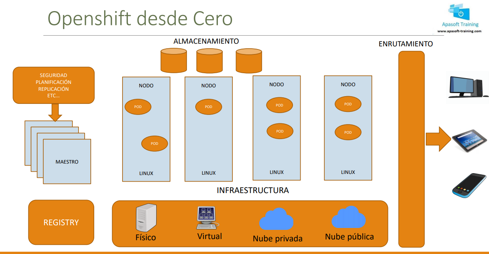

# OPENSHIFT  

+ Ejemplo muy resumen de montaje de insfraestructura:  
  

+ Minishift es una máquina virtual que te crea un cluster de un solo nodo en local para aprendizaje y desarrollo. Solo disponible en versión 3, por ahora. Es de OKD (Opensource).

+ La herramienta para openshift 4 es usar CRC, RedHat CodeReady Containers gestionada por red hat.

+ Hay otra herramienta online de Openshift Online pero ahora solo está con versión gratis de 30 dias (https://manage.openshift.com/)  

## MINISHIFT  

> Minishift solo funciona en estos momentos para versión 3 de Openshift. Por lo tanto no la vamos a usar durante el curso.  
> Sin embargo y dado que a nivel de línea de comandos es prácticamente idéntica a la versión 4, puede ser muy útil si en vuestro trabajo tenéis esta versión. Por eso me he animado a incluir unos vídeos donde indico como instalarla y usarla.  
> La diferencia radica sobre todo en la parte de la consola WEB que ha variado de forma notable con respecto a la 4.  

+ Para instalar minishift (https://www.okd.io/) ponemos /minishift y también los pasos de las diferentes releases (https://github.com/minishift/minishift/releases) y (https://github.com/minishift/minishift).  

### Instalación  

+ Instalacion virtualbox(https://computingforgeeks.com/how-to-install-virtualbox-on-fedora-linux/). Problemas virtualización (https://docs.fedoraproject.org/en-US/quick-docs/getting-started-with-virtualization/)

```
[isx46410800@miguel minishift]$ ll
total 26312
-rw-r--r--. 1 isx46410800 isx46410800    11374 Sep 26  2020 LICENSE
-rwxrwxr-x. 1 isx46410800 isx46410800 26927104 Sep 26  2020 minishift
-rw-r--r--. 1 isx46410800 isx46410800     3508 Sep 26  2020 README.adoc
[isx46410800@miguel minishift]$ ./minishift config set vm-driver virtualbox
No Minishift instance exists. New 'vm-driver' setting will be applied on next 'minishift start'
[isx46410800@miguel minishift]$ ./minishift start --vm-driver virtualbox
```  

+ Despues arrancado te da una serie de claves, ip(web grafica) y el OC que será como el comando para utilizar el OPENSHIFT CLIENT


## RH CODEREADY CONTAINERS  

### Instalación  

+ Esta es la versión similar a minishift pero utilizando la 4 pero instalado sobre un redhat. Utilizado mejor para 30 dias ya que luego se resetea la info.

+ Cogemos la descarga de (https://developers.redhat.com/products/codeready-containers/overview).

+ Una vez descargado antes seguimos con una serie de comandos:
```
yum install NetworkManager
yum install libvirt
```  

+ Descomprimimos el archivo, renonbramos crc al archivo, añadimos el usuario normal a trabajar a sudo. Como root en el /etc/sudoers:  
```
## Allow root to run any commands anywhere 
root    ALL=(ALL)       ALL
isx46410800 ALL=(ALL)       ALL
```

+ Despues __./crc setup__ para empezar a preparar el entorno de virtualización de crc.  

+ Despues __./crc start__ para arrancar la maquina. Nos pide un secret que está en los archivos del directorio crc bajado de la descarga, pegamos y enter. 

+ Luego podemos entrar en modo web o modo comando(copiar info en algun fichero que será como podemos entrar en modo kubeadmin y modo developer).  

+ En los directorios vemos que tenemos creados ahora un .crc(configuración y componentes de nuestro cluster) y un .kube(configuración de kubernetes). Dentro de .crc están en bin el driver de virtualización y oc que es la herramienta para gestionar todas las ordenes de nuestro cluster en openshift.

+ Para añadir en el path directamente el binario de la herramienta crc y no tener que escribir siempre ./crc, vamos al home editamos el .bashrc y ponemos __export PATH=$PATH:/home/openshift/crc__ es decir, ponemos la ruta de donde está la herramienta para poder usarlo.  

### Configuración  

+ __crc oc-env__ hace que para este entorno se pueda utilizar la herramienta oc, parecido a lo de .bashrc con lo de crc.  

+ Copiamos el __oc login -u developer -p developer https://api.crc.testing:6443__, info sacada de la instalación, y nos logueamos por comando. Si despues ponemos __crc ip__ vemos la ip de nuestra maquina virtual creada. 

+ Si luego copiamos el otro de __oc login -u kubeadmin -p xxxxxxxxx__ podemos loguearnos y usar ordenes de superadmin del cluster, como por ejemplo __oc get nodes__

+ Podemos usar __oc login__ para loguearnos de la manera que queramos. Si no nos acordamos podemos usar __crc console --credentials__ para recordar de que manera podemos entrar.  

+ Para acceder por una navegador a la consola podemos usar __crc console o crc console --url__ y nos da la dirección o entra directamente. Entramos con el usuario developer o kubeadmin para poder administrar todo lo que veremos en el curso.  

+ Una vez dentro vemos la interfaz web, a la izquierda el menu con las opciones de proyectos, pods, la red, monitoring, storage... También podemos ver la VIEW de como seria de admin y como developer y lo que puede manejar uno u otro.  

+ El __copy login command__ del menu, sirve para dar un ticket, un tocken para conectarme en modo remoto desde otro sitio.  


## OPENSHIFT ONLINE  


https://cloud.redhat.com/openshift/create/local

