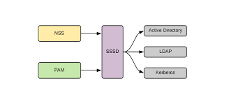

# PAM  

  

+ Conjunto de librerias que permiten la autenticación de aplicaciones en el sistema. Dan una API para dar ciertos privilegios a programas para su autenticacación.  

+ Los clientes de PAM son las aplicaciones que necesitan la autenticación.  

+ API cuando se proporcionan preguntas y te retorna respuestas.  

+ APP Pam Aware es una aplicación construida para utilizar pam a traves de su API. Irá a mirar el fichero de /etc/pam.d

+ Modulos plugables en /usr/lib64/security  

+ Linea de un file PAM: `type - control - module_path - module_arguments`  

+ Types: auth, account, password, session.  

+ Control: required, requisite, sufficient, optional, include, substack.  

+ pam_echo: siempre da SUCCESS  
+ pam_permit: permite cambiar chfn sin poner paasswd  
+ pam_deny: niega que puedas cambiar
+ pam_unix: permite si es un user valid  

+ ldd /usr/lib/chfn ver dependencias  

+ Calidad de un password: /etc/pam.d/passwd // /etc/security/pwquality.conf  

+ Time: /etc/security/time.conf  

+ Definimos volumen a compartir en: /etc/security/pam_mount.conf.xml  

+ Comprobamos conexion con LDAP con `getent passwd user/ getent group group`  

+ Ficheros importantes de nscd.conf, nslcd.conf y nsswitch.conf
## INSTALACION  

+ Dockerfile:  
```
# hostpam
FROM fedora:27
LABEL version="1.0"
LABEL author="Miguel Amorós"
LABEL subject="hostpam:scratch"
RUN dnf install -y vim util-linux-user-2.30.2-3.fc27.x86_64 finger passwd pam_mount nss-pam-ldapd authconfig
RUN mkdir /opt/docker
COPY * /opt/docker/
RUN chmod +x /opt/docker/startup.sh
WORKDIR /opt/docker
```  

+ Startup.sh:  
```
#! /bin/bash
bash /opt/docker/install.sh
/sbin/nscd
/sbin/nslcd -d
```

+ Install.sh:  
```
#! /bin/bash
useradd local1
useradd local2
useradd local3
echo "local1" | passwd --stdin local1
echo "local2" | passwd --stdin local2
echo "local3" | passwd --stdin local3
cp /opt/docker/login.defs /etc/login.defs
cp /opt/docker/nslcd.conf /etc/nslcd.conf
cp /opt/docker/nslcd.conf /etc/nscd.conf
cp /opt/docker/nsswitch.conf /etc/nsswitch.conf
authconfig --enableshadow --enablelocauthorize --enableldap --enableldapauth --enablemkhomedir --ldapserver='ldapserver' --ldapbase='dc=edt,dc=org' --updateall
#bash /opt/docker/auth.sh
```

## FICHEROS

+ nsswitch.conf:  
```
#
# /etc/nsswitch.conf
#
# An example Name Service Switch config file. This file should be
# sorted with the most-used services at the beginning.
#
# The entry '[NOTFOUND=return]' means that the search for an
# entry should stop if the search in the previous entry turned
# up nothing. Note that if the search failed due to some other reason
# (like no NIS server responding) then the search continues with the
# next entry.
#
# Valid entries include:
#
#	nisplus			Use NIS+ (NIS version 3)
#	nis			Use NIS (NIS version 2), also called YP
#	dns			Use DNS (Domain Name Service)
#	files			Use the local files
#	db			Use the local database (.db) files
#	compat			Use NIS on compat mode
#	hesiod			Use Hesiod for user lookups
#	[NOTFOUND=return]	Stop searching if not found so far
#
# To use db, put the "db" in front of "files" for entries you want to be
# looked up first in the databases
#
# Example:
#passwd:    db files nisplus nis
#shadow:    db files nisplus nis
#group:     db files nisplus nis
passwd:     files ldap systemd
shadow:     files ldap
group:      files ldap systemd
#hosts:     db files nisplus nis dns
hosts:      files dns myhostname
# Example - obey only what nisplus tells us...
#services:   nisplus [NOTFOUND=return] files
#networks:   nisplus [NOTFOUND=return] files
#protocols:  nisplus [NOTFOUND=return] files
#rpc:        nisplus [NOTFOUND=return] files
#ethers:     nisplus [NOTFOUND=return] files
#netmasks:   nisplus [NOTFOUND=return] files
bootparams: nisplus [NOTFOUND=return] files
ethers:     files
netmasks:   files
networks:   files
protocols:  files
rpc:        files
services:   files sss
netgroup:   nisplus sss
publickey:  nisplus
automount:  files nisplus
aliases:    files nisplus
```  

+ nslcd.conf:  
```
# This is the configuration file for the LDAP nameservice
# switch library's nslcd daemon. It configures the mapping
# between NSS names (see /etc/nsswitch.conf) and LDAP
# information in the directory.
# See the manual page nslcd.conf(5) for more information.
# The user and group nslcd should run as.
uid nslcd
gid ldap
# The uri pointing to the LDAP server to use for name lookups.
# Multiple entries may be specified. The address that is used
# here should be resolvable without using LDAP (obviously).
#uri ldap://127.0.0.1/
#uri ldaps://127.0.0.1/
#uri ldapi://%2fvar%2frun%2fldapi_sock/
# Note: %2f encodes the '/' used as directory separator
uri ldap://ldapserver
# The LDAP version to use (defaults to 3
# if supported by client library)
#ldap_version 3
# The distinguished name of the search base.
base dc=edt,dc=org
```  

+ nscd.conf no hacemos nada  

+ Login.defs.conf:  
```
#
# Please note that the parameters in this configuration file control the
# behavior of the tools from the shadow-utils component. None of these
# tools uses the PAM mechanism, and the utilities that use PAM (such as the
# passwd command) should therefore be configured elsewhere. Refer to
# /etc/pam.d/system-auth for more information.
#
# *REQUIRED*
#   Directory where mailboxes reside, _or_ name of file, relative to the
#   home directory.  If you _do_ define both, MAIL_DIR takes precedence.
#   QMAIL_DIR is for Qmail
#
#QMAIL_DIR	Maildir
MAIL_DIR	/var/spool/mail
#MAIL_FILE	.mail
# Password aging controls:
#
#	PASS_MAX_DAYS	Maximum number of days a password may be used.
#	PASS_MIN_DAYS	Minimum number of days allowed between password changes.
#	PASS_MIN_LEN	Minimum acceptable password length.
#	PASS_WARN_AGE	Number of days warning given before a password expires.
#
PASS_MAX_DAYS	99999
PASS_MIN_DAYS	0
PASS_MIN_LEN	5
PASS_WARN_AGE	7
#
# Min/max values for automatic uid selection in useradd
#
UID_MIN                  1000
UID_MAX                 60000
# System accounts
SYS_UID_MIN               201
SYS_UID_MAX               999
#
# Min/max values for automatic gid selection in groupadd
#
GID_MIN                  1000
GID_MAX                 60000
# System accounts
SYS_GID_MIN               201
SYS_GID_MAX               999
#
# If defined, this command is run when removing a user.
# It should remove any at/cron/print jobs etc. owned by
# the user to be removed (passed as the first argument).
#
#USERDEL_CMD	/usr/sbin/userdel_local
#
# If useradd should create home directories for users by default
# On RH systems, we do. This option is overridden with the -m flag on
# useradd command line.
#
CREATE_HOME	yes
# The permission mask is initialized to this value. If not specified, 
# the permission mask will be initialized to 022.
UMASK           077
# This enables userdel to remove user groups if no members exist.
#
USERGROUPS_ENAB yes
# Use SHA512 to encrypt password.
ENCRYPT_METHOD SHA512 
CHFN_RESTRICT no
```  

