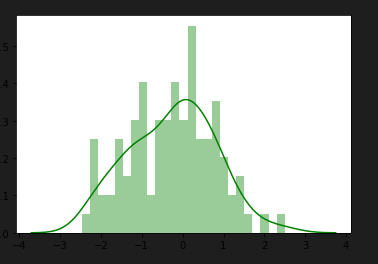

# Intro Programación PYTHON  
## Shebang
```
# !/usr/bin/python3
# -*-coding: utf-8-*-
```

## Server Python  
`python -m SimpleHTTPDServer 80`  

## Mostrar algo
```
print("Uso windows")
```

## Mostrar algo con formato
```
print("Hello World, my name is {}" .format(name))
print(f'My Python version is {version}')
```

## Importar librerias
```
import platform
from xxxx import xx
```

## Variables
```
x=100
y=True
z="Miguel"
```

## Condicional
```
x = 25
y = 15
if x > y:
    print("x is greater than y: where x is {} and y {}" .format(x,y))
elif x == y:
    print("x and y are the same: where x is {} and y {}" .format(x,y))
else:
    print("x is lesser than y: where x is {} and y {}" .format(x,y))
```

```
tengoHambre = True
y = "Necesito comer" if tengoHambre else "solo necesito beber"
```

```
a = True
b = False
# comparamos a y b
if a and b:
    print('Expresiones son TRUE')
else:
    print("Expresiones son False")
```

## Bucle for (iterar elementos)
```
food = ["breakfast", "lunch", "snack", "dinner"]
for i in food:
    print(i)
```

## Bucle while
```
food = ["breakfast", "lunch", "snack", "dinner"]
while m < 4:
    print(food[m])
    m +=1
```
## Funciones
```
def message():
    print("Mi version de python es la {}" .format(platform.python_version()))
message()
def operation(n=25):
    print(n)
    return n*2
```

## Test main
```
if __name__ == "__main__":
    runMe()
    name("Miguel")
    name(2)
    print(x)
```

## Objetos
```
class Time:
    h = "horas"
    m = "minutos"
    s = "segundos"
    def hours(self):
        print(self.h)

    def minuts(self):
        print(self.m)

    def seconds(self):
        print(self.s)
def main2():
    how_time = Time()
    how_time.hours()
    how_time.minuts()
    how_time.seconds()
main2()
```

## Mayusculas, minusculas, letra capital
```
mayus = "hello world".upper()
minus = "hello world".lower()
capi = "hello world".capitalize()
```

## Ver tipo de dato
```
print(type(w)) #float
```

## Listas
```
x = [1,2,3,4]
print(x[2])
x[2] = 10
for i in x:
    print(i)
```

```
# LISTA ACCIONES -- TUPLAS SON INMUTABLES Y NO SE PUEDE
def main():
    lista = ['perro', 'gato', 'cerdo', 'caballo']
    lista2 = ['perro', 'gato', 'cerdo', 'caballo']
    print(lista[1]) # gato
    print(lista[1:3]) # gato, cerdo
    print(lista[0:5:2]) # perro, cerdo
    print(lista.index('gato')) # 1, busca la posicion de esa palabra
    lista.append('koala') # añade koala
    lista.insert(0, 'vaca') # añade vaca en posicion 0
    lista.remove("vaca") # borra de la lista vaca
    lista.pop() # borra el ultimo elemento de la lista
    lista.pop(1) # borra esa posicion de la lista
    del lista[1] # borra de la lista ese elemento
    del lista[0:1] # borra ese slicing
    print(len(lista)) # cuenta en numero de elementos de la lista
    lista.extend(lista2) # junta dos listas
    print_lista(lista) # funcion de iterar la lista
# funcion para iterar la lista pasada por argumento
def print_lista(lista):
    for i in lista:
        print(i, end=' ', flush=True)
    print()
```

## Tuplas
```
t = (1,2,3,4,5)
# cosas con tuplas
## t[2] = 10 NO SE PUEDE ASIGNAR PARA CAMBIAR
print(t[2])
for e in t:
    print(e)
```

## Diccionarios
```
dic = { 'x' : 5, 'y' : 'miguel', 'z' : False }
# cosas con diccionarios
print(dic['y'])
dic['y'] = 'miguelito'
for id, valor in dic.items():
    print(f"id: {id} valor: {valor}")
for e in dic.values():
    print(e)
for e in dic:
    print(f'el id es {e}')
    print(f'el valor es {dic[e]}')
```

```
gente = {'1': "miguel", '2': "cristina", '3': "isabel"}
gente['4'] = 'maria'
for k in gente:
    print(k)
for k,v in gente.items():
    print(f'key: {k}   valor: {v}')
for k in gente.keys():
    print(f'key: {k}')
for v in gente.values():
    print(f'valor: {v}')
```

## Rangos
```
r = range(5) # no se puede asignar sino es con una lista
ra = list(range(5))
ra[2] = 20
rang = range(5,10,2) # del 5 al 10 de dos en dos
# cosas con rangos
for e in ra:
    print(e)
for e in rang:
    print(e)
```

## List Comprension
```
# de una lista
lista = range(11)
tupla = ((0,1),(1,2),(2,3))
# creas una lista,tupla iterando lista y operaciones
lista2 = [ x * 2 for x in lista]
tupla2 = [ (y*2, x*2) for x,y in tupla]
# resultados
print(lista2)
print(tupla2)
```

## Len
```
len(*args/lista)
```

## Objetos
```
# definimos una clase
class mobile:
    #definimos unas variables con contenido
    old_phone = "keypad"
    new_phone = "touch screen"

    # definimos funciones que printes esas variables
    def old_mobile(self):
        print(self.old_phone)
    
    def new_mobile(self):
        print(self.new_phone)
# creamos funcion,variable con objeto y sus dos partes de funciones
def main():
    x = mobile()
    x.old_mobile()
    x.new_mobile()
```

```
class Animal:
    def __init__(self, type, name, sound):
        self._type = type
        self._name = name
        self._sound = sound

    def type(self):
        return self._type

    def name(self):
        return self._name

    def sound(self):
        return self._sound
def print_animal(x):
    if not isinstance(x, Animal):
        raise TypeError("error, requiere un animal")
    print(f'El {x.type()} se llama {x.name()} y dice {x.sound()}')
# le pasamos a la funcion de hacer algo, los argumentos al objeto
def main():
    print_animal(Animal("Kitten", "Fluffly", "Meow"))
    print_animal(Animal("Duck", "Donald", "Quak"))
```

## Ficheros
+ Leer
```
def main():
    file = open('lines.txt', 'r')
    # file = open('lines.txt', 'r') # read only
    # file = open('lines.txt', 'w') # write only (empties files)
    # file = open('lines.txt', 'a') # añadir data in files
    # file = open('lines.txt', 'r+') # optional + read or write
    for line in file:
        print(line.rstrip()) #rstrip elimina espacios o lo que se ponga en ()
```

+ Escribir
```
def main():
    fileInput = open('lines.txt', 'rt') # r read t text
    fileOutput = open('linesOutput.txt', 'wt') # w write t text
    for line in fileInput:
        print(line.rstrip(), file=fileOutput) # cada linea sin blancos la envia al nuevo file
        print('.', end='', flush=True) # aqui solo printa esto por cada linea leida
    fileOutput.close() # cierra el doc nuevo
    print('\nDone.') # printa que se ha realizado todo
```

+ Copiar
```
def main():
    fileInput = open('cat.jpg', 'rb') # r read b binario
    fileOutput = open('cat_copy.jpg', 'wb') # w write b binario
    # mientras todo se pueda
    while True:
        # leemos datos y lo metemos en un buffer
        buffer = fileInput.read(102400)
        # mientras haya buffer por leer
        if buffer:
            # copiamos del buffer en el file nuevo
            fileOutput.write(buffer)
            print('.', end='', flush=True) # aqui solo printa esto por cada linea leida
        else:
            break
    fileOutput.close() # cierra el doc nuevo
    print('\nDone.') # printa que se ha realizado todo
```

## Módulos
```
import os, datetime, sys
def main():
    # modulo de system
    v = sys.version_info
    print('Mi version es {}.{}.{}' .format(*v))
    # modulo de operating system
    x = os.name
    w = os.getcwdb()
    print(v)
    print(w)
    # modulo de datetime
    date = datetime.datetime.now() # fecha y hora de ahora
    print(date)
    print(date.year)
    print(date.month)
    print(date.day)
```  

# AVANZADO PYTHON  

+ Todos los [COMMANDOS](https://pythonbasics.org/) interesantes de python y utilidades que se integran con él.  

+ import LIBRERIA

+ from MODULO import FUNCION  

## FUNCIONES  

+ Definir una funcion:
```
## FUNCION TABLA MULTIPLICAR
def TablaMultiplicar(numero, rango):
    for i in range(rango+1):
        print(f'{numero} X {i} = {numero+i}')

TablaMultiplicar(7,2)
TablaMultiplicar(10,3)
```  
> Print se pone al llamar la funcion para que te de un return, si no se pone nada, te dará los mensajes print de dentro de la funcion.  
> Variables `global` dentro de una funcion, se puede utilizar dentro y fuera de esa funcion.  
> Si como argumento ponemos (*argumento), devuelve una tupla.  

### Funcion type  

+ para saber que tipo de valor es `type(valor)`  

### Funcion float, int  

+ Transforma el valor en un decimal o entero `float(numeroint)` 

### Funcion MATH  

+ De la liberia math(from match import sqrt,pow).
+ hace una subida exponencial `pow(5,2)==5**2`  
+ Hace la raiz cuadrada `sqrt(100)`  
+ Valor absoluto de un numero `abs(-5)`  

### Funciones strings  

+ texto.lower(), texto.upper(), texto.capitalize(), texto.title(), texto.swapcase(), texto.strip(), texto.split(' '), texto.replace(' ', 'r'), len(texto).  

### Funciones booleanos  

+ text.isupper(),texto.islower(), texto.startswith('a'), texto.endswith('z'). Si es mayusculas, minisculas, si empieza o termina en tal.  

### Funciones listas  

+ lista.remove,insert,pop,append,sort,reverse,count,index,max,min,average.  
+ lista[1:-3].  

### Funciones diccionarios  

+ dict.pop,update,get,setdefault,copy,items,values,keys.  

### Funciones conjuntos y tuplas  

+ conjunto.add, update, remove, discard, update, pop, clear.  
+ tupla[posicion]  

## MODULOS  

+ Es un fichero con conjunto de funciones que podemos importar en otros ficheros.  
+ Todas enteras `import modulo.py`  
+ En concreto `from modulo.py import funcion1.py`  

## GESTION ERRORES  
```
while True:
    try:
        edad = int(input("Dime tu edad: "))
        print("Tu edad es:", edad)
        break
    except ZeroDivisionError:
        print("No se puede dividir entre zero")
    except ValueError:
        print("Numero incorrecto")
    except KeyboardInterrupt:
        print("Has cancelado la ejecucion")
        break
    finally:
        print("codigo ejecutado correctamente")
```  
> Hay varios except como divisionzero, keyboardinterrupt, error value...  


## GESTION DE FICHEROS  

+ Leer un fichero:  
```
#!/usr/bin/python3
# leer un fichero en modo read y texto y lo guardamos en una variable
fichero = open("./texto.txt", "rt")
# ver los datos
datos_fichero = fichero.read()
print(datos_fichero)
```  

+ Crear un fichero poniendo texto:  
```
#!/usr/bin/python3
# creamos un fichero y metodo write y texto para que escriba
fichero = open("./texto2.txt", "wt")
# escribir los datos
texto = "Esto es un ejemplo para\nescribir en un fichero\nque vamos a grabar.\n"
fichero.write(texto)
# cerramos dichero
fichero.close()
# al ejecutarlo se nos crea un fichero con ese nombre y ese texto.
```  

+ Añadir texto a un fichero:  
```
#!/usr/bin/python3
# creamos un fichero y metodo append y texto para que añada cosas al file
fichero = open("./texto3.txt", "at")
# escribir los datos
texto = "\nEsto es un ejemplo para\nañadir texto\n"
fichero.write(texto)
# cerramos dichero
fichero.close()
# al ejecutarlo se nos crea un fichero con ese nombre y ese texto.
```  

+ Borrar un fichero:  
```
#!/usr/bin/python3

# importamos un modulo para usar el metodo de borrar fichero del sistema
import os
# creamos un fichero y metodo append y texto para que añada cosas al file
os.remove("./texto3.txt")
# al ejecutarlo se nos crea un fichero con ese nombre y ese texto.
```  

+ Creamos un modulo de objeto Fichero y tratamos estas funciones en un programa:  
```
#!/usr/bin/python3

class Fichero:
    def __init__(self,nombre):
        self.nombre = nombre
    def grabar_fichero(self,texto):
        fichero = open(self.nombre, "wt")
        fichero.write(texto)
        fichero.close()
    def incluir_fichero(self,texto):
        fichero = open(self.nombre, "at")
        fichero.write(texto)
        fichero.close()
    def leer_fichero(self):
        fichero = open(self.nombre, "rt")
        texto = fichero.read()
        return texto
```

```
#!/usr/bin/python3

# importamos el modulo
import ficheros_modulo

# creamos nombre del fichero
nombre_fichero = "fichero1.txt"
fichero = ficheros_modulo.Fichero(nombre_fichero)
# en el fichero que vamos a crear, tiene este texto
texto = "Esta es la linea para añadir.\nEsta la segunda linea.\n"
fichero.grabar_fichero(texto)
# añadimos al fichero este texto
texto = "Esta es la linea para añadir.\n"
fichero.incluir_fichero(texto)
# leemos lo que tenemos de fichero
leer_texto = fichero.leer_fichero()
print(leer_texto)
```  

+ Tratamiento de binarios en python:  
```
#!/usr/bin/python3

# importamos el modulo para ficheros binarios
import pickle

# leer en modo binarios
fichero = open("binarios_colores.pckl", "rb")
lista_colores = pickle.load(fichero)
print(lista_colores)
```  

```
#!/usr/bin/python3

# importamos el modulo para ficheros binarios
import pickle

# añadimos a un fichero una lista de colores en modo binarios
colores = ["azul", "amarillo", "verde"]
fichero = open("binarios_colores.pckl", "wb")

pickle.dump(colores, fichero)
fichero.close()
```  

## EXPRESIONES REGULARES  

+ Expresiones regulares con el modulo RE:  
```
#!/usr/bin/python3

# importamos el modulo de expresiones regulares
import re

texto = "Hola me llamo miguel"

# SEARCH
# buscamos ese patron dentro del texto
resultado = re.search("llamo",texto)
# que acabe en miguel$, que empiece en ^miguel 
# que haya algo entre me.*miguel

if resultado:
    print("OK")
else:
    print("No encontado")

# FINDALL
texto2 = '''
el coche de miguel es rojo
el coche de natalia es blanco
'''
resultado = re.findall("coche.*rojo", texto2)

if resultado:
    print("OK")
else:
    print("No encontado")

# SPLIT
texto3 = "La silla es blanca y vale 80"
resultado = re.split("\s", texto3)

if resultado:
    print(resultado)
else:
    print("No encontado")

# SUB
texto4 = "La silla es blanca y vale 80"
resultado = re.sub("blanca", "roja", texto4)

if resultado:
    print(resultado)
else:
    print("No encontado")
```  

## CONVERT JSON  

```
#!/usr/bin/python3

# importamos el modulo de json
import _json

producto1 = {"nombre":"miguel", "apellido":"amoros"}

estructura_json = _json.dumps(producto1)
print(estructura_json)

producto2 = _json.loads(estructura_json)
print(producto2)
```  

## FECHA Y HORA  

```
#!/usr/bin/python3

# importamos el modulo de json
from datetime import datetime

fechayhora = datetime.now()
print(fechayhora)

año = fechayhora.year
mes = fechayhora.month
dia = fechayhora.day

hora = fechayhora.hour
minutos = fechayhora.minute
segundos = fechayhora.second
microsegundos = fechayhora.microsecond

print(f"La hora es {hora} : {minutos}")
print(f"La fecha es {dia} {mes} {año}")
```  

## SQLite  

+ Crear base de datos con python con el modulo sqlite:  

+ [TUTORIAL](https://likegeeks.com/es/tutorial-de-python-sqlite3/#SQLite3_Cursor)  

+ Podemos descargar la [herramienta](https://sqlitebrowser.org/dl/) para visualizar las cosas y manejar la bd.  

+ Ejemplo de creacion de bbdd:  
```
#!/usr/bin/python3

# importamos el modulo de bd sqlite
import sqlite3  

# creamos/existente bbdd
conexion = sqlite3.connect("bbdd1.db")

# sirve para poder hacer sentencias sql dentro
cursor = conexion.cursor()

# creamos una tabla
cursor.execute("CREATE TABLE PERSONAS (nombre TEXT, apellido1 TEXT, apellido2 TEXT, edad INTEGER)")
# creamos fila
cursor.execute("INSERT INTO PERSONAS VALUES ('Antonio', 'Perez', 'Gomez', 35)")
# creamos varias filas
lista_personas = [('Miguel', 'Amoros', 'Moret', 28), ('Natalia', 'Sendra', 'Soler', 26)]
cursor.executemany("INSERT INTO PERSONAS VALUES (?,?,?,?)", lista_personas)

# consulta de datos
cursor.execute("SELECT * FROM PERSONAS")
personas = cursor.fetchall()
for persona in personas:
    print(persona)

# consulta datos con WHERE
cursor.execute("SELECT * FROM PERSONAS WHERE edad > 28")
personas_edad = cursor.fetchall()
for persona in personas_edad:
    print(persona)

# consulta datos con WHERE y ordenado
cursor.execute("SELECT * FROM PERSONAS WHERE edad <= 28 ORDER BY edad DESC")
personas_edad = cursor.fetchall()
for persona in personas_edad:
    print(persona)

# borrar datos
cursor.execute("DELETE FROM PERSONAS WHERE nombre = 'Antonio'")

# actualizar datos
cursor.execute("UPDATE PERSONAS SET nombre = 'Miguelito' where edad = 28")


# mantener el registro guardado
conexion.commit()

# cerramos bdd
conexion.close()
```  

## TKINTER  

+ [TKINTER](https://docs.python.org/3.9/library/tkinter.html) Es un modulo de python que sirve para crear una interfaz grafica.

+ Ejemplo de lo que se puede hacer:  
```
#!/usr/bin/python3

# tkinter - componente raiz
import tkinter
from tkinter import filedialog

# definimos la ventana de la aplicacion
raiz = tkinter.Tk()
raiz.title("Mi programa")

# definimos aspecto de la ventana
frame = tkinter.Frame(raiz)
frame.config(fg="blue",width=400,height=300)
frame.pack()

# construimos un label
texto = "Hola mundo"
label = tkinter.Label(raiz,text=texto)
label.config(fg="green",bg="grey",font=("Cortana",30))
label.pack()

# construimos una entrada por teclado
entrada = tkinter.Entry(raiz)
entrada.config(justify="center", show="*")
entrada.pack()

# construimos una box de texto
box = tkinter.Text(raiz)
box.config(width=20,height=10,font=("Verdana",15),padx=10,pady=10,fg="green",selectbackground="yellow")
box.pack()

# construimos una boton que salte mensaje
def accion():
    print("Hola mundo")

boton = tkinter.Button(raiz,text="Ejecutar",command=accion)
boton.config(fg="green")
boton.pack()

# construimos un multiseleccion
def accion():
    print(f"La opcion es {opcion.get()}")

seleccion1 = tkinter.Radiobutton(raiz,text="Opcion 1",variable=opcion,command=accion)
seleccion1.pack()
seleccion2 = tkinter.Radiobutton(raiz,text="Opcion 2",variable=opcion,command=accion)
seleccion2.pack()

# construimos un checkbutton
def verificar():
    valor = check1.get()
    if valor == 1:
        print("La opcion está activada")
    else:
        print("La opcion está activada")

check1 = tkinter.IntVar()
boton1 = tkinter.Checkbutton(raiz,text="Opcion 1",variable=check1,onvalue=1,offvalue=0,command=verificar)
boton1.pack()

# construimos boton con popup
def avisar():
    tkinter.messagebox.showinfo("Titulo","Mensaje con la info")

boton = tkinter.Button(raiz,text="Pulsar para aviso",command=avisar)
boton.pack()

# construimos boton con popup para responder si o no
def preguntar():
    tkinter.messagebox.askquestion("Titulo","Quieres borrar la info?")

boton = tkinter.Button(raiz,text="Pulsar para preguntar",command=preguntar)
boton.pack()

# construimos boton para añadir fichero
from tkinter import filedialog
def abrirfichero():
    rutafichero = filedialog.askopenfilename(title="Abrir un fichero")
    print(rutafichero)

boton = tkinter.Button(raiz,text="Pulsar para abrir fichero",command=abrirfichero)
boton.pack()

# para que siga ejecutandose
raiz.mainloop()
```  

## PYDOC  

+ Es un comando que sirve para generar documentacion de una clase y sus funciones:  
`pydoc /ruta/programa.py`  
`pydoc -w /ruta/programa.py` para tenerla en html.  


## DOCTEST  

+ Sirve para hacer pruebas en los docstrings de las funciones:  
```
# DOCTEST PARA PODER HACER PRUEBAS EN EL DOCSTRING
def sumar(num1,num2):
    """
    Esto es una funcion para sumar numeros
    >>> sumar(4,3)
    7
    >>> sumar(4,3)
    8
    >>> sumar(2,3)
    5
    """
    return num1+num2
print(sumar(2,2))
# se importa al final la libreria para hacer las pruebas
import doctest
doctest.testmod()
```  

```
4
**********************************************************************
File "/home/miguel/Documents/curso_python2022/prueba_doctest.py", line 9, in __main__.sumar
Failed example:
    sumar(4,3)
Expected:
    8
Got:
    7
**********************************************************************
1 items had failures:
   1 of   3 in __main__.sumar
***Test Failed*** 1 failures.
```  

## UNISTEST  

+ Modulo que sirve para hacer [test](https://docs.python.org/3/library/unittest.html).  
```
#!/usr/bin/python3

# DOCTEST PARA PODER HACER PRUEBAS EN EL DOCSTRING
def sumar(num1,num2):
    """
    Esto es una funcion para sumar numeros
    """
    return num1+num2

print(sumar(2,2))

# se importa al final la libreria para hacer las pruebas
import unittest
class pruebas(unittest.TestCase):
    def test(self):
        self.assertEqual(sumar(4,5),9)
        self.assertEqual(sumar(4,5),19)

# prueba
if __name__ == '__main__':
    unittest.main()
```  

```
4
.
----------------------------------------------------------------------
Ran 1 test in 0.000s
OK
```  


## NUMPY  

+ [NUMPY](https://aprendeconalf.es/docencia/python/manual/numpy/) s una librería de Python especializada en el cálculo numérico y el análisis de datos, especialmente para un gran volumen de datos.  

+ Incorpora una nueva clase de objetos llamados arrays que permite representar colecciones de datos de un mismo tipo en varias dimensiones, y funciones muy eficientes para su manipulación.  

+ Instalamos libreria con `pip3 install numpy`  

+ Ejemplos de uso:  
```
#!/usr/bin/python3

# importamos la liberia
import numpy as np

# creamos arrays
lista1 = [1,2,3,4]
lista2 = [5,6,7,8]

print(np.zeros(4)) # crea array de 4 ceros
print(np.ones(5)) # crea array de 5 unos
np.arange(5) # crea array de 0 a 4
np.arange(2,10)

array1 = np.array(lista1)
array2 = np.array([1,2,3,4,5,6])
print(array1)

# array de dos dimensiones
lista_doble = (lista1,lista2,lista2,lista1)
print(lista_doble)

array_doble = np.array(lista_doble)
print(array_doble)

# formas que tiene el array
print(array_doble.shape) # 4 filas y 4 columnas
print(array_doble.dtype) # numeros int


# operaciones con arrays
print(array1 + 4) # multiplica todo lo de dentro por 4 pero no queda asignado
array_multiplicado = array1 * 3
print(array_multiplicado)

# indexacion / slicing
array3 = np.arange(10)
print(array3)
print(array3[0:3])
array4 = np.copy(array3)
array4[0:4] = 20
print(array3,array4)

# matrices
array5 = np.arange(15).reshape(3,5) # 3 filas y 5 columnas
print(array5)
print(array5[1][1])
array6 = array5.T # cambio el orden de filas y columnas
print(array6)

# entrada / salida de arrays
array7 = np.arange(6)
np.save("array7", array7) # guarda ese array con ese nombre
print(np.load("array7.npy")) # carga el archivo con el nombre del array
array8 = np.arange(8)
np.savez("arrayxy", x=array7, y=array8) # guarda en tipo coordenadas x y
array_xy = np.load("arrayxy.npz")
print(array_xy)
print(array_xy["x"])
print(array_xy["y"])
np.savetxt("mifilearray.txt", array8, delimiter=",") # guarda en un file txt
print(np.loadtxt("mifilearray.txt", delimiter=","))

# funciones
print(np.sqrt(array1)) #raiz cuadrada
print(np.random(5)) # 5 numeros aleatorios
print(np.add(array1, array2)) # suma las dos
print(np.maxium(array1,array2)) # elije el maximo de entre las dos arrays

# funcion par e impar
def pares(inicio,fin):
    if inicio % 2 == 0:
        array10 = np.arange(inicio,fin,2)
    else:
        inicio +=1
        array10 = np.arange(inicio,fin)
    return array10
print(pares(0,21))
```  

## PANDAS  

+ [PANDAS](https://aprendeconalf.es/docencia/python/manual/pandas/) es una librería de Python especializada en el manejo y análisis de estructuras de datos.  

+ Las principales características de esta librería son:  
    - Define nuevas estructuras de datos basadas en los arrays de la librería NumPy pero con nuevas funcionalidades.
    - Permite leer y escribir fácilmente ficheros en formato CSV, Excel y bases de datos SQL.
    - Permite acceder a los datos mediante índices o nombres para filas y columnas.
    - Ofrece métodos para reordenar, dividir y combinar conjuntos de datos.
    - Permite trabajar con series temporales.
    - Realiza todas estas operaciones de manera muy eficiente.

+ PARA QUE QUEDE EL CAMBIO HECHO SIEMPRE HAY QUE ASIGNAR LA FUNCION QUE SE HAGA A LA SERIE O DATAFRAME DEL CUAL SE HACE ALGO.  

+ Metodo SERIES para crear indices:  
```
#!/usr/bin/python3

# importamos la liberia
from logging.config import dictConfig
import pandas as pd

## INDICES

# te crea una serie de indices #0 1
serie1 = pd.Series([1,5,7])    #1 5
print(serie1)
# ver un indice
print(serie1[1]) #5
# crear un indice
asignaturas = ["mates", "sociales", "fisica"]
notas = [8,9,5]
serie_notas_miguel = pd.Series(notas,asignaturas)
print(serie_notas_miguel)
print(serie_notas_miguel["mates"])
#condiciones
print(serie_notas_miguel[serie_notas_miguel>7])
#asignamos nombres
serie_notas_miguel.name = "Notas de Miguel"
serie_notas_miguel.index.name = "Asignaturas de Bachiller"
print(serie_notas_miguel)
# convertir la serie en un diccionario
diccionario = serie_notas_miguel.to_dict()
print(diccionario)
serie = pd.Series(diccionario)
print(serie)
#operaciones con indices con las series
notas2 = [1,5,3]
serie_notas_natalia = pd.Series(notas2,asignaturas)
print(serie_notas_natalia)
notas_medias = (serie_notas_miguel+serie_notas_natalia)/2
print(notas_medias)
```  

+ Metodo DATAFRAMES:  
```
#!/usr/bin/python3

# importamos la liberia
import pandas as pd
import webbrowser # sirve para paginas web
## DATAFRAMES
# sirve para abrir esta web
website = "https://es.wikipedia.org/wiki/Anexo:Campeones_de_la_NBA"
webbrowser.open(website)
# copiamos algo al portapapeles de esa web y lo asignamos a un dataframe
dataframe_nba = pd.read_clipboard()
print(dataframe_nba)
# te dice el nombre de las columnas
print(dataframe_nba.columns)
print(dataframe_nba.columns["Campeón del Oeste"])
# ver la info por el indice
print(dataframe_nba.loc[5])
# ver los 5 primeros con head o especificos
print(dataframe_nba.head())
print(dataframe_nba.head(7))
print(dataframe_nba.tail())
print(dataframe_nba.tail(4))

# dataframe con un diccionario
asignaturas = ["Mates", "Reli", "Sociales", "Natus"]
notas = [8,5,7,8]
diccionario = { "Asignaturas": asignaturas, "Notas": notas}
print(diccionario)
# a raiz del diccionario te crea un dataframe con los nombres, notas e indices
dataframe_notas = pd.DataFrame(diccionario)
print(dataframe_notas)
```  


+ Metodo INDICES:  
```
#!/usr/bin/python3

# importamos la liberia
import pandas as pd

# INDICES
lista_valores = [1,2,3]
lista_indices = ["a", "b", "c"]

serie = pd.Series(lista_valores,index=lista_indices)
print(serie) # a 1 b 2 c 3
print(serie.index) # a b c
print(serie.index[0]) # a

lista_valores2 = [[1,2,3], [8,9,10], [3,5,6]]
lista_indices2 = ["Mates", "Natus", "Fisica"]
lista_nombres = ["Miguel","Natalia", "Cristina"]
# creamos el dataframe indicando indices, columnas y datos
dataframe = pd.DataFrame(lista_valores2, index=lista_indices2, columns=lista_nombres)
print(dataframe)
print(dataframe.index)
print(dataframe.index[2])
```  
> Si se crea mas indices que valores, se crean subindices y si usamos `serie.unstack()` convierte los otros indices en columnas. Para deshacer o el proceso inverso seria `dataframe.stack()`.  

+ Metodo BORRAR DATOS:  
```
#!/usr/bin/python3

# importamos la liberia
import pandas as pd
import numpy as np

# ELIMINAR DATOS

## INDICES
print(np.arange(4))
# creamos una serie a partir de un array de numpy y ponemos los indices
serie = pd.Series(np.arange(4), index=["a","b","c","d"])
print(serie)

# eliminamos indices
serie.drop("c")

## DATAFRAMES
print(np.arange(9).reshape(3,3))
lista_valores = np.arange(9).reshape(3,3)
lista_indices = ["a","b","c"]
lista_columnas = ["c1","c2","c3"]

dataframe = pd.DataFrame(lista_valores, index=lista_indices,columns=lista_columnas)
print(dataframe)
dataframe.drop("b")
dataframe.drop("c2", axis=1)
```  

+ Metodo SELECCIONAR DATOS:  
```
#!/usr/bin/python3

# importamos la liberia
import pandas as pd
import numpy as np

# SELECCIONAR DATOS
# en series
lista_valores = np.arange(3) # 0 1 2
lista_indices = ["i1","i2","i3"]

serie = pd.Series(lista_valores,index=lista_indices)
print(serie)
# multiplica los datos
serie = serie *2
print(serie)
# seleccionar datos
print(serie["i1"])
print(serie[1])
print(serie[0:2])
print(serie[serie>2])
serie[serie>2] = 6
print(serie)

# en datafranes
lista_valores2 = np.arange(25).reshape(5,5)
lista_indices2 = ["i1","i2","i3","i4","i5"]
lista_columnas2 = ["c1","c2","c3","c4","c5"]

dataframe = pd.DataFrame(lista_valores2,index=lista_indices2,columns=lista_columnas2)
print(dataframe)
print(dataframe["c2"]) # todo lo de la c2
print(dataframe["c2"]["i2"]) # valor concreto
print(dataframe[dataframe["c2"]>15]) # los datos de donde la columnas2
print(dataframe>20) # muestra cada valor si es true o false
print(dataframe.loc["i2"]) # fila i2
```  

+ Metodo ORGANIZAR Y CLASIFICAR ESTADISTICAS:  
```
#!/usr/bin/python3

# importamos la liberia
import pandas as pd
import numpy as np

# ORDENAR Y CLASIFICAR
lista_valores = range(4)
lista_indices = list("bcad")
lista_columnas = list("wxyz")
serie = pd.Series(lista_valores,index=lista_indices)
print(serie)

print(serie.sort_index())
print(serie.sort_values())
print(serie.rank()) # ordena ppor ranking de clasificaciones
# esto crea una sserie con 10 datos randoms
serie2 = pd.Series(np.random.randn(10))
print(serie2)
print(serie2.rank())

# CLASIFICAR DATOS
lista_indices2 = list("abc")
lista_columnas2 = list("xyz")
dataframe = pd.DataFrame(np.arange(9).reshape(3,3),index=lista_indices2, columns=lista_columnas2)
print(dataframe)
print(dataframe.describe())
print(dataframe.sum())
print(dataframe.max())
print(dataframe.max(axis=1))
print(dataframe.min())
print(dataframe.idxmin())
```  

+ Metodo para ver los VALORES NULOS:  
```
#!/usr/bin/python3

# importamos la liberia
import pandas as pd
import numpy as np

# VALORES NULOS
lista_valores = [1,2,np.nan,4]
lista_indices = list("abcd")

serie = pd.Series(lista_valores,index=lista_indices)
print(serie)
print(serie.isnull()) # ver booleanos los nulos
print(serie.dropna()) # borrar los nulos

lista_valores2 = [[1,2,1],[1,np.nan,2],[1,2,np.nan]]
lista_indices2 = list("123")
lista_columnas2 = list("abc")
dataframe = pd.DataFrame(lista_valores2,index=lista_indices2,columns=lista_columnas2)
print(dataframe)
print(dataframe.isnull())
print(dataframe.dropna())
print(dataframe.fillna(0)) # rellena los nulos con 0
```  

+ Metodo en HTML:  
```
#!/usr/bin/python3

import pandas as pd

# TRATAMIENTO DE DATOS EN URL HTML
url = "https://es.wikipedia.org/wiki/Anexo:Finales_de_la_Copa_Mundial_de_F%C3%BAtbol"

# cogemos los datos de la url
dataframe_futbol = pd.io.html.read_html(url)


# cambiamos los campos de columnas por los que queremos
print(dataframe_futbol.loc[0])
# creamos un diccionario con los nombres de las columnas
diccionario = dict(dataframe_futbol.loc[0])
print(diccionario)
# lo asignamos al nuevo dataframe
dataframe_futbol = dataframe_futbol.rename(columns=diccionario)
# ahora borramos la fila 1 que se repite y borramos la columna notas
dataframe_futbol = dataframe_futbol.drop(0)
dataframe_futbol = dataframe_futbol.drop("Notas",axis=1)
print(dataframe_futbol)
```  

+ Metodo en EXCEL:  
```
#!/usr/bin/python3

import pandas as pd

# TRATAMIENTO DE DATOS EN FILE EXCELL

# cogemos los datos deL FICHERO
file_excell = pd.ExcelFile("/home/miguel/Documents/curso_python2022/pandas/poblacion.xlsx")
# en csv seria:
# file_csv = pd.read_csv("/home/miguel/Documents/curso_python2022/pandas/poblacion.xlsx")

# parseamos en que hoja está
dataframe = file_excell.parse("Hoja1")

print(dataframe)
```  

## TRATAMIENTO DATOS DATAFRAMES  

+ UNION DE DATAFRAMES:  
```
#!/usr/bin/python3

import pandas as pd

dataframe1 = pd.DataFrame({"c1" : ["1","2","3"], "clave" : ["a","b","c"]})
dataframe2 = pd.DataFrame({"c2" : ["4","5","6"], "clave" : ["c","b","e"]})

# hacer una union de datafames segun columna. Une por claves iguales
dataframe3 = pd.DataFrame.merge(dataframe1,dataframe2,on="clave")
print(dataframe3)
# une igual pero manteniendo los datos del de la izquierda
dataframe4 = pd.DataFrame.merge(dataframe1,dataframe2,on="clave",how="left")
print(dataframe4)
# une igual pero manteniendo los datos del de la derecha
dataframe5 = pd.DataFrame.merge(dataframe1,dataframe2,on="clave",how="right")
print(dataframe5)
```  

+ CONCATENAR Y COMBINAR DATAFRAMES:  
```
#!/usr/bin/python3

import pandas as pd
import numpy as np

# concatenamos los dos arrays
array1 = np.arange(9).reshape(3,3)
array_concatenado = np.concatenate([array1,array1])
print(array_concatenado)

# concatenamos series poniendo los campos de serie
serie1 = pd.Series([1,2,3], index=["a","b","c"])
serie2 = pd.Series([4,5,6], index=["d","e","f"])
serie_concatenada = pd.concat([serie1,serie2], keys=["serie1","serie2"])
print(serie_concatenada)

# concatenamos datafranes
dataframe1 = pd.DataFrame(np.random.rand(3,3), columns=["a","b","c"]) #3 filas 3 columnas
dataframe2 = pd.DataFrame(np.random.rand(2,3), columns=["a","b","c"])
dataframe3 = pd.concat([dataframe1,dataframe2],keys=["dataframe1","dataframe2"])
print(dataframe3)

# combinar serie y dataframes
serie_combinada = serie1.combine_first(serie2)
print(serie_combinada)
dataframe_combinado = dataframe1.combine_first(dataframe2)
print(dataframe_combinado)
```  

+ DUPLICAR DATAFRAMES:  
```
#!/usr/bin/python3

import pandas as pd
import numpy as np


lista_valores = [[1,2],[1,2],[5,6],[5,8]]
lista_indices = list("mnop")
lista_columnas = ["columna1","columna2"]

dataframe = pd.DataFrame(lista_valores, index=lista_indices, columns=lista_columnas)
print(dataframe)

# BORRAR LOS DUPLICADOS
dataframe_duplicado = dataframe.drop_duplicates()
print(dataframe_duplicado)

# BORRAR LOS DUPLICADOS PARA SOLO VALORES UNICOS EN UNA COLUMNA Y MANTENER EL ULTIMO VALOR
dataframe_duplicado_columna = dataframe_duplicado.drop_duplicates(["columna1"], keep="last")
print(dataframe_duplicado_columna)
```  

+ METODO REEMPLAZAR SERIES:  
```
#!/usr/bin/python3

import pandas as pd
import numpy as np

# REEMPLAZAR SERIES
serie = pd.Series([1,2,3,4,5,6])
print(serie)
# reemplaza el 1 por el 10
serie1 = serie.replace(1,10)
print(serie1)
serie2 = serie.replace({1:10,2:20})
print(serie2)
```  

+ METODO PARA RENOMBRAR INDICES:  
```
#!/usr/bin/python3

import pandas as pd
import numpy as np

lista_valores = np.arange(9).reshape(3,3)
lista_indices = list("abc")
lista_columnas = ["columna1","columna2","columna3"]

dataframe = pd.DataFrame(lista_valores, index=lista_indices, columns=lista_columnas)
print(dataframe)
# REEMPLAZAMOS LOS INDICES
# POR MAYUSCULAS
nuevos_indices = dataframe.index.map(str.upper)
dataframe.index = nuevos_indices
print(dataframe)
# POR RENAME
dataframe = dataframe.rename(index=str.lower)
print(dataframe)
# NUEVOS INDICES
indices_nuevos = {"a":"f","b":"w","c":"z"}
dataframe = dataframe.rename(index=indices_nuevos)
print(dataframe)
# O SOLO UNO DE LOS QUE HAY
indices_uno = {"f":"xxx"}
dataframe = dataframe.rename(index=indices_uno)
print(dataframe)
```  

+ METODO PARA AGRUPAR CATEGORIAS:  
```
#!/usr/bin/python3

import pandas as pd
import numpy as np

precio = [42,50,45,23,5,21,88,34,26]
rango = [10,20,30,40,50,60,70,80,90,100]

# AGRUPAR CATEGORIAS
# te sale en que rango está cada precio de la lista de rangos
precio_con_rango = pd.cut(precio,rango)
print(precio_con_rango)
# cuenta cuantos hay para cada rango de precios
print(pd.value_counts(precio_con_rango))
```  

+ METODO PARA FILTRAR INDICES:  
```
#!/usr/bin/python3

import pandas as pd
import numpy as np

# 10 filas por 3 columnas
lista_valores = np.random.rand(10,3)
# creamos un dataframe
dataframe = pd.DataFrame(lista_valores)
print(dataframe)
# filtramos por columna y valor
columna0 = dataframe[0]
print(columna0)
print(columna0[columna0>0.40])
# tmb por dataframe se puede
print(dataframe[dataframe>0.40])
```  

+ METODO PARA COMBINAR ELEMENTOS:  
```
#!/usr/bin/python3

import pandas as pd
import numpy as np

lista_valores = np.arange(25).reshape(5,5)

dataframe = pd.DataFrame(lista_valores)

# cambiamos los indices por una combinacion aleatoria
combinacion = np.random.permutation(5)
print(combinacion)

# ahora ordena los valores segun el indice de la combinacion
print(dataframe.take(combinacion))
```  

+ METODO PARA AGRUPAR POR COLUMNAS GROUPBY:  
```
#!/usr/bin/python3

import pandas as pd
import numpy as np

lista_valores = {"clave1": ["x","x","y","y","z"],"clave2": ["a","b","a","b","a"], "datos1": np.random.rand(5), "datos2": np.random.rand(5)}

dataframe = pd.DataFrame(lista_valores)
print(dataframe)
# queremos agrupar datos1 con clave1
agrupacion = dataframe["datos1"].groupby(dataframe["clave1"])
print(agrupacion)
# te hace una media de x y z
print(agrupacion.mean())
```  

+ METODO PARA AGREGACIONES EN DATAFRAMES:  
```
#!/usr/bin/python3

import pandas as pd
import numpy as np

lista_valores = [[1,2,3],[4,5,6],[7,8,9],[np.nan,np.nan,np.nan]]
lista_columnas = list("abc")
dataframe = pd.DataFrame(lista_valores,columns=lista_columnas)
print(dataframe)

# agregaciones de suma, minimo sobre los datos
print(dataframe.agg(["sum","min"]))
# por fila
print(dataframe.agg("sum",axis=1))
```  

## SEABORN  

+ [SEABORN](https://interactivechaos.com/es/manual/tutorial-de-seaborn/presentacion#:~:text=seaborn%20es%20una%20librer%C3%ADa%20de,para%20Python%20desarrollada%20sobre%20matplotlib%20.&text=Adem%C3%A1s%2C%20est%C3%A1%20%C3%ADntimamente%20integrada%20con,de%20las%20funciones%20de%20visualizaci%C3%B3n.) es una librería para Python que permite generar fácilmente elegantes gráficos. Seaborn esta basada en matplotlib y proporciona una interfaz de alto nivel que es realmente sencilla de aprender. Dada su gran popularidad se encuentra instalada por defecto en la distribución Anaconda.  

+ La representación de datos es una tarea clave del análisis de datos. La utilización de una gráfica adecuada puede hacer que los resultados y conclusiones se comuniquen de una forma adecuada o no. Conocer y manejar diferentes herramientas es clave para poder seleccionar la gráfica adecua en cada ocasión. En esta entrada se va a repasar básicamente las funciones que ofrece la librería Seaborn.  

+ INSTALACION `pip3 install seaborn`  

+ Para usarlo en el [VS CODE - JUPYTER](https://code.visualstudio.com/docs/python/jupyter-support-py) y tenemos que crear una ventana interactiva de jupyter para usarlo dentro de vscode `pip3 install jupyter`  

+ PODEMOS CREAR HISTOGRAMAS CON DATOS (VIA INTERACTIVO JUPYTER):  
```
#!/usr/bin/python3

# importamos la libreria
import matplotlib.pyplot as plt
import pandas as pd
import numpy as np
import matplotlib as mpl
import seaborn as sns

# para que se cree luego el histograma(en web interactiva~Jupyter)
#print(%matplotlib inline)
datos1 = np.random.randn(100)
print(datos1)

# crea un histograma
print(mpl.pyplot.hist(datos1))
print(sns.displot(datos1))

# podemos cambiar el color y oscuridad
print(sns.displot(datos1, color="green"))
print(mpl.pyplot.hist(datos1, color="green", alpha=0.8))

# creamos otros datos
datos2 = np.random.randn(80)
print(sns.displot(datos2, color="yellow"))
print(mpl.pyplot.hist(datos2, color="yellow", alpha=0.8))

# juntamos los dos datos / bin=barras a mostrar
print(mpl.pyplot.hist(datos1, color="yellow", alpha=0.8, bins=20, density=True))
print(mpl.pyplot.hist(datos2, color="blue", alpha=0.8, bins=20, density=True))

# juntamos con seaborn
datos3 = np.random.randn(100)
datos4 = np.random.randn(100)
print(sns.jointplot(datos3,datos4))
print(sns.jointplot(datos3,datos4, kind="hex"))
```  
> [TUTOTIAL HISTOGRAMAS](https://interactivechaos.com/es/manual/tutorial-de-seaborn/presentacion)  
> [INSTALACION](https://stackabuse.com/seaborn-library-for-data-visualization-in-python-part-1/)  
> [TIPOS HISTOGRAMA](https://www.python-graph-gallery.com/)


+ CREAMOS HISTOGRAMAS DE DIFERENTES DISTRIBUCIONES:  
```
#!/usr/bin/python3

# importamos la libreria
import pandas as pd
import numpy as np
import matplotlib as mpl
import matplotlib.pyplot as plt
import seaborn as sns

# para crear el grafico en estas pruebas
#%matplotlib inline

datos = np.random.randn(100)

# DIFERENTES DISTRIBUCIONES DEL HISTOGRAMA
print(sns.distplot(datos))
print(sns.distplot(datos, color="green", hist=False))
# creamos poniendo un color la linea y otro las barras
argumentos_curva = {"color":"black", "label":"Curva"}
argumentos_histograma = {"color":"grey", "label":"Histograma"}
print(sns.distplot(datos, kde_kws=argumentos_curva, hist_kws=argumentos_histograma))

# desde una serie creamos el histograma
serie = pd.Series(datos)
print(sns.distplot(serie, bins=25, color="green"))
```  




+ DIAGRAMA DE CAJA:  
```
#!/usr/bin/python3

# importamos la libreria
import pandas as pd
import numpy as np
import matplotlib as mpl
import matplotlib.pyplot as plt
import seaborn as sns

# para crear el grafico en estas pruebas
#%matplotlib inline

datos = np.random.randn(100)

# DIAGRAMA DE CAJA
print(sns.boxplot(datos))
```  


+ DIAGRAMA DE REGRESIONES LINEALES:  
```
#!/usr/bin/python3

# importamos la libreria
import pandas as pd
import numpy as np
import matplotlib as mpl
import matplotlib.pyplot as plt
import seaborn as sns

# para crear el grafico en estas pruebas
#%matplotlib inline

# regresiones lineales que sirven respecto una variable
# respecto a otras
# nos carga una preguardado de gente dejando propinas
propinas = sns.load_dataset("tips")
print(propinas.head(10))

# creamos un grafico de regresion lineal
# compara la media con las propinas
print(sns.lmplot(x="total_bill",y="tip",data=propinas))
print(sns.lmplot(x="total_bill",y="tip",data=propinas, scatter_kws={"marker": "o","color":"green"},line_kws={"color":"blue"}))

# agreamos otra columna mas a la tabla de propinas
propinas["porcentaje"]= 100*propinas["tip"]/propinas["total_bill"]
print(propinas.head())
# creamos diagrama
print(sns.lmplot(x="size",y="porcentaje",data=propinas))
print(sns.lmplot(x="total_bill",y="porcentaje",data=propinas,hue="sex",markers=["x","o"]))
```  

  
  
  


+ DIAGRAMA MAPA DE CALOR:  
```
#!/usr/bin/python3

# importamos la libreria
import pandas as pd
import numpy as np
import matplotlib as mpl
import matplotlib.pyplot as plt
import seaborn as sns

# para crear el grafico en estas pruebas
#%matplotlib inline

# MAPAS DE CALOR
vuelos = sns.load_dataset("flights")
print(vuelos.head())

# creamos una matriz con los datos:indice,columnas, valor
vuelos = vuelos.pivot("month","year","passengers")

# representacion sin o con valores
print(sns.heatmap(vuelos))
print(sns.heatmap(vuelos,annot=True,fmt="d"))

# mirar un valor concreto
print(vuelos.loc["May"][1956])#318
# hacer un mapa de calor ref valor concreto
valor = vuelos.loc["May"][1956]
print(sns.heatmap(vuelos,center=valor,annot=True,fmt="d",cbar_kws={"orientation":"horizontal"}))
```  

  
  


+ EJERCICIO:  
```
#!/usr/bin/python3

# importamos la libreria
import pandas as pd
import numpy as np
import matplotlib as mpl
import matplotlib.pyplot as plt
import seaborn as sns

# para crear el grafico en estas pruebas
#%matplotlib inline

# CREAR UN ARRAY DE 100 NUMEROS ALEATORIOS DE 0-500
# CREAR UN DIAGRAMA DE CAJA
lista_valores = np.random.randint(0,500,100)
print(lista_valores)

print(sns.boxplot(data=lista_valores))
```  

## PROYECTOS LIBRERIAS  

### SUBASTA  

```
#!/usr/bin/python3

# GESTIONAR UNA SUBASTA

# preguntar nombre y precio apuesta
# añadirlo a un diccionario
# borrar la pantalla
# preguntar si hay mas personas para esta apuesta (bucle hasta no)
# SI: repetir misma preguntas y añadir
# NO: mostrar la apuesta ganadora y fin del programa

# libreria para limpiar la pantalla
import os 

print("Bienvenidos a la SUBASTA de MIGUEL")

# creamos el diccionario
diccionario = {}

# funcionar calcular el ganador
def calcular_ganador(diccionario):
    max = 0
    ganador = ""
    for nombre in diccionario:
        precio = diccionario[nombre]
        if precio > max:
            max = precio
            ganador = nombre
    print(f"El ganador es {ganador} con apuesta de {max}")

# bucle para que mientras haya mas apuestas, siga preguntando y añadiendo
mas_subastas = True
while mas_subastas:
    precio = float(input("Escribe tu apuesta: "))
    nombre = input("Escribe nombre: ")
    diccionario[nombre]=precio

    pregunta = input("Hay mas apuesta? Escribe 'si' o 'no'").lower()
    if pregunta == "si":
        os.system("clear")
    elif pregunta == "no":
        mas_subastas = False
    else:
        print("Eleccion incorrecta")

# decimos ganador
os.system("clear")
calcular_ganador(diccionario)
```  

### CALCULO BOTES DE PINTURA  

```
#!/usr/bin/python3

import random
import math
# CALCULO DE BOTES DE PINTA PARA PINTAR UNA PARED

# alto de la pared 
# ancho de la pared 
# cuantos metros cuadrados cubre un bote de pintura 
# calculo de (alto*ancho)/m2 que cubre cada bote 


print("Bienvenidos al calculo de botes de pintura")

# CON FUNCION
def calculo_pared(alto,ancho,superficie):
    botes = (alto*ancho)/superficie
    # redondea hacia arriba
    numero_botes = math.ceil(botes)
    return numero_botes

print(calculo_pared(3,4.5,1))

alto = float(input("Escribe cuanto tiene de alto la pared: "))
ancho = float(input("Escribe cuantos tiene de ancho la pared: "))
superficie = float(input("Escribe cuantos metros cuadrados cubre un bote de pintura: "))

# botes = (alto*ancho)/superficie
numero_botes = calculo_pared(alto,ancho,superficie)
print(f"Necesitas {numero_botes} botes de pintura para tu pared")
```  

### CALCULADORA PROPINAS  

```
#!/usr/bin/python3

# JUEGO PARA CALCULADORA DE PROPINAS
# precio de la factura
# porcentaje de propina
# personas a repartir

print("Bienvenido a la calculadora de propinas")
factura = float(input("precio de la factura?"))
propina = int(input("Cual es el porcentaje de propina a dejar?"))
personas = int(input("Entre cuantas personas hay que repatir la factura?"))

importe_propina = (factura*propina)/100
factura_total = round(factura + importe_propina,2)
reparto = factura_total/personas

print("El importe por persona es: ", reparto)
```  

### GENERADOR CONTRASEÑAS  

```
#!/usr/bin/python3

import random
# GENERADOR DE CONTRASEÑAS

# Pedir cuantas letras, numeros y simbolos necesitas

letras = ["A","B","C","D","E"]
numeros = ["1","2","3","4","5"]
simbolos = ["!","#","@","$","&"]

print("Bienvenidos al generador de contraseñas")
numero_letras = int(input("Escribe cuantas letras quieres: "))
numero_numeros = int(input("Escribe cuantos numeros quieres: "))
numero_simbolos = int(input("Escribe cuantos simbolos quieres: "))

lista = []

# por cada caracter que quiera, lo añadimos a la lista 
for letra in range(1, numero_letras+1):
    lista.append(random.choice(letras))

for letra in range(1, numero_numeros+1):
    lista.append(random.choice(numeros))

for letra in range(1, numero_simbolos+1):
    lista.append(random.choice(simbolos))   

# resultado de la lista
print(lista)

# ponemos la lista aleatoria
random.shuffle(lista)
print(lista)

# creamos la contraseña
password = ""
for caracter in lista:
    password = password + caracter

print(password)
```  

### JUEGO DE PREGUNTAS  

```
#!/usr/bin/python3

# JUEGO DE PREGUNTAS

print("Bienvenidos al juego de las preguntas")
respuesta1 = input("Quieres ir a la izquierda o derecha. Escribe 'izquieda' o 'derecha'. ").lower()

if respuesta1 == "izquierda":
    print("Respuesta fallida, has perdido. Vuelvelo a intentar")
elif respuesta1 != "derecha":
    print("Has fallado, respuesta introducida invalida")
else:
    respuesta2 = input("Quieres ir a nadando o caminar. Escribe 'nadar' o 'caminar'. ").lower()
    if respuesta2 == "nadar":
        print("Respuesta fallida, has perdido. Vuelvelo a intentar")
    elif respuesta1 != "caminar":
        print("Has fallado, respuesta introducida invalida")
    else:
        respuesta3 = input("Has llegado a una casa con tres puertas. Escribe 'rojo', 'verde' o 'azul'. ").lower()
        if respuesta3 == "rojo" or respuesta3 == "verde":
            print("Respuesta fallida, has perdido. Vuelvelo a intentar")
        elif respuesta1 != "azul":
            print("Has fallado, respuesta introducida invalida")
        else:
            print("Enhorabuena, has ganado el juego!")
```  

### PIEDRA, PAPEL Y TIJERA  

```
#!/usr/bin/python3

# JUEGO DE PIEDRA PAPEL Y TIJERA

# El usuario elije una opcion
# el ordenador una aleatoria

# resultado
# tijera gana a papel
# papel gana a piedra
# piedra gana a tijera

from random import randrange


print("Bienvenidos al juego de piedra, papel y tijera")
usuario = int(input("Escribe '0' piedra, '1' papel o '2' tijera: "))
if usuario not in range(0,3):
    print("Numero no valido, vuelve a intentarlo..!")
else:
    ordenador = randrange(0,3)

print("El usuario ha elegido: ", usuario)
print("El ordenador ha elegido: ", ordenador)

if (usuario > ordenador) or (usuario == 0 and ordenador == 2):
    print("El usuario ha ganado!!")
elif usuario == ordenador:
    print("ui...empate!")
else:
    print("El ordenador ha ganado, has perdido...!!")
```  

### 


## SELENIUM WEB DRIVER  

+ Es una herramienta que sirve para automatizar pruebas de testing en navegadores web.

+ No se instala de manera nativa, sino en un IDE se corre como PyCharm.  

+ Multiplataforma.  

+ No tiene soporte, solo es para navegadores web.  

### PyCharm  

+ [PyCharm](https://www.jetbrains.com/es-es/pycharm/) es este famoso IDE que además cuenta con una versión para las distribuciones Gnu/Linux, lo que hace que sea más sencillo aún su utilización y creación de programas con este lenguaje de programación.PyCharm es un IDE, es decir, no solo es un editor de código sino que también tiene un depurador, un interprete y otras herramientas que nos ayudarán a crear y exportar los programas que creemos. PyCharm tiene un interprete en el editor de código que nos ayudará a saber o conocer los posibles errores del código en tiempo real, algo que ha hecho que Python y PyCharm sean elegidos por muchos usuarios que comienzan a programar.  

+ IDE: Un entorno de desarrollo integrado​​ o entorno de desarrollo interactivo, en inglés Integrated Development Environment, es una aplicación informática que proporciona servicios integrales para facilitarle al desarrollador o programador el desarrollo de software.  

+ Instalamos pycharm desde la web indicada, extraemos el tar e inicimos desde el directorio bin con `./pycharm.sh`.  

### Selenium  

+ Para poder usar [Selenium](https://www.selenium.dev/documentation/) en pycharm tenemos que instalarlo en la [web selenium](https://www.selenium.dev/downloads/) y luego instalar la version de python. Instalamos con `pip install selenium` dentro de la terminal de pycharm.  

+ Ahora necesitamos instalar drivers de [selenium](https://www.selenium.dev/downloads/). En este caso vamos a instalar el del navegador de [google chrome](https://chromedriver.chromium.org/) pero todos se instalan del mismo modo.  

+ Una vez nos bajamos el zip de chrome, descomprimimos, copiamos el chromedriver.exe, vamos a pycharm y boton derecho a nuestro proyecto y creamos un python file de prueba. Despues de nuevo creamos un package file de nombre drivers y dentro de el, boton derecho y pegamos el driver. Ya solo tendremos que descargar los navegadores que queramos y peguemos en esta carpeta los ficheros ejecutables de drivers.  

+ Ahora hay que hacer un pequeño script para ver que todo esto funcione de pycharm con selenium en el navegador: 
```
# importamos la implementacion que crea una instancia para conectarse a un navegador
from selenium import webdriver
from selenium.webdriver.common.by import By
# importamos libreria time
import time

# llamamos al driver y su path para abrir chrome (mejor llamar desde ruta original)
#driver = webdriver.Chrome(executable_path="Drivers/chromedriver")
controlador = webdriver.Chrome(executable_path=r"/home/miguel/Downloads/chromedriver_linux64/chromedriver")

# maximiza la ventana total del navegador
controlador.maximize_window()

# metodo get nos indica la url a la que conectarnos
controlador.get("https://www.udemy.com/join/login-popup/?locale=es_ES&response_type=html&next=https%3A%2F%2Fwww.udemy.com%2Fjoin%2Flogin-popup%2F%3Flocale%3Des_ES%26response_type%3Dhtml%26next%3Dhttps%253A%252F%252Fwww.udemy.com%252Fes%252F%253Futm_source%253Dadwords-brand%2526utm_medium%253Dudemyads%2526utm_campaign%253DNEW-AW-PROS-Branded-Search-SP-SPA_._ci__._sl_SPA_._vi__._sd_All_._la_SP_._%2526tabei%253D7%2526utm_term%253D_._ag_53604040718_._ad_254061738916_._de_c_._dm__._pl__._ti_kwd-357002749620_._li_1005424_._pd__._%2526gclid%253DCj0KCQjw-uH6BRDQARIsAI3I-Ud3hC1QNzFFLCPuZ6H6BbB4sNh5StLf3qvjF1S-mVR0WaM8fs7gOeEaAr_HEALw_wcB%2526persist_locale%253D%2526locale%253Des_ES")

# inspeccionamos el codigo fuente del udemy y vamos a la seccion de usuario/password y cppiamos el id
usuario = controlador.find_element(By.ID, "email--1")
password = controlador.find_element(By.ID, "id_password")

# ingresaremos los datos directamente. Ponemos un tiempo para ver resultados.
usuario.send_keys("dfdflujogramas@gmail.com")
time.sleep(1)
password.send_keys("12345678910")
time.sleep(1)

# ahora inspeccionamos el boton de iniciar sesion y su id. Despues clicamos
boton = controlador.find_element(By.ID, "submit-id-submit")
boton.click()
time.sleep(3)

# cerramos
controlador.quit()
```  

### XPATH  

+ Sirve para extraer informacion xhtml en las webs a través de componentes y etiquetas segun su ubicacion.  

+ Añadimos la extension [CROPATH](https://chrome.google.com/webstore/detail/chropath/ljngjbnaijcbncmcnjfhigebomdlkcjo)  

+ Ejemplos (//etiqueta[@atributo="valor"])
    - //div[@data-purpose='lecture-title']

+ Ejemplo con selenium en pycharm ruta relativa:  
```
from selenium import webdriver
from selenium.webdriver.common.by import By
import time

driver = webdriver.Chrome(executable_path="Drivers/chromedriver.exe")
driver.get("https://www.udemy.com/join/login-popup/?skip_suggest=1&locale=es_ES&next=https%3A%2F%2Fwww.udemy.com%2Fmobile%2Fipad%2F&response_type=html")
time.sleep(1)

usuario = driver.find_element(By.XPATH,"//input[@id='email--1'])
usuario.send_keys("dfdflujogramas@gmail.com")
time.sleep(1)

clave = driver.find_element(By.XPATH,"//input[@name='password']")
clave.send_keys("12345678910")
time.sleep(1)

boton = driver.find_element(By.XPATH,"//input[@name='submit']")
boton.click()
time.sleep(5)

driver.quit()
```  

+ Ejemplo con selenium en pycharm ruta absoluta:
```
from selenium import webdriver
from selenium.webdriver.common.by import By
import time

driver = webdriver.Chrome(executable_path="Drivers/chromedriver.exe")
driver.get("https://www.udemy.com/join/login-popup/?skip_suggest=1&locale=es_ES&next=https%3A%2F%2Fwww.udemy.com%2Fmobile%2Fipad%2F&response_type=html")
time.sleep(1)

usuario = driver.find_element(By.XPATH,"html[1]/body[1]/div[1]/div[2]/div[1]/div[3]/form[1]/div[1]/div[1]/div[1]/input[1]")
usuario.send_keys("dfdflujogramas@gmail.com")
time.sleep(1)

clave = driver.find_element(By.XPATH,"/html[1]/body[1]/div[1]/div[2]/div[1]/div[3]/form[1]/div[1]/div[2]/div[1]/input[1]")
clave.send_keys("12345678910")
time.sleep(1)

boton = driver.find_element(By.XPATH,"//input[@name='submit']")
boton.click()
time.sleep(5)

driver.quit()
```  

+ SELECTORES DE CSS(MODO CSS EN INSPECCIONAR ELEMENTOS):  
```
NORMALES
clave = driver.find_element(By.CSS_SELECTOR,"input[@name='password']")
ID
boton = driver.find_element(By.CSS_SELECTOR,"input#submit-id-submit")
CLASS
boton = driver.find_element(By.CSS_SELECTOR,"input.btn-primary")

```

## TURTLE  

+ Es un modulo de Python utilizado para enseñar programacion a través de coordenadas relativas(X,Y).  

+ El objeto a programar recibe el nombre de TORTUGA.  

### Comandos basicos:  
```
#!/usr/bin/python
# importamos la libreria turtle
import turtle

# creamos la pantalla
s = turtle.Screen()

# color de la pantalla
s.bgcolor("red")
# nombre de la pestaña
s.title("Proyecto basicos turtle")

# necesitamos el objeto, la tortuga a dibujar
t = turtle.Turtle()
# personalizamos la tortuga forma,color,tinta,etc
t.shape("turtle") # arrow, triangle, classic, circle
t.shapesize(2,2,1)
t.fillcolor("orange")
t.pencolor("white")
t.color("green","blue") # borde y relleno
t.pensize(5)

# rellenar figuras
t.begin_fill()
t.color("white","blue") # borde/tinta y relleno
t.circle(100)
t.end_fill()

# dar velocidad a la tortuga (1-10)
t.speed(1)

# dar movimientos a la tortuga
t.backward(100)
t.right(90)
t.forward(100)
t.left(90)
t.forward(100)

# dar movimiento sin pintar
t.penup()
t.forward(50)
t.pendown()
t.forward(50)

# hacer un retroceso
t.undo()

# limpiar pantalla y resetear posicion
t.clear()
t.reset()

# dejar una marca como sello y seguir
t.forward(100)
t.stamp()
t.forward(100)

# movimiento perpendiculares
t.goto(100,100)
t.goto(-100,100)
t.goto(0,0) # == t.home())

# movimientos de formas
t.circle(50) #circulo diametro
t.dot(30) #punto y diametro

# esconder y mostrar de nuevo la tortuga dibujando
t.hideturtle()
t.circle(50)
t.showturtle()
t.circle(30)

# movilizar la tortuga
t.setx(100)
t.sety(-10)

# para que se quede la pantalla todo el rato
turtle.done()

# dar movimientos a la tortuga con un cuadrado
t.forward(100)
t.right(90)
t.forward(100)
t.right(90)
t.forward(100)
t.right(90)
t.forward(100)

# cuadrado automatizado
t.color("red","blue")
for i in range(4):
    t.forward(100)
    t.right(90)

# dar movimientos con un circulo
t.color("blue","yellow")
t.circle(100)
t.circle(80)
t.circle(60)
t.circle(40)
t.circle(20)

# circulo automatizado
resultado = input("Quieres dibujar?: ")
t.color("red","blue")
if resultado == "si":
    while i<=100:
        t.circle(i)
        i+=20
else:
    print("No quieres dibujar...:(")
```


