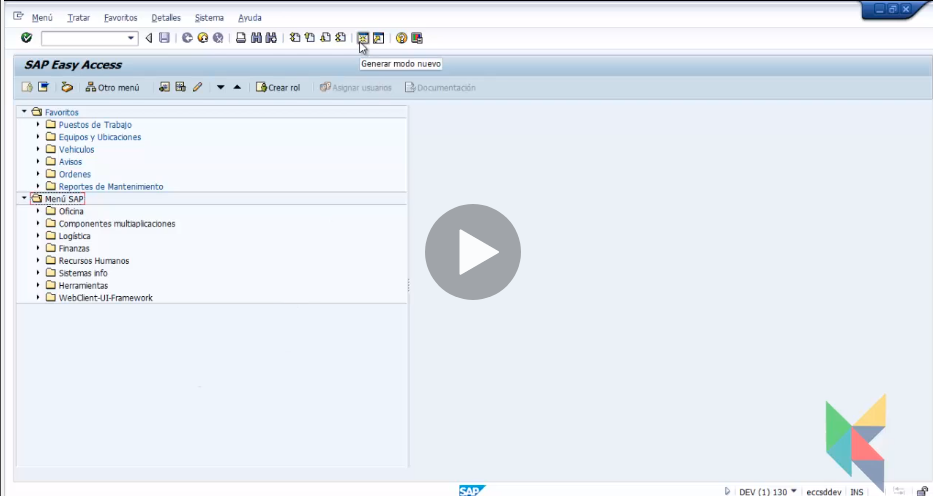

# SAP CURSO  

+ Systeme Anwendungen und Produkte que significa en español 'sistemas, aplicaciones y productos'.  

+ SAP ERP​ es un software de planificación de recursos empresariales desarrollado por la compañía alemana SAP SE. SAP ERP incorpora las funciones empresariales claves de una organización.  

+ Así, si tuviéramos que definir qué es SAP diríamos que es un software ERP (Enterprise Resource Planning), que permite planificar y gestionar los recursos de todas las áreas de la empresa: desde logística a contabilidad, pasando por el departamento comercial y de márketing, finanzas, producción, gestión de proyectos, de la calidad, mantenimiento o dirección y administración general.  

## ERP  

+ Enterprise Resource Planning, planificación de recursos empresariales.  

+ Es un conjunto de programas integrados que apoya las principales actividades organizacionales tales como finanza, contabilidad, logística, producción, ventas y recursos humanos.  

+ Caracteristicas:  
    - Procesos estandatizados
    - En linea
    - Bases de datos unica
    - Integrar todos los datos y procesos en un sistema único.
    - Configurable
    - Modular

## SAP  

+ System Applications and Products in data processing. Sistema, aplicaciones y productos en el procesamiento de datos.  

## ARQUITECTURA  

+ Estructura cliente - servidor

+ Estrucutra de ambiente de desarrollo - calidad - producción.  

+ SAP GUI es el programa que se instala el ordenador para porder acceder en remoto al servidor en una empresa.  

+ SAP LOGON es el programa que se utiliza para entrar o loguearse en SAP. Es como el iconito al clicar dos veces para conectarse y elegir a que servidor conectarse.  

## MODULOS SAP  

+ Formado por varios modulos interconectados entre ellos y que si hay datos en uno se referencian en los otros automaticamente.  

+ Modulos:  
    - FI (Finanzas)
    - CO (controling de costes)
    - MM (Materiales)
    - SD (venta y distribucion)
    - PP ( Produccion)
    - PM (mantemiento planta)
    - QM (calidad)
    - PS (proyectos)
    - HR (rrhh)
    - ABAP (programacion y desarrollo) 

## CONCEPTOS BASICOS  

+ Customizing: configuración que representa la estructura legal y los procesos de negocio de la empresa.  

+ Unidad Organizativa: representa la estructura jerarquica de la empresa en el sistema.  

+ Datos maestros: datos requeridos para realizar transacciones del proceso en el sistema(clientes, materiales, proveedores...)  

+ Batch Input: para la entrada de grandes cantidades de registros.  

+ Documentos: cada transacción registra datos en la bbdd, crea un documento con id unico.  

+ Transacción: procesos de negocio en el sistema SAP.  

+ Sistemas de información: transacciones guardadas.  

+ Z: programas desarrollados aparte.  

+ MODO SAP: cada pantalla del SAP.  

+ WORKFLOW: flujo de trabajo para optimizar procesos.  

+ DATOS MAESTROS: info que cambia poco y son campos obligatorios para rellenar(clientes, precios, proveedores..)  

## ESTRUCTURA ORGANIZATIVA  

  

## CONEXION A SAP  

  
  

## PANTALLA EASSY SAP  

  
  

## FAVORITOS  

  
  

## BARRA HERRAMIENTAS  

  

## BARRA DE MENU  

  

## MODOS  

  
  

## COMANDOS DE USO FRECUENTE 

+ En el cuadro de busqueda:  
    - /N - termina la transacción
    - /O - ver modos abiertos
    - /I - cierra la transaccion abierta
    - /Ntransacción - lleva a la trans indicada y cierra la actual.  
    - /NEND - salir del sistema pero avisa de cosas abiertas.
    - /NEX - cierra totalmente

## CAMPOS DIFERENTES  

  
  
