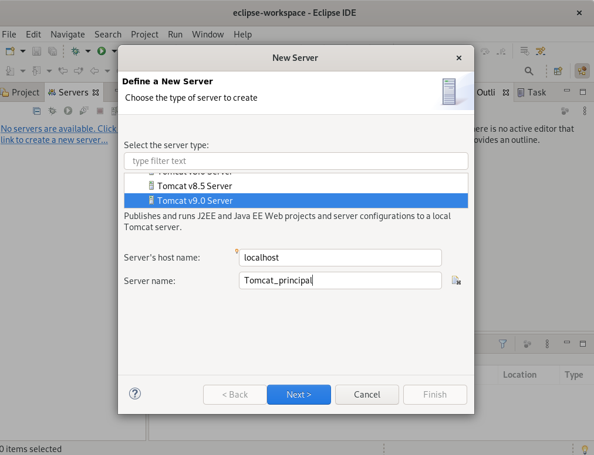

# APACHE TOMCAT  

+ [DOCUMENTACIÓN TOMCAT](https://tomcat.apache.org/)  

## Instalación:  

+ Seguimos los pasos de esta [web](https://www.digitalocean.com/community/tutorials/install-tomcat-9-ubuntu-1804-es):  

```
sudo apt update
sudo apt install default-jdk
sudo groupadd tomcat
sudo useradd -s /bin/false -g tomcat -d /home/ubuntu/tomcat tomcat
cd /tmp
curl -O paste_the_copied_link_here
sudo mkdir /home/ubuntu/tomcat
sudo tar xzvf apache-tomcat-*tar.gz -C /home/ubuntu/tomcat --strip-components=1
ubuntu@ip-172-31-38-253:~/tomcat$ cd /home/ubuntu/tomcat
ubuntu@ip-172-31-38-253:/home/ubuntu/tomcat$ sudo chgrp -R tomcat /home/ubuntu/tomcat
ubuntu@ip-172-31-38-253:/home/ubuntu/tomcat$ sudo chmod -R g+r conf
ubuntu@ip-172-31-38-253:/home/ubuntu/tomcat$ sudo chmod g+x conf
ubuntu@ip-172-31-38-253:/home/ubuntu/tomcat$ sudo chown -R tomcat webapps/ work/ temp/ logs/
ubuntu@ip-172-31-38-253:/home/ubuntu/tomcat$ sudo update-java-alternatives -l
java-1.11.0-openjdk-amd64      1111       /usr/lib/jvm/java-1.11.0-openjdk-amd64
ubuntu@ip-172-31-38-253:/home/ubuntu/tomcat$ sudo vim /etc/systemd/system/tomcat.service
ubuntu@ip-172-31-38-253:/home/ubuntu/tomcat$ sudo systemctl daemon-reload
ubuntu@ip-172-31-38-253:/home/ubuntu/tomcat$ sudo systemctl start tomcat
ubuntu@ip-172-31-38-253:/home/ubuntu/tomcat$ sudo systemctl status tomcat
● tomcat.service - Apache Tomcat Web Application Container
     Loaded: loaded (/etc/systemd/system/tomcat.service; disabled; vendor preset: enabled)
     Active: active (running) since Thu 2021-04-08 11:00:09 UTC; 4s ago
    Process: 4655 ExecStart=/home/ubuntu/tomcat/bin/startup.sh (code=exited, status=0/SUCCESS)
   Main PID: 4662 (java)
      Tasks: 30 (limit: 1160)
     Memory: 128.6M
     CGroup: /system.slice/tomcat.service
             └─4662 /usr/lib/jvm/java-1.11.0-openjdk-amd64/bin/java -Djava.util.logging.config.file=/home/ubuntu/tomcat/conf/>
Apr 08 11:00:09 ip-172-31-38-253 systemd[1]: Starting Apache Tomcat Web Application Container...
Apr 08 11:00:09 ip-172-31-38-253 startup.sh[4655]: Tomcat started.
Apr 08 11:00:09 ip-172-31-38-253 systemd[1]: Started Apache Tomcat Web Application Container.
ubuntu@ip-172-31-38-253:/home/ubuntu/tomcat$ sudo ufw allow 8080
Rules updated
Rules updated (v6)
ubuntu@ip-172-31-38-253:/home/ubuntu/tomcat$ sudo systemctl restart tomcat
sudo systemctl enable tomcat
ubuntu@ip-172-31-38-253:/home/ubuntu/tomcat$ sudo systemctl restart tomcat
ubuntu@ip-172-31-38-253:/home/ubuntu/tomcat$ sudo systemctl enable tomcat
Created symlink /etc/systemd/system/multi-user.target.wants/tomcat.service → /etc/systemd/system/tomcat.service.
ubuntu@ip-172-31-38-253:/home/ubuntu/tomcat$ sudo vi /home/ubuntu/tomcat/conf/tomcat-users.xml
ubuntu@ip-172-31-38-253:/home/ubuntu/tomcat$ sudo vi /home/ubuntu/tomcat/webapps/manager/META-INF/context.xml
ubuntu@ip-172-31-38-253:/home/ubuntu/tomcat$ sudo vi /home/ubuntu/tomcat/webapps/host-manager/META-INF/context.xml
ubuntu@ip-172-31-38-253:/home/ubuntu/tomcat$ sudo systemctl restart tomcat
```  

  

+ Podemos poner en -bashrc la variable JAVA_HOME de /usr/lib/lvm/java... para que tengamos la variable configurada.  

+ Levantamos servicios o despliegues con:  
`ubuntu@ip-172-31-38-253:/home/ubuntu/tomcat$ sudo  bin/catalina.sh // bin/startup.sh start`  

+ Comprobamos que está funcionando con:  
`root@ip-172-31-29-160:/home/ubuntu/tomcat/bin# ps ax | grep java`  

## DIRECTORIOS TOMCAT  

+ Tomcat directorios:  
```
/bin - Startup, shutdown, and other scripts. The *.sh files (for Unix systems) are functional duplicates of the *.bat files (for Windows systems). Since the Win32 command-line lacks certain functionality, there are some additional files in here.
/conf - Configuration files and related DTDs. The most important file in here is server.xml. It is the main configuration file for the container.
/logs - Log files are here by default.
/webapps - This is where your webapps go.
```  

+ CATALINA_HOME and CATALINA_BASE:  
```
CATALINA_HOME: Represents the root of your Tomcat installation, for example /home/tomcat/apache-tomcat-9.0.10 or C:\Program Files\apache-tomcat-9.0.10.
CATALINA_BASE: Represents the root of a runtime configuration of a specific Tomcat instance. If you want to have multiple Tomcat instances on one machine, use the CATALINA_BASE property.
If you set the properties to different locations, the CATALINA_HOME location contains static sources, such as .jar files, or binary files. The CATALINA_BASE location contains configuration files, log files, deployed applications, and other runtime requirements.
```  

+ Ejemplo APP:  
```
Sample Application
The example app has been packaged as a war file and can be downloaded here (Note: make sure your browser doesn't change file extension or append a new one).
The easiest way to run this application is simply to move the war file to your CATALINA_BASE/webapps directory. A default Tomcat install will automatically expand and deploy the application for you. You can view it with the following URL (assuming that you're running tomcat on port 8080 which is the default):
http://localhost:8080/sample
If you just want to browse the contents, you can unpack the war file with the jar command.
        jar -xvf sample.war     
Note: CATALINA_BASE is usually the directory in which you unpacked the Tomcat distribution. For more information on CATALINA_HOME, CATALINA_BASE and the difference between them see RUNNING.txt in the directory you unpacked your Tomcat distribution.
```  

+ Copiamos el ejemplo de demo app:  
```
[isx46410800@miguel .ssh]$ scp -i mykeypair.pem /home/isx46410800/Documents/tomcat/DemoApp.tar.gz  ubuntu@3.8.187.27:/home/ubuntu
DemoApp.tar.gz                                                                      100%    0     0.0KB/s   00:00 
```  

+ Estructura: el cliente se conecta al servidor por diferentes puertos que hace peticiones  como servicios. el engine se encarga de gestionar estas peticiones a través del host que contiene todas las aplicaciones que hay dentro del contexto.  

  


+ El fichero server.xml contiene la configuración global, central de tomcat. Catalina es el motor de los servlets, tomcat en sí.  

+ Catalina.properties se pueden configurar variables, cosas del sistema, tiene algunas librerías o paquetes. Se pueden cambiar o añadir [propiedades](https://tomcat.apache.org/tomcat-8.5-doc/config/systemprops.html)  

+ Con la orden `catalina.sh`(nos sale por poner la variable JAVA_HOME en el path):  
```
root@ip-172-31-29-160:/home/ubuntu/tomcat# catalina.sh version
Using CATALINA_BASE:   /home/ubuntu/tomcat
Using CATALINA_HOME:   /home/ubuntu/tomcat
Using CATALINA_TMPDIR: /home/ubuntu/tomcat/temp
Using JRE_HOME:        /usr
Using CLASSPATH:       /home/ubuntu/tomcat/bin/bootstrap.jar:/home/ubuntu/tomcat/bin/tomcat-juli.jar
Using CATALINA_OPTS:   
NOTE: Picked up JDK_JAVA_OPTIONS:  --add-opens=java.base/java.lang=ALL-UNNAMED --add-opens=java.base/java.io=ALL-UNNAMED --add-opens=java.base/java.util=ALL-UNNAMED --add-opens=java.base/java.util.concurrent=ALL-UNNAMED --add-opens=java.rmi/sun.rmi.transport=ALL-UNNAMED
Server version: Apache Tomcat/9.0.45
Server built:   Mar 30 2021 10:29:04 UTC
Server number:  9.0.45.0
OS Name:        Linux
OS Version:     5.4.0-1038-aws
Architecture:   amd64
JVM Version:    11.0.10+9-Ubuntu-0ubuntu1.20.04
JVM Vendor:     Ubuntu
```  
> Catalina base nos dice cual es la intancia activa, si hubiera varias instancias se debería poner cual es la activa.  

+ Tambien podemos poner la variable CATALINA_HOME en el bashrc para que nos pille ya el directorio de tomcat.  
```
export PATH=$PATH:/home/ubuntu/tomcat/bin
export JAVA_HOME=/usr/lib/jvm/java-11-openjdk-amd64/
export CATALINA_HOME=/home/ubuntu/tomcat
```  

+ Podemos usar catalina.sh _run_ para iniciar en foreground o _start_ en background.  


### PUERTO SHUTDOWN  

+ Podemos ver la [doc del server.xml](https://tomcat.apache.org/tomcat-8.5-doc/config/server.html) para diferentes configuraciones o objetos que se pueden poner.  

+ Unas buenas prácticas es desactivar el puerto de shutdown para que no se pueda hacer ni por tcp ni por remoto. Si recibimos una cadena de SHUTDOWN por cierto puerto, nos matan el tomcat.  

```
<Server port="8005" shutdown="SHUTDOWN">
---
root@ip-172-31-29-160:/home/ubuntu/tomcat/conf# telnet localhost 8005
Trying 127.0.0.1...
Connected to localhost.
Escape character is '^]'.
SHUTDOWN
Connection closed by foreign host.
root@ip-172-31-29-160:/home/ubuntu/tomcat/conf# ps ax | grep java
  15743 pts/0    S+     0:00 grep --color=auto java
```  

+ Para que no pase eso, segun la docu ponemos puerto -1 o cambiamos la string de shutdown por algo dificil de acertar:  
`<Server port="-1" shutdown="SHUTDOWN">`  

### JAVA_OPTS Y CATALINA_OPTS  

+ JAVA_OPTS es lo que coge java para todas las cosas java y CATALINA_OPTS son solo para cosas relacionadas con Tomcat.  


## DESPLIEGUE APPS  

+ Siempre que desplegamos algo tenemos que hacerlos en el directorio __webapps__ de tomcat. Podemos hacerlo copiando directamente el .war o el directorio con todo el contenido. Al rato veremos que se nos crea el directorio autodesplegado en webapps con el contenido del war copiado:  

`[isx46410800@miguel tomcat]$ sudo cp ejemploWAR/ejemplo.war /home/tomcat/tomcat/webapps/.`  

  

+ Con un directorio:  
```
[isx46410800@miguel tomcat]$ ll ejemploWARdir/web1/
total 20
-rw-r--r--. 1 isx46410800 isx46410800  309 Jul  5  2020 hello.jsp
drwxr-xr-x. 2 isx46410800 isx46410800 4096 Jul  5  2020 images
-rw-r--r--. 1 isx46410800 isx46410800  470 Jul  5  2020 index.html
drwxr-xr-x. 2 isx46410800 isx46410800 4096 Jul  5  2020 META-INF
drwxr-xr-x. 3 isx46410800 isx46410800 4096 Jul  5  2020 WEB-INF
[isx46410800@miguel tomcat]$ sudo cp -r ejemploWARdir/web1/ /home/tomcat/tomcat/webapps/.
```  

  

+ Si cambiamos algo, modificamos en el código fuente el index.html y hello.jsp. Luego tenemos que generar de nuevo el .jar en el directorio de todo el codigo fuente con `jar cvf ejemplo.war *` y esto lo copiamos en el webapps.  

+ Para quitar despliegues con solo eliminar el .war o el directorio, ya se hace undeploy.  


## INTEGRACION ECLIPSE CON TOMCAT  

+ Instale Eclipse IDE en CentOS, RHEL y Fedora:  
Se requiere una versión de Java 9 o superior para instalar Eclipse IDE y la forma más sencilla de instalar Oracle Java JDK desde los repositorios predeterminados.

`yum install java-11-openjdk-devel`  
`java -version`  

A continuación, abra un navegador, navegue hasta la página de descarga oficial de Eclipse y descargue la última versión del paquete tar específico para su arquitectura de distribución de Linux instalada.  

Alternativamente, también puede descargar el archivo de instalación de Eclipse IDE en su sistema a través de la utilidad wget, emitiendo el siguiente comando.  

`wget http://ftp.yz.yamagata-u.ac.jp/pub/eclipse/oomph/epp/2020-06/R/eclipse-inst-linux64.tar.gz`  

Una vez que se complete la descarga, navegue hasta el directorio donde se descargó el paquete de archivo y emita los siguientes comandos para comenzar a instalar Eclipse IDE.

`tar -xvf eclipse-inst-linux64.tar.gz`  
`cd eclipse-installer/`  
`sudo ./eclipse-inst`  

  
  
  
  
  
  
  
  
  
  
  
  

 

## TOMCAT MANAGER  

+ Añadimos en el fichero conf/tomcat-users.xml un usuario con privilegios para poder entrar:  
`<user username="admin" password="jupiter" roles="manager-gui,admin-gui"/>`  
> Para entrar: http://localhost:8888/manager/html  

+ Para desplegar una app vamos a browse seleccionamos el fichero .war y deploy. Despues se puede parar, undeploy, expirar sesion etc.  

+ Tambien se puede desplegar un dir(con solo todo el codigo descomprimido) o war con un path diferente nombre y no coja el nombre del archivo war o del directorio.  

  

+ Para utilizar el modo comando se ha de añadir en el fichero de conf/tomcat-users.xml:  
`<user username="admin" password="jupiter" roles="manager-gui,admin-gui,manager-script"/>`  
> Se entra en http://localhost:8888/manager/text/list  

+ Algunos comandos:  
        - http://localhost:8888/manager/text/serverinfo
        - http://localhost:8888/manager/text/list  
        - http://localhost:8888/manager/text/vminfo  
        - http://localhost:8888/manager/text/sessions?path=/app1  
        - http://localhost:8888/manager/text/threaddump
        - http://localhost:8888/manager/text/deploy?war=file:/tmp/app1.war
        - http://localhost:8888/manager/text/deploy?war=file:/tmp/app1&path=/app3
        - http://localhost:8888/manager/text/deploy?war=file:/tmp/app1.war&path=/app2
        - http://localhost:8888/manager/text/stop?path=/app2
        - http://localhost:8888/manager/text/start?path=/app2
        - http://localhost:8888/manager/text/expire?path=/app1&iddle=1
        - http://localhost:8888/manager/text/undeploy?path=/app3


## LOGS  

+ Fichero clave: conf/logging.properties.  

+ Los handers son los indicadores de a donde enrutamos las entradas de los logs de tomcat.  

```
handlers = 1catalina.org.apache.juli.AsyncFileHandler, 2localhost.org.apache.juli.AsyncFileHandler, 3manager.org.apache.juli.AsyncFileHandler, 4host-manager.org.apache.juli.AsyncFileHandler, java.util.logging.ConsoleHandler
#
.handlers = 1catalina.org.apache.juli.AsyncFileHandler, java.util.logging.ConsoleHandler
#
############################################################
# Handler specific properties.
# Describes specific configuration info for Handlers.
############################################################
#
1catalina.org.apache.juli.AsyncFileHandler.level = FINE
1catalina.org.apache.juli.AsyncFileHandler.directory = ${catalina.base}/logs
1catalina.org.apache.juli.AsyncFileHandler.prefix = catalina.
1catalina.org.apache.juli.AsyncFileHandler.maxDays = 90
1catalina.org.apache.juli.AsyncFileHandler.encoding = UTF-8
#
2localhost.org.apache.juli.AsyncFileHandler.level = FINE
2localhost.org.apache.juli.AsyncFileHandler.directory = ${catalina.base}/logs
2localhost.org.apache.juli.AsyncFileHandler.prefix = localhost.
2localhost.org.apache.juli.AsyncFileHandler.maxDays = 90
2localhost.org.apache.juli.AsyncFileHandler.encoding = UTF-8
#
3manager.org.apache.juli.AsyncFileHandler.level = FINE
3manager.org.apache.juli.AsyncFileHandler.directory = ${catalina.base}/logs
3manager.org.apache.juli.AsyncFileHandler.prefix = manager.
3manager.org.apache.juli.AsyncFileHandler.maxDays = 90
3manager.org.apache.juli.AsyncFileHandler.encoding = UTF-8
#
4host-manager.org.apache.juli.AsyncFileHandler.level = FINE
4host-manager.org.apache.juli.AsyncFileHandler.directory = ${catalina.base}/logs
4host-manager.org.apache.juli.AsyncFileHandler.prefix = host-manager.
4host-manager.org.apache.juli.AsyncFileHandler.maxDays = 90
4host-manager.org.apache.juli.AsyncFileHandler.encoding = UTF-8
#
java.util.logging.ConsoleHandler.level = FINE
java.util.logging.ConsoleHandler.formatter = org.apache.juli.OneLineFormatter
java.util.logging.ConsoleHandler.encoding = UTF-8
```
> el .handlers es el que coge de predeterminado  

+ [Documentación paquete JULI](http://tomcat.apache.org/tomcat-9.0-doc/api/org/apache/juli/package-summary.html)  

+ Estos handers del archivo coinciden con lo que tenemos en /logs:  
```
[tomcat@miguel tomcat]$ ll logs/
total 100
-rw-r-----. 1 tomcat tomcat 16752 may 19 13:55 catalina.2021-05-19.log
-rw-r-----. 1 tomcat tomcat 15599 may 20 20:53 catalina.2021-05-20.log
-rw-r-----. 1 tomcat tomcat 32351 may 20 20:53 catalina.out
-rw-r-----. 1 tomcat tomcat   175 may 19 13:28 host-manager.2021-05-19.log
-rw-r-----. 1 tomcat tomcat     0 may 20 20:23 host-manager.2021-05-20.log
-rw-r-----. 1 tomcat tomcat  1121 may 19 13:28 localhost.2021-05-19.log
-rw-r-----. 1 tomcat tomcat  1122 may 20 20:37 localhost.2021-05-20.log
-rw-r-----. 1 tomcat tomcat  2034 may 19 14:14 localhost_access_log.2021-05-19.txt
-rw-r-----. 1 tomcat tomcat  3656 may 20 20:53 localhost_access_log.2021-05-20.txt
-rw-r-----. 1 tomcat tomcat     0 may 19 13:25 manager.2021-05-19.log
-rw-r-----. 1 tomcat tomcat  4328 may 20 20:53 manager.2021-05-20.log
```  

+ Podemos personaliar uno:  
```
3manager.org.apache.juli.AsyncFileHandler.level = FINE
3manager.org.apache.juli.AsyncFileHandler.directory = ${catalina.base}/logs/mis-logs
3manager.org.apache.juli.AsyncFileHandler.prefix = manager.
3manager.org.apache.juli.AsyncFileHandler.maxDays = 90
3manager.org.apache.juli.AsyncFileHandler.encoding = UTF-8
3manager.org.apache.juli.AsyncFileHandler.formatter = java.util.logging.XMLFormatter
```  

+ Vemos que se genera contenido en el personalizado:  
```
[tomcat@miguel logs]$ ll mis-logs/
total 0
-rw-r-----. 1 tomcat tomcat 0 may 21 00:23 manager.2021-05-21.log
[tomcat@miguel logs]$ cat mis-logs/
cat: mis-logs/: Es un directorio
[tomcat@miguel logs]$ cat mis-logs/manager.2021-05-21.log 
[tomcat@miguel logs]$ cat mis-logs/manager.2021-05-21.log 
[tomcat@miguel logs]$ cat mis-logs/manager.2021-05-21.log 
<?xml version="1.0" encoding="UTF-8" standalone="no"?>
<!DOCTYPE log SYSTEM "logger.dtd">
<log>
<record>
  <date>2021-05-21T00:25:02</date>
  <millis>1621549502823</millis>
  <sequence>46</sequence>
  <logger>org.apache.catalina.core.ContainerBase.[Catalina].[localhost].[/manager]</logger>
  <level>INFO</level>
  <class>org.apache.catalina.core.ApplicationContext</class>
  <method>log</method>
  <thread>17</thread>
  <message>HTMLManager: init: Associated with Deployer 'Catalina:type=Deployer,host=localhost'</message>
</record>
```  

## VALVES  

+ Las valvulas son sistemas de seguridad para la hora de entrar a una aplicación etc, segun en que capa de servicio está especificada. [DOC VALVES](https://tomcat.apache.org/tomcat-9.0-doc/config/valve.html)  

+ Una personalizada:  
```
<Host name="localhost"  appBase="webapps"
            unpackWARs="true" autoDeploy="true">
        <!-- SingleSignOn valve, share authentication between web applications
             Documentation at: /docs/config/valve.html -->
        <!--
        <Valve className="org.apache.catalina.authenticator.SingleSignOn" />
        -->
        <!-- Access log processes all example.
             Documentation at: /docs/config/valve.html
             Note: The pattern used is equivalent to using pattern="common" -->
        <Valve className="org.apache.catalina.valves.AccessLogValve" directory="logs/mis-logs"
               prefix="localhost_access_log" suffix=".log"
               pattern="%h %l %u %t &quot;%r&quot; %s %b %B" />
      </Host>
```  

+ Vemos el contenido:  
```
[tomcat@miguel logs]$ ll mis-logs/
total 12
-rw-r-----. 1 tomcat tomcat  217 may 21 00:41 localhost_access_log.2021-05-21.log
-rw-r-----. 1 tomcat tomcat 5539 may 21 00:41 manager.2021-05-21.log
[tomcat@miguel logs]$ cat mis-logs/localhost_access_log.2021-05-21.log 
0:0:0:0:0:0:0:1 - admin [21/May/2021:00:41:22 +0200] "GET /manager/text/stop?path=/app2 HTTP/1.1" 200 70 70
0:0:0:0:0:0:0:1 - admin [21/May/2021:00:41:25 +0200] "GET /manager/text/start?path=/app2 HTTP/1.1" 200 73 73
```  

+ Ahora hacemos un ejemplo que permita o no unas ips o puertos:  

`<Valve className="org.apache.catalina.valves.RemoteAddrValve" allow="127\.\d+\.\d+\.\d+|::1|0:0:0:0:0:0:0:1"/>`  
> solo acceden los que tienen la ip de localhost 127.0.0.1. Si ponemos nuestra ip:8888 no nos deja porque no hemos entrado por la de localhost indicada en el valve.  


## JDBC BBDD  

+ Instalamos la herramienta [probe](https://github.com/psi-probe/psi-probe) para ver de otra manera el contenido de tomcat como una consola.  

+ Instalamos [mariadb](https://fedoraproject.org/wiki/MariaDB) como bbdd mysql.  
```
MariaDB [seguridad]> select * from usuarios;
+----------+
| nombre   |
+----------+
| Miguel   |
| Cristina |
| Isabel   |
+----------+
3 rows in set (0.000 sec)
MariaDB [seguridad]> create user 'desa'@'localhost' identified by 'desa';
Query OK, 0 rows affected (0.000 sec)
MariaDB [seguridad]> grant all on seguridad.* to 'desa'@'localhost';
Query OK, 0 rows affected (0.000 sec)
MariaDB [seguridad]> commit;
```  

+ Instalamos el [driver](https://mariadb.com/kb/en/mariadb-connector-j-2-6-1/) jdbc de mariadb en nuestro caso en:  
`[isx46410800@miguel tomcat]$ sudo cp ~/Downloads/mariadb-java-client-2.6.1-sources.jar /home/tomcat/lib`  

+ Configuramos el recurso de bbdd en tomcat que utilice ese driver de jdbc:  
```
<Context path="/jdbc" >
                    <Resource name="jdbc/cursoDB"
                        auth="Container"
                        type="javax.sql.DataSource"
                        username="desa"
                        password="desa"
                        driverClassName="org.mariadb.jdbc.Driver"
                        url="jdbc:mariadb://localhost:3306/seguridad"
                        initialSize="4"
                        maxActive="15"
                        maxIdle="3"/>
</Context>
```  

## REALM  

+ Son otras opciones de seguridad para en contra de Tomcat, proteger recursos, impedir accesos indeseados...
```
<!-- Use the LockOutRealm to prevent attempts to guess user passwords
           via a brute-force attack -->
      <Realm className="org.apache.catalina.realm.LockOutRealm">
        <!-- This Realm uses the UserDatabase configured in the global JNDI
             resources under the key "UserDatabase".  Any edits
             that are performed against this UserDatabase are immediately
             available for use by the Realm.  -->
        <Realm className="org.apache.catalina.realm.UserDatabaseRealm"
               resourceName="UserDatabase"/>
      </Realm>
```  

+ Sirven para proteger recursos webs y se basa en usuarios y roles asociados a las aplicaciones.  

+ Creamos un realm:  
```
<Context path="/ejeRealm">
                <Realm className="org.apache.catalina.realm.MemoryRealm" pathname="conf/usuarios.xml"/>
</Context>
```  

+ en usuarios.xml:  
```
<!xml version="1.0" enconding="UTF-8"?>
<tomcat-users>
        <user username="usu1" password="usu1" roles="usuario"/>
</tomcat-users>
```  

+ Y con la app que pasamos, indicamos que solo podrá entrar segun el usuario o roles indicados en la app.  


## APACHE CON TOMCAT  

+ Descargamos el conector [mod_jk](http://tomcat.apache.org/download-connectors.cgi)  

+ Luego tenemos que instalar como root una serie de paquetes como el paquete de http de desarrollador, el framework runtime apr para trabajar como dev, el compilador de c...  
`[root@miguel tomcat]# dnf install httpd-devel apr apr-devel apr-util apr-util-devel gcc make libtool`  

+ Despues vamos como root al directorio para compilar un arhcivo y meterlo en el tomcat lo que necesitamos.  

1- /home/isx46410800/Downloads/tomcat-connectors-1.2.48-src/native  
2- Configure para configurar, preparar librerias, el codigo fuente  
3- make para compilar  
4- make-install para instalar  
5- tendremos el fichero mod_jk.so para poder conectar el apache con el tomcat, y puedan entenderse entre ellos.  

```
[root@miguel native]# #./configure --with-apxs=/bin/apxs
[root@miguel native]# whereis apxs
apxs: /usr/bin/apxs /usr/share/man/man1/apxs.1.gz
[root@miguel native]# make
[root@miguel apache-2.0]# cd apache-2.0/
[root@miguel apache-2.0]# ll mod_jk.s*
-rwxr-xr-x. 1 root root 1961464 may 22 15:49 mod_jk.so
[root@miguel apache-2.0]# cp mod_jk.so /etc/httpd/modules/
```  

+ Despues añadimos un archivo a la configuracion de apache en /etc/httpd/conf/httpd.conf:  IncludeOptional conf/mod_jk.conf

```
[root@miguel conf]# cat mod_jk.conf 
    # Cargamos el modulo
	LoadModule jk_module modules/mod_jk.so
		
	# Indicamos dinde esta el fichero workers.properties
	JkWorkersFile conf/workers.properties
	
	# Podemos generar ficheros de log
	JkShmFile  logs/mod_jk.shm
	JkLogFile  logs/mod_jk.log
	
	JkLogLevel info
	
	# Con esto podemos monitorizar jkstatus
	JkMount /jkmanager/* jkstatus
	<Location /jkmanager/>		
	</Location>
	
	# Mapeamos las URL contra un conjunto de workers
	JkMount  /* MisTomcat
```  

+ Creamos nuestros ficheros de workers.properties de lo que será nuestros tomcats diferentes, clusters etc(conf/workers.properties).  
```
     # Lista de Workers
     worker.list=jkstatus, MisTomcat

     # Activar los workers
     #worker.jkstatus.type=status
     #worker.MisTomcat.type=lb

     # Añadir instancias como workers, 3 en este caso

     worker.worker1.type=ajp13
     worker.worker1.host=localhost
     worker.worker1.port=8009

     #worker.worker2.type=ajp13
     #worker.worker2.host=localhost
     #worker.worker2.port=9010

     #worker.worker3.type=ajp13
     #worker.worker3.host=localhost
     #worker.worker3.port=10011

     # Workers en el Load Balancer
     worker.MisTomcat.balance_workers=worker1
     #worker.MisTomcat.balance_workers=worker1,worker2,worker3
``` 
> Por ahora comentamos los workers2 y 3 porque solo trabajamos con uno.  

+ La info de el puerto y tipo ajp13 la vemos en la info de conf/server.xml y descomentamos la linea de ajp, indicamos los datos y añadimos un parametro para que no de fallo:  
```
<!-- Define an AJP 1.3 Connector on port 8009 -->
    <Connector protocol="AJP/1.3"
               address="::1"
               port="8009"
               secretRequired="false"
               redirectPort="8443" />
```  

+ Ahora vemos que al pasarle al localhost sin puerto algo, nos manda al tomcat:  

  


## CLUSTERS  

+ Instalaremos dos tomcats más y en cada uno de ellos modificamos el puertos y el ajp correspondiente:  
```
[tomcat@miguel ~]$ vim tomcat1/conf/server.xml 
[tomcat@miguel ~]$ vim tomcat2/conf/server.xml 
```  

+ Eliminamos la variable del .bashrc que apuntaba cual era el tomcat, ya que ahora al tener 3 no podemos indicar que sea el primero solo. También podemos abrir tres terminales y exportar la variable con el home correspondiente:  
`[tomcat@miguel tomcat1]$ export CATALINA_HOME=/home/tomcat/tomcat1`  

+ Despues arrancamos cada maquina desde su bin para que pille esa variable:  
`[tomcat@miguel bin]$ ./catalina.sh run`  

+ Ahora modificamos el worker.properties de apache para que haya 3 workers con su ajp correspondiente, en modo balanceador de carga y para que mantenga la sesion con el el sticky sesion:  

```
     # Lista de Workers
     worker.list=jkstatus, MisTomcat

     # Activar los workers
     #worker.jkstatus.type=status
     worker.MisTomcat.type=lb

     # Añadir instancias como workers, 3 en este caso

     worker.worker1.type=ajp13
     worker.worker1.host=localhost
     worker.worker1.port=8009

     worker.worker2.type=ajp13
     worker.worker2.host=localhost
     worker.worker2.port=9009

     worker.worker3.type=ajp13
     worker.worker3.host=localhost
     worker.worker3.port=7009

     # Workers en el Load Balancer
     #worker.MisTomcat.balance_workers=worker1
     worker.MisTomcat.balance_workers=worker1,worker2,worker3
     worker.MisTomcat.sticky_session=true
```  

+ Paramos y arrancamos de nuevo el apache.  

+ Para probar el entorno de cluster copiamos el war de cluster para saber en cual estoy en los 3 tomcats:  
```
[isx46410800@miguel tomcat]$ sudo cp cluster.war /home/tomcat/tomcat/webapps/.
[isx46410800@miguel tomcat]$ sudo cp cluster.war /home/tomcat/tomcat1/webapps/.
[isx46410800@miguel tomcat]$ sudo cp cluster.war /home/tomcat/tomcat2/webapps/.
```  

+ Probamos: http://localhost/cluster/hello.jsp  

  
  
  

+ Probamos la parte del jkstatus como worker:  
```
# Con esto podemos monitorizar jkstatus
        JkMount /jkmanager/* jkstatus
```  

+ Del worker properties:  
```
# Activar los workers
worker.jkstatus.type=status
```  

+ Comprobamos con http://localhost/jkmanager/  


## PERSISTENCIA EN TOMCAT  

+ Sirve para cuando estamos en una session alojada por ejemplo en tomcat 1, todo se quede alojado ahi y no recargue en otro tomcat y perdamos todo lo de la sesion.  

+ En el server.xml de cada uno añadimos el jvmroute. Lo que hace es identificar cada sesion con un ID de sesion y lo asigna al worker que ya indicamos el el worker.properties:  
`<Engine name="Catalina" defaultHost="localhost" jvmRoute="worker1">`  
`<Engine name="Catalina" defaultHost="localhost" jvmRoute="worker2">`  
`<Engine name="Catalina" defaultHost="localhost" jvmRoute="worker3">`  

+ Descomentamos también la opcion de [cluster](https://tomcat.apache.org/tomcat-9.0-doc/cluster-howto.html):  
`<Cluster className="org.apache.catalina.ha.tcp.SimpleTcpCluster"/>`  

+ Si vamos al navegador y ponemos ajustes - web developer -storage inspector, veremos que nos sale siempre el mismo id worker de la sesion.  


## VIRTUALHOSTS  

+ Estos crea dentro de un mismo tomcat, diferentes dominios repartidos para que segun lo que sea, trabaja una cosa u otra.  

+ En server.xml ponemos:  
```
     #Virtual host 1
       <Host name="empresa1.com"  appBase="webapps" unpackWARs="true" autoDeploy="true">
           <Alias>www.empresa1.com</Alias>

            <Valve className="org.apache.catalina.valves.AccessLogValve" directory="logs"
               prefix="example_access_log" suffix=".txt"
               pattern="%h %l %u %t %r %s %b" />

            <Context path="" docBase="/home/tomcat/tomcat/webapps/empresa1" debug="0" reloadable="true"/>
      </Host>


     #Virtual host 2
      <Host name="empresa2.com"  appBase="webapps" unpackWARs="true" autoDeploy="true">
          <Alias>www.empresa2.com</Alias>

           <Valve className="org.apache.catalina.valves.AccessLogValve" directory="logs"
                prefix="mydomain_access_log" suffix=".txt"
                pattern="%h %l %u %t %r %s %b" />

           <Context path="" docBase="/home/tomcat/tomcat/webapps/empresa2" debug="0" reloadable="true"/>
      </Host>
```
> el alias es a lo que responde la petición, con este nombre referido.  

+ Para probar estos alias tenemos que ponerlos en el etc/hosts, dns o en el hosting.  
```
192.168.1.113 www.empresa1.com
192.168.1.113 www.empresa2.com
```  

+ Copiamos la app de prueba de virtual host y comprobamos que por los dos alias te responde segun lo indicado en el server.xml  

  
  


+ Tenemos una herramienta que es el VHOST MANAGER. Para ello necesitamos crear un usuario con los permisos en el tomcat-users.xml:  
`<user username="admin1" password="jupiter" roles="admin-gui,admin-script"/>`

+ Rebotamos y entramos desde inicio - host manager o http://localhost:8888/host-manager/html

  


+ Aquí podemos eliminar, añadirlo con opciones indicadas y para que se guarde los cambios a final de pagina hemos de añadir la siguiente directiz en server.xml.  
`<Listener className="org.apache.catalina.storeconfig.StoreConfigLifecycleListener"/>`


