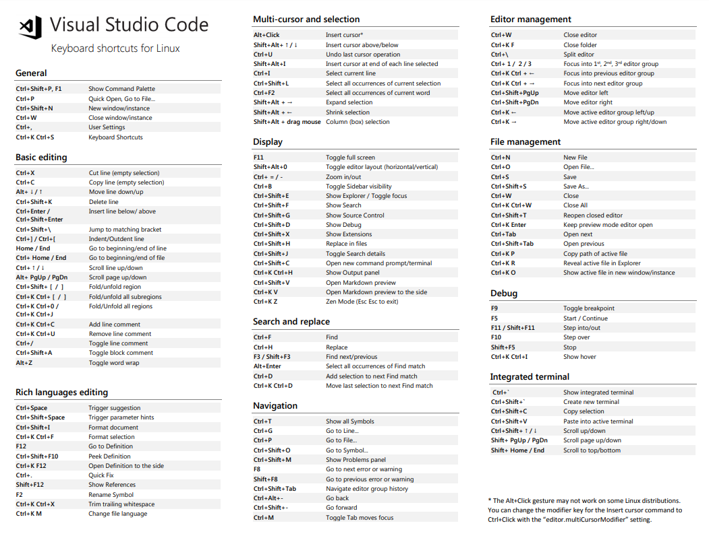

# VISUAL STUDIO CODE  

+ Partimos del curso gratis con tips de [VSCODE](https://github.com/Klerith/curso-VSCode)  

  

## EDICIONES Y TIPS BÁSICOS  

### SELECCIONAR ALGO  

+ Se apreta SHIFT + FLECHAS  

### QUITAR ESPACIOS  

+ Se apreta SHIFT + TAB  

### QUITAR BARRA LATERAL  

+ Se apreta CONTROL + b  

### ORDENAR LINEAS  

+ Se apreta ALT + FLECHA ARRIBA/ABAJO en cualquier parte de la frase y movemos para cambiar el orden:  
```
<ul>
    <li>Línea 1</li>
    <li>Línea 2</li>
    <li>Línea 3</li>
    <li>Línea 4</li>
    <li>Línea 5</li>
    <li>Línea 6</li>
    <li>Línea 7</li>
</ul>
```  

+ Para lineas de más de una linea se SELECCIONA TODAS LAS LINEAS y se apreta ALT + FLECHA ARRIBA/ABAJO:  
```
<ul>
    <li>
        <span>línea 1</span>
        <span>Nada importante 1</span>
    </li>
    <li>
        <span>línea 2</span>
        <span>Nada importante 2</span>
    </li>
    <li>
        <li>
            <span>línea 3</span>
            <span>Nada importante 3</span>
    </li>
        <span>línea 4</span>
        <span>Nada importante 4</span>
    </li>
</ul>
```  

### COMENTAR CÓDIGO  

+ Se apreta CONTROL + SHIFT + A o CONTROL + SHIFT + /  

+ Para trozos en medio de frases solo la opción de CONTROL + SHIFT + A.  

### CREAR UNA RUTA DE ARCHIVO 

+ Apretamos CONTROL + CLICK y creamos file de la ruta clicada y se crea todos los direcotorios y ficheros:  
`<script src="assets/js/app.js"></script>`  

+ También sirve para ir a una función concreta de un archivo enlazado.  

+ O vista previa sin salir del documento con SHIFT + F12.  

### BORRAR LINEAS  

+ Borra una linea CONTROL + SHIFT + K.  

+ Borrar todo que se llame igual CONTROL + SHIFT + L y CONTROL + SHIFT + K.  

### REHACER / DESHACER  

+ CONTROL + Z deshacer.  

+ CONTROL + SHIFT + Z rehacer.  

### ZEN MODE  

+ Se apreta CONTROL + K y luego Z.  

### NAVEGACIÓN PESTAÑAS  

```
Ctrl + W            Cerrar tab
Ctrl + K  Ctrl + W  Cerrar todas
Ctrl + Shift + T    Reabrir anterior
Ctrl + TAB          Cambiar de tab
```  

### ABRIR TERMINAL  

+ Se apreta CONTROL + ` o icono abajo derecha de >.  

+ Aqui se puede usar como bash normal, abrir mas terminales, matar terminal, etc.

### LLAMAR A LA PALETA DE BUSQUEDA  

+ Se apreta CONTROL + SHIFT + P.  

+ Ejemplo de wrap with abreviation y despues como queremos encapsular unas palabras: code, ul>li...

### CONFIGURAR UN SHORTCUT.  

+ Manage -> keyboard shorcuts -> buscamos por ejemos wrap y ponemos la combinación que queremos.  

+ Tambien CONTROL + K + CONTROL + S.


## MULTICURSORES Y EDICIÓN RÁPIDA  

### CLONAR LINEAS  

+ Shortcut COPY LINE DOWN Y UP.  

### CREAR MULTICURSOR ARRIBA/ABAJO  

+ Se apreta CONTROL + SHIFT + FLECHAS y escribes una sola vez que sirve para todo.  

### MULTICURSOS CON COPY  

+ Partimos de:  
```
<span>amarillo</span>
<span>rojo</span>
<span>verde</span>
<span>naranja</span>
<span>morado</span>
<span>negro</span>
<span>blanco</span>
```  

+ Creamos un cursos despues de span, luego nos ponemos inico de la palabra del color y CONTROL + SHIFT + FELCHA ADELANTE, copiamos, vamos para atras y pegamos:  
```
<span class="amarillo">amarillo</span>
<span class="rojo">rojo</span>
<span class="verde">verde</span>
<span class="naranja">naranja</span>
<span class="morado">morado</span>
<span class="negro">negro</span>
<span class="blanco">blanco</span>
```  

### MULTICURSOR PARA FORMATO  

+ Se crea multicursor con CONTROL + SHIFT + FLECHAS y damos espacios para quedar alineado.  

+ De palabras seleccionamos con ALT copiamos, vamos para atras y pegar:  
```
<span>amarillo</span>
<p>rojo</p>
<div-personalizado>verde</div-personalizado>
<bold>naranja</bold>
<otro-div-complejo>naranja-azul</otro-div-complejo>
<!-- Objetivo final -->
<span class="amarillo">amarillo</span>
<p class="rojo">rojo</p>
<div-personalizado class="verde">verde</div-personalizado>
<bold class="naranja">naranja</bold>
<otro-div-complejo class="naranja-azul">naranja-azul</otro-div-complejo>
```  

### LOWECASE / UPPERCASE  

+ Creamos multicursor y CONTROL + SHIFT + U/L  

### SELECCION VARIAS COSAS A LA VEZ  

+ CONTROL + D.  


## DEFINICIONES Y SNIPPETS  

### BUSCAR DEFINICIONES  

+ Ctrl + P => luego escribir la @:  
+ Ctrl + Shift = O  

### BUSCAR LINEAS  

+ CONTROL + P + :nºlinea 

### MARKDOWN PREVIEW  

+ CONTROL + SHIFT + V  

+ CONTROL + K V 

+ Ctrl + P : Markdown Open Preview  

+ Ctrl + P : Markdown Open Preview to the side  

### REPLACE SYMBOL  

+ Para reemplazar la misma palabra en todos los documentos enlazados o llamados se apreta F2.  

### CREAR SNIPPET  

+ Es un fragmento de código ya creado y poder llamarlo.  

+ Manage -> usar snippet -> elegir lenguaje.  

```
"Print to console": {
		"prefix": "log",
		"body": [
			"console.log('${1:Hola mundo}');",
			"$2"
		],
		"description": "Log output to console"
	}
```  

+ Lo llamamos con el nombre del 'prefix'.  


## EXTENSIONES  

+ PASTE JSON AS CODE  
+ TERMINAL  
+ TODO FREE  
+ BOOKMARKS  
+ MATERIAL ICON THEME  
+ MATERIAL THEME  
+ LIVE SERVER  
+ COLOR HIGHLIGHT  
+ BRAKET PAIR COLORIZED 2  
+ GIT  
    - https://code.visualstudio.com/docs/editor/versioncontrol  
    - https://code.visualstudio.com/docs/editor/github
+ DOCKER  
    - https://marketplace.visualstudio.com/items?itemName=ms-azuretools.vscode-docker  
    - https://code.visualstudio.com/docs/containers/overview


