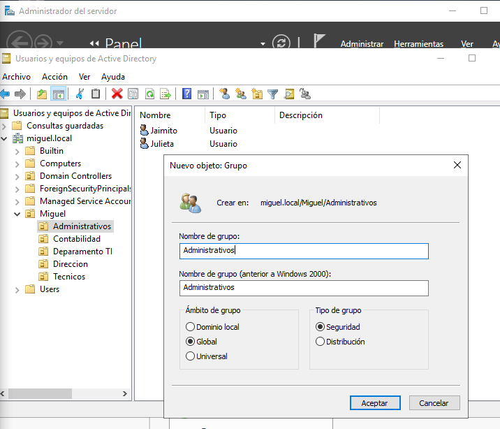
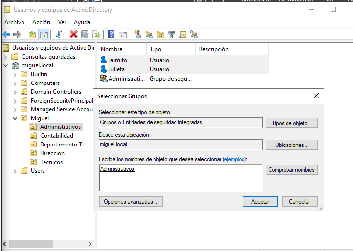
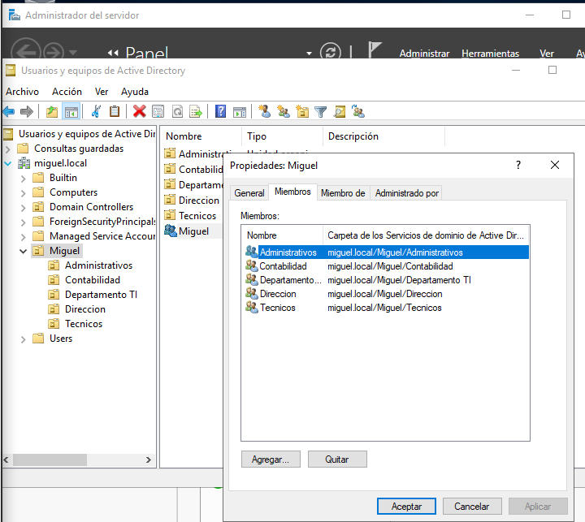
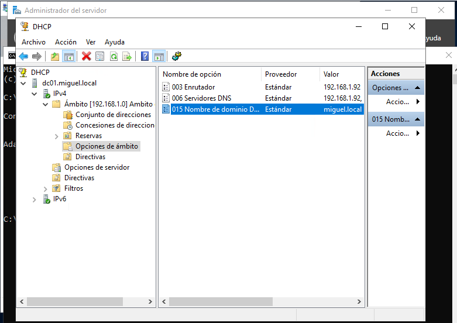

# ADMINISTRAR WINDOWS SERVER 2019  

## INSTALACIÓN  

+ Para probar lo haremos con una maquina virtual. En este caso probaremos con __HYPER-V__, una herramienta de virtualización propia de windows que utiliza un hypervisor.  

+ Hyper-V es un programa de virtualización de Microsoft basado en un hipervisor para los sistemas de 64 bits​ con los procesadores basados en AMD-V o Tecnología de virtualización Intel.  

+ Un hipervisor o monitor de máquina virtual ​ es una plataforma que permite aplicar diversas técnicas de control de virtualización para utilizar, al mismo tiempo, diferentes sistemas operativos en una misma computadora.  

+ Los windows 10 home no lo tienen, no obstante con este fichero lo podremos aplicar: [Enable HYPER-V](https://mega.nz/file/BNQDkA5D#uBn_TK3Yw5DF_VK3GZFaQ2mQqsRZLq_r0KwmvMEvWT4)  

+ Al reiniciar si no funciona directamente tendremos que hacer las siguientes opciones:  
    1. Habilitar virtualización en la BIOS
    2. En la powershell comando `bcdedit /set hypervisorlaunchtype auto`
    3. En la powershell comando `dism /online /enable-feature /featurename:Microsoft-Hyper-V -All`  

+ Iniciamos maquina virtual y configuramos:  
    - Idioma/Región
    - S.O. versión standard evaluation con experiencia de escritorio para que tenga ventanas y no solo consola
    - Instalación personalizada (si le damos a SHIFT+F10 nos abre una consola de cmd para poder hacer cosas también)
    - Varios reinicios
    - Contraseña administrador

+ El controlador de dominio es el centro neurálgico de un dominio Windows, tal como un servidor Network Information Service (NIS) lo es del servicio de información de una red Unix.

+ Los controladores de dominio tienen una serie de responsabilidades, y una de ellas es la autenticación, que es el proceso de garantizar o denegar a un usuario el acceso a recursos compartidos o a otra máquina de la red, normalmente a través del uso de una contraseña. Esto permite validar a los usuarios de una red para ser partes de la plataforma de clientes que recibirán los servicios de información.

+ Cada controlador de dominio usa un security account manager (SAM), o NTDS en Windows 2003 Server (que es la forma promovida de la SAM, al pasar como controlador de dominio), para mantener una lista de pares de nombre de usuario y contraseña. El controlador de dominio entonces crea un repositorio centralizado de contraseñas, que están enlazados a los nombres de usuarios (una clave por usuario), lo cual es más eficiente que mantener en cada máquina cliente centenares de claves para cada recurso de red disponible.

+ En un dominio Windows, cuando un cliente no autorizado solicita un acceso a los recursos compartidos de un servidor, el servidor actúa y pregunta al controlador de dominio si ese usuario está autentificado. Si lo está, el servidor establecerá una conexión de sesión con los derechos de acceso correspondientes para ese servicio y usuario. Si no lo está, la conexión es denegada.

+ Una vez que el controlador de dominio autentifica a un usuario, se devuelve al cliente una ficha especial (token) de autenticación, de manera que el usuario no necesitará volver a iniciar sesión para acceder a otros recursos en dicho dominio, ya que el usuario se considera autentificado en el dominio.


## SERVER MANAGER  

+ El server manager(administrador del servidor) es el aplicativo para configurar todas las cosas del server.

+ Antes miramos las tarjetas de red con el comando `ncpa.cpl`. Elegimos la tarjeta - propiedades - ipv4 - propiedades y indicamos la IP que queremos ponerle. 


+ Cambiar nombre en `servidor local` y lo ponemos como un control de dominio(domain controller):  


+ En servidor local activamos el escritorio remoto y desactivamos aqui solo(en produccion no) la seguridad de Iexplorer.

+ En servidor local abajo en rendimiento, iniciamos contador y a la dercha configuramos las alertas para 7 dias.

+ En servidor local , parte arriba derecha en administrar le damos a agregar roles y caracteristicas. Seleccionamos el servidor y despues en roles de servidor, seleccionamos `servicios de dominio de Active Directory`. Siguiente, siguiente e instalamos.

    - En powershell sería con el comando `install-windowsfeature` y para ver los que hay `get-windowsfeature`


+ Despues de instalar le damos a promover servicio para configurar el AD:  

  

  
> Si se trabaja con aparatos mas antiguos, el nivel funcional hay que bajarlos.  

Siguiente pantalla
  
  
  

+ En Panel - derecha Herramientas - DNS:  
    - En DC01 boton derecho ejecutar nslookup(nos sale unkown)
    - Solucinamos dandole a zona inversa crear nueva. Siguiente hasta encontrar el cajon de poner ip, ponemos 192.168.1
    - Ahora actualizamos el puntero PTR en la directa dando boton derecho a la de la ip y le damos a actualizar y nos sale
    - En boton derecho DC01 propiedades - reenviadores le ponemos los DNS. En revisión hacemos la prueba

  
  
  
  


## ESTRUCTURANDO EL AD  

+ Representaremos este ejemplo:  
  

+ Vamos al Panel - derecha Herramientas - Usuarios y equipos de Active Directory.  

+ Entramos a la organización creada de miguel.local y dentro creamos la organización global `Miguel` con boton derecho - nuevo - organización.
> Hemos creado un global porque luego para crear directivas de grupo, afectará a todo lo de abajo y sino tendriamos problemas porque afectaria a cosas que estan en la misma altura que no queremos que tengan esto.

  
  

+ Ahora entramos en esta y vamos creando dentro nuevos deparamentos:  

  

+ Si tenemos algun error, al tener la casilla marcada de no poder eliminar. Vamos al menu ver - caracteriticas avanzadas - buscamos el departamento - propiedades - recursos y eliminamos la casilla y luego ya podremos mover o eliminar ese departamento.  

  

+ Ahora entramos en cada departamento y vamos creando usuarios en cada uno con una misma contraseña.  

  
  

+ Ahora dentro de cada departamento , creamos un grupo con el mismo nombre. Esto se hace para poder luego compartir recursos, ya que por unidades organizativas no se puede.  

  

+ El departamento global de `Miguel` tambien tiene que tener un grupo creado. Porque asi si creamos un recurso o algo global, si se lo damos a esto, se lo aplica a todos los de su union:  

  

+ Ahora en cada departamento, seleccionamos todos los usuarios que hayan, boton derecho asignar un nuevo grupo. Escribimos el nombre del grupo, le damos a comprobar nombres y aceptamos. Si entramos a las propiedades del grupo, veremos que están como miembros.  

  
  
  


+ Despues de cada grupo, lo asignamos al grupo general `Miguel`.

  


## GPO  

+ Cpanel - Herramientas - Administracion de directivas de grupo. Todas las directivas se guardan en objetos de directivas de grupo.  

+ Vemos la que hay y las configuraciones que tienen:  

  
  

+ Para editar una vamos a boton derecho y editar. Desde aquí para modificar algo se busca siguiendo la misma ruta que en la configuración.  

  

+ Para crear una directiva de grupo(GPO) vamos a objetos y boton derecho crear. Todas las GPO para vincularlas necesitan una unidad organizativa. Para ello, vamos a la unidad de Contabilidad, boton derecho y vincular a la creada.  

  
  
  

+ Tambien se puede crear directamente yendo a la unidad y boton derecho crear GPO y vincular:  

  
  

+ GPO de inicio: sirve para que esa directiva sea comun para todos. Vamos a GPO de inicio y crear. Unas de las más comunes es el fondo de escritorio o que no usen los USB. Para crear una, en contenido boton derecho nuevo.

  

+ Ahora si creamos una directiva de grupo, le podemos indicar que sea como base la de inicio:  

  

+ Para editar una GPO de inicio, entramos vamos a configuracion boton derecho edicion. Tocamos lo que sea y en la proxima GPO que creemos veremos que tiene estas configuraciones, partirá con la reciente modificación. Siempre parten de como esten en ese momento, los cambios no afectan a todas las que esten asignadas.  

  
  
  

+ Se puede crear GPO para la raiz y hereda para todos. No obstante, si queremos que algun departamento no herede, vamos a la unidad organizativa, boton derecho eliminar herencia:  

  
  

+ No obstante, aunque se quita la herencia. Si las GPO de la raiz le doy boton derecho y exigido. La van a tener si o si:  

  
  

+ La parte ultima de resultados de directivas de grupo, se puede generar un informe de un usuario/grupo de todas las directivas que tiene.  

  
> Se puede hacer por consola con la orden `gpresult /h file.html`  


## RAS(Remote Access Server)  

+ Primero instalamos el servicio de enrutamiento. Cpanel - administrar - roles y caracteristicas. En este caso seleccionamos acceso remoto que es donde esta y en los servicios agregamos enrutamiento. Todo siguiente hasta instalar.  

  
  

+ Una vez instalado vamos a herramientas - enrutamiento y acceso remoto
  

+ Vamos a boton derecho en DC01 y configurar, despues a tradducion de NAT y elegimos cual es la interfaz a la que conectarse y aceptar.  

+ NAT permite que con una solo IP publica puedan varios dispositivos salir a internet por esta IP

## DHCP  

+ Primero instalamos el servicio de enrutamiento. Cpanel - administrar - roles y caracteristicas. En este caso seleccionamos DHCP que es donde esta y en los servicios agregamos enrutamiento. Todo siguiente hasta instalar.  

  

+ Despues de con configuración posterior, vamos a herramientas - dhcp. En ipv4 creamos ambito nuevo, ponemos la ip del servidor y le damos un rango a partir de la siguiente a esa ip.    

  


## PRACTICA DC Y 3 SERVERS

- Nombre servidor: dc01
-Tarjetas de Red propia y privada(ip/dnd 192.168.16.100
- Instalar active directory y configurar nuevo bosque 
- Hacer dns inverso de la red 192.168.16
- Instalar acceso remoto y enruntamiento, configurar enruntamiento, opción Nat con la Red wan  
- instalar Dhcp y configurar. Creamos ámbito, rango de ips 1-50 ejemplo. Puerta enlace será nuestra ip del server
- abrimos otra máquina de Windows y probamos que se pueda conectar x Dhcp del server y pueda navegar. No conectar directo a la Red que sale. 
- crear unidades/usuarios con centro de administración de AD o en grupo de unidades organizativas o usuarios y equipos AD. Siempre creamos una raíz. Los usuarios gestionamos su horario de conexión. Podemos hacer uno de modo plantilla y el resto copiar a partir de ahí. Creamos un grupo tmb de cada cosa. Agregamos cada usuario a su grupo. Y grupo con subgrupos
-  instalamos en servicio de archivos - scsi - desduplicacion de datos. En configuración luego en volúmenes seleccionamos que unidad queremos hacerlo y su programación. Esto ahorra mucho espacio y junta fragmentos de mismo archivos.
- crear una GPO de política en objetos de administración de unidades organizativas y editamos. Habilitamos directiva de redes y el ping(firewall permitir excepciones compartir archivos e impresoras entrantes y ponemos la ip de la Red global) y la de (firewallbpermir excepciones icmp). Tmb inicio de sesión interactivo título mensaje al iniciar y luego el de texto mensaje. Vinculamos esta política a la unidad general creada para que solo afecte a ellos.  
- instalamos en servicios archivos de almacenamiento - scsi - administrador de recursos del servidor de archivos. Dentro en características añadimos copias de seguridad de Windows server.  
- creamos una copia de seguridad - programamos personalizada todo lo que queremos hacer de copia y donde guardarlo. 
- en recursos compartidos - tarea nuevo recurso y seleccionar carpeta a compartir y seleccionar quién puede acceder y sus permisos.  
Podemos decir que en la carpeta compartida los users no puedan almacenar cierto tipo de archivos. Vamos a herramientas - administrador de recursos compartidos del servidor - filtrado - filtros. Seleccionamos carpeta y ponemos po ejemplo bloquear archivos d audio y vídeo. 
También podemos crear cuota para ponerle límites a las carpetas
- abrimos otro Windows y cambiamos nombre del equipo y lueg lo añadimos al dominio creado. 
- se puede hacer una prueba de reiniciar remotamente el equipo desde cmd server. 
- de un volumen o disco podemos ir a propiedades y habilitar instantáneas para poder volver a Estados anteriores. 
- recuperar servidor desde una copia de seguridad. Arrancamos con la iso, reparar equipo, solucionar problemas, recuperar de una imagen del sistema y elegimos la copia. 
- vpn modo sencillo: enrutamienti y acceso remoto. Botón derecho y en mi dc01 y configurar. Seleccionar vpn y elegimos interfaz que da Internet wan. Automáticamente elegimos, no radius. Vamos a otro equipo,configuración de vpn
- vpn manual. Lo mismo pero elegimos Nat la interfaz. Propiedades de dc01, enrutador de la y servidor remoto. En ipv4 creamos interfaz /protó igmp(wan proxy y lan enrutador). Interfaz /protó Nat (wan interfaz Internet y habilitar;puertos de puerta enlace y de seguridad 4,ip loop, lan interfaz privada). Puertos/clientes propiedades (enrutador enrutamienti y servidor ipv4. Puertos propiedades activamos las dos opciones. 

- 3 servers; ras, Dhcp, AD.  
AD en dominio con puerta enlace ras y dns el mismo 192.168.16.200 // 254//200
Ras dis interfaces. 192.168.100. 254 se instala enrutamiento y acceso remoto. 
Dhcp instala Dhcp puerta enlace ras //251 //254
En el ad se añade d servidor el dhcp
Cliente coge IP del dhcp k coge Internet por el ras 


## NOTAS  

+ Nat Y Red interna. Dhcp el del otro adaptador

+ Crear equipos en herramientas de directivas de grupo, y en los usuarios creados cuando inicien sesión, en propiedades del sistema, agregar al dominio creado. En Linux en admin - autenticació - cuentas de usuarios de winbind. Controladores es la IP y dominio con nombre corto

+ Agregar características para recursos compartidos y creamos una carpeta que sea compartida por los usuarios que digamos

+ Si conectamos otro pc cn sistema en la misma Red interna del Dhcp como adaptador, le da la IP el dhcp

+ Comandos cmd.:
```
D:

dir

hostname

sconfig

cd c:\Windows\ruta

shutdown 

Comandos powershell:

dsadd agregar objetos, cuentas... 
```

+ Crear vlans:

    En Dhcp creamos ámbitos con diferentes rangos de ups y después activamos ámbito. 

    En opciones de servidores se crean los registros que serán comunes para todos los ambitos: se añaden registros ips d dns, correo, enrutador

    Se puede crear superambito para unir zonas de ámbito como por ejemplo pisos de un sitio. 

    Las reservas sirven para reservar la misma IP al que se conecta 

    En dns se crean las zonas inversas de cada Red añadida


## ACTIVE DIRECTORY  

+ Por powershell vemos las caracteristicas e instalamos:  
`Get-WindowsFeature`  
`Install-WindowsFeature ad-domain-services, dns, dhcpserver, dhcp, rsat-dhcp -IncludeAllSubFeature`  
`Get-Command -module dhcpserver`  
`Import-Module / Import-Module addsdeployment`  


## MICROSOFT INTUNE  

+ [Microsoft Intune](https://docs.microsoft.com/es-es/mem/intune/fundamentals/what-is-intune) es un servicio basado en la nube que se centra en la administración de dispositivos móviles (MDM) y en la administración de aplicaciones móviles (MAM). Puede controlar cómo se usan los dispositivos de la organización, incluidos los teléfonos móviles, las tabletas y los equipos portátiles. También puede configurar directivas específicas para controlar las aplicaciones. Por ejemplo, puede evitar que se envíen mensajes de correo electrónico a personas ajenas a la organización. Intune también permite que las personas de la organización usen sus dispositivos personales para la escuela o el trabajo. En los dispositivos personales, Intune ayuda a que los datos de la organización permanezcan protegidos y puede aislar los datos de la organización de los datos personales:  
    + Elegir estar al 100 % en una nube con Intune, o aplicar una administración conjunta con Configuration Manager e Intune.  
    + Establecer reglas y configurar opciones en dispositivos personales y de propiedad de la organización para que obtengan acceso a los datos y las redes.  
    + Implementar y autenticar aplicaciones en dispositivos, locales y móviles.  
    + Proteger la información de la empresa controlando la forma en que los usuarios acceden a la información y la comparten.  
    + Asegurarse de que los dispositivos y las aplicaciones cumplan los requisitos de seguridad.


+ [TUTORIAL Microsoft Intune](https://docs.microsoft.com/es-es/mem/intune/fundamentals/tutorial-walkthrough-endpoint-manager), que forma parte de Microsoft Endpoint Manager, proporciona la infraestructura en la nube, la administración de dispositivos móviles (MDM) basada en la nube, la administración de aplicaciones móviles (MAM) basada en la nube y la administración de equipos basada en la nube para su organización. Intune ayuda a asegurarse de que los dispositivos, aplicaciones y datos empresariales cumplen los requisitos de seguridad de la empresa. Tiene el control para establecer qué requisitos se deben comprobar y qué sucede cuando no se cumplen. En el Centro de administración de Microsoft Endpoint Manager puede encontrar el servicio Microsoft Intune, así como otras opciones relacionadas con la administración de dispositivos. Comprender las características disponibles en Intune le ayudará a realizar diferentes tareas de administración de dispositivos móviles (MDM) y administración de aplicaciones móviles (MAM).  

+ Podemos acceder desde:  
    - Microsoft azure - intune
    - En devicemanagement.microsoft.com  
    - En portal.manage.microsoft.com (en usuarios finales)  

+ MICROSOFT AZURE ACTIVE DIRECTORY CONNECT es la herramienta para vincular la sincronizacion de AD con Intune para que los usuarios puedan acceder a los recursos locales y de la nube.  

+ [AUTOPILOT](https://docs.microsoft.com/es-es/mem/autopilot/)  es un conjunto de tecnologías que se utilizan para configurar y preconfigurar nuevos dispositivos, preparándolos para un uso productivo. Windows Autopilot se puede usar para implementar Windows equipos o HoloLens 2 dispositivos. Para obtener más información acerca de cómo implementar HoloLens 2 con Autopilot, vea Windows Autopilot for HoloLens 2.

+ También se puede usar Windows Autopilot para restablecer, reasignar y recuperar dispositivos. Esta solución permite a un departamento de TI lograr lo anterior con poca o ninguna infraestructura que administrar, con un proceso fácil y sencillo.

+ Windows Autopilot simplifica el ciclo de vida Windows dispositivo, tanto para ti como para usuarios finales, desde la implementación inicial hasta el final de la vida útil. Con servicios basados en la nube, Windows Autopilot:  
    - reduce el tiempo que IT dedica a implementar, administrar y retirar dispositivos.
    - reduce la infraestructura necesaria para mantener los dispositivos.
    - maximiza la facilidad de uso para todos los tipos de usuarios finales.


